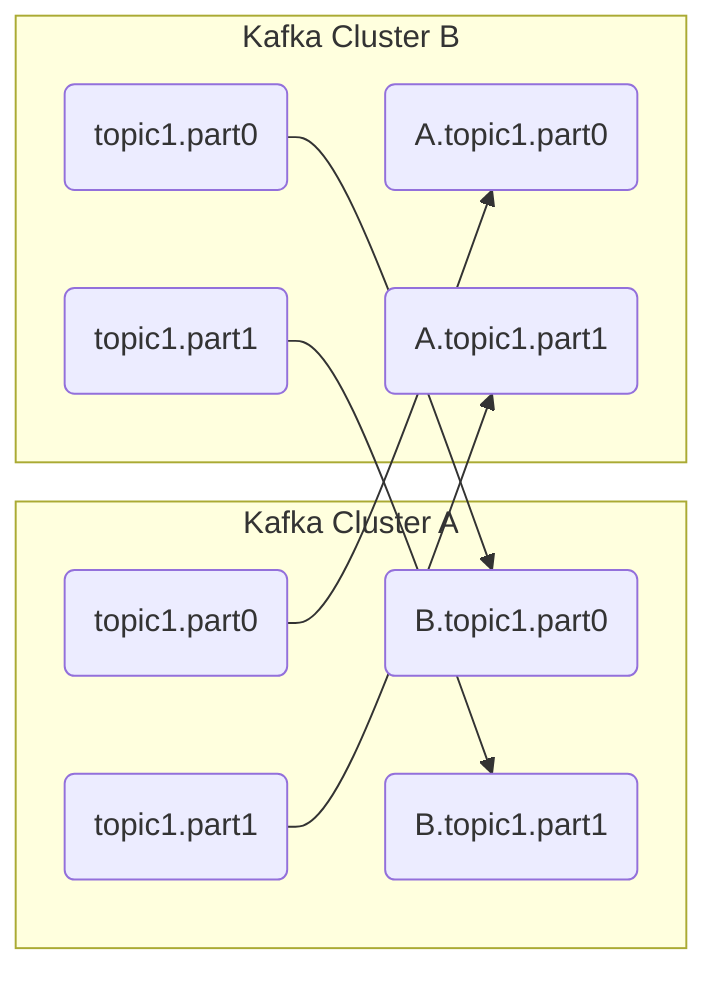

# 11.5 커넥터 기반의 미러 메이커 2.0

- 엔터프라이즈 환경에선 카프카 클러스터를 다중으로 활용한다.
- 다중 클러스터 활용 예
    - 장애 복구 차원에서 여러 데이터 센터 운영하는 경우 데이터 센터 간 카프카 리플리케이션(미러링)을 구성
    - 온프레미스에서 클라우드로 데이터 마이그레이션을 하는 경우 온프레미스에서 클라우드로 리플리케이션 구성
    - 데이터 분석을 위해 카프카 간 리플리케이션이 필요
- 카프카를 업스트림/다운스트림으로 구분하는 경우가 있다.
    - 업스트림 카프카 - 실시간 용도
    - 다운스트림 카프카 - 배치를 위한 용도
    - 업스트림 카프카에서 다운스트림 카프카로 리플리케이션을 구성하여 데이터를 전송한다.

## 미러 메이커

- 미러 메이커 (Mirro Maker)
    - 카프카와 카프카 간 리플리케이션을 하기 위한 도구
    - 소스 클러스터에서 타겟 클러스터로 타겟 토픽들을 리플리케이션한다.
    - 카프카에 기본 내장되어 있다.
- 2019년에 미러 메이커 2.0이 등장했는데 초기 버전에 비해 많은 부분이 개선되었다.

### 원격 토픽과 에일리어스 가능

- 미러 메이커 2.0 리플리케이션은 단방향/양방향 모두 가능하다.
    - 양방향을 지원하기 위해 기본적으로 액티브/액티브 리플리케이션 토픽 이름 정책이 적용된다.
    - 덕분에 서로의 리플리케이션이 병합되거나 순서가 바뀌는 파티션은 없다.

- 미러 메이커 1.0에선 미러링 대상의 토픽명이 소스와 타겟 모두 동일했다.
    - 단방향에선 문제 없지만 양방향에선 순서가 뒤섞이거나 무한 루프하는 문제가 있었다.
- 미러 메이커 2.0에선 토픽에 alias를 추가해 서로 토픽명을 구분할 수 있게 되었다.
    - 각 클러스터가 가진 토픽 이름이 동일해더 서로 구분할 수 있게 되어 양방향 미러링이 가능해진 것

### 카프카 클러스터 통합

- 다중 클러스터로부터 미러링된 토픽들을 다운스트림 컨슈머가 통합할 수 있다.
- 예를 들어 다음 토픽들이 있다고 하면 경우에 따라 하나만 컨슘할 수도, 모두 통합해서 컨슘할 수도 있다.
  - us-west 카프카에서 미러링된 us-west.topic1 토픽
  - us-east 카프카에서 미러링된 us-east.topic1 토픽
  - 로컬의 topic1 토픽
- 즉 굳이 통합을 목적으로 하는 별도 카프카 클러스터를 구성하지 않아도 되는 것이다.

### 무한 루프 방지

- 앞서도 언급했지만 토픽 이름에 alias를 추가함으로써 무한 루프를 방지할 수 있다.
- 모든 토픽에 적용되기에 더 많은 클러스터와도 리플리케이션이 가능하다.

### 토픽 설정 동기화

- 소스 토픽을 모니터링하고 토픽 설정 변경을 원격 대상 토픽으로 전파한다.
- 예를 들어 소스 토픽 파티션 수를 증가시키면 원격 대상 토픽 파티션 수도 증가한다.

### 안전한 저장소로 내부 토픽 활용

- 카프카 내부 토픽을 사용하여 미러 메이커 관련 정보를 저장한다.
  - 미러 메이커 내부 점검을 위한 하트비트
  - 미러링 관련 토픽
  - 컨슈머 그룹의 오프셋 정보
  - 각 토픽 파티션 리플리케이션 체크를 위한 오프셋 싱크 등

### 카프카 커넥트 지원

- 미러 메이커 2.0은 카프카 커넥트 프레임워크를 기반으로 한다.
  - 성능, 신뢰성, 확정성 향상
