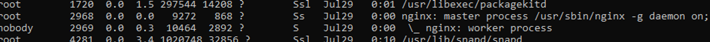
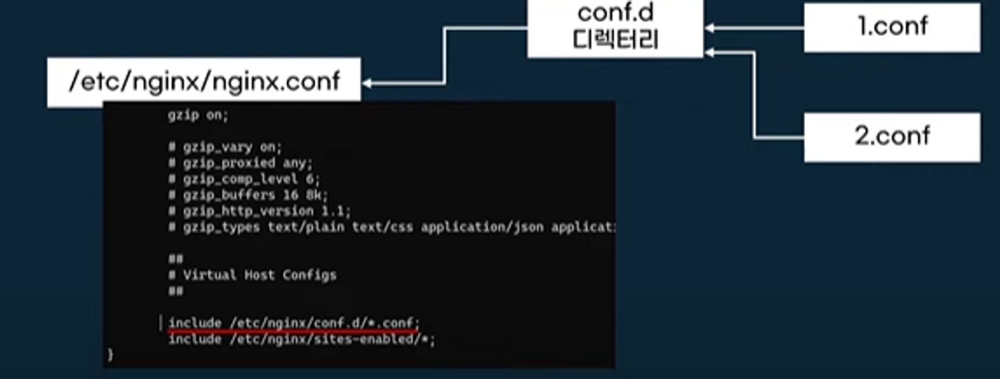

# Nginx 실전
## 프로세스 상관 관계 보기

```bash
ubuntu@ip-192-168-2-68:/etc/nginx$ ps aux --forest
```

- master process 하위에 worker process 확인 가능
- worker process가 1개인데 이는 기본 값이 1개이기 때무이다.

## worker process 개수 설정

- nginx.conf를 살펴 보면 worker_processes가 auto로 되어 있는데 os 코어 개수에 의해 할당 된다.
- 이를 2로 바꾸고 nginx를 재실행하면 worker process가 2개로 는 걸 확인할 수 있다.
```bash
user www-data;
worker_processes auto;
bid /run/nginx/pid;
include /etc/nginx/modules-enabled/*.conf;
```

## 설정 파일

- 설정 파일은 /etc/nginx/nginx.conf에 위치
- 설정 파일은 디렉티브(directives)로 관리
    - 간단(simple) 디렉티브와 블럭 디렉티브로 분류

```bash
server {
  location / {
    root /data/www;
  }
  
  location /images/ {
    root /data;
  }
}
```
- server, location은 블럭 디렉티브, root는 간단 디렉티브
- 설정 끝은 세미클론으로 표시
- include를 사용해서 설정 파일을 분리해서 관리할 수도 있다.

## server block

- 서버 기능을 설정하는 블록
- 어떤 주소:포트를 요청을 받을지 결정 (smody.co.kr:80 요청)

```bash
server {
		listen  80;
		server_name smody.co.kr;
}
```

- `listen` 어떤 포트로 받을 것인지
- `server_name`: 어떤 ip로 받을 것인지

## 중간 TIP `nginx -t`

- nginx 설정 파일이 문법에 맞는지 검사

## http block

- server block은 http block 안에 있어야 한다.

```bash
http {
  server {
    listen 80;
    server_name smody.co.kr;
  }
}
```

## location block

- 요청 URI를 분석하여 세부 설정
- server block 안에 작성하면 된다.
    - `location /`
```bash
location = / {
  [configuration A]
}
location / {
  [configuration B]
}
location /documents/ {
  [configuration C]
}
location = '~ /images/ {
  [configuration D]
}
location ~* \.(gif|jpg|jpeg)$  {
  [configuration A]
}
```
- location block은 prefix만 맞으면 뒤에 어떤 경로가 추가적으로 와도 동작한다.
    - /images/asefds라는 요청이 와도 `location /images/`가 있기 때문에 동작
    - exact match를 사용하면 정확한 경로 매핑이 가능하다.
        - =만 추가하면 됨
        - `location = /`

---

### 참고

[https://youtu.be/hA0cxENGBQQ](https://youtu.be/hA0cxENGBQQ)

[https://prohannah.tistory.com/136](https://prohannah.tistory.com/136)
