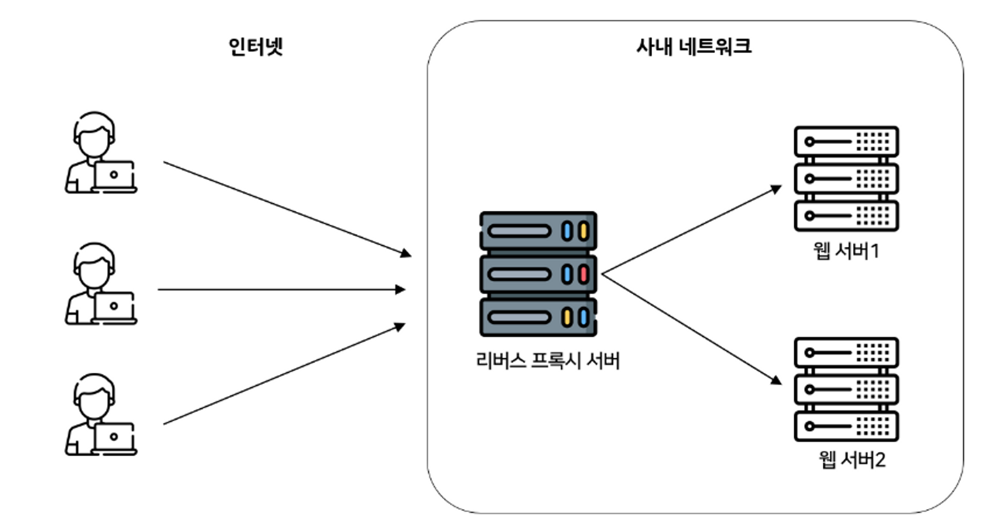
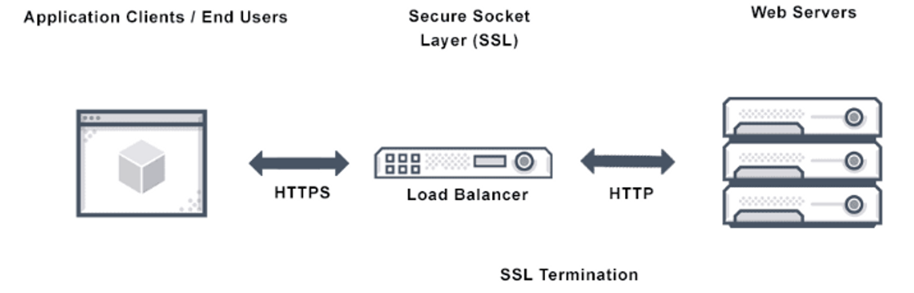

# 리버스 프록시
> **리버스 프록시**(reverse proxy)는 컴퓨터 네트워크에서 클라이언트를 대신해서 한 대 이상의 서버로부터 자원을 추출하는 프록시 서버의 일종이다. 그런 다음 이러한 자원들이 마치 웹 서버 자체에서 기원한 것처럼 해당 클라이언트로 반환된다. 관련 클라이언트들을 위해 임의의 서버에 접속하는 중간 매개체인 포워드 프록시(forward proxy)와는 반대로, 리버스 프록시는 관련 서버들을 위해 임의의 클라이언트가 해당 서버에 접속하는 중간 매개체이다.
>
> 널리 보급된 웹 서버들은 리버스 프록시 기능을 사용하는 일이 잦으며 취약한 HTTP 기능의 애플리케이션 프레임워크를 보호한다.
>
> 출처: 위키
>

## 프록시란?

> *프록시 서버(proxy server)는 클라이언트가 자신을 통해서 다른 네트워크 서비스에 간접적으로 접속할 수 있게 해 주는 컴퓨터 시스템이나 응용 프로그램을 가리킨다. 서버와 클라이언트 사이에 중계기로서 대리로 통신을 수행하는 것을 가리켜 ‘프록시’, 그 중계 기능을 하는 것을 프록시 서버라고 부른다.*
>

## 리버스 프록시

- 클라이언트의 요청을 대신 받아 내부 서버로 전달해 주는 것을 말한다.
- 클라이언트는 리버스 프록시 서버만 바라보고 요청하고 응답을 받는다.
- 로드 밸런싱, SSL 터미네이션 등을 적용할 수 있는 기반이 된다.

### 장점

- 서버 보안
    - 본래 서버 IP 주소를 노출시키지 않을 수 있다.
    - 따라서 해커들의 DDoS 공격을 막는데 유용하다.
- 로드 밸런싱
    - 많은 트래픽을 싱글 서버로 감당해 내기란 어렵다.
    - 리버스 프록시 서버가 여러 서버들 앞에 두면 트래픽을 분산 시킬 수 있다.
- 캐싱
    - 프록시 서버에 캐싱된 데이터를 통해 성능을 향상 시킬 수 있다.
- SSL 터미네이션
    - 트래픽 암호화 및 암호화되지 않을 때의 전환 프로세스
    - 본래 서버가 클라이언트들과 통신할 때 SSL 암호화 복호화를 할 경우 비용이 많이 든다.
    - 리버스 프록시를 사용하면 들어오고 나가는 요청과 응답을 모두 암호화해주므로 클라이언트와 안전한 통신을 할 수 있으며 본래 서버의 부담을 줄일 수 있다.

## SSL 터미네이션

HTTPS 통신과 HTTP 통신의 전환 프로세스
- 리버스 프록시 서버가 HTTPS 요청을 받아 SSL 복호화를 진행한 후 본 서버에게는 복호화된 데이터로 다시 요청한다. 그래서 서버 속도를 높이는 데 도움이 된다.
- 하나의 리버스 프록시 서버로 여러 서버에 HTTPS를 적용 시킨 것처럼 동작하게 할 수 있다.
- 하지만 리버스 프록시 서버와 서버 간의 트래픽은 암호화되지 않으므로 공격 당할 수도 있다.

출처

[https://losskatsu.github.io/it-infra/reverse-proxy/#리버스-프록시reverse-proxy-서버-개념](https://losskatsu.github.io/it-infra/reverse-proxy/#%EB%A6%AC%EB%B2%84%EC%8A%A4-%ED%94%84%EB%A1%9D%EC%8B%9Creverse-proxy-%EC%84%9C%EB%B2%84-%EA%B0%9C%EB%85%90)

[https://inpa.tistory.com/entry/NETWORK-📡-Reverse-Proxy-Forward-Proxy-정의-차이-정리#리버스_프록시_(Reverse_Proxy)](https://inpa.tistory.com/entry/NETWORK-%F0%9F%93%A1-Reverse-Proxy-Forward-Proxy-%EC%A0%95%EC%9D%98-%EC%B0%A8%EC%9D%B4-%EC%A0%95%EB%A6%AC#%EB%A6%AC%EB%B2%84%EC%8A%A4_%ED%94%84%EB%A1%9D%EC%8B%9C_(Reverse_Proxy))
