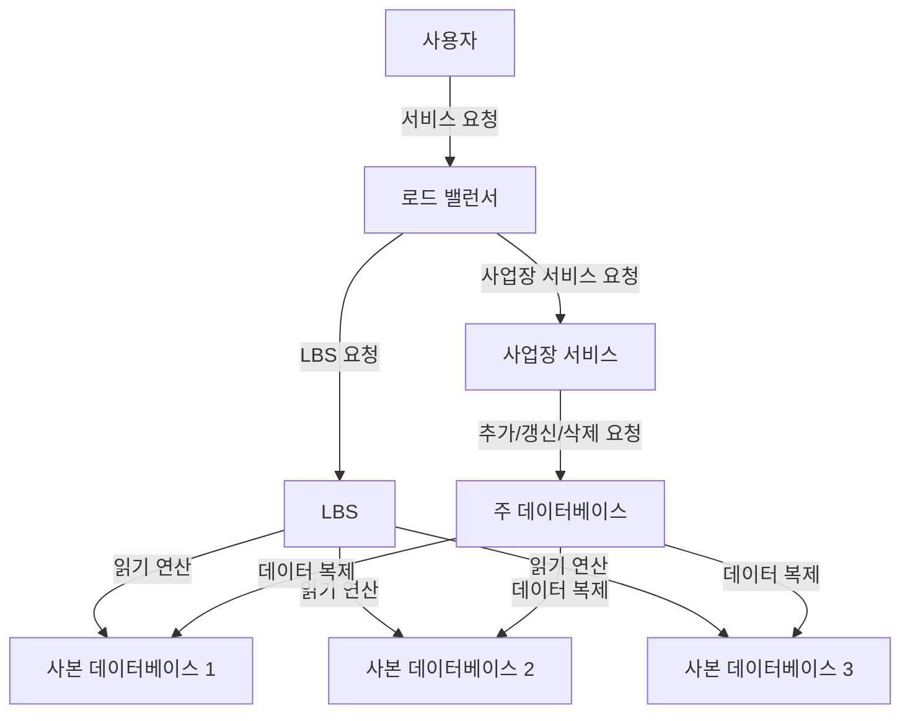

# 1장 근접성 서비스
- 근접성 서비스
    - 현재 위치에서 가까운 시설을 찾는 데 이용된다.
    - ex) 구글맵

## 1단계: 문제 이해 및 설계 범위 확정

- 기능 요구사항
    - 사용자의 위치와 검색 반경 정보에 매치되는 사업장 목록 반환
    - 사업장 소유주가 사업장 정보를 추가, 삭제, 갱신할 수 있으나 실시간 반영될 필요는 없음
    - 고객은 사업장의 상세 정보를 살필 수 있어야 함
- 비기능 요구사항
    - 낮은 응답 지연 - 신속한 검색
    - 데이터 보호 - 사용자 위치 정보는 보호되어야 한다.
    - 고가용성 및 규모 확장성 - 트래픽이 급증해도 감당 가능해야 한다.
- 개략적 규모 측정
    - DAU 1억명
    - 등록된 사업장 수는 2억
- QPS (Query per Second) 계산
    - 1일 = 24시간 = 86400초이지만 대략 쉬운 계산을 위해 10^5로 올림하여 사용 예정
    - 한 사용자는 하루 5회 검색 시도한다고가정
    - 즉 QPS = (1억 * )5 / 10^5 = 5000

## 2단계: 개략적 설계안 제시 및 동의 구하기

### API 설계

다음 REST API가 필요할 것이다.

- 기준에 맞는 사업장 목록 반환 API
    - 검색 기준에 맞는 사업장 목록 반환
    - 위도, 경도, 반경 몇 미터인지를 파라미터로 넘김
- 사업장 관련 API
    - 특정 사업장 상세 정보 반환 API
    - 사업장 추가, 갱신, 삭제 API

### 데이터 모델

- 근접성 서비스는 쓰기 연산에 비해 읽기 연산의 빈도가 압도적으로 높다.
- 읽기 연산이 높은 시스템에선 MySQL 같은 관계형 데이터베이스가 바람직할 수 있다.
- 시스템의 핵심은 business 테이블과 지리적 위치 색인 테이블(geospatial index table)이다.
    - busniess 테이블엔 pk, 주소, 위치 정보, 위도, 경도 등 컬럼 존재

### 개략적 설계

- 위치 기반 서비스 (LBS)
    - 주어진 위치와 반경 정보를 기반으로 주변 사업장을 검색
    - 읽기 요청만 빈번한 서비스로 QPS가 높다.
    - 무상태 서비스이므로 수평 확장이 쉽다.
- 사업장 서비스
    - 사업장 소유주가 사업장 정보를 생성, 갱신, 삭제하는데 이러한 쓰기 요청은 QPS가 높지 않다.
    - 고객이 사업장 정보를 조회할 때도 사용되는데 특정 시간대에 QPS가 높아진다.
- 데이터베이스 클러스터
    - 주-부(primary-secondary) 데이터베이스 형태로 구성
    - 주 데이터베이스에 쓰기, 부 데이터베이스에 읽기 요청을 처리시킬 수 있다.
    - 주 데이터베이스에 기록된 데이터가 부 데이터베이스로 복사된다.
    - 데이터 복제에는 시간 차이가 발생하지만 실시간성이 필요 없는 서비스에선 큰 문제가 되지 않는다.
- 규모 확장성
    - 사업장 서비스와 LBS 둘 다 무상태 서비스이기에 몰리는 트래픽에 서버를 추가하여 대응 가능하다.
