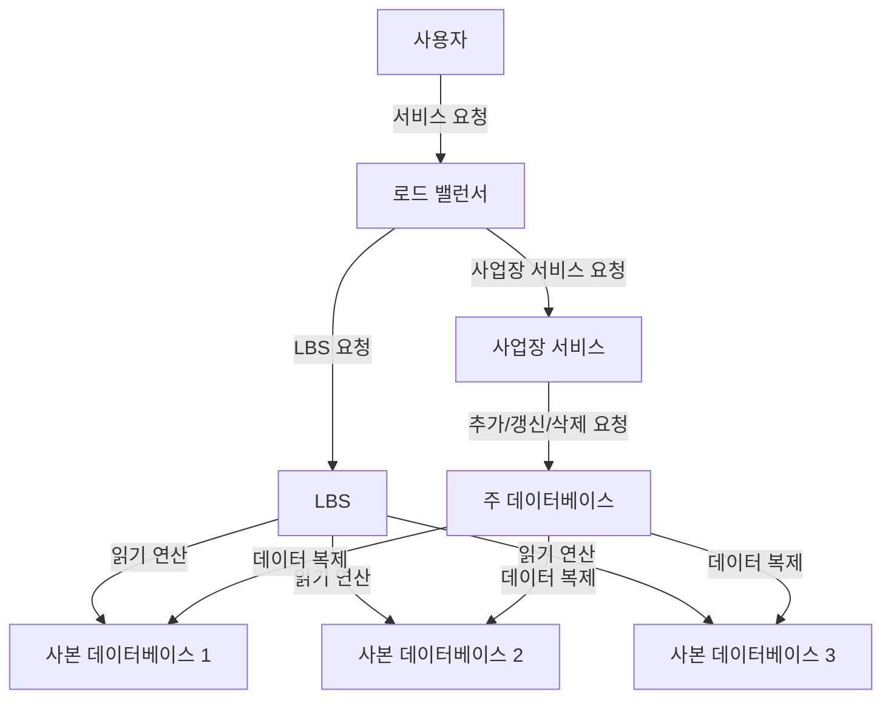

# 1장 근접성 서비스
- 근접성 서비스
    - 현재 위치에서 가까운 시설을 찾는 데 이용된다.
    - ex) 구글맵

## 1단계: 문제 이해 및 설계 범위 확정

- 기능 요구사항
    - 사용자의 위치와 검색 반경 정보에 매치되는 사업장 목록 반환
    - 사업장 소유주가 사업장 정보를 추가, 삭제, 갱신할 수 있으나 실시간 반영될 필요는 없음
    - 고객은 사업장의 상세 정보를 살필 수 있어야 함
- 비기능 요구사항
    - 낮은 응답 지연 - 신속한 검색
    - 데이터 보호 - 사용자 위치 정보는 보호되어야 한다.
    - 고가용성 및 규모 확장성 - 트래픽이 급증해도 감당 가능해야 한다.
- 개략적 규모 측정
    - DAU 1억명
    - 등록된 사업장 수는 2억
- QPS (Query per Second) 계산
    - 1일 = 24시간 = 86400초이지만 대략 쉬운 계산을 위해 10^5로 올림하여 사용 예정
    - 한 사용자는 하루 5회 검색 시도한다고가정
    - 즉 QPS = (1억 * )5 / 10^5 = 5000

## 2단계: 개략적 설계안 제시 및 동의 구하기

### API 설계

다음 REST API가 필요할 것이다.

- 기준에 맞는 사업장 목록 반환 API
    - 검색 기준에 맞는 사업장 목록 반환
    - 위도, 경도, 반경 몇 미터인지를 파라미터로 넘김
- 사업장 관련 API
    - 특정 사업장 상세 정보 반환 API
    - 사업장 추가, 갱신, 삭제 API

### 데이터 모델

- 근접성 서비스는 쓰기 연산에 비해 읽기 연산의 빈도가 압도적으로 높다.
- 읽기 연산이 높은 시스템에선 MySQL 같은 관계형 데이터베이스가 바람직할 수 있다.
- 시스템의 핵심은 business 테이블과 지리적 위치 색인 테이블(geospatial index table)이다.
    - busniess 테이블엔 pk, 주소, 위치 정보, 위도, 경도 등 컬럼 존재

### 개략적 설계

- 위치 기반 서비스 (LBS)
    - 주어진 위치와 반경 정보를 기반으로 주변 사업장을 검색
    - 읽기 요청만 빈번한 서비스로 QPS가 높다.
    - 무상태 서비스이므로 수평 확장이 쉽다.
- 사업장 서비스
    - 사업장 소유주가 사업장 정보를 생성, 갱신, 삭제하는데 이러한 쓰기 요청은 QPS가 높지 않다.
    - 고객이 사업장 정보를 조회할 때도 사용되는데 특정 시간대에 QPS가 높아진다.
- 데이터베이스 클러스터
    - 주-부(primary-secondary) 데이터베이스 형태로 구성
    - 주 데이터베이스에 쓰기, 부 데이터베이스에 읽기 요청을 처리시킬 수 있다.
    - 주 데이터베이스에 기록된 데이터가 부 데이터베이스로 복사된다.
    - 데이터 복제에는 시간 차이가 발생하지만 실시간성이 필요 없는 서비스에선 큰 문제가 되지 않는다.
- 규모 확장성
    - 사업장 서비스와 LBS 둘 다 무상태 서비스이기에 몰리는 트래픽에 서버를 추가하여 대응 가능하다.

### 주변 사업장 검색 알고리즘

- 지리적인 데이터 검색 시 단순한 색인으로는 큰 효율을 내기 힘들다.
  - 색인은 1차원 데이터를 검색할 때 효과적
  - 2차원 데이터를 검색하려면 각 1차원 검색 값을 모두 불러와 교집합을 구해야 한다.
  - ex) 위도와 경도 각각에 색인을 만들어 두어도 주어진 모든 위도, 경도를 검색한 후 교집합을 걸러내야 한다.
- 2차원 데이터를 위한 색인 방식엔 두 가지가 있는데 지도를 작은 영역으로 분할하고 고속 검색이 가능하도록 하는 것이 특징이다.
  - 해시 기반 방안: 균등 격자, 지오해시, 카르테시안 계층 등
  - 트리 기반 방안: 쿼드트리, 구글 S2, R 트리 등
- 균등 격자 (even grid)
  - 지도를 작은 격자로 나누는 단순한 접근법
  - 하나의 격자에 여러 사업장을 담을 수 있다.
  - 다만 사업장 분포가 균등하지 않다는 단점이 있다.
  - ex) 뉴욕엔 많은 사업장이 있겠지만 사막이나 바다에 사업장이 있을 리가 없기 때문

### 지오해시 (Geohash)

- 2차원의 위도 경도 데이터를 1차원의 문자열로 변환하며 균등 격자보다 나은 방안
- 비트를 하나씩 늘려가며 재귀적으로 세계를 더 작은 격자로 분할해 나간다.
- 위도와 경도를 이진수로 변환한 뒤, 이를 Base32 형식의 문자열로 인코딩
  - ex) 구글 본사 지오해시 (길이=6) - `1001 11010 01001 10001 11111 11110`
- 지오해시는 12단계 정밀도를 갖는다.
  - 최적 정밀도는 사용자가 지정한 반경으로 그린 원을 덮는 최소 크기 격자를 만드는 지오해시 길이를 구해야 한다.
- 지오해시의 격자 가장자리 이슈
  - 지오해시는 해시값의 공통 접두어가 긴 격자들이 서로 가깝게 놓이도록 보장한다.
  - 하지만 그 역은 참이 아닌데 아주 가까운 두 위치가 어떤 공통 접두어도 갖지 않을 수도 있다.
  - 이 문제 때문에 단순한 접두어 기반 SQL 질의문으로는 모든 주변 사업장을 가져올 수 없다.
  - 또한 두 지점이 공통 접두어를 가지더라도 다른 격자에 포함되어 있다면 검색에서 다른 격자 지점이 누락되기도 한다.
- 격자 가장자리 이슈를 해결하려면 현재 격자를 포함한 인접한 격자를 모두 탐색할 필요가 있다.
- 현재 격자와 주변 격자를 모두 살펴 보아도 표시할 데이터가 충분하지 않은 경우
  - 선택지 1: 부족하면 부족한대로 결과를 반환한다. 다만 사용자의 욕구를 만족시킬 수 없을 확률이 크다.
  - 선택지 2: 검색 반경을 키운다. 지오해시 값 마지막 비트를 삭제하여 얻은 새 지오해시 값으로 주변을 검색한다.

### 쿼드 트리 (quadtree)

- 쿼드트리
  - 트리 자료구조의 일종으로, 각 노드가 최대 4개의 자식 노드를 가지는 구조
  - 격자 내용이 특정 기준을 만족할 때까지 2차원 공간을 재귀적으로 사분면 분할 하는 데 흔히 사용된다.
  - ex) 격자에 담긴 사업장 수가 100 이하가 될 때까지 분할
- 쿼드트리를 사용한다는 것은 질의에 답하는 데 사용될 트리 구조를 메모리 안에 만드는 것이다.
  - 쿼드트리는 메모리 내의 자료 구조일 뿐 DB가 아니다.
  - 쿼드트리는 각각의 LBS 서버에 존재해야 한다.
  - 쿼드트리는 메모리를 많이 잡아먹지 않기에 서버 한 대에 충분히 올릴 수 있다.
- 쿼드트리의 내부 노드와 말단 노드가 존재한다.
  - 말단 노드에 수록되는 데이터
    - 격자 식별을 위한 좌상단과 우하단 꼭짓점 좌표 (32바이트)
    - 격자 내부 사업장 ID 목록 (ID당 8바이트)
  - 내부 노드에 수록되는 데이터
    - 격자 식별을 위한 좌상단과 우하단 꼭짓점 좌표 (32바이트)
    - 하위 노드 4개를 가리킬 포인터
- 전체 쿼드트리 구축에 소요되는 시간
  - 말단 노드에 100개 사업장이 저장된다는 가정
  - 전체 사업장 수를 n이라 하면 시간 복잡도는 `n/100 log n/100`
- 쿼드트리로 주변 사업장을 검색하는 과정
  - 메모리에 쿼드트리 인덱스 구축
  - 검색 시작점이 포함된 말단 노드를 만날 때까지 루트 노드부터 탐색
  - 해당 노드에 충분한 사업장 수가 확보되지 않았다면 충분한 수가 모일 때까지 인접 노드도 추가
- 쿼드트리 운영 시 고려사항
  - 쿼드트리 구축 때문에 서버 시작 시간이 길어질 수 있기에 릴리즈 시 동시에 너무 많은 서버를 배포하지 않도록 조심해야 한다.
    - 롤링 배포 시엔 많은 서버가 오래동안 다운되면서 트래픽을 못쳐낼 수도 있다.
    - 블루/그린 배포를 하더라도 많은 서버가 동시에 트리를 구축하며 데이터베이스에 큰 부하를 줄 수 있다.
  - 사업장이 추가/삭제될 때 쿼드트리를 갱신해야 하는 문제가 있다.
    - 점진적 갱신을 할 수 있지만 짧은 시간이나마 낡은 데이터가 반환될 수 있다.
    - 수많은 키가 한 번에 무효화되어 캐시 서버에 부하가 가해질 수 있는 위험이 있다.
    - 쿼드트리의 실시간 갱신도 가능하지만 설계가 많이 복잡해진다.

### 구글 S2

- 구글 S2는 쿼드트리와 마찬가지로 메모리 기반 솔루션이다.
- 지구를 구체로 모델링하여 이를 효율적으로 관리하고 분석할 수 있는 방식으로 설계되었다.
- 지구를 힐베르트 곡선이라는 공간 채움 곡선을 사용하여 1차원 색인화하는 방식을 사용
- 관심 있는 역역의 경계를 지정할 수 있어 풍부한 기능을 제공한다.
  - ex) 특정 지점 반경 몇 km 이내
  - ex) 스쿨 존 같은 이미 있는 경계선을 묶어 설정할 수도 있다.

### 추천

- 아래는 각 방법을 어떤 회사가 사용하고 있는지 정리한 표다.

| 색인 방법 | 회사 |
| --- | --- |
| 지오해시 | Bing 지도, 레디스, 몽고DB, 리프트 |
| 쿼드트리 | 엑스트 |
| 지오해시 + 쿼드트리 | Elasticsearch |
| S2 | 구글 맵, 틴더 |
