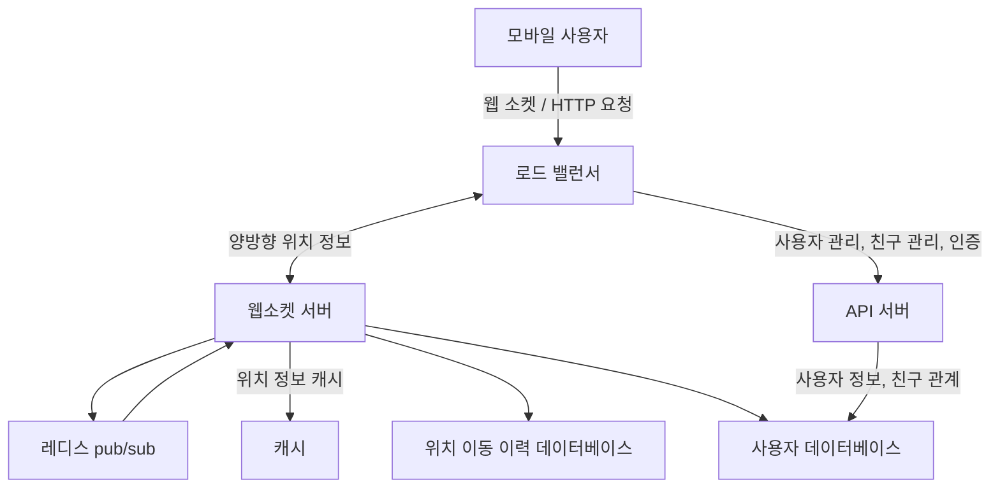

# 2장 주변 친구
- ‘주변 친구’ 기능
    - 본인의 친구 목록을 보여주는 시스템
    - 단순 친구가 아닌 위치 정보를 활용해 인근의 친구 목록을 보여준다.

## 1단계: 문제 이해 및 설계 범위 확정

- 기능 요구사항
    - 사용자는 앱에서 주변 친구 목록을 확인할 수 있다.
        - 각 항목에는 친구까지의 거리, 갱신 시간 등이 표시된다.
    - 친구 목록은 몇 초마다 한 번씩 갱신되어야 한다.
- 비기능 요구사항
    - 낮은 지연 시간 -  주변 친구 위치 변화가 반영되는ㄷ 데 너무 오래 걸리지 않아야 한다.
    - 안정성 - 전반적으로 안정적이어야 하지만, 때로 몇 개 데이터가 유실되는 것 정도는 용인할 수 있다.
    - 결과적 일관성 - 복제본 데이터가 원본과 동일하게 변경되기까지 몇 초 정도 걸리는 것은 용인할 수 있다.
- 개략적 규모 측정
    - ‘주변 친구’는 5마일(8km) 반경 이내로 정의
    - 친구 위치 정보는 30초 주기로 갱신
    - 평균적으로 매일 주변 친구를 검색하는 사용자는 1억 명으로 가정
    - 동시 접속자 수는 DAU의 10%로 가정. 즉 천만 명
    - 평균적으로 한 사용자는 400명의 친구를 갖는다고 가정
    - 페이지당 20명 주변 친구를 표시하고 선택에 따라 더 많은 정보를 노출

## 2단계: 개략적 설계안 제시 및 동의 구하기

### 개략적 설계안

- 사용자는 근방의 모든 활성 친구의 새 위치 정보를 수신해야 한다.
- 백엔드 서버가 해야할 역할은 다음과 같다.
    - 모든 활성 상태 사용자의 위치 변화 내역을 수신
    - 사용자 위치 변경 내역을 수신할 때마다 해당 사용자의 모든 활성 친구를 찾아 그 단말로 변경 내역 전달
    - 두 사용자 사이 거리가 특정 임계치보다 먼 경우엔 변경 내역을 전송하지 않는다.
- 동시 접속자 수를 천만 명으로 가정했기에 엄청난 양의 갱신 내역을 사용자 단말로 보내야 한다.

### 설계안

- 우선 소규모 백엔드를 위한 설계안을 생각하고 상세 설계 단계에서 확장할 예정이다.

- 로드밸런서
    - API 서버 및 양방향 유상태 웹소켓 서버 앞단에 위치
    - 부하 분산
- RESTful API 서버
    - 무상태 서버의 클러스터로 통상적인 요청/응답 트래픽 처리
    - 친구 추가/삭제 및 사용자 정보 갱신 등의 작업을 처리
- 웹소켓 서버
    - 친구 위치 정보 변경을 실시간에 가깝게 처리하는 유상태 서버 클러스터
    - 각 클라이언트는 그 가운데 한 대와 웹소켓 연결을 지속적으로 유지한다.f
    - 클라이언트가 서비스를 키면 모든 주변 친구를 전송하는 초기화 역할도 담당
- 레디스 위치 정보 캐시
    - 활성 상태 사용자의 가장 최근 위치 정보를 캐시
    - TTL에 따라 사용자를 비활성 상태로 바꾸고 해당 위치 정보를 캐시에서 삭제한다.
        - 캐시 정보 갱신 시엔 TTL 도 갱신
- 사용자 데이터베이스
    - 사용자 데이터 및 사용자 친구 관계 정보를 저장
    - 관계형 또는 NoSQL 모두 사용 가능
- 위치 이동 이력 데이터베이스
    - 사용자의 위치 변동 이력을 보관
- 레디서 pub/sub 서버
    - 초경량 메시지 버스(message bus)로 웹소켓 서버를 통해 수신한 사용자 위치 정보 변경 이벤트를 pub/sub 채널에 발행하는 용도
    - 해당 사용자의 친구 각각과 연결된 웹소켓 연결 핸들러는 해당 채널 구독자로 설정되어 있다.
    - 각 핸들러는 변경 이벤트를 수신할 친구가 활성 상태면 거리를 다시 계산해 웹소켓 연결을 통해 해당 친구에게 새 정보를 보낸다.
