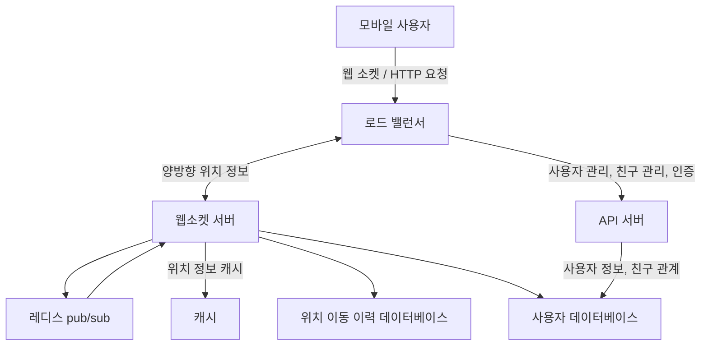

# 2장 주변 친구
- ‘주변 친구’ 기능
    - 본인의 친구 목록을 보여주는 시스템
    - 단순 친구가 아닌 위치 정보를 활용해 인근의 친구 목록을 보여준다.

## 1단계: 문제 이해 및 설계 범위 확정

- 기능 요구사항
    - 사용자는 앱에서 주변 친구 목록을 확인할 수 있다.
        - 각 항목에는 친구까지의 거리, 갱신 시간 등이 표시된다.
    - 친구 목록은 몇 초마다 한 번씩 갱신되어야 한다.
- 비기능 요구사항
    - 낮은 지연 시간 -  주변 친구 위치 변화가 반영되는ㄷ 데 너무 오래 걸리지 않아야 한다.
    - 안정성 - 전반적으로 안정적이어야 하지만, 때로 몇 개 데이터가 유실되는 것 정도는 용인할 수 있다.
    - 결과적 일관성 - 복제본 데이터가 원본과 동일하게 변경되기까지 몇 초 정도 걸리는 것은 용인할 수 있다.
- 개략적 규모 측정
    - ‘주변 친구’는 5마일(8km) 반경 이내로 정의
    - 친구 위치 정보는 30초 주기로 갱신
    - 평균적으로 매일 주변 친구를 검색하는 사용자는 1억 명으로 가정
    - 동시 접속자 수는 DAU의 10%로 가정. 즉 천만 명
    - 평균적으로 한 사용자는 400명의 친구를 갖는다고 가정
    - 페이지당 20명 주변 친구를 표시하고 선택에 따라 더 많은 정보를 노출

## 2단계: 개략적 설계안 제시 및 동의 구하기

### 개략적 설계안

- 사용자는 근방의 모든 활성 친구의 새 위치 정보를 수신해야 한다.
- 백엔드 서버가 해야할 역할은 다음과 같다.
    - 모든 활성 상태 사용자의 위치 변화 내역을 수신
    - 사용자 위치 변경 내역을 수신할 때마다 해당 사용자의 모든 활성 친구를 찾아 그 단말로 변경 내역 전달
    - 두 사용자 사이 거리가 특정 임계치보다 먼 경우엔 변경 내역을 전송하지 않는다.
- 동시 접속자 수를 천만 명으로 가정했기에 엄청난 양의 갱신 내역을 사용자 단말로 보내야 한다.

### 설계안

- 우선 소규모 백엔드를 위한 설계안을 생각하고 상세 설계 단계에서 확장할 예정이다.

- 로드밸런서
    - API 서버 및 양방향 유상태 웹소켓 서버 앞단에 위치
    - 부하 분산
- RESTful API 서버
    - 무상태 서버의 클러스터로 통상적인 요청/응답 트래픽 처리
    - 친구 추가/삭제 및 사용자 정보 갱신 등의 작업을 처리
- 웹소켓 서버
    - 친구 위치 정보 변경을 실시간에 가깝게 처리하는 유상태 서버 클러스터
    - 각 클라이언트는 그 가운데 한 대와 웹소켓 연결을 지속적으로 유지한다.f
    - 클라이언트가 서비스를 키면 모든 주변 친구를 전송하는 초기화 역할도 담당
- 레디스 위치 정보 캐시
    - 활성 상태 사용자의 가장 최근 위치 정보를 캐시
    - TTL에 따라 사용자를 비활성 상태로 바꾸고 해당 위치 정보를 캐시에서 삭제한다.
        - 캐시 정보 갱신 시엔 TTL 도 갱신
- 사용자 데이터베이스
    - 사용자 데이터 및 사용자 친구 관계 정보를 저장
    - 관계형 또는 NoSQL 모두 사용 가능
- 위치 이동 이력 데이터베이스
    - 사용자의 위치 변동 이력을 보관
- 레디서 pub/sub 서버
    - 초경량 메시지 버스(message bus)로 웹소켓 서버를 통해 수신한 사용자 위치 정보 변경 이벤트를 pub/sub 채널에 발행하는 용도
    - 해당 사용자의 친구 각각과 연결된 웹소켓 연결 핸들러는 해당 채널 구독자로 설정되어 있다.
    - 각 핸들러는 변경 이벤트를 수신할 친구가 활성 상태면 거리를 다시 계산해 웹소켓 연결을 통해 해당 친구에게 새 정보를 보낸다.

- 주기적 위치 갱신 과정
  - 클라이언트가 위치 변경을 로드밸런서에 전송
  - 로드밸런서는 위치 변경 내역을 해당 클라이언트와 웹소켓 서버 사이에 설정된 연결로 웹소켓 서버로 전송
  - 웹소켓 서버는 해당 이벤트를 위치 이동 이력 데이터베이스에 저장
  - 웹소켓 서버는 새 위치 정보를 캐시에 보관 (TTL도 갱신)
  - 웹소켓 서버는 레디서 pub/sub 서버의 해당 사용자 채널에 새 위치를 발행 (3~5까지의 단계는 병렬 수행)
  - 레디스 pub/sub 채널에 발행된 이벤트는 모든 구독자에게 브로드캐스트된다.
    - 구독자 - 위치 변경 이벤트를 보낸 사용자의 온라인 상태 친구들
  - 메시지를 받은 웹소켓 서버의 연결 핸들러는 새 위치를 보낸 사용자와 메시지를 받은 사용자 사이의 거리를 새로 계산
  - 이전 단계에서 계산한 거리가 검색 반경을 넘지 않는다면 새 위치 및 이벤트 발생 시각을 해당 구독자의 클라이언트 앱으로 전송

### 데이터 모델

- 위치 정보 캐시
  - ‘주변 친구’ 기능을 킨 활성 상태 친구의 가장 최근 위치를 보관
  - 레디스를 대표적으로 사용할 수 있고 (키, 값)을 `(사용자 ID, {위도, 경도, 시각})` 형태로 보관할 수 있다.
  - 위치 정보 저장에 데이터베이스를 사용하지 않는 이유
    - ‘현재 위치’만을 이용하기에 사용자 위치는 하나만 보관하면 충분하다.
    - ‘현재 위치’라는 정보에 대해선 영속성을 보장할 필요가 없다.
    - 캐시 서버가 장애에서 복구되는 과정에 친구의 위치 변경 내역을 놓치는 일이 생길 수도 있지만 수용 가능한 문제다.
- 위치 이동 이력 데이터베이스
  - 사용자 위치 정보 변경 히스토리를 저장
  - `user_id`, `latitude`, `longitude`, `timestamp`의 컬럼을 가진다.
  - 막대한 쓰기 연산 부하를 감당할 수 있고 수평적 확장이 가능한 데이터베이스가 필요하다.
  - 카산드라가 이 요구사항에 부합한다.
    - 관계형 DB도 가능은 하지만 데이터 양이 너무 많을 수 있으므로 샤딩이 필요할 것이다.

## 3단계: 상세 설계

### 각 요소의 규모 확장성 고려

- API 서버
  - API 서버는 무상태 서버기에 부하에 따라 수평 확장이 가능하다.
- 웹소켓 서버
  - 웹소켓 클러스터 또한 사용률에 따라 규모 확장은 어렵지 않다.
  - 다만 유상태 서버이기 기존 노드를 제거할 때 모든 연결을 종료시키고 제거해야 한다.
  - 로드밸런서가 제거 예정인 노드에게 더 이상 연결을 만들지 않는 등의 처리가 필요하기에 좋은 로드밸런서가 있어야 한다.
- 클라이언트 초기화
  - 모바일 클라이언트는 기동되면 웹소켓 서버 중 하나와 지속성 연결을 맺는데 연결 초기화 후 클라이언트는 단말의 위치 정보를 전송한다.
  - 위치 정보를 받은 웹소켓 연결 핸들러는 다음 작업을 수행한다.
    - 위치 정보 캐시에 보관된 해당 사용자 위치를 갱신
    - 해당 위치 정보는 뒤이은 계산 과정에 이용되므로 핸들러 내 변수에 저장해 둔다.
    - 사용자 데이터베이스에서 해당 사용자의 모든 친구 정보를 조회
    - 위치 정보 캐시에 일괄 요청을 보내 모든 친구 위치를 한 번에 가져온다.
    - 캐시가 돌려준 친구 위치 각각에 대해 거리를 계산한 후 웹소켓 연결을 통해 클라이언트에 반환
    - 아울러 웹소켓 서버는 각 친구의 레디스 pub/sub 채널을 구독한다.
    - 사용자 현재 위치를 레디서 pub/sub 전용 채널을 통해 모든 친구에게 전송한다.
- 사용자 데이터베이스
  - 사용자 데이터베이스엔 사용자 ID를 비롯한 사용자 상세 정보와 친구 관계 데이터가 저장되어 있다.
  - 이러한 데이터는 한 대의 관계형 데이터베이스로는 부족할 수 있지만 사용자 ID로 샤딩하면 수평 규모 확장이 가능하다.
  - 유의할 점은 이번 설계안의 규모라면 사용자 및 친구 데이터 각각 별도 팀이 필요할 것이고 그 데이터는 내부 API를 통해 이용해야 한다.
- 위치 정보 캐시
  - 레디스에 TTL을 설정하기에 최대 메모리 사용량은 일정 한도 아래로 유지된다.
  - 가장 시스템이 붐비는 천만 명을 가정해도 위치 정보가 100바이트라고 했을 때 수 GB 이상의 메모리를 갖춘 레디스 서버 한 대로 모든 위치 정보를 캐시 가능하다.
  - 다만 천만 명 활성 사용자가 위치 변경을 계속 전송한다면 레디스 한 대가 감당한 연산 수는 초당 334k에 달하므로 이 또한 사용자 ID를 기준으로 샤딩하여 부하 분배를 고려해야 한다.
  - 고가용성을 위해 각 샤드의 위치 정보를 standby 노드에 복제해 빠른 장애 회복에 이용할 수 있다.

### 레디스 pub/sub 서버의 규모 확장성 고려

- 레디스 pub/sub 서버
  - 이 설계안에서 pub/sub 서버는 모든 온라인 친구에게 보내는 위치 변경 내역 메시지의 라우팅 계층이다.
  - ‘주변 친구’ 기능을 활용하는 모든 사용자에 채널 하나씩을 부여해 앱 초기화 시 모든 친구의 채널과 구독 관계를 설정한다.
  - 구독 관계 설정 시 친구가 활성 상태인지 딱히 개의치 않는데 이는 더 많은 메모리를 사용하게 되지만 친구가 비활성 상태가 됐을 때 구독 중단하는 등 작업을 할 필요가 없어 아키텍처가 단순해진다.
    - 레디스 pub/sub은 채널을 만드는 비용이 아주 저렴한데 소량의 메모리만을 사용하기에 메모리가 병목이 될 가능성은 낮다.
- 얼마나 많은 레디스 pub/sub 서버가 필요한가?
  - 메모리 사용량
    - 필요한 채널의 수: 1억 개 (매일 주변 친구를 검색하는 사용자 수)
    - 필요한 메모리: 200GB (구독자 한 명을 추적하기 위해 20바이트가 필요한다고 하면 1억 * 20바이트)
    - 100GB의 메모리를 설치할 수 있는 최신 서버를 사용한다면 pub/sub 서버 두 대면 충분할 것이다.
  - CPU 사용량
    - pub/sub 서버가 구독자에게 전송해야 하는 위치 정보 업데이트 양을 초당 1400만 건이라고 가정
    - 보수적으로 기가비트 네트워크 카드 탑재한 현대 서버 한 대로 감당 가능한 구독자 수는 100,000이라 가정
    - 이 추정치로 필요한 레디스 서버 수는 1400만 / 100,000 = 140대이다.
  - 레디스 pub/sub 서버의 병목은 메모리가 아닌 CPU 사용량이다.
  - 본 설계안의 규모를 감당하려면 레디스 pub/sub 클러스터가 필요하다.

