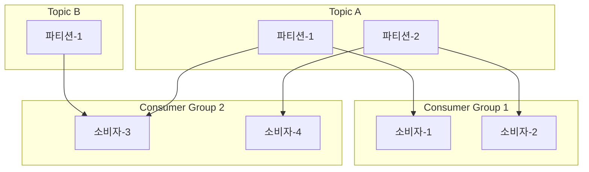

# 4장 분산 메시지 큐
- 메시지 큐 사용의 이점
    - 결합도 완화(decoupling)
    - 규모 확장성 개선: 소비자 시스템 규모를 트래픽 부하에 맞춰 독립적으로 늘릴 수 있다.
    - 가용성 개선: 특정 컴포넌트에 장애가 발생해도 다른 컴포넌트는 서비스를 계속할 수 있다.
    - 성능 개선: 메시지 큐를 통해 비동기 통신이 쉽게 가능하고 생산자와 소비자는 서로를 기다릴 필요가 없다.

### 메시지 큐 대 이벤트 스트리밍 플랫폼

- 아파치 카프카(Kafaka)나 펄사(Pulsa)는 엄밀히 말하면 메시지 큐가 아닌 이벤트 스트리밍 플랫폼이다.
    - 데이터 장기 보관, 메시지 반복 소비 등의 부가 기능은 통상적으로 이벤트 스트리밍 플랫폼에서만 이용 가능하다.
- 하지만 메시지 큐(RocketMQ, RabbitMQ 등)의 기능이 점점 확장되며 경계가 점차 희미해지고 있다.
    - ex) RabbitMQ에서 반복적으로 소비 가능하고, 장기 보관이 가능한 스트리밍 기능이 옵션으로 제공된다.
- 이번 장에선 이벤트 스트리밍 플랫폼이 지원하는 부가 기능을 갖춘 분산 메시지 큐를 설계해볼 것이다.

## 1단계: 문제 이해 및 설계 범위 확정

- 기능 요구사항
    - 생산자는 메시지 큐에 메시지를 보낼 수 있다
    - 소비자는 메시지 큐를 통해 메시지를 수신할 수 있다.
    - 메시지는 반복적으로 수신할 수 있어야 하고, 단 한 번만 수신하도록 설정될 수 있어야 한다.
    - 오래된 이력 데이터는 삭제될 수 있다.
    - 메시지 크기는 킬로바이트 수준
    - 메시지가 생산된 순서대로 소비자에게 전달할 수 있어야 한다.
    - 메시지 전달 방식은 최소 한 번, 최대 한 번, 정확히 한 번 가운데 설정할 수 있어야 한다.
- 비기능 요구사항
    - 높은 대역폭과 낮은 전송 지연 가운데 하나 선택 가능
    - 규모 확장성 지원
    - 지속성 및 내구성
        - 데이터를 디스크에 지속적으로 보관
        - 데이터를 여러 노드에 복제

## 2단계: 계략적 설계안 제시 및 동의 구하기

- 메시지 큐는 생산자와 소비자 사이 결합을 느슨하게 하는 서비스
    - 생산자와 소비자의 독립적 운영 및 규모 확장을 가능하게 한다.
    - 클라이언트/서버 모델 관점에서 생산자와 소비자는 모두 클라이언트고 메시지 큐는 서버 역할을 한다.

### 메시지 모델

- 일대일 모델
    - 큐에 전송된 메시지는 오직 한 소비자만 소비
    - 소비자가 많을 순 있지만 오직 한 소비자만 메시지를 가져갈 수 있다.
    - 메시지가 소비되면 큐에 해당 메시지는 삭제된다. (데이터 보관을 지원하지 않음)
- 발행-구독 모델
    - 토픽(topic)
        - 메시지를 주제별로 정리하는 데 사용
        - 각 토픽은 메시지 큐 서비스 전반에 고유한 이름을 가진다.
    - 토픽에 전달된 메시지는 해당 토픽을 구독하는 모든 소비자에게 전달된다.

### 토픽, 파티션, 브로커

- 토픽 한 대로 감당하기 어려운 데이터 양이 쌓인다면 파티션(partition)을 활용할 수 있다.
  - 파티션은 토픽에 보낼 메시지의 작은 부분 집합이다.
  - 토픽을 여러 파티션으로 분할해 메시지를 모든 파티션에 균등하게 보낸다.
  - 즉 토픽 용량을 확장하려면 파티션 개수를 늘리면 된다.
- 파티션을 유지하는 서버는 브로커(broker)라 부른다.
- 각 토픽 파텨신은 FIFO(first in, first out) 큐처럼 동작한다.
- 같은 파티션 안에서 메시지 순서가 유지된다.
- 같은 키를 가진 모든 메시지는 같은 파티션으로 보내진다.
- 토픽을 구독하는 소비자는 하나 이상의 파티션에서 데이터를 소비한다.

### 소비자 그룹

- 토픽을 구독하는 소비자가 여럿인 경우 이 소비자들을 소비자 그룹(consumer group)이라 부른다.
- 하나의 소비자 그룹은 여러 토픽을 구독할 수 있고 오프셋을 별도로 관리한다.
- 같은 그룹 내 소비자는 메시지를 병렬로 소비할 수 있다.
- 메시지 순서를 보장하려면 어떤 파티션의 메시지는 한 그룹 안에서 오직 한 소비자만 읽을 수 있도록 제약을 추가해야 한다.
  - 다만 그룹 내 소비자 수가 구독하는 토픽의 파티션 수보다 크면 메시지를 받지 못하는 소비자가 생긴다.
  - 그래서 아래 다이어그램에서 소비자-4은 토픽 B의 메시지를 수신할 수 없다.

- 그래서 파티션 수를 동적으로 늘리는 일을 피하기 위해 충분한 파티션을 미리 할당해두기도 한다.
  - 처리 용량을 늘리려면 소비자를 더 추가하면 된다.

### 계략적 설계안

- 클라이언트
  - 생산자: 메시지를 특정 토픽에 전송
  - 소비자 그룹: 토픽을 구독하고 메시지를 소비
- 핵심 서비스 및 저장소
  - 브로커: 파티션 유지
  - 저장소
    - 데이터 저장소: 메시지는 파티션 내 저장소에 보관
    - 상태 저장소: 소비자 상태를 저장
    - 메타데이터 저장소: 토픽 설정, 토픽 속성 등 저장
  - 조정 서비스
    - 서비스 디스커버리: 어떤 브로커가 살아있는지 탐색
    - 리더 선출: 브로커 가운데 하나를 리더로 선정해야 하며 한 클러스터에는 반드시 활성 리더가 하나 있어야 한다. 이 리더가 파티션 배치를 책임진다.
    - 아파치 주키퍼나 etd가 보텅 리더 선출 컴포넌트로 유명하다.

## 3단계: 상세 설계

### 데이터 저장소

- 메시지를 지속적으로 저장할 저장소 선택을 위해 메시지 큐 트래픽 패턴을 살펴보자
  - 읽기/쓰기가 빈번히 발생
  - 갱신/삭제 연산은 발생하지 않는다.
  - 순차적인 읽기/쓰기가 대부분이다.
- 선택지 1: 데이터베이스
  - 관계형 DB라면 토픽별로 테이블을 만들어 메시지를 레코드로 추가하는 방법이 있다.
  - NoSQL이라면 토픽별로 컬렉션을 만들어 메시지를 하나의 문서로 추가하면 된다.
  - 다만 읽기와 쓰기가 동시에 대규모로 빈번하게 발생하는 상황을 잘 처리하는 데이터베이스를 설계하기는 어렵다.
- 선택지 2: 쓰기 우선 로그 (Write-Ahead Log, WAL)
  - WAL은 데이터가 추가되기만 하는 (append-only) 일반 파일이다.
    - MySQL의 redo log가 WAL로 구현되어 있다.
  - WAL에 대한 접근 패턴은 읽기/쓰기 전부 순차적이고 순차적인 접근에서 아주 좋은 성능을 보인다.
  - 지속성을 보장해야 한다면 메시지는 디스크에 WAL로 보관할 것을 추천한다.
- 디스크 성능 관련 유의사항
  - 데이터 장기 보관 요구사항 때문에 디스크 드라이버로 다량의 데이터를 보관할 수 있다.
  - 회전식 디스크가 느린건 랜덤한 접근일 때고, 순차적 데이터 접근 패턴이라면 현대적 디스크 드라이버에서 수백 MB/sec 성능을 달성하는 것은 어렵지 않다.
  - 또한 현대 운영체제는 디스크 데이터를 메모리에 적극적으로 캐시한다.

### 메시지 자료 구조

- 메시지 자료 구조는 생산자, 메시지 큐, 소비자 사이의 계약(contract)이다.
- 메시지가 소비자에게 전달되는 과정에서 불필요한 복사를 피하면 높은 대역폭을 달성할 수 있다.
  - 컴포넌트 가운데 게약을 그대로 받아들이지 못하는 것이 있다면 메시지 변경 과정에서 값비싼 복사가 발생
- 메시지 키
  - 키는 파티션을 정할 때 사용되고 문자열일 수도 숫자일 수도 있다.
  - 키가 주어지지 않으면 무작위로 파티션이 결정된다.
  - 키가 주어진다면 파티션은 `hash(key) % numPartitions` 공식으로 결정된다.
    - 이는 직접 정의할 수도 있는데 모든 파티션에 메시지가 균등히 분산되도록 해야 한다.
- 메시지 값은 일반 텍스트일 수도 있고 압축된 이진 블록일 수도 있다.
- 메시지의 기타 필드
  - 토픽: 메시지가 속한 토픽 이름
  - 파티션: 메시지가 속한 파티션 ID
  - 오프셋: 파티션 내 메시지의 위치
    - 메시지는 토픽, 파티션, 오프셋 세 가지만 알면 찾을 수 있다.
  - 타임스탬프
  - 크기
  - CRC: 순환 중복 검사(Cyclic Redundancy Check)로 주어진 데이터의 무결성 보장에 이용된다.
