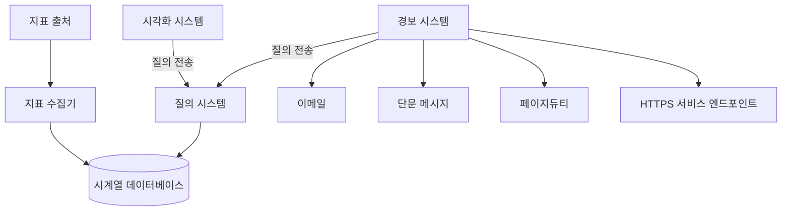

# 5장 지표 모니터링 및 경보 시스템
## 1단계: 문제 이해 및 설계 범위 확정

- 대규모 인프라를 모니터링 해야 함
    - DAU 1억명
    - 서버 풀 1,000개, 풀당 서버 수 100개
    - 데이터 보관 기간은 1년
    - 수집한 그대로 데이터를 일주일 간 보관 후 그 뒤에는 1분 단위 데이터로 변환 후에 30일간 보관 후 그 뒤에는 1시간 단위 데이터로 변환 뒤에 1년 간 보관
- 모니터링할 지표
    - CPU 사용률
    - 요청 수
    - 메모리 사용량
    - 메시지 큐 내의 메시지 수
- 비기능 요구사항
    - 규모 확장성: 시스템은 늘어나는 지표에 맞게 확장될 수 있어야 한다.
    - 낮은 응답 지연: 경보(alert)를 신속하게 대처할 수 있도록 낮은 응답을 보장해야 한다.
    - 안정성: 중요 경보를 놓치지 않아야 한다.
    - 유연성: 미래의 신기술을 쉽게 통합할 수 있도록 유연하게 변경 가능한 파이프라인을 구축해야 한다.

## 2단계: 계략적 설계안 제시 및 동의 구하기

- 지표 모니터링 및 경보 시스템은 다음 다섯 컴포넌트를 이용한다.
    - 데이터 수집: 여러 출처로부터 지표를 수집
    - 데이터 전송: 지표 데이터를 모니터링 시스템으로 전송
    - 데이터 저장소: 전송된 데이터를 정리 및 저장
    - 경보(alert): 데이터를 분석하고 이상 징후를 감지하여 경보를 발생시키는데 다양한 통신 채널로 발송할 수 있어야 한다.
    - 시각화: 지표를 차트나 그래프 등으로 제공한다.

### 데이터 모델

- 지표 데이터는 보통 시계열(time series) 데이터 형태로 기록한다.
    - 값 집합에 타임스탬프가 붙은 형태
    - 시계열 각각에 고유한 이름이 붙고 선택적으로 레이블(label)을 붙이기도 한다.
- 많은 모니터링 소프트웨어가 시계열 데이터를 구성할 때 아래 형식을 준수한다.

| 이름 | 자료형 |
| --- | --- |
| 지표 이름 | 문자열 |
| 태그/레이블 집합 | <키:값> 쌍의 리스트(List) |
| 지표 값 및 그 타임스탬프의 배열 | <값, 타임스탬프> 쌍의 배열(Array |

- ex) 만약 특정 서버 인스턴스의 20:00 시점의 CPU 부하를 알고 싶은 경우
    - 아래 데이터는 지표 이름 레이블, 지표 데이터로 구성되어 있다.

| metric_name | cpu.load |
| --- | --- |
| labels | host:i631,env:prod |
| timestamp | 1613707265 |
| value | 0.29 |

- ex) 지난 10분간 us-west 지역에 위치한 모든 웹 서버의 CPU 부하 평균을 알고 싶은 경우 지표 이름이 CPU.load이고 레이블에 포함된 지역 이름이 us-west인 데이터들로 평균을 구하면 된다.
    - `CPU.load host=webserver01,region=us-west 1613707265 50`

- 로그 데이터 접근 패턴
  - 일반적인 웹 애플리케이션과 달리 읽기 부하보다 쓰기 부하가 더 막대하다.
  - 읽기 부하는 일시적으로 치솟았다 사라지는 편이다.

### 데이터 저장소 시스템

- 일반적인 관계형 데이터베이스는 시계열 데이터 처리가 가능하긴 하지만 부하 규모에 맞추려면 전문가 수준의 튜닝이 필요하다.
  - 관계형 DB는 시계열 데이터에 최적화되어 있지도 않다.
- 카산드라 같은 NoSQL은 관계형 보다는 낫지만 시계열 데이터를 위한 스키마를 설계하려면 NoSQL에 대한 새박한 지식이 필요하다.
- 시장에는 잘 최적화된 시계열 데이터 저장소 시스템이 많다.
  - OpenTSDB는 분산 시계열 데이터베이스이지만 하둡과 HBase 기반이기에 하둡/HBase 클러스터를 운영해야 해서 복잡하다.
  - X(구 트위터)는 MetricsDB를 사용한다.
  - 아마존은 타임스트림(Timestream)이라는 제품을 출시했다.
- DB-engins에서 조사한 결과 가장 인기 있는 시계열 데이터베이스 두 가지는 InfluxDB와 프로메테우스(Prometheus)이다.
  - 다량의 시계열 데이터를 저장, 실시간 분석하는 것이 가능
  - 메모리 캐시와 디스크 저장소를 함께 사용하여 영속성 요건도 잘 만족한다.
  - 8CPU 코어와 32GB 램을 갖춘 Influx 한 대로 초당 250,000회 쓰기 연산 처리가 가능하다고 한다.
- 좋은 시계열 데이터베이스는 대량의 시계열 데이터를 레이블 기준으로 집계, 분석하는 기능을 제공한다.
  - InfluxDB의 경우 이를 지원하기 위해 레이블 별 인덱스를 구축한다.
  - 핵심은 각 레이블이 가질 수 있는 값의 가짓수가 낮아야 한다.

### 계략적 설계안

- 지표 출처
  - 지표 데이터가 만들어지는 곳
  - ex) 애플리케이션 서버, 데이터베이스, 메시지 큐 등
- 지표 수집기
  - 지표 데이터 수집
  - 시계열 데이터에 기록
- 시계열 데이터베이스
  - 지표 데이터를 시계열 데이터 형태로 보관하는 저장소
  - 시계열 데이터의 분석, 요약하는 데 적합한 질의 인터페이스를 제공
- 질의 서비스
  - 시계열 데이터 데이터베이스의 데이터를 질의하는 서비스
  - 좋은 시계열 데이터베이스를 골랐다면 이 서비스는 많은 일을 하지 않아도 된다.
- 경보 시스템
  - 경보를 받아야 하는 대상
  - 경보 알림을 전송하는 시스템
- 시각화 시스템
  - 지표를 다양한 형태의 그래프/차트로 시각화하는 기능을 제공

## 3단계: 상세 설계

### 지표 수집

- 풀 모델
  - 지표 수집기가 지표 출처로부터 데이터를 pull하는 방식
  - 지표 수집기가 데이터를 가져올 서비스 목록을 알아야하기에 서비스 디스커버리 서비스를(Service Discovery Service, SDS) 활용하면 좋다.
  - 수천 대 서버가 생성하는 지표를 수집하려면 지표 수집기 서버 풀이 있어야 하는데 이 경우 같은 출처에서 중복된 데이터를 가져갈 수 있기에 안정 해시 링 같은 중재 메커니즘이 필요하다.
- 푸시 모델
  - 지표 출처가 직접 지표 수집기에 데이터를 전송하는 모델
  - 푸시 모델의 경우 모니터링 대상 서버에 통상 수집 에이전트라 불리는 소프트웨어를 설치한다.
  - 데이터 집계(aggregation)를 통해 지표 수집기에 보내는 데이터 양을 효과적으로 줄일 수도 있다.
  - 푸시 모델을 사용하는 지표 수집기가 밀려드는 지표 데이터를 제때 처리하려면 지표 수집기 자체도 자동 규모 확장이 가능해야 한다. (로드밸런서 - 클러스터 구조)
- 풀 모델 vs 푸시 모델 비교

|  | 풀 모델 | 푸시 모델 |
| --- | --- | --- |
| 손쉬운 디버깅 | 애플리케이션 서버에 /metrics 엔드포인트를 두도록 강제하므로 언제든 지표 데이터를 볼 수 있다. 풀 모델이 디버깅엔 더 낫다. |  |
| 상태 진단 | 애플리케이션 서버가 풀 요청에 응답하지 않으면 장애로 진단할 수 있어 풀 모델 쪽이 더 쉽다. | 지표 수집기가 지표를 받지 못하면 네트워크 장애인지, 서버 장애인지 판단하기 어렵다. |
| 생존 기간이 짧은 프로세스 | 생명 주기가 짧은 일괄 작업 프로세스의 경우 지표를 끌어가기도(pull) 전에 작업이 종료되어 유실될 수 있다. | 풀 모델의 단점 때문에 푸시 모델이 더 낫지만 풀 모델도 푸시 게이트웨이를 도입하면 해당 문제를 해결할 수 있다. |
| 방화벽 등의 복잡한 네트워크 구성 | 데이터가 풀 되려면 /metrics 엔드포인트가 모두 접근 가능해야하기에 세심한 네트워크 인프라 설계가 필요하다. | 지표 수집기가 자동 확장되는 구조라면 어디서 오는 지표라도 수집 가능하기에 푸시 모델이 더 낫다. |
| 성능 | 일반적으로 TCP를 사용 | 일반적으로 UDP를 사용하기에 전송 지연이 더 낮다. |
| 데이터 신빙성 | 지표 데이터를 가져올 애플리케이션 서버 목록이 이미 정의되었기에 신뢰할 수 있다. | 아무나 지표 수집기에 데이터를 보낼 수 있기에 인증을 강제해야 한다. |

- 무엇이 더 나은지는 정답이 없고 서버리스 기술이 각광받음에 따라 많은 조직이 두 모델 모두 지원하기도 한다.

### 지표 전송 파이프라인의 규모 확장

- 풀 모델이든 푸시 모델이든 지표 수집기는 엄청난 양의 데이터를 받아 처리해야 한다.
- 하지만 시계열 데이터베이스에 장애가 발생하면 데이터 손실이 발생할 가능성이 있다.
- 지표 수집기가 시계열 데이터베이스에 데이터를 쌓을 때 카프카 같은 큐 시스템에 전송하면 이 문제를 해소할 수 있다.
    - 카프카는 고도로 안정적이고 규모 확장성이 뛰어난 분산 메시지 플랫폼이다.
    - 데이터 수집 컴포넌트와 처리 컴포넌트 사이 결합도를 낮춘다.
    - 데이터베이스에 장애가 생겨도 데이터는 소실되지 않는다.

- 카프카에 내장된 파티션 시스템을 사용하면 시스템 규모를 다양하게 확장할 수 있다.
    - 대역폭에 따라 파티션 수를 설정한다.
    - 어떤 지표를 어느 파티션에 배치할지 결정하면 소비자는 지표 이름에 따라 데이터를 집계 가능하다.
    - 태그/레이블에 따라 지표 데이터를 더 세분화된 파티션으로 나눈다.
    - 중요 지표가 먼저 처리될 수 있도록 지표를 분류하고 우선순위를 정한다.
- 하지만 상용 카프카 시스템 구축은 쉽지 않고 시장에는 큐 없이도 대규모 데이터 처리가 가능한 모니터링 시스템이 있다. → 고릴라(Gorilla)

### 데이터 집계 지점

- 지표 집계는 다양한 지점에서 실행 가능하다.
    - 수집 에이전트에서
    - 데이터 수집 파이프라인에서
    - 질의 시 집계
- 수집 에이전트가 집계
    - 클라이언트에 설치된 에이전트는 복잡한 집계 로직은 지원하기 어렵다.
    - 어떤 카운터 값을 분 단위로 집계하여 지표 수집기에 보내는 정도는 가능
- 데이터 수집 파이프라인에서 집계
    - DB에 기록하기 전 집계하려면 스트림 프로세싱 엔진이 필요하다. (ex. 플링크)
    - 계산 결과만 DB에 기록하면 되기에 기록되는 데이터 양은 엄청 줄어든다.
    - 하지만 늦게 도착하는 지표 데이터 처리가 어렵고 원본 데이터를 보관하지 않기에 정밀도나 유연성 측면에서 손해다.
- 질의 시 집계
    - 데이터 손실 문제는 없다.
    - 질의 처리 시점에 전체 데이터세트 대상으로 집계를 계산해야 하기에 느리다.
