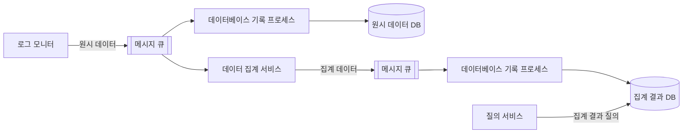
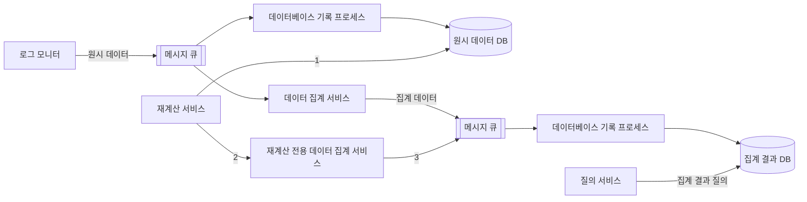

# 6장 광고 클릭 이벤트 집계
- 온라인 광고의 핵심은 실시간 데이터를 통해 광고 효과를 정량적으로 측정할 수 있다는 점이다.
- 디지털 광고의 핵심 프로세스는 RTB(Real-Time Bidding)이다.
    - 즉 실시간 경매로 광고가 나갈 지면을 거래한다.
    - RTB 프로세스는 속도가 중요하다. (1초 내에 마무리되어야 함)
- 광고 클릭 이벤트 집계는 온라인 광고가 얼마나 효율적이었는지 측정하는 데 결정적 역할을 한다.
    - CTR(Click-Through Rate, 클릭률)
    - CVR(Conversion Rate, 전환률)

## 1단계: 문제 이해 및 설계 범위 확정

- 기능 요구사항
    - 지난 M분 동안의 ad_id 클릭 수 집계
    - 매분 가장 많이 클릭된 상위 100개 광고 아이디 반환
    - 다양한 집계 필터링 지원
    - 데이터 양은 페이스북이나 구글 규모
- 비기능 요구사항
    - 집계 결과 정확성은 데이터가 RTB 및 광고 과금에 사용되므로 중요
    - 지연되거나 중복된 이벤트를 적절히 처리해야 함
    - 부분적 장애는 감내할 수 있어야 함
    - 전체 처리 시간은 최대 수 분을 넘지 않아야 함
- 개략적 추정
    - DAU 10억 명
    - 각 사용자는 하루에 평균 1개 광고를 클릭한다고 가정 (하루 10억건 클릭 발생)
    - 광고 클릭 QPS = 10,000
    - 최대 광고 클릭 QPS는 다섯 배라 가정
    - 클릭 이벤트 하나당 0.1KB 용량이 필요하다고 가정함 (0.1KB * 10억 = 100GB, 월간 용량 요구량 대략 3TB)

## 2단계: 개략적 설계안 제시 및 동의 구하기

### 질의 API 설계

- API는 2개 있으면 된다.
    - 지난 M분간 각 ad_id에 발생한 클릭 수 집계 API
    - 지난 M분간 가장 많은 클릭이 발생한 상위 N개 ad_id 목록

### 데이터 모델

- 데이터는 원시 데이터와 집계 결과 데이터 두 종류로 나눌 수 있다.
- 원시 데이터
    - ex) `[AdClickEvent] ad001, 2021-01-01 00:00:01, user 1, 207.148.22.22, USA`
    - 원시 데이터는 여러 애플리케이션 서버에 산재해 있다.
- 집계 결과 데이터
    - 아래는 분당 집계를 기록한 예시이다.

| ad_id | click_minute | count |
| --- | --- | --- |
| ad001 | 202101010000 | 5 |
| ad001 | 202101010001 | 7 |

- 원시 데이터와 집계 데이터 둘 다 저장하는 것이 좋다.
    - 원시 데이터는 문제 발생 시 디버깅 용도로 활용할 수 있다.
    - 원시 데이터는 양이 엄청나므로 직접 질의는 비효율적이기에 집계 데이터에 질의하는 것이 바람직하다.
    - 원시 데이터는 백업 데이터로 활용된다.
    - 집계 결과 데이터는 활성 데이터 구실을 하고 성능을 위해 튜닝하는 것이 보통이다.

### 올바른 데이터베이스의 선택

- 원시 데이터는 일상 작업에선 필요 없지만 데이터 분석에는 유용하다.
  - 원시 데이터는 쓰기가 압도적이고 읽기는 백업과 재계산 용도로만 이용된다.
  - 이정도 규모의 쓰기는 관계형 보단 카산드라나 InfluxDB를 사용하는 것이 바람직하다.
- 집계 데이터는 본질적으로 시계열 데이터이며 읽기/쓰기 둘 다 많이 사용한다.
  - 각 광고마다 매 분마다 질의를 던져 고객에게 최신 집계 결과를 제시해야 한다.
  - 집계 서비스가 데이터를 매 분 집계하고 결과를 기록하므로 쓰기도 빈번하다.
- 원시 데이터와 집계 데이터는 같은 유형의 데이터베이스를 활용하는 것이 가능하다.

### 개략적 설계안

- 폭발적으로 증가하는 트래픽을 처리하려면 집계 서비스를 비동기로 처리해야 한다.
  - 보통 카프카 같은 메시지 큐를 도입하여 생산자와 소비자의 결합을 끊는다.
- 로그 감시자, 집계 서비스, 데이터베이스는 2개의 메시지 큐로 분리되어 있다.
  - 첫 번째 메시지큐는 원시 데이터를, 두 번째 메시지큐는 집계 데이터를 처리한다.
  - 집계 결과를 바로 DB에 기록하지 않고 또 메시지 큐를 통하는 이유는 정확하게 한 번 데이터를 원자적으로 처리하기 위해서다.

### 집계 서비스

- 광고 클릭 이벤트를 집계하는 좋은 방안 중 하나는 맵리듀스(MapReduce) 프레임워크를 사용하는 것
  - 유향 비순환 그래프(directed acyclic graph, DAG) 모델이 맵리듀스에 적합하다.
- 맵 노드(map node)
  - 데이터 출처에서 읽은 데이터를 필터링하고 변환하는 역할을 담당한다.
  - ex) ad_id % 2 = 0의 조건을 만족하는 데이터를 노드 1로, 나머지는 노드 2로 라우팅
  - 맵 노드가 무조건 필수는 아니지만 입력 데이터를 정리하거나 정규화해야 하는 경우 필요하다.
  - 맵 노드가 없고 데이터가 생성되는 방식에 대한 제어권이 없는 경우 동일 ad_id를 갖는 이벤트가 서로 다른 카프카 파티션에 입력될 수도 있다.
- 집계 노드
  - 집계 노드는 ad_id별 광고 클릭 이벤트 수를 매 분 메모리에서 집계한다.
  - 맵리듀스에서 집계 노드는 리듀스 프로세스의 일부이므로 맵-집계-리듀스 프로세스는 실제로 맵-리듀스-리듀스 프로세스라고도 할 수 있다.
- 리듀스 노드
  - 집계 노드가 산출한 결과를 최종 결과로 축약한다.
  - ex) 집계 노드가 각각 자기 관점에서 가장 많은 클릭이 발생한 광고 3개를 추린다면 리듀스 노드는 그 결과들을 모아 최종적으로 3개 광고만 남긴다.
  - 주요 사용 사례지난 M분간 ad_id에 발생한 클릭 이벤트 수 집계
  - 지난 M분간 가장 많은 클릭이 발생한 상위 N개 ad_id 집계
  - 데이터 필터링

## 3단계: 상세 설계

### 스트리밍 vs 일괄 처리

- 스트림 처리는 데이터를 오는 대로 처리하고 실시간으로 집계 결과를 생성하는 데 사용된다.
- 일괄 처리는 이력 데이터를 백업하기 위해 활용한다.
- 일괄 및 스트리밍 처리 경로를 동시에 지원하는 시스템 아키텍처를 람다라 부른다.
  - 유지 관리해야 할 코드가 두 벌이라는 단점이 있다.
  - 카파 아키텍처는 일괄 처리와 스트리밍 처리 경로를 하나로 결합하여 코드 중복 문제를 해결한다.

### 데이터 재계산

- 때로 이미 집계한 데이터를 다시 계산해야 하는 경우가 있다.
  - ex) 집계 서비스에 버그가 있어 버그 발생 시점부터 원시 데이터를 다시 읽어야 하는 경우

1. 재계산 서비스는 원시 데이터 저장소에서 데이터를 일괄 처리로 검색한다.
2. 추출된 데이터는 전용 집계 서비스로 전송한다. (전용 집계 서비스를 두는 이유는 실시간 데이터 처리 과정이 재처리 프로세스와 간섭하는 것을 막기 위함)
3. 집계 결과는 두 번째 메시지 큐로 전송되어 집계 결과 데이터베이스에 반영된다.

### 시간

- 집계를 위한 타임스탬프는 두 가지 위치에서 만들어질 수 있다.
  - 이벤트 시각: 광고 클릭이 발생한 시각
  - 처리 시각: 집계 서버가 클릭 이벤트를 처리한 시스템 시각
- 네트워크 지연으로 인해 이벤트 시각과 처리 시각의 격차가 커질 수 있다.
- 이벤트 발생 시각을 집계에 사용하는 경우
  - 장점 - 광고 클릭 시점을 정확히 아는 것은 클라이언트이므로 집계 결과가 정확
  - 단점 - 클라이언트에 설정된 시간이 잘못 되었거나 악성 사용자가 조작할 가능성이 있다.
- 처리 시각을 집계에 사용하는 경우
  - 장점 - 서버 타임스탬프가 클라이언트 서버 스탬프보다 안정적
  - 단점 - 이벤트가 시스템에 도착한 시각이 한참 뒤인 경우 집계 결과가 부정확해짐
- 데이터 정확도가 아주 중요하다면 이벤트 발생 시각을 사용할 것을 추천한다.
  - 이 경우 시스템에 늦게 도착한 이벤트를 올바르게 처리해야 한다.

- 워터마크
  - 텀블링 윈도 방식에서 집계 윈도가 끝나는 시점보다 살짝 늦게 도착한 이벤트를 집계하는 데 실패하는 문제를 해결할 수 있다.
  - 워터마크는 집계 윈도의 확장으로 보는데 각 윈도 마지막에 붙는 여분으로 이벤트 시간의 진행 상황을 추적하고 지연 데이터를 처리하는 메커니즘이다.
  - 하지만 워터마크로도 한참 뒤에 도달하는 이벤트는 처리할 수 없는데 발생 확률이 낮은 이벤트 처리를 위해 시스템을 복잡하게 설계하면 ROI(Return on Investment)가 떨어진다.

### 집계 윈도 (aggregation window)

- <데이터 중심 애플리케이션 설계>에 따르면 윈도에는 4가지 종류가 있다.
  - 텀플링 윈도우 (Tumbling Window)
    - 고정된 크기의 시간 간격으로 데이터를 나눈다.
    - 윈도우 간에 겹치지 않고 각 이벤트는 정확히 한 윈도우에 속한다.
    - ex) 매 분 발생한 광고 클릭 이벤트를 집계하기에 적합하다.
  - 홉핑 윈도우 (Hopping Windo
    - 고정된 크기의 윈도우가 일정 간격으로 이동한다.
    - 윈도우 간에 겹침이 있을 수 있어 한 이벤트가 여러 윈도우에 포함될 수 있다.
    - ex) 10분 길이의 윈도우를 5분마다 생성
  - 슬라이딩 윈도우 (Sliding Window)
    - 고정된 크기위 윈도우가 연속적으로 이동한다.
    - 새로운 이벤트가 도착할 때마다 윈도우가 업데이트된다.
    - 실시간 분석에 적합하다.
    - ex) 최근 5분 동안의 데이터를 지속적으로 분석하는 경우
  - 세션 윈도우 (Session Window)
    - 고정된 크기가 없으며 이벤트 활동을 기반으로 동적으로 생성된다.
    - 일정 시간 동안 이벤트가 없으면 세션이 종료된다.
    - 사용자 활동 분석에 유용하다.
    - ex)웹 사이트 방문자의 세션 분석
- 본 설계안의 두 요구사항엔 다음 윈도우가 적합하다
  - 매 분 발생한 광고 클릭 이벤트 집계 → 텀블링 윈도우
  - 지난 M분간 가장 많이 클릭된 상위 N개 광고 찾기 → 슬라이딩 윈도우
