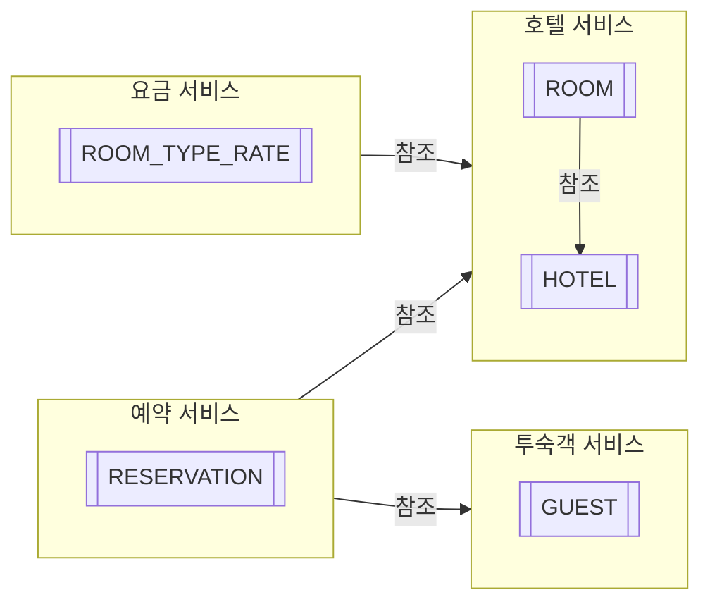
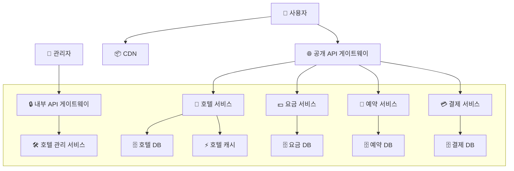

# 7장 호텔 예약 시스템
## 1단계: 문제 이해 및 설계 범위 확정

- 기능 요구사항
    - 호텔 정보 페이지 표시
    - 객실 정보 페이지 표시
    - 객실 예약/취소
        - 대금은 예약 시 지불
        - 객실 가격은 유동적
    - 호텔이나 객실 정보를 추가/삭제/갱신하는 관리자 페이지 지원
    - 초과 예약 지원
        - 일부 고객이 예약을 취소할 것을 예상하여 10% 초과예약이 가능해야 한다.
- 비기능 요구사항
    - 높은 수준의 동시성 지원 (성수기나 대규모 이벤트 고려)
    - 적절한 지연 시간
        - 예약 시 응답 속도가 빠르면 이상적이겠지만 요청 처리에 몇 초 정도 걸리는 것은 괜찮다.
- 계략적 규모 측정
    - 5000개 호텔, 100만 개 객실을 가정
    - 평균적으로 객실의 70%가 사용 중이고 평균 투숙 기간은 3일이라 가정
    - 일일 예약 건수: `백만 * 0.7 / 3 = 233,333`
    - 초당 예약 건수 = `240,000 / 10^5초 =~ 3.`
        - TPS는 그다지 높지 않다.
- QPS 예측
    - 예약 페이지의 사용 흐름에는 세 단계가 존재한다.
        - 호텔/객실 상세 페이지: 사용자가 정보를 확인 (조회)
        - 예약 상세 정보 페이지: 사용자가 날짜, 투숙 인원, 결제 등 상세 정보를 예약 전에 확인 (조회)
        - 객실 예약 페이지: 사용자가 객실을 예약 (트랜잭션 발생)
    - 대략 10% 사용자가 다음 단계로 진행한다고 가정하여 다음 결과를 제시
        - 객실 상세 QPS - 300
        - 예약 상세 QPS - 30
        - 객실 예약 QOS - 3
## 2단계: 개략적 설계안 제시 및 동의 구하기

### API 설계

- 각종 조회 api와 관리자용 호텔/객실 수정 api가 물론 있지만 ‘신규 예약 접수’만 살펴보자
- POST `/v1/reservations`
    - `reservationID`는 이중 예약 방지를 보장하는 멱등 키다.
    - 이중 예약은 같은 날 같은 객실에 예약이 중복으로 이루어지는 것을 말한다.

```json
{
	"startDate": "2021-04-28",
	"endDate": "2021-04-30",
	"hotelID": "245",
	"roomID": "U1234546",
	"reservationID": "13422445"
}
```

### 데이터 모델

- 호텔 예약 시스테의 데이터 접근 패턴
    - 호텔 상세 정보 확인
    - 지정된 날짜 범위에 사용 가능한 객실 유형 확인
    - 예약 정보 기록
    - 예약 내역 또는 과거 이력 정보 조회
- 본 설계안에선 관계형 DB를 선택한다.
    - 관계형 DB에선 쓰기보다 읽기 빈도가 높은 작업 흐름을 잘 지원한다.
    - ACID 지원을 통해 예약 기능을 잘 지원할 수 있는데 잔액이 마이너스가 되거나 이중 청구 문제를 방지하기 용이하다.
    - 비즈니스 데이터 구조를 명확히 하고 쉽게 모델링할 수 있다.



### 계략적 설계안

- 이 호텔 예약 시스템은 마이크로서비스 아키텍처를 사용한다



- 각 구성 요소 설명
    - CDN(콘텐츠 전송 네트워크): 모든 정적 컨텐츠를 캐시하여 웹사이트 성능 개선에 이용
    - 공개 API 게이트웨이
        - 처리율 제한, 인증 등 기능을 지원하는 완전 관리형 서비스
        - 엔드포인트 기반으로 특정 서비스에 요청을 전달
    - 내부 API
        - 승인된 관리자만 사용 가능
        - VPN 등의 기술을 사용해 외부 공격으로부터 보호한다.
    - 호텔 서비스
        - 호텔과 객실에 대한 상세 정보를 제공
        - 정적인 정보라 캐시가 용이
    - 요금 서비스
        - 어떤 날에 어떤 요금을 받아야 하는지 데이터를 제공하는 서비스
        - 해당 날짜에 얼마나 많은 손님이 몰리느냐에 따라 요금이 달라진다.
    - 예약 서비스
        - 예약 요청을 받고 처리
        - 예약/취소 시 잔여 객실 정보를 갱신
    - 결제 서비스: 결제를 맡아 처리하고 결제 상태를 관리
    - 호텔 관리 서비스
        - 승인된 관리자만 사용 가능
        - 예약 기록 확인, 예약/예약 취소 등 기능 제공
- 서비스 간 요청
    - 실제론 각 서비스 사이에도 의존/요청 관계가 있지만 위 다이어그램에선 생략했다.
    - ex) 예약 서비스는 객실 요금 계산을 위해 요금 서비스에 질의해야 한다.
    - ex) 호텔 관리 서비스에서 변경된 데이터는 대부분의 다른 서비스들이 해당 변경을 반영해야 한다.
- 서비스 간 통신에는 gRPC 같은 고성능 원격 프로시저 호출 프레임워크를 사용하곤 한다.

## 3단계: 상세 설계

### 동시성 문제

- 예약 시스템에선 이중 예약을 방지해야 한다.
    - 같은 사용자가 예약 버튼을 여러 번 누를 수 있다.
    - 여러 사용자가 같은 객실을 동시에 예약하러 할 수 있다.
- 같은 사용자가 예약 버튼을 여러번 누르는 경우
    - 클라이언트 측 구현
        - 클라이언트 요청 후 ‘예약’ 버튼을 disable 처리하여 이중 클릭 방지
        - 하지만 안정적인 방법은 아니다.
    - 멱등 API
        - 예약 API 요청에 멱등키를 추가하는 방안
        - 본 설계안에선 reservation_id를 멱등 키로 사용해 이중 예약 문제를 해결한다.
    - 멱등키와 RDB의 유일성 제약 조건을 이용해 이중 클릭을 방지한다.
- 여러 사용자가 같은 객실을 예약하러 하는 경우
    - 격리 수준이 repeatable read인 경우 여러 트랜잭션이 1자리 남은 객실을 예약 가능한 객실이라 판단하고 예약하여 이중 예약이 발생한다.
    - 방안 1: 비관적 락
        - 사용자가 레코드를 갱신하려는 순간 즉시 락을 걸어 동시 업데이트를 방지하는 기술
        - 구현이 쉽고 데이터 경합이 심할 때 유용하다.
        - 다만 여러 레코드에 락을 걸면서 데드락이 발생할 수 있고 확장성과 성능에 악영향을 미친다.
    - 방안 2: 낙관적 락
        - 여러 사용자가 동시에 자원을 갱신하는 것을 허용하지만 버저닝을 통해 동시 업데이트를 방지한다.
        - 일반적으로 비관적 락보다 빠르지만 동시성 수준이 아주 높으면 성능이 급격히 나빠진다.
        - 낙관적 예외가 발생하면 다시 예약을 시도해야 하지만 매번 성공하는 클라이언트는 하나이기 때문에 나머지는 다시 시도해야 한다.
        - 따라서 낙관적 락은 경쟁이 치열하지 않은 상황에 적합하다.
        - 예약 QPS가 높지 않은 본 설계안에선 낙관적 락이 적합한 선택지다.
    - 방안 3: 데이터베이스 제약 조건
        - `CONSTRAINT ‘check_room_count’ CHECK((’total_inventory - total_reserved’ ≥ 0))`
        - 객실 예약 시 제약 조건을 위반하면 트랜잭션은 중단되고 롤백된다.
        - 구현이 쉽고 데이터에 대한 경쟁이 심하지 않을 때 잘 동작한다.
        - 하지만 낙관적 락과 마찬가지로 경쟁이 심하면 연산 실패 수가 엄청 늘어나게 된다.
        - 데이터베이스 제약 조건은 애플리케이션 코드와 달라 버전을 통제하기 어렵다.
        - 제약 조건이 없는 데이터베이스도 있으므로 DB 교체 시 문제가 생길 수도 있다.

### 데이터베이스 샤딩

- QPS가 엄청 높아진다면 어떻게 해아할까
    - 무상태 서버는 스케일 아웃을 하면 된다.
    - 하지만 상태가 저장되는 데이터베이스는 단순히 서버를 늘리는 것만으론 해결할 수 없다.
- 데이터베이스 샤딩
    - 데이터베이스를 여러 대 두고 각각 데이터의 일부만 보관하는 방식
    - 본 설계안에선 hotel_id를 샤드 키로 활용할 수 있다.
    - QPS를 30,000이라 가정했을 때 MySQL 서버가 16대면 1대에서 1875QPS를 감당하게 되는데 이는 충분히 감당 가능한 트래픽이다.

### 캐시

- 호텔 잔여 객실 데이터는 현재와 미래 데이터만이 중요하기에 TTL을 설정할 수 있다면 좋다.
- 레디스를 활용하면 TTL과 LRU(Least Recently Used) 캐시 교체 정책을 통해 메모리를 최적으로 활용 가능하다.
- 데이터 로딩 속도와 확장성에 문제가 생긴다면 DB 앞에 캐시 계층을 두어 객실 확인 및 예약 로직을 캐시 계층에서 실행하도록 할 수 있다.
- 다만 잔여 객실 수에 대한 최종적 진실은 결국엔 DB에 있기에 다시 다시 한 번 확인할 필요는 있다.
- 각 시스템 컴포넌트는 다음과 같다.
    - 예약 서비스
        - 지정된 호텔과 객실 유형을 질의
        - 객실을 예약하고 total_reserved 값을 1 증가
        - 예약이 취소되면 잔여 객실 수를 갱신
    - 잔여 객실 캐시
        - 모든 잔여 객실 관리에 필요한 질의는 레디스로 구현되는 캐시로 옮긴다.
        - 키: `hotelID_roomTypeID_{날짜},` 값: 호텔 ID, 객실 유형 ID, 잔여 객실 수
        - 호텔 예약 시스템은 읽기 연산 빈도가 쓰기보다 훨씬 많기에 디부분의 읽기 연산은 캐시가 처리한다.
    - 잔여 객실 데이터 베이스
        - 객실 수에 대한 가장 믿을 만한 정보가 보관되는 장소

### 캐시와 데이터베이스 사이의 데이터 일관성

- 캐시 계층을 추가하면 확장성과 처리량은 상승하지만 DB와 캐시의 일관성 유지를 신경 써야 한다.
- 사용자가 객실을 예약할 때 다음 두 가지 작업이 이루어진다.
    - 캐시에서 잔여 객실 수를 질의하여 충분한지 확인한다.
    - 잔여 객실 데이터를 갱신한다.
        - 데이터베이스가 먼저 갱신되고 캐시가 그 후 갱신된다.
        - 변경 데이터 감지 (CDC) 메커니즘을 사용할 수도 있다.
- DB에 먼저 데이터를 업데이트하기에 캐시에는 최신 데이터가 없을 가능성이 있다.
- 다만 이런 불일치는 데이터베이스가 최종적으로 잔여 객실을 확인하도록 하면 문제되지 않는다.
    - 캐시 질의 결과 잔여 객실이 있지만 데이터베이스에는 잔여 객실이 없는 경우 사용자는 예약을 시도한다.
    - 해당 요청이 데이터베이스에 도달하면 유효성 검사가 수행되고 남은 객실이 없음이 확인된다.
    - 결과적으로 클라이언트는 남은 객실이 없다는 결과를 반환할 수 있다.
- 장점
    - 읽기 질의를 캐시가 처리하기에 DB 부하가 크게 줄어든다.
    - 읽기 질의를 메모리에서 실행하므로 높은 성능을 보장한다.
- 단점
    - 데이터베이스와 캐시 사이 데이터 일관성 유지가 까다롭다.
