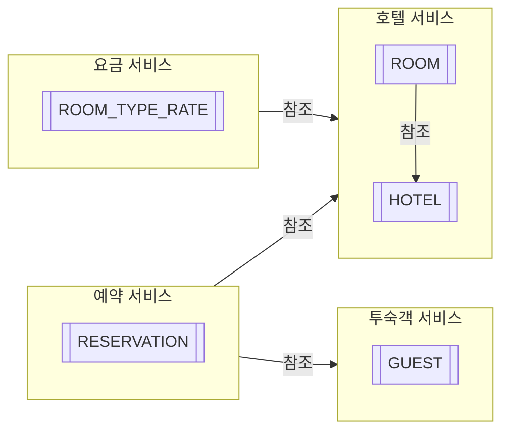
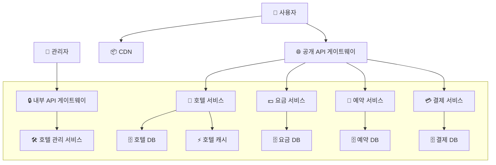

# 7장 호텔 예약 시스템
## 1단계: 문제 이해 및 설계 범위 확정

- 기능 요구사항
    - 호텔 정보 페이지 표시
    - 객실 정보 페이지 표시
    - 객실 예약/취소
        - 대금은 예약 시 지불
        - 객실 가격은 유동적
    - 호텔이나 객실 정보를 추가/삭제/갱신하는 관리자 페이지 지원
    - 초과 예약 지원
        - 일부 고객이 예약을 취소할 것을 예상하여 10% 초과예약이 가능해야 한다.
- 비기능 요구사항
    - 높은 수준의 동시성 지원 (성수기나 대규모 이벤트 고려)
    - 적절한 지연 시간
        - 예약 시 응답 속도가 빠르면 이상적이겠지만 요청 처리에 몇 초 정도 걸리는 것은 괜찮다.
- 계략적 규모 측정
    - 5000개 호텔, 100만 개 객실을 가정
    - 평균적으로 객실의 70%가 사용 중이고 평균 투숙 기간은 3일이라 가정
    - 일일 예약 건수: `백만 * 0.7 / 3 = 233,333`
    - 초당 예약 건수 = `240,000 / 10^5초 =~ 3.`
        - TPS는 그다지 높지 않다.
- QPS 예측
    - 예약 페이지의 사용 흐름에는 세 단계가 존재한다.
        - 호텔/객실 상세 페이지: 사용자가 정보를 확인 (조회)
        - 예약 상세 정보 페이지: 사용자가 날짜, 투숙 인원, 결제 등 상세 정보를 예약 전에 확인 (조회)
        - 객실 예약 페이지: 사용자가 객실을 예약 (트랜잭션 발생)
    - 대략 10% 사용자가 다음 단계로 진행한다고 가정하여 다음 결과를 제시
        - 객실 상세 QPS - 300
        - 예약 상세 QPS - 30
        - 객실 예약 QOS - 3
## 2단계: 개략적 설계안 제시 및 동의 구하기

### API 설계

- 각종 조회 api와 관리자용 호텔/객실 수정 api가 물론 있지만 ‘신규 예약 접수’만 살펴보자
- POST `/v1/reservations`
    - `reservationID`는 이중 예약 방지를 보장하는 멱등 키다.
    - 이중 예약은 같은 날 같은 객실에 예약이 중복으로 이루어지는 것을 말한다.

```json
{
	"startDate": "2021-04-28",
	"endDate": "2021-04-30",
	"hotelID": "245",
	"roomID": "U1234546",
	"reservationID": "13422445"
}
```

### 데이터 모델

- 호텔 예약 시스테의 데이터 접근 패턴
    - 호텔 상세 정보 확인
    - 지정된 날짜 범위에 사용 가능한 객실 유형 확인
    - 예약 정보 기록
    - 예약 내역 또는 과거 이력 정보 조회
- 본 설계안에선 관계형 DB를 선택한다.
    - 관계형 DB에선 쓰기보다 읽기 빈도가 높은 작업 흐름을 잘 지원한다.
    - ACID 지원을 통해 예약 기능을 잘 지원할 수 있는데 잔액이 마이너스가 되거나 이중 청구 문제를 방지하기 용이하다.
    - 비즈니스 데이터 구조를 명확히 하고 쉽게 모델링할 수 있다.



### 계략적 설계안

- 이 호텔 예약 시스템은 마이크로서비스 아키텍처를 사용한다



- 각 구성 요소 설명
    - CDN(콘텐츠 전송 네트워크): 모든 정적 컨텐츠를 캐시하여 웹사이트 성능 개선에 이용
    - 공개 API 게이트웨이
        - 처리율 제한, 인증 등 기능을 지원하는 완전 관리형 서비스
        - 엔드포인트 기반으로 특정 서비스에 요청을 전달
    - 내부 API
        - 승인된 관리자만 사용 가능
        - VPN 등의 기술을 사용해 외부 공격으로부터 보호한다.
    - 호텔 서비스
        - 호텔과 객실에 대한 상세 정보를 제공
        - 정적인 정보라 캐시가 용이
    - 요금 서비스
        - 어떤 날에 어떤 요금을 받아야 하는지 데이터를 제공하는 서비스
        - 해당 날짜에 얼마나 많은 손님이 몰리느냐에 따라 요금이 달라진다.
    - 예약 서비스
        - 예약 요청을 받고 처리
        - 예약/취소 시 잔여 객실 정보를 갱신
    - 결제 서비스: 결제를 맡아 처리하고 결제 상태를 관리
    - 호텔 관리 서비스
        - 승인된 관리자만 사용 가능
        - 예약 기록 확인, 예약/예약 취소 등 기능 제공
- 서비스 간 요청
    - 실제론 각 서비스 사이에도 의존/요청 관계가 있지만 위 다이어그램에선 생략했다.
    - ex) 예약 서비스는 객실 요금 계산을 위해 요금 서비스에 질의해야 한다.
    - ex) 호텔 관리 서비스에서 변경된 데이터는 대부분의 다른 서비스들이 해당 변경을 반영해야 한다.
- 서비스 간 통신에는 gRPC 같은 고성능 원격 프로시저 호출 프레임워크를 사용하곤 한다.
