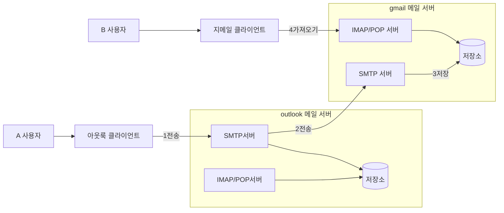

# 8장 분산 이메일 서비스
## 1단계: 문제 이해 및 설계 범위 확정

- 기능 요구사항
    - 인증
    - 이메일 발송/수신
    - 모든 이메일 조회
    - 읽음 여부에 따른 필터링
    - 제목, 발신인, 메일 내용에 따른 검색
    - 스팸 및 바이러스 방지
- 비기능 요구사항
    - 안정성: 이메일 데이터가 소실되어서는 안 된다.
    - 가용성
        - 데이터를 여러 노드에 자동으로 복제하여 가용성을 보장해야 한다.
        - 부분적으로 장애가 발생해도 시스템은 계속 동작해야 한다.
    - 확장성
        - 사용자가 늘어나도 감당할 수 있어야 한다.
        - 사용자나 이메일이 많아져도 성능이 저하되면 안 된다.
    - 유연성과 확장성
        - 새 컴포넌트를 더해 쉽게 기능을 추가할 수 있어야 한다.
        - POP나 IMAP 같은 기존 이메일 프로토콜은 매우 제한적이기에 맞춤형 프로토콜이 필요할 수도 있다.
- 개략적인 규모 추정
    - 10억 명의 사용자
    - 한 사람이 하루에 보내는 평균 이메일 수는 10건이라 가정하면 QPS = 100,000
    - 한 사람이 하루에 수신하는 이메일 수 평균 40건이라 가정
    - 이메일 하나의 메타데이터는 평균 50KB로 가정하고 이러한 메타데이터는 데이터베이스에 저장
    - 1년간 메타데이터를 유지하기 위한 스토리지 요구사항은 10억 * 40건 * 365일 * 50KB = 730PB에 달한다.
    - 첨부 파일까지 생각하면 메타데이터의 약 2배가 든다고 가정한다.

## 2단계: 개략적 설계안 제시 및 동의 구하기

### 이메일 프로토콜

- SMTP (Simple Mail Transfer Protocol)
    - 이메일을 한 서버 간 전송시키는 표준 프로토콜이다.
- POP (Post Office Protocol)
    - 이메일 클라이언트가 원격 메일 서버에서 이메일을 수신/다운로드 하기 위해 사용하는 표준 프로토콜
    - 단말로 다운로드된 이메일은 서버에서 삭제되어 한 대 단말에서만 이메일을 읽을 수 있다.
- 이 프로토콜을 사용하는 클라이언트는 이메일 일부만 읽을 수 없고 읽으려면 전부 내려 받아야 하기에 용량이 크면 읽는데 시간이 오래 걸린다.
- IMAP (Internet Mail Access Protocol)
    - 이메일 클라이언트가 원격 메일 서버에서 이메일을 수신하는 또 다른 표준 프로토콜
    - POP와 달리 클릭하지 않으면 메시지는 다운로드 되지 않는다.
    - 메일 서버에서 지워지지도 않기에 여러 단말에서 메일을 읽을 수 있다.
    - 개인 이메일 계정에서 널리 사용되는 프로토콜
    - 이메일을 실제로 열기 전엔 헤더만 다운로드하기에 인터넷 속도가 느려도 잘 동작한다.
- HTTPS
    - 기술적으로 메일 전송 프로토콜은 아니지만 웹 기반 이메일 시스템의 메일함 접속에 이용된다.

### DNS

- DNS는 수신자 도메인의 메일 교환기 레코드(Mail Exchage, MX) 검색에 이용된다.
    - cmmand-line에서 gmail.com의 DNS 레코드를 검색해보면 아래와 같은 MX 레코드가 표시된다.
    - exchanger 오른쪽의 수치는 우선순위 선호도를 나타내는데 값이 낮으면 우선순위가 높은 것이다.
    - `gmail-smtp-in.l.google.com.`가 우선순위가 가장 높아 최우선으로 쓰인다.
    - 서버 연결에 실패하면 그 다음 우선순위의 서버에 연결을 시도한다.

```
Non-authoritative answer:
gmail.com	mail exchanger = 30 alt3.gmail-smtp-in.l.google.com.
gmail.com	mail exchanger = 10 alt1.gmail-smtp-in.l.google.com.
gmail.com	mail exchanger = 40 alt4.gmail-smtp-in.l.google.com.
gmail.com	mail exchanger = 5 gmail-smtp-in.l.google.com.
gmail.com	mail exchanger = 20 alt2.gmail-smtp-in.l.google.com.
```

### 첨부파일

- 이메일 첨부 파일은 일반적으로 Base64 인코딩을 사용하여 메시지와 함께 전송된다.
    - 일반적으로 첨부 파일에는 크기 제한이 있다.
    - ex) 지메일은 첨부파일 크기를 25MB로 제한하고 있다.

### 전통적 메일 서버

- 전통적 메일 서버는 보통 서버 한 대로 운용되는 사용자가 많지 않을 때 잘 동작하는 시스템이다.
- 아래는 전통적 메일 서버에서 A가 B에게 메일을 보내는 시나리오다.



1. A는 outlook 클라이언트에 로그인하여 이메일을 작성하고 이메일을 보내면 outlook 메일 서버로 전송되는데 이 때 SMTP 프로토콜을 사용한다.
2. outlook 메일 서버는 DNS 질의를 통해 수신사 SMTP 서버 주소를 찾고 (지메일) 해당 메일 서버로 이메일을 보낸다. (SMTP 사용)
3. 지메일 서버는 이메일을 저장하고 수신자인 B가 읽어갈 수 있도록 한다.
4. B가 지메일에 로그인하면 지메일 클라이언트는 IMAP/POP 서버를 통해 새 이메일을 가져온다.

- 전통적 메일 서버는 이메일을 파일 시스템 디렉터리에 저장한다.
  - 각 이메일은 고유한 이름을 가진 별도 파일로 보관한다.
  - 이러한 구조는 메일 양이 많아지고 파일 구조가 복잡해지면 디스크 I/O가 병목이 되곤 했다.
