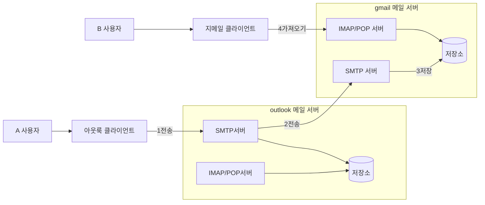
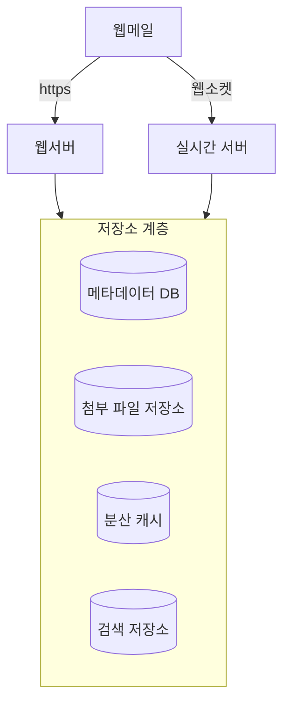
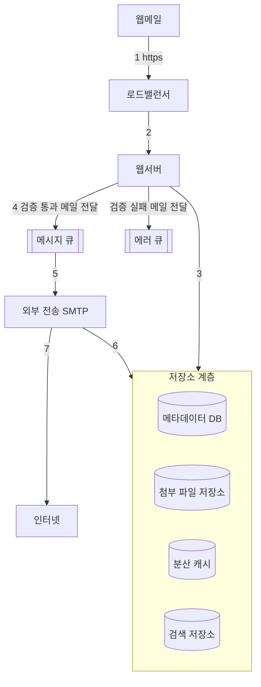
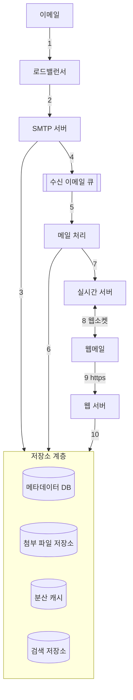

# 8장 분산 이메일 서비스
## 1단계: 문제 이해 및 설계 범위 확정

- 기능 요구사항
    - 인증
    - 이메일 발송/수신
    - 모든 이메일 조회
    - 읽음 여부에 따른 필터링
    - 제목, 발신인, 메일 내용에 따른 검색
    - 스팸 및 바이러스 방지
- 비기능 요구사항
    - 안정성: 이메일 데이터가 소실되어서는 안 된다.
    - 가용성
        - 데이터를 여러 노드에 자동으로 복제하여 가용성을 보장해야 한다.
        - 부분적으로 장애가 발생해도 시스템은 계속 동작해야 한다.
    - 확장성
        - 사용자가 늘어나도 감당할 수 있어야 한다.
        - 사용자나 이메일이 많아져도 성능이 저하되면 안 된다.
    - 유연성과 확장성
        - 새 컴포넌트를 더해 쉽게 기능을 추가할 수 있어야 한다.
        - POP나 IMAP 같은 기존 이메일 프로토콜은 매우 제한적이기에 맞춤형 프로토콜이 필요할 수도 있다.
- 개략적인 규모 추정
    - 10억 명의 사용자
    - 한 사람이 하루에 보내는 평균 이메일 수는 10건이라 가정하면 QPS = 100,000
    - 한 사람이 하루에 수신하는 이메일 수 평균 40건이라 가정
    - 이메일 하나의 메타데이터는 평균 50KB로 가정하고 이러한 메타데이터는 데이터베이스에 저장
    - 1년간 메타데이터를 유지하기 위한 스토리지 요구사항은 10억 * 40건 * 365일 * 50KB = 730PB에 달한다.
    - 첨부 파일까지 생각하면 메타데이터의 약 2배가 든다고 가정한다.

## 2단계: 개략적 설계안 제시 및 동의 구하기

### 이메일 프로토콜

- SMTP (Simple Mail Transfer Protocol)
    - 이메일을 한 서버 간 전송시키는 표준 프로토콜이다.
- POP (Post Office Protocol)
    - 이메일 클라이언트가 원격 메일 서버에서 이메일을 수신/다운로드 하기 위해 사용하는 표준 프로토콜
    - 단말로 다운로드된 이메일은 서버에서 삭제되어 한 대 단말에서만 이메일을 읽을 수 있다.
- 이 프로토콜을 사용하는 클라이언트는 이메일 일부만 읽을 수 없고 읽으려면 전부 내려 받아야 하기에 용량이 크면 읽는데 시간이 오래 걸린다.
- IMAP (Internet Mail Access Protocol)
    - 이메일 클라이언트가 원격 메일 서버에서 이메일을 수신하는 또 다른 표준 프로토콜
    - POP와 달리 클릭하지 않으면 메시지는 다운로드 되지 않는다.
    - 메일 서버에서 지워지지도 않기에 여러 단말에서 메일을 읽을 수 있다.
    - 개인 이메일 계정에서 널리 사용되는 프로토콜
    - 이메일을 실제로 열기 전엔 헤더만 다운로드하기에 인터넷 속도가 느려도 잘 동작한다.
- HTTPS
    - 기술적으로 메일 전송 프로토콜은 아니지만 웹 기반 이메일 시스템의 메일함 접속에 이용된다.

### DNS

- DNS는 수신자 도메인의 메일 교환기 레코드(Mail Exchage, MX) 검색에 이용된다.
    - cmmand-line에서 gmail.com의 DNS 레코드를 검색해보면 아래와 같은 MX 레코드가 표시된다.
    - exchanger 오른쪽의 수치는 우선순위 선호도를 나타내는데 값이 낮으면 우선순위가 높은 것이다.
    - `gmail-smtp-in.l.google.com.`가 우선순위가 가장 높아 최우선으로 쓰인다.
    - 서버 연결에 실패하면 그 다음 우선순위의 서버에 연결을 시도한다.

```
Non-authoritative answer:
gmail.com	mail exchanger = 30 alt3.gmail-smtp-in.l.google.com.
gmail.com	mail exchanger = 10 alt1.gmail-smtp-in.l.google.com.
gmail.com	mail exchanger = 40 alt4.gmail-smtp-in.l.google.com.
gmail.com	mail exchanger = 5 gmail-smtp-in.l.google.com.
gmail.com	mail exchanger = 20 alt2.gmail-smtp-in.l.google.com.
```

### 첨부파일

- 이메일 첨부 파일은 일반적으로 Base64 인코딩을 사용하여 메시지와 함께 전송된다.
    - 일반적으로 첨부 파일에는 크기 제한이 있다.
    - ex) 지메일은 첨부파일 크기를 25MB로 제한하고 있다.

### 전통적 메일 서버

- 전통적 메일 서버는 보통 서버 한 대로 운용되는 사용자가 많지 않을 때 잘 동작하는 시스템이다.
- 아래는 전통적 메일 서버에서 A가 B에게 메일을 보내는 시나리오다.



1. A는 outlook 클라이언트에 로그인하여 이메일을 작성하고 이메일을 보내면 outlook 메일 서버로 전송되는데 이 때 SMTP 프로토콜을 사용한다.
2. outlook 메일 서버는 DNS 질의를 통해 수신사 SMTP 서버 주소를 찾고 (지메일) 해당 메일 서버로 이메일을 보낸다. (SMTP 사용)
3. 지메일 서버는 이메일을 저장하고 수신자인 B가 읽어갈 수 있도록 한다.
4. B가 지메일에 로그인하면 지메일 클라이언트는 IMAP/POP 서버를 통해 새 이메일을 가져온다.

- 전통적 메일 서버는 이메일을 파일 시스템 디렉터리에 저장한다.
  - 각 이메일은 고유한 이름을 가진 별도 파일로 보관한다.
  - 이러한 구조는 메일 양이 많아지고 파일 구조가 복잡해지면 디스크 I/O가 병목이 되곤 했다.

### 분산 메일 서버 아키텍처



- 웹메일 - 사용자는 웹브라우저를 사용해 메일을 받고 보낸다.
- 웹서버
  - 사용자가 이용하는 요청/응답 서비스로 로그인, 가입 등 관리 기능을 담당한다.
  - 이메일 발송, 목록 확인, 메시지 확인 등 이메일 API 요청은 전부 웹서버를 통한다.
- 실시간 서버
  - 새로운 메일 내역을 클라이언트에 실시간으로 전달한다.
  - 지속성 연결이 필요하므로 stateful하다.
  - 웹소켓을 쓰되 브라우저 호환 문제가 있다면 롱폴링도 사용할 수 있다.
- 메타데이터 데이터베이스
  - 이메일 제목, 본문, 발신인, 수신인 목록 등 메타데이터를 저장한다.
- 첨부 파일 저장소
  - AWS S3 같은 객체 저장소를 사용하는데 S3는 대용량 파일을 저장하는 데 적합한 인프라다.
    - 본 설계안에선 25MB까지 올릴 수 있도록 하겠다.
  - 카산드라 같은 NoSQL 데이터베이스는 적합하지 않다.
    - 카산드라가 BLOB(Binary Large Object) 자료형을 지원하지만 실질적으로는 1MB 이상 파일을 지원하지 못한다.
    - 카산드라에 첨부 파일을 저장하면 레코드 캐시를 사용하기 어렵다. (너무 많은 메모리를 잡아 먹을 것)
- 분산 캐시
  - 최근 수신된 메일은 자주 읽을 가능성이 높기에 메모리에 캐시해 두면 좋다.
  - 본 설계안에선 레디스를 활용할 것이다.
- 검색 저장소
  - 분산 문서 저장소로 고속 텍스트 검색을 지원하는 역 인덱스(inverted index) 자료구조로 사용한다.

### 이메일 전송 절차



1. 사용자가 웹메일 환경에서 메일을 작성한 후 전송하면 요청은 로드밸런서로 전송된다.
2. 로드밸런서는 처리율 제한 한도를 넘지 않는 선에서 요청을 웹 서버로 전달한다.
3. 웹 서버는 기본적인 이메일 검증, 도메인 검사를 수행한다.
4. 검증을 통과한 이메일은 외부 전송 메시지 큐로 전달되고 너무 큰 첨부 파일의 경우 객체 저장소에 따로 저장하고 큐에는 참조만 보관한다.
5. 외부 전송 담당 SMTP 작업 프로세스는 메시지 큐에서 메시지를 꺼내 이메일 스팸 및 바이러스 감염 여부를 확인한다.
6. 검증을 통과한 이메일은 저장소 계층 내의 ‘보낸 편지함’에 저장된다.
7. 외부 전송 담당 SMTP 작업 프로세스가 수신자의 메일 서버로 메일을 전송한다.

- 분산 메시지 큐는 비동기적 메일 처리를 가능하게 하는 핵심 컴포넌트다.
  - 큐 크기 모니터링할 땐 주의가 필요한데 오래 처리되지 않은 데이터가 있다면 이유를 분석해야 한다.
  - 수신자 측 메일 서버에 장애가 발생한 거라면 나중에 메일을 다시 전송해야 하고 지수적 백오프 전략을 사용할 수 있다.
  - 이메일을 전송하는 큐의 소비자 수가 부족하다면 더 많은 소비자를 추가할 수 있다.
- 웹 서버에서 외부 전송 담당 SMTP 프로세스를 분리함으로써 전송용 SMTP 프로세스 규모를 독립적으로 조정할 수 있다.

### 이메일 수신 절차



1. 이메일이 SMTP 로드밸런서에 도착한다.
2. 로드밸런서는 트래픽을 여러 SMTP 서버로 분산한다.
3. 이메일의 첨부 파일 큐에 들어가기 너무 크다면 S3에 보관한다.
4. 이메일을 수신 이메일 큐에 넣는다.
5. 메일 처리 작업 프로세스(worker)는 스팸 메일을 필터링하고 바이러스를 차단한다.
6. 검증 통과 이메일을 메일 저장소, 캐시, 객체 저장소 등에 보관한다.
7. 수신자가 온라인 상태라면 이메일을 실시간 서버로 전달한다.
8. 실시간 서버는 웹소켓 서버로 수신자 클라이언트가 실시간으로 메일을 받게 한다.
9. 오프라인 상태 사용자의 이메일은 저장소 계층에 보관하고 사용자가 온라인 상태가 되면 REST API로 메일을 조회한다.
10. 웹 서버는 새로운 이메일 저장소 계층에서 가져와 클라이언트에 반환한다.

## 3단계: 상세 설계

### 메타데이터 데이터베이스

- 이메일 메타데이터의 특성
  - 이메일 헤더는 일반적으로 작고 빈번히 이용된다.
  - 이메일 본문 크기는 다양하지만 사용 빈도는 낮고 사용자는 보통 본문을 한 번만 읽는다.
  - 이메일 가져오기, 읽은 메일로 표시, 검색 등 작업은 사용자 별로 격리 수행되어야 하는데 이는 즉 자신의 메일만 읽을 수 있어야 한다는 것
  - 사용자는 보통 최근 메일만 읽는데 16일 이하 데이터에 발생하는 질의는 전체 질의의 82%에 달한다.
  - 데이터는 높은 안정성을 보장해야 하기에 손실은 용납되지 않는다.
- 올바른 데이터베이스 선정
  - 관계형 데이터베이스
    - 관계형을 쓴다면 헤더와 본문에 대한 인덱스로 효율적인 검색을 할 수 있기 때문이 크다.
    - 하지만 관계형은  데이터 크기가 작을 때만 적합하다.
    - 이메일은 보통 수 KB 보다 크고 HTML이 포함되면 쉽게 100KB가 넘는다.
    - BLOB을 사용할 순 있지만 비정형 BLOB 자료형은 질의 성능이 좋지 않다.
  - 분산 객체 저장소
    - 객체 저장소는 백업 데이터 보관에는 좋다.
    - 하지만 읽음 표시, 키워드 검색, 이메일 타래(thread) 기능 구현에는 그다지 좋지 않다.
  - NoSQL
    - 지메일은 구글 빅테이블(Bigtable)을 저장소로 사용하는데 오픈소스가 아니고 구현 방안은 미스터리하다.
    - 카산드라를 사용할 수도 있겠지만 사례가 거의 없다.
- 상용 도구로는 이메일 데이터베이스에 완전 적합한 DB는 없다고 봐도 좋다.
- 대형 메일 서비스 업체는 대체로 독자적인 데이터베이스 시스템을 사용한다.
- 다만 이메일 데이터베이스가 다음 조건을 충족해야 한다는 점은 알아두자
  - 단일 컬럼 크기가 한 자릿 수 MB 정도일 수 있다.
  - 강력한 데이터 일관성이 필요
  - 디스크 I/O가 최소화되어야 한다.
  - 가용성이 아주 높아야 하고 일부 장애를 견딜 수 있어야 한다.
  - 증분 백업이 쉬워야 한다.
- 데이터 모델
  - user_id를 파티션 키로 사용하여 특정 사용자 데이터를 같은 샤드에 보관하면 된다.
  - 여러 사용자와 데이터를 공유할 수 없지만 이메일은 자신의 것만 확인하니 상관없다.
- 일관성 문제
  - 이메일 시스템은 데이터 정확성이 아주 중요하므로 모든 메일함은 반드시 하나의 주 사본을 통해 서비스된다.
  - 장애가 발생하면 다른 사본을 통해 주 사본을 복원할 때까지 기다려야 하기에 일관성을 위해 가용성을 희생한다.
