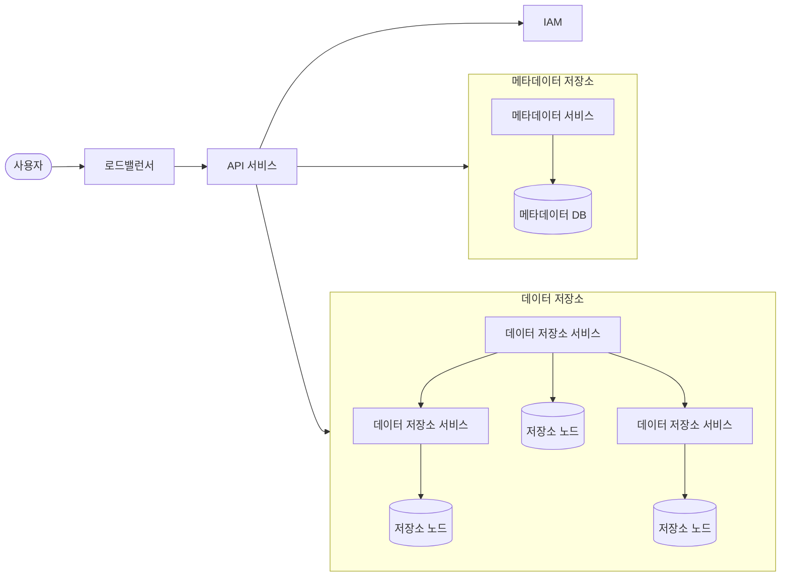
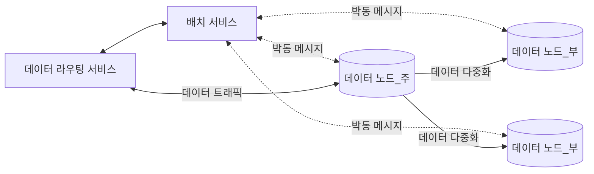
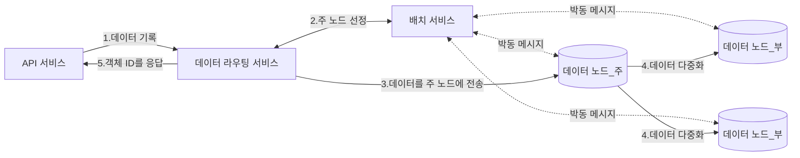
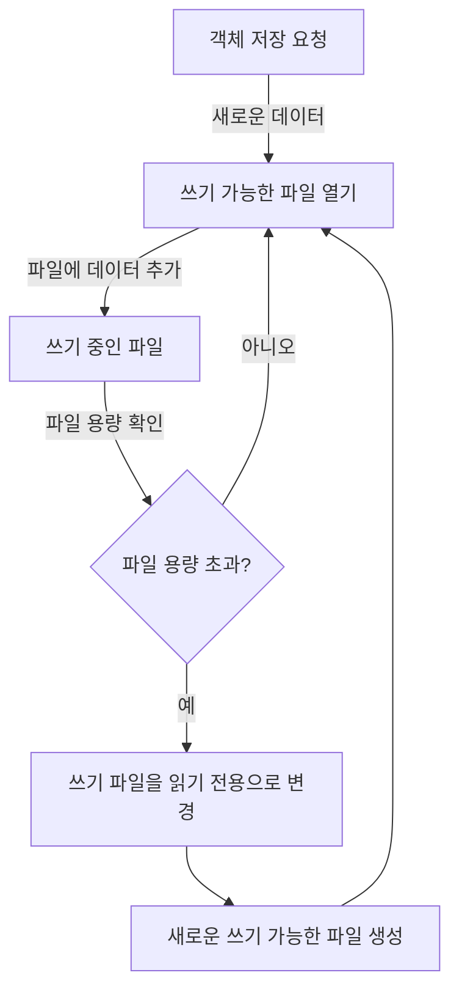
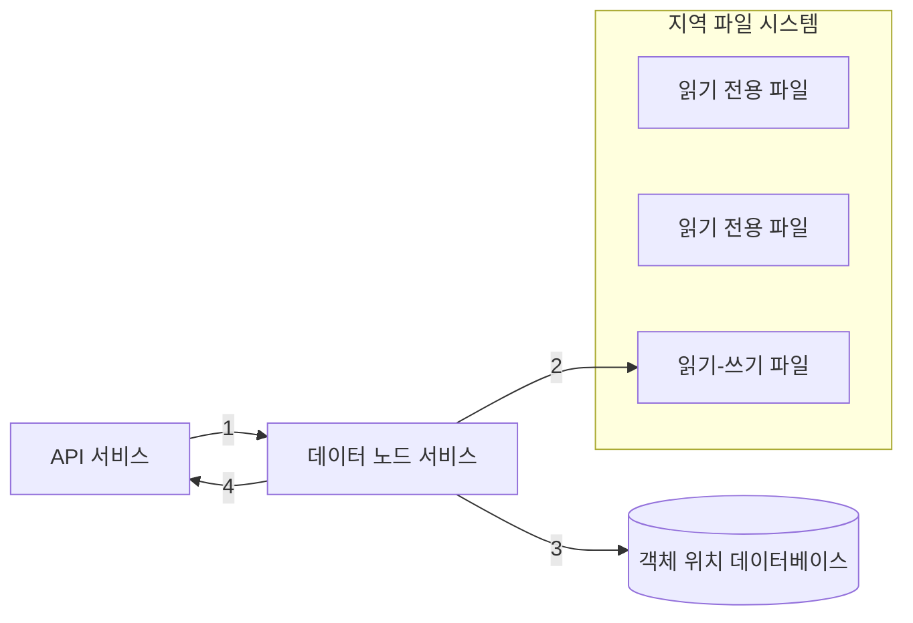

# 9장 S3와 유사한 객체 저장소
- S3는 AWS에서 제공하는 REST API 기반 인터페이스로 이용 가능한 객체 저장소다.

## 저장소 시스템 101

- 개략적으로 저장소 시스템엔 세 가지 부류가 있다.
- 블록 저장소
    - 블록 저장소는 원시 블록을 서버에 볼륨 형태로 제공하는 가장 유연하고 융통성 높은 저장소다.
    - HDD나 SSD처럼 서버에 물리적으로 연결되는 드라이브는 블록 저장소의 가장 흔한 형태다.
    - 원시 블록을 서버에 볼륨 형태로 제공하며 가장 유연한 저장소다.
    - 데이터베이스나 가상 머신 엔진 등은 원시 블록을 직접 제어하여 최대한의 성능을 끌어낸다.
- 파일 저장소
    - 파일 저장소는 블록 저장소 위에 구현되어 더 높은 추상화를 제공한다.
    - 데이터는 계층적인 디렉터리 안에 보관된다.
    - 파일 저장소를 사용하는 서버는 블록을 직접 제어/포맷하는 까다로움을 거치지 않아도 된다.
- 객체 저장소
    - 데이터 영속성과 대규모 애플리케이션을 지원하며 비용을 낮추기 위해 성능을 희생하는 특징이 있다.
    - 데이터 아카이브나 백업에 주로 쓰이며 모든 데이터를 수평적 구조의 객체로 보관한다. (계층적 디렉터리가 없음)
    - 데이터 접근은 REST API를 통한다.
    - ex) AWS S3, Azure Blob Storage

### 용어 정리

- 버킷(bucket)
    - 객체를 보관하는 논리적 컨테이너
    - 버킷 이름은 전역적으로 유일해야 한다.
    - S3에 데이터를 업로드하기 위해선 버킷부터 만들어야 한다.
- 객체(object)
    - 버킷에 저장하는 개별 데이터
    - 데이터(payload)와 메타데이터를 갖는다.
    - 메타데이터는 객체를 기술하는 이름-값 쌍이다.
- 버전(versioning)
    - 한 객체의 여러 버전을 같은 버킷 안에 둘 수 있게 하는 기능
    - 실수로 지웠거나 덮어 쓴 객체를 복구할 수 있도록 한다.
- URI(Uniform Resource Identifier)
    - 객체에 접근할 수 있도록 하는 REST API를 제공
    - 각 객체는 해당 API URI를 통해 고유하게 식별 가능하다.
- SLA(Service-Level Agreement)
    - 서비스 수준 협약은 서비스 제공자와 클라이언트 사이 맺어지는 계약이다.
    - AWS S3의 경우
        - 여러 가용 구역에 걸쳐 99.9999999%의 객체 내구성 제공
        - 한 가용 구역 전체가 소실되어도 데이터 복구 가능
        - 연간 99.9% 가용성 제공

## 1단계: 문제 이해 및 설계 범위 확정

- 기능 요구사항
  - 버킷 생성
  - 객체 업로드 및 다운로드
  - 객체 버전
  - 버킷 내 객체 목록 출력 기능
- 비기능 요구사항
  - 100PB 데이터
  - 식스 나인(six nines, 99.9999%) 수준의 데이터 내구성
  - 포 나인(99.99%) 수준의 서비스 가용성
  - 저장소 효올성: 높은 수준의 안정성과 성능은 보증하되 저장소 비용은 최대한 낮추어야 한다.
- 대략적인 규모 추정
  - 객체 저장소는 디스크 용량이나 초당 디스크 IO(IOPS)가 병목이 될 가능성이 높다.
  - 객체 크기의 분포를 잘 고려해야 한다.
    - ex) 객체 중 20%가 1MB 미만, 60%는 1~64MB, 나머지 20%는 64MB이상의 대형 객체
  - IOPS: 초당 100~150회 임의 데이터 탐색을 지원한다고 가정
  - 이러한 가정에 기반하여 시스템의 가용 객체 수를 가늠할 수 있다.

## 2단계: 개략적 설계안 제시 및 동의 구하기

### 객체 저장소의 속성

- 객체 불변성
  - 보관되는 객체들은 변경이 불가능하다.
  - 새 버전 객체로 대체될 순 있지만 값을 바꿀 순 없다.
- 키-값 저장소
  - 해당 객체의 URI를 사용하여 데이터를 가져올 수 있다.
- 저장은 1회, 읽기는 여러 번
  - 데이터 접근 패턴 측면에서 쓰기 1회, 읽기는 여러 번 발생한다.
- 소형 및 대형 객체 동시 지원
  - 다양한 크기 객체를 문제 없이 저장할 수 있다.
- 객체 저장소 설계 철학은 UNIX 파일 시스템 설계 철학과 유사하다.
  - UNIX의 경우 파일 저장 시 파일의 이름과 데이터는 같은 곳에 저장되지 않는다.
    - 파일 이름은 ‘아이노드(inode)’라는 자료구조에, 데이터는 디스크의 다른 위치에 들어간다.
    - 아이노드에는 실제 데이터가 보관되는 곳을 가리키는 포인터 목록이 저장된다.
  - 객체 저장소도 UNIX와 비슷하게 메타데이터와 객체 데이터가 별도로 저장된다.
    - 다만 메타데이터 저장소에는 포인터 대신 네트워크를 통해 객체를 식별하는 식별자(ID)가 보관된다.
  - 메타데이터와 실제 객체 데이터를 분리하면 설계가 단순해진다.
    - 객체는 불변이지만 메타데이터는 변경 가능
    - 두 컴포넌트를 독립적으로 구현 및 최적화가 가능한 것

### 개략적 설계안

- 로드밸런서: REST API에 대한 요청을 API 서버들에 분산하는 역할 담당
- API 서비스
  - 각 서비스에 대한 호출을 조율하는 역할을 담당
  - 무상태 서비스이기에 수평 확장 가능
- IAM 서비스: 인증, 권한 부여, 접근 제어 등 처리
- 데이터 저장소
  - 실제 데이터를 보관/읽어가는 장소
  - 모든 데이터 관련 연산은 객체 ID를 통한다.
- 메타데이터 저장소: 객체 메타데이터를 보관

### 객체 업로드

1. 클라이언트는 버킷 생성을 의한 PUT 요청 전송
2. API 서비스는 IAM을 호출하여 사용자가 WRITE 권한을 가지는 지 확인
3. API 서비스는 메타데이터 데이터베이스에 버킷 정보 등록을 위해 메타데이터 저장소를 호출
4. 버킷 생성 후 클라이언트는 업로드할 객체를 생성하기 위한 PUT 요청 전송
5. API 서비스는 해당 사용자의 신원과 WRITE 권한을 확인
6. API 서비스는 PUT 요청 안의 데이터를 데이터 저장소로 보낸 후 객체의 UUID를 반환한다.
7. API 서비스는 메타데이터 저장소에 새로운 항목을 등록한다.

### 객체 다운로드

- 버킷은 디렉터리 같은 계층 구조를 지원하진 않지만 버킷과 객체 이름을 연결하여 만든 폴더 구조로 논리적 계층을 만들 수 있다.
  - ex) bucket-to-share/script.txt

1. 클라이언트는 GET `/{버킷 이름}/{객체 ID}` 요청을 로드밸런서로 전송
2. API 서비스는 IAM을 통해 READ 권한이 있는지 확인
3. API 서비스는 해당 객체의 UUID를 메타데이터 저장소에서 가져온다.
4. API 서비스는 UUID로 데이터 저장소에 질의하여 객체 데이터를 가져온다.
5. API 서비스는 GET 요청의 응답으로 객체 데이터를 반환한다.

## 3단계: 상세 설계

### 데이터 저장소

- 데이터 저장소는 세 가지 주요 컴포넌트로 구성된다.
  - 데이터 라우팅 서비스, 배치 서비스, 데이터 노드

- 데이터 라우팅 서비스
  - 데이터 노드 클러스터에 접근하기 위한 REST 도는 gRPC 서비스를 제공
  - 무상태 서비스로 쉽게 규모 확장이 가능
  - 역할
    - 배치 서비스를 호출하여 데이터를 저장할 최적의 노드를 판단
    - 데이터 노드에서 데이터를 읽어 API 서비스에 반환
    - 데이터 노드에 기록
- 배치 서비스
  - 어느 데이터 노드에 데이터를 저장할지 결정한다.
  - 내부적으로 가상 클러스터 지도(virtual cluster map)를 유지
    - 클러스터의 물리적 형상 정보를 보관
    - 지도의 데이터 노드 위치 정보를 이용하여 데이터 사본이 물리적으로 다른 위치에 놓이도록 배치
  - 모든 데이터 노드와 박동 메시지를 주고받으며 상태를 모니터링
  - 배치 서비스는 중요한 서비스이므로 5~7개 노드를 갖는 배치 서비스 클러스터를 구축할 것을 권장한다.
    - 팩서스(Paxos)나 래프트(Raft) 같은 합의 프로토콜을 통해 내결함성을 보장
- 데이터 노드
  - 실제 객체 데이터가 보관되는 곳
  - 여러 노드에 데이터를 복제하는 다중화 그룹을 통해 데이터 안정성과 내구성을 보증한다.
  - 배치 서비스에 보내는 박동 메시지에는 다음 정보가 포함된다.
    - 해당 데이터 노드에 부착된 디스크 드라이브(HDD/SSD) 수
    - 각 드라이브에 저장된 데이터 양
  - 배치 서비스는 처음 보는 노드로부터 박동 메시지를 받는 경우
    - 해당 노드에 ID를 부여
    - 가상 클러스터 지도에 추가
    - 그리고 아래 정보를 반환한다.
      - 부여한 고유 식별자
      - 가상 클러스터 지도
      - 데이터 사본을 보관할 위치

### 데이터 저장흐름

1. API 서비스는 객체 데이터를 데이터 저장소로 포워딩
2. 라우팅 서비스가 객체에 UUID 할당 후 배치 서비스에 해당 객체를 보관할 데이터 노드를 질의 (주 노드를 반환)
3. 데이터 라우팅 서비스는 UUID와 함께 주 데이터 노드에 객체를 직접 전송
4. 주 데이터 노드는 데이터를 지역적으로 저장하고 다른 부 데이터 노드에 다중화
5. 객체의 UUID를 API 서비스에 반환

### 데이터는 어떻게 저장되는가

- 단순히 생각하면 각 객체를 개별 파일로 저장하면 되지만 성능이 떨어지고 두 가지 문제가 생긴다.
  - 첫 번째로 낭비되는 데이터 블록(block) 수가 늘어난다.
    - 보통 한 블록은 4KB인데 크기가 작은 파일을 저장할 때도 블록 하나를 온전히 쓰기에 작은 파일이 많아지면 낭비되는 블록이 늘어난다.
  - 두 번째로 시스템의 아이노드 용량 한계를 초과할 수 있다.
    - 파일 시스템은 파일 위치 등의 정보를 아이노드라는 특별한 블록에 저장한다.
    - 작은 파일 수가 수백만에 달하면 아이노드가 전부 소진될 수 있다.
- 이 문제는 작은 객체들을 큰 파일 하나로 모아 해결할 수 있다.
  - WAL(Write-Ahead Log)와 같이 객체를 저장할 때 이미 존재하는 파일에 추가하는 방식
  - 용량 임계치에 도달한 파일은 읽기 전용으로 변경하고 새 파일을 만든다.
  - 읽기-쓰기 파일에 대한 연산은 순차적으로 이루어진다.
    - 객체가 파일에 일렬로 저장됨
    - 이를 위해 코어별로 전담 읽기-쓰기 파일을 두면 대역폭 문제를 개선할 수 있다.

### 객체 소재 확인

- 각 데이터 파일 안에 많은 작은 객체가 있을 때 UUID로 객체 위치를 찾으려면 다음 정보가 필요하다.
  - 객체가 보관된 데이터 파일
  - 데이터 파일 내 객체 오프셋
  - 객체 크기
- 위 정보를 저장하는 두 가지 방법이 존재
  - RocksDB 같은 파일 기반 키-값 저장소 사용
    - SSTable 기반으로 쓰기는 빠르지만 읽기는 느림
  - 관계형 데이터베이스 사용
    - B+트리 기반 저장 엔진을 이용해 읽기는 빠르지만 쓰기는 느림
  - 읽기 연산이 좋은 관계형 데이터베이스가 나은 선택인데 이는 한 번 기록된 후 변경은 없고 읽기가 아주 빈번하기 때문이다.
    - 데이터 노드에 저장되는 위치를 다른 데이터 노드와 공유할 필요가 없다.
    - 파일 기반 관계형 DB인 SQLite가 좋은 선택지가 될 수 있다.

1. API 서비스가 새로운 객체를 저장하기 위해 데이터 노드 서비스에 요청
2. 데이터 노드 서비스는 객체를 읽기-쓰기 파일의 마지막 부분에 추가
3. 해당 객체에 대한 새로운 레코드를 위치 데이터베이스의 레코드로 추가
4. 데이터 노드 서비스는 API 서비스에 해당 객체의 UUID를 반환

### 데이터 내구성

99.9999%(six-nine) 수준 데이터 내구성을 제공하려면 무엇이 필요할까?

- 하드웨어 장애
  - 하드 디스크 장애는 피할 수 없다.
  - 내구성을 높이려면 여러 하드 드라이브에 데이터를 복제하여 장애가 전체 가용성에 영향을 주지 않도록 해야 한다.
  - 회전식 드라이브 연간 장애율이 0.81이라고 한다면 데이터를 3중 복제하면 대략 0.999999이다.
- 장애 도메인
  - 장애 도메인은 중요 서비스에 문제 발생 시 부정적 영향을 받는 물리 또는 논리적 구획을 일컫는다.
  - 데이터를 여러 AZ에 복제해 높으면 장애 여파를 최소화할 수 있다.

- 소거 코드
  - 데이터를 작은 단위로 분할하여 다른 서버에 배치하고, 일부가 소실되었을 때 복구하기 위한 패리티(parity) 정보를 통해 중복성(redundancy)를 확보하는 방법
    - 장애가 생기면 남은 데이터와 패리티를 조합하여 소실된 부분을 복구할 수 있다.
  - ex) 4 + 2 소거 코드 사례
    - 데이터를 4개의 d1 ~ d4 노드로 분할
    - 수학 공식을 사용해 패리티 p1, p2를 계산
    - 만약 장애로 d3, d4 노드가 소실되었다고 가정
    - 남은 값 d1, d2, p1, p2를 통해 수식으로 d3와 d4를 복구할 수 있다.
  - 데이터를 다중화하면 객체 데이터를 하나의 노드에서 읽으면 충분하지만, 소거 코드를 사용하면 n개 노드에서 데이터를 가져와야하는 구조적 단점이 있다.
  - 높은 내구성과 낮은 저장소 비용을 가지지만 응답 지연은 높아진다.
  - 2개 데이터 블록 하나에 하나의 패리티 블록이 필요하므로 저장 용량 오버헤드는 50%이다.

|  | 다중화 | 소거 코드 |
| --- | --- | --- |
| 내구성 | 99.9999%(3중 복제의 경우) | 99.999999999(8+4 소거 코드인 경우) |
| 저장소 효율성 | 200% 저장 용량 오버 헤드 | 50% 저장 용량 오버 헤드 |
| 계산 자원 | 계산이 필요 없음 | 패티이 계산에 자원이 소모 |
| 쓰기 성능 | 추가 계산 작업이 필요 없이 데이터를 여러 노드에 복제 | 데이터를 기록하기 전 패리티 계산이 필요하므로 쓰기 지연 발생 |
| 읽기 성능 | 멀쩡한 노드에서 단순히 데이터를 읽음 | 데이터를 읽을 때마다 여러 노드에서 데이터를 가져와야 함. 장애 발생 시 복원 지연 시간 증가 |

- 정확성 검증
  - 소거 코드를 통해 높은 데이터 내구성을 달성할 수 있지만 대규모 시스템의 경우 데이터 훼손 문제는 디스크에 국한되지 않는다.
  - 메모리에 데이터가 훼손될 수도 있는데 이는 프로세스 경계에 데이터 검증을 위한 체크섬을 두어 해결할 수 있다.
    - 체크섬: 에러를 발견하는 데 사용되는 작은 데이터 블록
  - 원본 데이터 체크섬을 알면 데이터 정확성은 체크섬을 다시 계산해서 확인 가능하다.
    - 새로 계산한 체크섬이 원본 체크섬과 다르면 데이터가 망가진 것
    - 같은 경우 아주 높은 확률로 데이터가 온전하다고 볼 수 있다.
  - 체크섬은 객체 데이터 끝에 두어 파일을 읽기 전용으로 전환하기 직전 파일 말미에 추가한다.

### 메타데이터 데이터 모델

- 메타데이터 데이터베이스 스키마는 다음 3가지를 질의할 수 있어야 한다.
  - 객체 이름으로 객체 ID 찾기
  - 객체 이름 기반 객체 삽입 또는 삭제
  - 같은 접두어를 갖는 버킷 내 모든 객체 목록 확인
- `bucket`과 `object` 두 테이블이 필요하다.
  - `bucket (bucket_name, bucket_id, owner_id, enable_versioning)`
  - `object(bucket_name, object_name, object_version, object_id)`
- `bucket` 테이블의 규모 확장
  - 보통 한 사용자가 만드는 버킷 수엔 제한이 있으므로 테이블 크기는 작다.
  - 최신 데이터베이스 서버 한 대면 충분할 것이다.
    - 가령 고객이 백만 명이 각 10개 버킷을 가지며 한 레코드 크기가 10KB라면 10GB가 필요
  - 하지만 모든 읽기 요청을 처리하기 위해선 데이터베이스 사본으로 읽기 부하를 분산하면 된다.
- `object` 테이블의 규모 확장
  - 객체 메타데이터를 보관하는 테이블로 데이터베이스 서버 한 대로는 부족하다.
  - 본 설계안에선 `bucket_name`과 `object_name`을 결합하여 샤딩에 사용한다.
    - 대부분 메타데이터 관련 연산이 객체 URI 기준이기 때문
    - `bucket_name`과 데이터를 균등하게 분산하려면 `object_name` 순서쌍을 해싱한 값을 샤딩 키로 사용하면 된다.
    - 이 샤딩을 통해 객체 이름으로 객체 찾기와 이름 기반 업로드/삭제는 지원 가능하다.

### 버킷 내 객체 목록 확인

- 객체 저장소 내에서 객체를 계층적 구조로 보관하지 않고 {버킷 이름/객체 이름}의 수평적 경로로 접근한다.
- S3는 버킷 내 객체를 잘 정리할 수 있도록 ‘접두어’ 개념을 지원한다.
  - 객체 이름 시작 부분 문자열을 일컫는 개념
  - 잘 사용하면 디렉터리와 비슷하게 데이터를 정리할 수 있다. (하지만 디렉터리는 아님)
  - ex) `s3://mybucket/abc/d/e/f/file.txt` 의 경우 접두어는 `abc/d/e/f`

### 단일 데이터베이스 서버

- 단일 데이터베이스에서 특정 사용자의 모든 버킷을 출력하려면 다음 질의를 하면 된다.
  - `SELECT * FROM bucket WHERE owner_id={id}`
- 같은 접두어를 갖는 버킷 내 모든 객체를 출력하려면 다음 질의를 하면된다.
  - `SELECT * FROM object WHERE bucket_id = “123” AND object_name LIKE ‘abc/%’`

### 분산 데이터베이스

- 샤딩 환경인 분산 데이터베이스에서 버킷 내 모든 객체 출력은 구현하기 까다롭다.
- 가장 단순한 해결책은 모든 샤드에 검색 질의를 돌려 결과를 취합하는 것이다.
  - 이 방식은 동작하지만 페이징 기능을 구현하기가 복잡하다.
- 페이징 문제를 해결하기 위해 버킷 ID 별로 샤딩하는 별도 테이블 목록 데이터를 비정규화하는 방법이 있다.
  - 객체 목록 출력 시에는 이 테이블의 데이터를 사용

### 객체 버전

- 객체 버전은 버킷 안 한 객체에 여러 버전을 둘 수 있게 하는 기능이다.
  - 실수로 지운 객체를 쉽게 복구 가능하다.

1. 클라이언트는 script.txt 객체를 업로드하기 위한 PUT 요청을 전송
2. API 서비스는 버킷에 쓰기 권한을 가지는 지 확인
3. 문제가 없으면 데이터를 데이터 저장소에 업로드 후 API 서비스에 새로운 UUID 반환
4. API 서비스는 메타데이터 저장소를 호출해 새 객체의 메타데이터를 보관
5. 버전 기능 지원을 위해 메타데이터 객체 테이블엔 `object_version` 열이 존재한다.
   - 같은 이름의 객체를 업로드하는 경우 기존 레코드를 덮어쓰는 대신 bucket_id와 bucket_name은 같은, object_id와 object_version이 새로운 값인 레코드를 추가한다. 
   - object_Version은 TIMEUUID 값이기에 큰 것이 최신 버전이다.

### 큰 파일의 업로드 성능 최적화

- 크기가 큰 객체의 경우 작게 쪼갠 다음 독립적으로 업로드하는 것이 좋다. (멀티파트 업로드)
  - 한 번에 올리면 아주 오래 걸린다.
  - 한 번에 올리다가 중간에 네트워크가 중단되면 처음부터 다시 업로드해야 한다.
1. 클라이언트가 객체 저장소를 호출
2. 데이터 저장소가 uploadID를 반환 (해당 업로드를 식별할 ID)
3. 클라이언트는 파일을 작은 객체로 분할해 업로드 시작 (각 파트를 2단계에서 받은 ETag와 함께 올린다)
4. 조각 하나가 업로드될 때마다 데이터 저장소는 ETag를 반환 (멀티 파트 업로드가 정상적인지 검사할 때 이용)
5. 모든 조각을 업로드하면 클라이언트는 업로드 종료 요청을 보낸다. (uploadID, 조각 번호 목록, ETag 목록을 포함시킴)
6. 데이터 저장소는 전송 받은 조각 번호 목록을 사용해 원본 객체를 복원하고 성공 메시지를 반환
