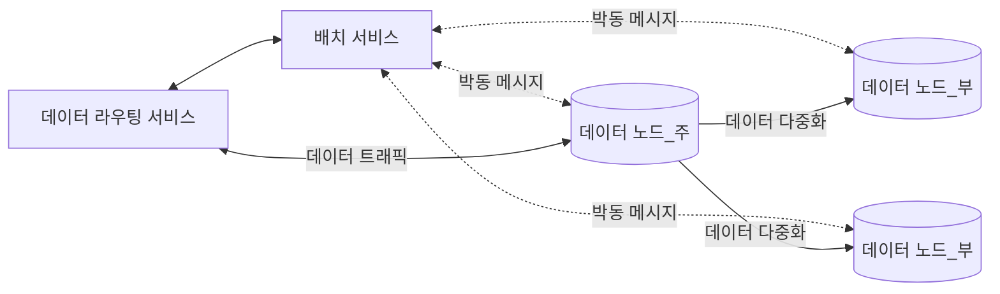
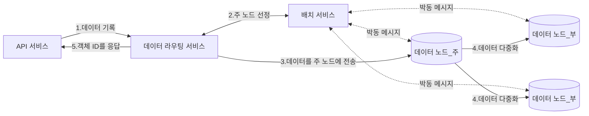

# 9장 S3와 유사한 객체 저장소
- S3는 AWS에서 제공하는 REST API 기반 인터페이스로 이용 가능한 객체 저장소다.

## 저장소 시스템 101

- 개략적으로 저장소 시스템엔 세 가지 부류가 있다.
- 블록 저장소
    - 블록 저장소는 원시 블록을 서버에 볼륨 형태로 제공하는 가장 유연하고 융통성 높은 저장소다.
    - HDD나 SSD처럼 서버에 물리적으로 연결되는 드라이브는 블록 저장소의 가장 흔한 형태다.
    - 원시 블록을 서버에 볼륨 형태로 제공하며 가장 유연한 저장소다.
    - 데이터베이스나 가상 머신 엔진 등은 원시 블록을 직접 제어하여 최대한의 성능을 끌어낸다.
- 파일 저장소
    - 파일 저장소는 블록 저장소 위에 구현되어 더 높은 추상화를 제공한다.
    - 데이터는 계층적인 디렉터리 안에 보관된다.
    - 파일 저장소를 사용하는 서버는 블록을 직접 제어/포맷하는 까다로움을 거치지 않아도 된다.
- 객체 저장소
    - 데이터 영속성과 대규모 애플리케이션을 지원하며 비용을 낮추기 위해 성능을 희생하는 특징이 있다.
    - 데이터 아카이브나 백업에 주로 쓰이며 모든 데이터를 수평적 구조의 객체로 보관한다. (계층적 디렉터리가 없음)
    - 데이터 접근은 REST API를 통한다.
    - ex) AWS S3, Azure Blob Storage

### 용어 정리

- 버킷(bucket)
    - 객체를 보관하는 논리적 컨테이너
    - 버킷 이름은 전역적으로 유일해야 한다.
    - S3에 데이터를 업로드하기 위해선 버킷부터 만들어야 한다.
- 객체(object)
    - 버킷에 저장하는 개별 데이터
    - 데이터(payload)와 메타데이터를 갖는다.
    - 메타데이터는 객체를 기술하는 이름-값 쌍이다.
- 버전(versioning)
    - 한 객체의 여러 버전을 같은 버킷 안에 둘 수 있게 하는 기능
    - 실수로 지웠거나 덮어 쓴 객체를 복구할 수 있도록 한다.
- URI(Uniform Resource Identifier)
    - 객체에 접근할 수 있도록 하는 REST API를 제공
    - 각 객체는 해당 API URI를 통해 고유하게 식별 가능하다.
- SLA(Service-Level Agreement)
    - 서비스 수준 협약은 서비스 제공자와 클라이언트 사이 맺어지는 계약이다.
    - AWS S3의 경우
        - 여러 가용 구역에 걸쳐 99.9999999%의 객체 내구성 제공
        - 한 가용 구역 전체가 소실되어도 데이터 복구 가능
        - 연간 99.9% 가용성 제공

## 1단계: 문제 이해 및 설계 범위 확정

- 기능 요구사항
  - 버킷 생성
  - 객체 업로드 및 다운로드
  - 객체 버전
  - 버킷 내 객체 목록 출력 기능
- 비기능 요구사항
  - 100PB 데이터
  - 식스 나인(six nines, 99.9999%) 수준의 데이터 내구성
  - 포 나인(99.99%) 수준의 서비스 가용성
  - 저장소 효올성: 높은 수준의 안정성과 성능은 보증하되 저장소 비용은 최대한 낮추어야 한다.
- 대략적인 규모 추정
  - 객체 저장소는 디스크 용량이나 초당 디스크 IO(IOPS)가 병목이 될 가능성이 높다.
  - 객체 크기의 분포를 잘 고려해야 한다.
    - ex) 객체 중 20%가 1MB 미만, 60%는 1~64MB, 나머지 20%는 64MB이상의 대형 객체
  - IOPS: 초당 100~150회 임의 데이터 탐색을 지원한다고 가정
  - 이러한 가정에 기반하여 시스템의 가용 객체 수를 가늠할 수 있다.

## 2단계: 개략적 설계안 제시 및 동의 구하기

### 객체 저장소의 속성

- 객체 불변성
  - 보관되는 객체들은 변경이 불가능하다.
  - 새 버전 객체로 대체될 순 있지만 값을 바꿀 순 없다.
- 키-값 저장소
  - 해당 객체의 URI를 사용하여 데이터를 가져올 수 있다.
- 저장은 1회, 읽기는 여러 번
  - 데이터 접근 패턴 측면에서 쓰기 1회, 읽기는 여러 번 발생한다.
- 소형 및 대형 객체 동시 지원
  - 다양한 크기 객체를 문제 없이 저장할 수 있다.
- 객체 저장소 설계 철학은 UNIX 파일 시스템 설계 철학과 유사하다.
  - UNIX의 경우 파일 저장 시 파일의 이름과 데이터는 같은 곳에 저장되지 않는다.
    - 파일 이름은 ‘아이노드(inode)’라는 자료구조에, 데이터는 디스크의 다른 위치에 들어간다.
    - 아이노드에는 실제 데이터가 보관되는 곳을 가리키는 포인터 목록이 저장된다.
  - 객체 저장소도 UNIX와 비슷하게 메타데이터와 객체 데이터가 별도로 저장된다.
    - 다만 메타데이터 저장소에는 포인터 대신 네트워크를 통해 객체를 식별하는 식별자(ID)가 보관된다.
  - 메타데이터와 실제 객체 데이터를 분리하면 설계가 단순해진다.
    - 객체는 불변이지만 메타데이터는 변경 가능
    - 두 컴포넌트를 독립적으로 구현 및 최적화가 가능한 것

### 개략적 설계안

- 로드밸런서: REST API에 대한 요청을 API 서버들에 분산하는 역할 담당
- API 서비스
  - 각 서비스에 대한 호출을 조율하는 역할을 담당
  - 무상태 서비스이기에 수평 확장 가능
- IAM 서비스: 인증, 권한 부여, 접근 제어 등 처리
- 데이터 저장소
  - 실제 데이터를 보관/읽어가는 장소
  - 모든 데이터 관련 연산은 객체 ID를 통한다.
- 메타데이터 저장소: 객체 메타데이터를 보관

### 객체 업로드

1. 클라이언트는 버킷 생성을 의한 PUT 요청 전송
2. API 서비스는 IAM을 호출하여 사용자가 WRITE 권한을 가지는 지 확인
3. API 서비스는 메타데이터 데이터베이스에 버킷 정보 등록을 위해 메타데이터 저장소를 호출
4. 버킷 생성 후 클라이언트는 업로드할 객체를 생성하기 위한 PUT 요청 전송
5. API 서비스는 해당 사용자의 신원과 WRITE 권한을 확인
6. API 서비스는 PUT 요청 안의 데이터를 데이터 저장소로 보낸 후 객체의 UUID를 반환한다.
7. API 서비스는 메타데이터 저장소에 새로운 항목을 등록한다.

### 객체 다운로드

- 버킷은 디렉터리 같은 계층 구조를 지원하진 않지만 버킷과 객체 이름을 연결하여 만든 폴더 구조로 논리적 계층을 만들 수 있다.
  - ex) bucket-to-share/script.txt

1. 클라이언트는 GET `/{버킷 이름}/{객체 ID}` 요청을 로드밸런서로 전송
2. API 서비스는 IAM을 통해 READ 권한이 있는지 확인
3. API 서비스는 해당 객체의 UUID를 메타데이터 저장소에서 가져온다.
4. API 서비스는 UUID로 데이터 저장소에 질의하여 객체 데이터를 가져온다.
5. API 서비스는 GET 요청의 응답으로 객체 데이터를 반환한다.

## 3단계: 상세 설계

### 데이터 저장소

- 데이터 저장소는 세 가지 주요 컴포넌트로 구성된다.
  - 데이터 라우팅 서비스, 배치 서비스, 데이터 노드

- 데이터 라우팅 서비스
  - 데이터 노드 클러스터에 접근하기 위한 REST 도는 gRPC 서비스를 제공
  - 무상태 서비스로 쉽게 규모 확장이 가능
  - 역할
    - 배치 서비스를 호출하여 데이터를 저장할 최적의 노드를 판단
    - 데이터 노드에서 데이터를 읽어 API 서비스에 반환
    - 데이터 노드에 기록
- 배치 서비스
  - 어느 데이터 노드에 데이터를 저장할지 결정한다.
  - 내부적으로 가상 클러스터 지도(virtual cluster map)를 유지
    - 클러스터의 물리적 형상 정보를 보관
    - 지도의 데이터 노드 위치 정보를 이용하여 데이터 사본이 물리적으로 다른 위치에 놓이도록 배치
  - 모든 데이터 노드와 박동 메시지를 주고받으며 상태를 모니터링
  - 배치 서비스는 중요한 서비스이므로 5~7개 노드를 갖는 배치 서비스 클러스터를 구축할 것을 권장한다.
    - 팩서스(Paxos)나 래프트(Raft) 같은 합의 프로토콜을 통해 내결함성을 보장
- 데이터 노드
  - 실제 객체 데이터가 보관되는 곳
  - 여러 노드에 데이터를 복제하는 다중화 그룹을 통해 데이터 안정성과 내구성을 보증한다.
  - 배치 서비스에 보내는 박동 메시지에는 다음 정보가 포함된다.
    - 해당 데이터 노드에 부착된 디스크 드라이브(HDD/SSD) 수
    - 각 드라이브에 저장된 데이터 양
  - 배치 서비스는 처음 보는 노드로부터 박동 메시지를 받는 경우
    - 해당 노드에 ID를 부여
    - 가상 클러스터 지도에 추가
    - 그리고 아래 정보를 반환한다.
      - 부여한 고유 식별자
      - 가상 클러스터 지도
      - 데이터 사본을 보관할 위치

### 데이터 저장흐름

1. API 서비스는 객체 데이터를 데이터 저장소로 포워딩
2. 라우팅 서비스가 객체에 UUID 할당 후 배치 서비스에 해당 객체를 보관할 데이터 노드를 질의 (주 노드를 반환)
3. 데이터 라우팅 서비스는 UUID와 함께 주 데이터 노드에 객체를 직접 전송
4. 주 데이터 노드는 데이터를 지역적으로 저장하고 다른 부 데이터 노드에 다중화
5. 객체의 UUID를 API 서비스에 반환
