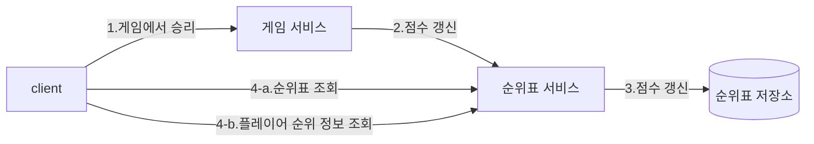

# 10장 실시간 게임 순위표
## 1단계: 문제 이해 및 설계 범위 확정

- 기능 요구사항
    - 순위표에 상위 10명 플레이어를 표시한다.
    - 특정 사용자의 순위를 표시한다.
    - 어떤 사용자보다 4순위 위와 아래 있는 사용자를 표시한다.
- 비기능 요구사항
    - 점수 업데이트는 실시간으로 순위표에 반영한다.
    - 일반적인 확장성, 가용성 및 안정성 요구사항
- 개략적 규모 추정
    - DAU 500만, MAU 2500만 명으로 가정
    - 트래픽이 24시간 동안 고르게 분포한다고 가정하면 초당 50명 사용자이지만 피크 시간대를 고려하여 5배인 초당 250명 사용자를 감당할 수 있어야 한다.
    - 점수 획득 QPS: 한 사용자가 평균 10개 게임을 플레이한다고 가정하여 250 * 10 = 2500 QPS
    - 상위 10명 순위표 가져오기 QPS: 각 사용자가 하루에 한 번 게임을 열고 순위표를 한 번 확인하다고 가정하면 약 50 QPS (처음 게임 열 때만 순위표를 표시)

## 2단계: 개략적 설계안 제시 및 동의 구하기

### API 설계

- POST `/v1/scores`
    - 순위 갱신 요청
- GET `/v1/scores`
    - 상위 10명 플레이어 조회
- GET `/v1/scores/{:userId}`

### 개략적 설계안

- 이 설계안에는 ‘게임 서비스’와 ‘순위표 서비스’가 존재한다.

1. 사용자가 게임에서 승리하면 클라이언트는 게임 서비스에 요청을 보낸다.
2. 게임 서비스는 해당 승리가 유효한지 확인하고 순위표 서비스에 점수 갱신 요청을 보낸다.
3. 순위표 서비스는 순위표 저장소에 기록된 해당 사용자 점수를 갱신한다.
4. 해당 사용자 클라이언트는 순위표 서비스에 요청하여 상위 10명 순위표와 해당 사용자 순위를 가져온다.

- 클라이언트가 순위표 서비스와 직접 통신하면 안 된다.
    - 클라이언트가 점수를 정하게 된다면 중간자 공격으로 점수를 조작할 가능성이 존재한다.
    - 점수는 서버가 정해야 한다.
- 게임 서비스와 순위표 서버 사이 메시지 큐가 필요한가?
    - 점수 데이터가 다른 곳에서 이용되거나 여러 기능을 지원해야 한다면 메시지 큐가 합리적일 수 있다.
    - 하지만 본 설계안의 요구사항은 아니기에 포함시키지 않았다.
