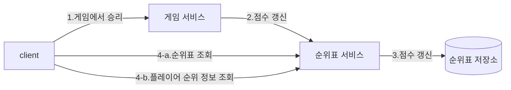

# 10장 실시간 게임 순위표
## 1단계: 문제 이해 및 설계 범위 확정

- 기능 요구사항
    - 순위표에 상위 10명 플레이어를 표시한다.
    - 특정 사용자의 순위를 표시한다.
    - 어떤 사용자보다 4순위 위와 아래 있는 사용자를 표시한다.
- 비기능 요구사항
    - 점수 업데이트는 실시간으로 순위표에 반영한다.
    - 일반적인 확장성, 가용성 및 안정성 요구사항
- 개략적 규모 추정
    - DAU 500만, MAU 2500만 명으로 가정
    - 트래픽이 24시간 동안 고르게 분포한다고 가정하면 초당 50명 사용자이지만 피크 시간대를 고려하여 5배인 초당 250명 사용자를 감당할 수 있어야 한다.
    - 점수 획득 QPS: 한 사용자가 평균 10개 게임을 플레이한다고 가정하여 250 * 10 = 2500 QPS
    - 상위 10명 순위표 가져오기 QPS: 각 사용자가 하루에 한 번 게임을 열고 순위표를 한 번 확인하다고 가정하면 약 50 QPS (처음 게임 열 때만 순위표를 표시)

## 2단계: 개략적 설계안 제시 및 동의 구하기

### API 설계

- POST `/v1/scores`
    - 순위 갱신 요청
- GET `/v1/scores`
    - 상위 10명 플레이어 조회
- GET `/v1/scores/{:userId}`

### 개략적 설계안

- 이 설계안에는 ‘게임 서비스’와 ‘순위표 서비스’가 존재한다.

1. 사용자가 게임에서 승리하면 클라이언트는 게임 서비스에 요청을 보낸다.
2. 게임 서비스는 해당 승리가 유효한지 확인하고 순위표 서비스에 점수 갱신 요청을 보낸다.
3. 순위표 서비스는 순위표 저장소에 기록된 해당 사용자 점수를 갱신한다.
4. 해당 사용자 클라이언트는 순위표 서비스에 요청하여 상위 10명 순위표와 해당 사용자 순위를 가져온다.

- 클라이언트가 순위표 서비스와 직접 통신하면 안 된다.
    - 클라이언트가 점수를 정하게 된다면 중간자 공격으로 점수를 조작할 가능성이 존재한다.
    - 점수는 서버가 정해야 한다.
- 게임 서비스와 순위표 서버 사이 메시지 큐가 필요한가?
    - 점수 데이터가 다른 곳에서 이용되거나 여러 기능을 지원해야 한다면 메시지 큐가 합리적일 수 있다.
    - 하지만 본 설계안의 요구사항은 아니기에 포함시키지 않았다.

### 데이터 모델

- 저장소는 세 가지 유형 중 하나를 선택할 수 있다.
  - 관계형, NoSQL, 레디스
- 관계형 데이터베이스
  - 규모 확장성이 그다지 중요하지 않다면 사용할 수 있다.
  - `user_id`, `score` 컬럼을 가지는 테이블을 점수 내림차순으로 정렬하면 된다.
  - 하지만 SQL DB는 지속적으로 변화하는 대량의 정보를 신속하게 처리하지 못하기에 대규모/실시간성 애플리케이션에선 적합하지 않다.
- 레디스
  - 레디스의 sorted set 자료형을 사용하면 순위표 시스템을 효과적으로 설계할 수 있다.
  - sorted set은 내부적으로 해시 테이블과 스킵 리스트라는 두 자료 구조를 사용한다.
    - 해시 테이블은 특정 사용자의 점수를 저장하기 위해 사용된다. (key-value 기반 `O(1)` 복잡도로 빠른 조회가 가능)
    - 스킵 리스트는 정렬된 순서를 유지하면서 특정 점수를 딴 사용자 목록을 저장하기 위해 쓰이는데 삽입/삭제/수정 연산을 평균 `O(log(n))` 복잡도로 수행한다.
  - 순위표 구현에 사용할 레디스 연산
    - `ZADD`: 새로운 사용자를 집합에 삽입, `O(log(n))`
    - `ZINCRBY`: 사용자 점수를 지정된 값만큼 증가시킨다, `O(log(n))`
    - `ZRANGE`/`ZREVRANGE`: 점수에 따라 정렬된 사용자 중 특정 범위를 조회한다, `O(log(n) + m)`: n은 정렬 집합 크기, m은 조회 항목 수
    - `ZRANK`/`ZREVRANK`: 오름차순/내림차순으로 특정 사용자의 위치를 조회 `O(log(n))`
  - 정렬 집합을 사용한 구현 동작 원리
    - 사용자가 점수 획득 시 → `ZINCRBY <키> <증분> <사용자>`
    - 사용자가 순위표 상위 10명을 조회하는 경우 → `ZREVRANGE leaderboard_feb_2021 0 9 WITHSCORES` (상위 10명을 점수와 함께 조회)
    - 사용자가 자기 순위 조회하는 경우 → `ZREVRANK leaderboard_feb_2021 'mary1934'`
    - 특정 사용자 순위 기준 일정 범위 사용자를 질의하는 경우 → `ZREVRANGE leaderboard_feb_2021 357 365` (361위 사용자의 전/후 4명 조회)
- 저장소 요구사항
  - 최소한 사용자의 ID와 점수를 저장해야 함
  - 최악의 경우 월간 활성 사용자 2500만 명 모두 월 순위표에 올라가는 경우 약 650MB 저장 공간이 레디스 캐시에 필요하고 이는 최신 레디스 서버 한 대로 충분하다.
    - ID가 24자 문자열(char)에(24바이트) 점수 2바이트 정수라고 한다면 26 * 2500 = 약 650MB
  - 개략적 추정치인 2500/초 QPS 또한 단일 레디스 서버로 충분하다.
  - 한 가지 걱정은 영속성으로 레디스 장애 시 휘발될 수 있다는 것인데 이 또한 읽기 사본과 fail over가 가능하다.
