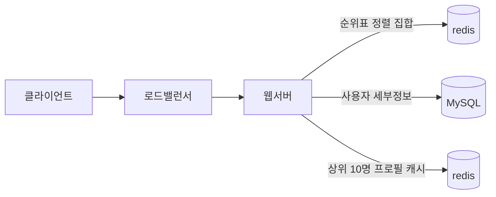
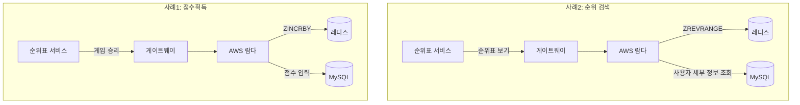
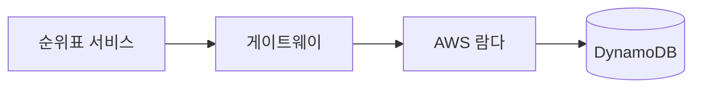

# 10장 실시간 게임 순위표
## 1단계: 문제 이해 및 설계 범위 확정

- 기능 요구사항
    - 순위표에 상위 10명 플레이어를 표시한다.
    - 특정 사용자의 순위를 표시한다.
    - 어떤 사용자보다 4순위 위와 아래 있는 사용자를 표시한다.
- 비기능 요구사항
    - 점수 업데이트는 실시간으로 순위표에 반영한다.
    - 일반적인 확장성, 가용성 및 안정성 요구사항
- 개략적 규모 추정
    - DAU 500만, MAU 2500만 명으로 가정
    - 트래픽이 24시간 동안 고르게 분포한다고 가정하면 초당 50명 사용자이지만 피크 시간대를 고려하여 5배인 초당 250명 사용자를 감당할 수 있어야 한다.
    - 점수 획득 QPS: 한 사용자가 평균 10개 게임을 플레이한다고 가정하여 250 * 10 = 2500 QPS
    - 상위 10명 순위표 가져오기 QPS: 각 사용자가 하루에 한 번 게임을 열고 순위표를 한 번 확인하다고 가정하면 약 50 QPS (처음 게임 열 때만 순위표를 표시)

## 2단계: 개략적 설계안 제시 및 동의 구하기

### API 설계

- POST `/v1/scores`
    - 순위 갱신 요청
- GET `/v1/scores`
    - 상위 10명 플레이어 조회
- GET `/v1/scores/{:userId}`

### 개략적 설계안

- 이 설계안에는 ‘게임 서비스’와 ‘순위표 서비스’가 존재한다.

1. 사용자가 게임에서 승리하면 클라이언트는 게임 서비스에 요청을 보낸다.
2. 게임 서비스는 해당 승리가 유효한지 확인하고 순위표 서비스에 점수 갱신 요청을 보낸다.
3. 순위표 서비스는 순위표 저장소에 기록된 해당 사용자 점수를 갱신한다.
4. 해당 사용자 클라이언트는 순위표 서비스에 요청하여 상위 10명 순위표와 해당 사용자 순위를 가져온다.

- 클라이언트가 순위표 서비스와 직접 통신하면 안 된다.
    - 클라이언트가 점수를 정하게 된다면 중간자 공격으로 점수를 조작할 가능성이 존재한다.
    - 점수는 서버가 정해야 한다.
- 게임 서비스와 순위표 서버 사이 메시지 큐가 필요한가?
    - 점수 데이터가 다른 곳에서 이용되거나 여러 기능을 지원해야 한다면 메시지 큐가 합리적일 수 있다.
    - 하지만 본 설계안의 요구사항은 아니기에 포함시키지 않았다.

### 데이터 모델

- 저장소는 세 가지 유형 중 하나를 선택할 수 있다.
  - 관계형, NoSQL, 레디스
- 관계형 데이터베이스
  - 규모 확장성이 그다지 중요하지 않다면 사용할 수 있다.
  - `user_id`, `score` 컬럼을 가지는 테이블을 점수 내림차순으로 정렬하면 된다.
  - 하지만 SQL DB는 지속적으로 변화하는 대량의 정보를 신속하게 처리하지 못하기에 대규모/실시간성 애플리케이션에선 적합하지 않다.
- 레디스
  - 레디스의 sorted set 자료형을 사용하면 순위표 시스템을 효과적으로 설계할 수 있다.
  - sorted set은 내부적으로 해시 테이블과 스킵 리스트라는 두 자료 구조를 사용한다.
    - 해시 테이블은 특정 사용자의 점수를 저장하기 위해 사용된다. (key-value 기반 `O(1)` 복잡도로 빠른 조회가 가능)
    - 스킵 리스트는 정렬된 순서를 유지하면서 특정 점수를 딴 사용자 목록을 저장하기 위해 쓰이는데 삽입/삭제/수정 연산을 평균 `O(log(n))` 복잡도로 수행한다.
  - 순위표 구현에 사용할 레디스 연산
    - `ZADD`: 새로운 사용자를 집합에 삽입, `O(log(n))`
    - `ZINCRBY`: 사용자 점수를 지정된 값만큼 증가시킨다, `O(log(n))`
    - `ZRANGE`/`ZREVRANGE`: 점수에 따라 정렬된 사용자 중 특정 범위를 조회한다, `O(log(n) + m)`: n은 정렬 집합 크기, m은 조회 항목 수
    - `ZRANK`/`ZREVRANK`: 오름차순/내림차순으로 특정 사용자의 위치를 조회 `O(log(n))`
  - 정렬 집합을 사용한 구현 동작 원리
    - 사용자가 점수 획득 시 → `ZINCRBY <키> <증분> <사용자>`
    - 사용자가 순위표 상위 10명을 조회하는 경우 → `ZREVRANGE leaderboard_feb_2021 0 9 WITHSCORES` (상위 10명을 점수와 함께 조회)
    - 사용자가 자기 순위 조회하는 경우 → `ZREVRANK leaderboard_feb_2021 'mary1934'`
    - 특정 사용자 순위 기준 일정 범위 사용자를 질의하는 경우 → `ZREVRANGE leaderboard_feb_2021 357 365` (361위 사용자의 전/후 4명 조회)
- 저장소 요구사항
  - 최소한 사용자의 ID와 점수를 저장해야 함
  - 최악의 경우 월간 활성 사용자 2500만 명 모두 월 순위표에 올라가는 경우 약 650MB 저장 공간이 레디스 캐시에 필요하고 이는 최신 레디스 서버 한 대로 충분하다.
    - ID가 24자 문자열(char)에(24바이트) 점수 2바이트 정수라고 한다면 26 * 2500 = 약 650MB
  - 개략적 추정치인 2500/초 QPS 또한 단일 레디스 서버로 충분하다.
  - 한 가지 걱정은 영속성으로 레디스 장애 시 휘발될 수 있다는 것인데 이 또한 읽기 사본과 fail over가 가능하다.

## 3단계: 상세 설계

### 클라우드 서비스 사용 여부

- 자체 서비스를 이용하는 방안
  - 매월 정렬 집합을 생성하여 해당 기간 순위표를 저장할 수 있다.
  - 이름 및 프로필 같은 사용자 세부 정보는 MySQL에 저장한다.
  - 순위표를 가져올 때 순위 데이터와 더불어 MySQL의 세부 정보도 조회한다.
  - 순위표 조회 로직이 너무 비효율적이면 상위 순위 10명을 캐시에 저장하여 해결할 수 있다.

- 클라우드 서비스를 이용하는 방안
  - 아마준 API 게이트웨이와 AWS 람다(Lambda) 두 기술을 사용할 것이다.
  - 게임이 API 게이트웨이를 호출하고 게이트웨이가 적절한 람다 함수를 호출한다.
  - AWS에선 람다에서 레디스를 호출할 수 있도록 클라이언트를 제공한다.
  - 또한 람다는 DAU 성장세에 맞춰 자동으로 규모를 확장할 수 있다.
  - 람다는 서버리스이기에 규모 확장, 환결 설정, 유지 보수 등의 문제를 직접 관리할 필요가 없다.

### 레디스 규모 확장

- 5백만 DAU면 모를까 원래 규모의 100배인 5억 DAU를 처리하려면 레디스 캐시 서버 하나로 충분하지 않다.
  - 이 정도 규모를 감당하려면 샤딩이 필요하다.
- 고정 파티션
  - 순위표의 점수 범위에 다라 파티션을 나누는 방안 (ex. 1~100, 101~200, … , 901~1000)
  - 순위표 전반에 점수가 고르게 분포되어야 제대로 작동한다.
  - 고르게 분포되지 않는다면 점수 범위를 조정하여 비교적 고른 분포가 되게 해야 한다.
  - 애플리케이션에서 샤딩을 제어한다면 사용자가 있는 샤드 위치 파악 및 점수 변화에 따른 샤드 옮기기를 신경써야 한다.
  - 순위표에서 상위 10명 플레이어를 가져오려면 가장 높은 점수가 저장된 샤드에서 상위 10명을 가져오면 된다.
  - 특정 사용자의 순위를 알려면 해당 사용자가 있는 샤드 내 순위와 해당 샤드보다 높은 점수의 모든 샤드의 사용자 수를 알아야 한다. (`info keyspace` 명령으로 O(1) 시간에 특정 샤드 사용자 수를 파악 가능)
- 해시 파티션
  - 레디스 클러스터를 사용하는 방법으로 점수가 특정 대역에 과도하게 모여 있는 경우 효과적이다.
  - 각각의 키가 특정 해시 슬롯에 속하도록 하는 샤딩 기법을 사용한다.
  - 총 16384개 해시 슬롯이 있으며 `CRC16(key) % 16384` 연산으로 슬롯을 계산한다.
    - 모든 키를 재분배하지 않아도 클러스터에 쉽게 노드를 추가/제거 가능
  - 특정 사용자의 점수를 갱신하는 것은 연산으로 슬롯을 찾으면 되니 간단하다.
  - 상위 10명을 검색하는 작업은 까다로운데 분산-수집 접근법을 통해 모든 샤드에서 검색한 후 애플리케이션에서 다시 정렬해야 한다.
    - 상위 k개 결과를 반환해야 한다면 각 샤드에서 데이터를 읽고 또 정렬해야 하기에 지연이 늘어난다.
    - 가장 느린 파티션에서 데이터를 다 읽고 나서야 결과를 도출할 수 있다.]
    - 특정 사용자의 순위를 결정하기도 매우 까다롭다.
  - 즉 본 설계안에선 고정 파티션이 더 적절하다.
- 레디스 노드 크기 조정
  - 쓰기 연산이 많다면 메모리를 두 배 더 할당하는 것이 안전하다.
    - 장애에 대비해 스냅숏을 생성할 때 필요한 모든 쓰기 연산을 감당할 수 있어야 하기 때문
  - redis-benchmark 도구를 통해 레디스 성능 벤치마킹을 할 수 있다.
    - 여러 클라이언트가 동시에 여러 질의를 하는 시뮬레이션 가능
    - 초당 얼마나 많은 요청을 처리하는지 측정 가능

### 대안: NoSQL

- 다음과 같은 데이터베이스가 이상적이다.
  - 쓰기에 최적화
  - 같은 파티션 내 항목을 점수에 따라 효율적으로 정렬 가능
  - 좋은 후보로는 아마존의 DynamoDB, 카산드라, 혹은 MongoDB 등이 있다.
- 본 설계안에선 DynamoDB를 고려해 본다.
  - 안정적인 성능과 뛰어난 확장성을 제공하는 완전 관리형 NoSQL 데이터베이스
  - 기본키 이외에 전역 보조 색인을 제공하여 효과적인 질의를 제공한다.
- 전역 보조 색인
  - 기본 테이블과 다른 파티션 키와 정렬 키를 사용할 수 있는 인덱스
  - 파티션 키와 정렬 키가 기본 테이블과 완전히 다를 수 있다.
  - 단순 기본 키 또는 복합 기본 키(파티션 키와 정렬 키) 모두 사용 가능
  - 모든 파티션에서 인덱스의 쿼리가 기본 테이블의 모든 데이터에 적용되므로 ‘전역’이라 불린다.

- DynamoDB는 안정 해시를 사용하여 여러 노드에 데이터를 분산한다.
  - 데이터를 여러 파티션에 고르게 분산시키기 위해 쓰기 샤딩 패턴을 도입할 수 있다.
    - 데이터를 n개 파티션으로 분할하고 파티션 번호(user_id % number_of_partitions)를 파티션 키에 추가하는 것
    - 다만 읽기 쓰기 모두 복잡해지기에 장단점을 잘 따져봐야 한다.
- 얼마나 많은 파티션을 두어야 할까?
  - 쓰기 볼륨 또는 DAU를 기준으로 결정할 수 있겠지만 부하와 읽기 복잡도 사이엔 트레이드 오프가 존재한다.
  - 같은 달 데이터를 여러 파티션에 분산시키면 부하는 낮아지지만 특정 달의 데이터를 읽으려면 모든 파티션에 질의해야 한다.
- 아래는 파티션 키를 `game_name#{year-month}#p{partition_number}`로 설정한 예다.
  - 같은 파티션 내 데이터는 전부 점수로 정렬된 n개 파티션이 만들어진다.
  - 상위 10명 사용자를 가져오려면 ‘분산-수집’을 통해 각 파티션의 상위 10개를 취합해 다시 정렬하면 된다.
  - 이 또한 파티션이 많으면 부하는 줄지만 복잡성은 증가하기에 벤치마킹을 통해 신중히 결정해야 한다.

| 전역 보조 색인 | 전역 보조 색인 | 속성 | 속성 | 속성 |
| --- | --- | --- | --- | --- |
| 파티션 키 (PK) | 정렬 키(score | user_id | email | profile_pic |
