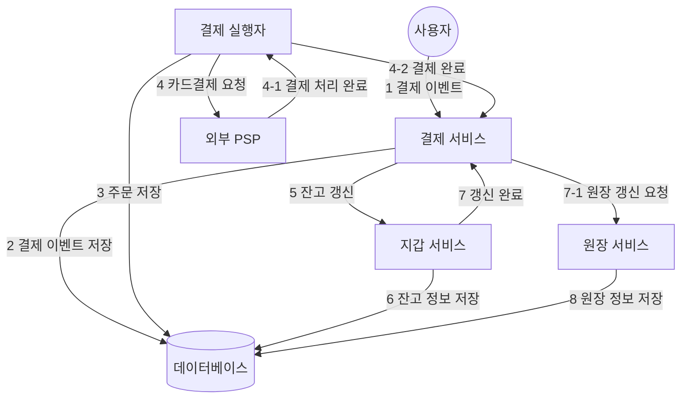
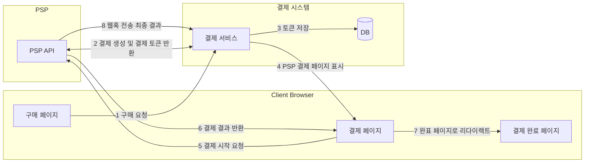

# 11장 결제 시스템

## 1단계: 문제 이해 및 설계 범위 확정

- 기능 요구사항
    - 대금 수신(pay-in) 흐름: 결제 시스템이 판매자를 대신하여 고객으로부터 대금을 수령
    - 대금 정산(pay-out) 흐름: 결제 시스템이 전 세계의 판매자에게 제품 판매 대금을 송금
- 비기능 요구사항
    - 신뢰성 및 내결함성: 결제 실패는 신중히 처리해야 한다.
    - 내부 서비스(결제 시스템, 회계 시스템)와 외부 서비스(결제 서비스 제공업체) 간 조정 프로세스
        - 시스템 간 결제 정보가 일치하는지 비동기적으로 확인
- 계략적인 규모 측정
    - 하루 100만 건 트랜잭션을 처리 (10 TPS)
    - 일반적인 데이터베이스로 별 문제 없이 처리 가능하므로 대역폭 대신 결제 트랜잭션의 정확한 처리에 초점을 맞추자

## 2단계: 계략적 설계안 제시 및 동의 구하기

- 결제 흐름은 크게 두 단계로 세분화된다.
    - 대금 수신 흐름
    - 대금 정산 흐름

### 대금 수신 흐름

- 결제 서비스(payment service)
    - 사용자로부터 결제 이벤트를 수락하고 결제 프로세스를 조율한다.
    - 일반적으로 제3자 제공업체(결제 서비스 공급자, PSP)를 이용해 결제를 처리한다.
        - ex) PayPal, stripe 등
- 결제 실행자 (payment executor)
    - 결제 서비스 공급자, 즉 PSP를 통해 결제 주문 하나를 실행
    - 하나의 결제에는 여러 결제 주문이 포함될 수 있다.
- 결제 서비스 공급자 (Payment Service Provider)
    - A 계정에서 B 계정으로 돈을 옮기는 역할을 담당
- 카드 유형
    - 카드사는 신용 카드 업무를 처리하는 조직이다.
    - 비자, 마스터카드, 디스커버리 등
- 원장 (ledger)
    - 결제 트랜잭션에 대한 금용 기록
    - 원장 시스템은 웹사이트의 총 수익을 계산하거나 향후 수익을 예측하는 등 분석에서 중요한 역할을 한다.
- 지갑 (wallet)
    - 판매자의 계정 잔액을 기록
    - 특정 사용자의 결제 총 금액을 기록할 수도 있다.

1. 사용자가 주문 버튼을 클릭해 결제 이벤트가 결제 서비스로 전송
2. 결제 서비스는 결제 이벤트를 데이터베이스에 저장
3. 결제 실행자는 결제 주문을 데이터베이스에 저장
4. 결제 실행자가 외부 PSP를 호출하여 신용 카드 결제를 처리
5. 결제 실행자가 결제를 성공적으로 처리하고 나면 결제 서비스는 지갑을 갱신하여 특정 판매자의 잔고를 기록
6. 지갑 서버는 갱신된 잔고 정보를 데이터베이스에 저장
7. 지갑 서비스가 판매자 잔고를 성공적으로 갱신하면 결제 서비스는 원장을 호출
8. 원장 서비스는 새 원장 정보를 데이터베이스에 추가

### 결제 서비스 API

- POST `/v1/payment`
    - 결제 이벤트를 실행하며 여러 결제 주문이 포함될 수 있다.
    - 요청 매개변수
        - 구매자 정보
        - 결제 이벤트 ID
        - 암호화된 카드 정보 또는 결제 토큰 (PSP마다 다른 값)
        - 결제 주문 목록 [(판매자 정보, 대금, 통화 단위, 주문 ID)]
    - 결제 실행자가 PSP에 결제 요청을 전송할 때 주문 ID는 멱등 키로 사용한다.
- GET `/v1/payments/{:id}`
    - 주문 ID가 가리키는 단일 결제 주문 실행 상태를 반환

### 결제 서비스 데이터 모델

- 결제 서비스에는 결제 이벤트(payment event)와 결제 주문(payment order)의 두 테이블이 필요하다.
- 결제 시스템용 저장소는 일반적으로 ACID를 지원하는 전통적인 관계형 DB를 사용한다.
    - 성능 보다 안정성 중시
- 결제 이벤트 테이블 스키마
    - `checkout_id`, `buyer_info`, `seller_info`, `credit_card_info`, `is_payment_done`
    - `checkout_id`는 외래 키로 한 번의 결제 행위는 하나의 결제 이벤트를 만든다.
    - 하나의 결제 이벤트에는 여러 결제 주문이 포함될 수 있다.
- 결제 주문 테이블 스키마
    - `payment_order_id`, `buyer_account`, `amount`, `currency`, `checkout_id`, `payment_order_status`, `ledger_updated`, `wallet_updated`
    - 결제 주문 로직이 실행되며 `payment_order_status`를 최종적으로 `SUCCESS` 처리
    - 결제 성공 후 결제 서비스는 지갑 서비스를 호출해 판매자 잔액을 업데이트하고 `wallet_updated`를 `TRUE`로 변경
    - 그리고 결제 서비스는 원장 서비스를 호출하여 `ledger_updated` 필드를 `TRUE`로 갱신
- 동일한 `checkout_id` 아래 모든 결제 주문이 성공적으로 처리되면 결제 서비스는 `is_payment_done`을 `TRUE`로 업데이트한다.
- 아직 종결되지 않는 결제 주문을 모니터링 하기 위해 주기적으로 scheduled job을 통해 엔지니어에게 경고를 보내야 한다.

### 복식부기 원장 시스템

- 원장 시스템에는 복식부기(double-entry)라는 중요한 설계 원칙이 있다.
    - 모든 결제 거래를 두 개의 별도 원장 계좌에 같은 금액으로 기록
    - 한 계좌에선 차감이 이루어지고 다른 계좌에는 입금이 이루어진다.
    - 복식부기 시스템에서 모든 거래 항목의 합계는 0이어야 한다.
- 복식부기 시스템을 통해 자금의 흐름을 시작부터 끝까지 추적할 수 있으며 결제 주기 전반에 걸쳐 일관성을 보장할 수 있다.

### 외부 결제 페이지

- 대부분 기업은 신용 카드 정보를 내부에 저장하지 않는다.
    - 미국의 PCI DSS(Payment Card Industry Data Security Standard) 같은 복잡한 규정을 준수해야 하기 때문
- 신용 카드 정보를 취급하지 않기 위해 PSP에서 제공하는 외부 페이지를 사용한다.
    - 우리 결제 서비스가 아닌 PSP가 제공하는 외부 결제 페이지가 직접 고객 카드 정보를 수집

### 대금 정산 흐름

- 대금 수신에선 PSP를 사용하여 구매자의 신용 카드에서 전자상거래 웹사이트 은행 계좌로 돈을 이체
- 대금 정산에선 타사 정산 서비스를 이용해 전자상거래 웹사이트 은행 계쫘에서 판매자 은행 계좌로 돈을 이체
- 일반적으로 정산 또한 외상 매입금 지급 서비스 제공업체를 이용한다.

## 3단계: 상세 설계

- 분산 시스템에서 오류와 장애는 피할 수 없다.
  - 중복 결제? 네트워크 오류로 인한 결제 실패?

### PSP 연동

- 대부분의 회사는 카드 시스템에 직접 연결하는 번거로움을 쏟지 않고 다음 두 방법 중 하나로 결제를 PSP와 연동한다.
  - 민감한 결제 정보를 저장할 수 있다면 API를 통해 PSP와 연동
    - 회사는 결제 웹페이지를 개발하고 카드를 수집
    - PSP는 은행 연결, 다양한 카드를 지원하는 역할
  - 민감한 결제 정보를 저장하지 않기로 결정한 경우
    - PSP는 카드 결제 정보를 수집하고 외부 결제 페이지를 제공

- 사용자가 클라이언트 브라우저에서 ‘결제’ 버튼 클릭하면 클라이언트는 결제 서비스를 호출
- 결제 주문 정보를 수신한 결제 서비스는 결제 등록 요청을 PSP로 전송하고 결제 토큰을 반환 받는다.
  - 결제 금액, 통화, 결제 요청 만료일 등을 포함하여 PSP에 요청
  - 결제 주문이 정확히 한 번만 등록되도록 UUID 필드를 둔다. (주문 번호)
  - 결제 토큰은 PSP의 UUID이다.
- 결제 서비스는 결제 토큰을 DB에 저장
- 클라이언트는 PSP가 제공하는 외부 결제 페이지를 표시한다.
  - 외부 결제 페이지는 민감한 결제 정보를 수집하는데 우리 시스템에는 해당 데이터가 절대 넘어오지 않는다.
- 결제를 시작하면 PSP가 결제 처리를 시작한다.
- PSP가 결제 상태를 반환한다.
- 결제를 하는 사용자는 리다이렉션 되어 완료 페이지로 보내진다.
- PSP의 웹훅을 통해 결제 서비스는 결제 이벤트를 수신한다.
