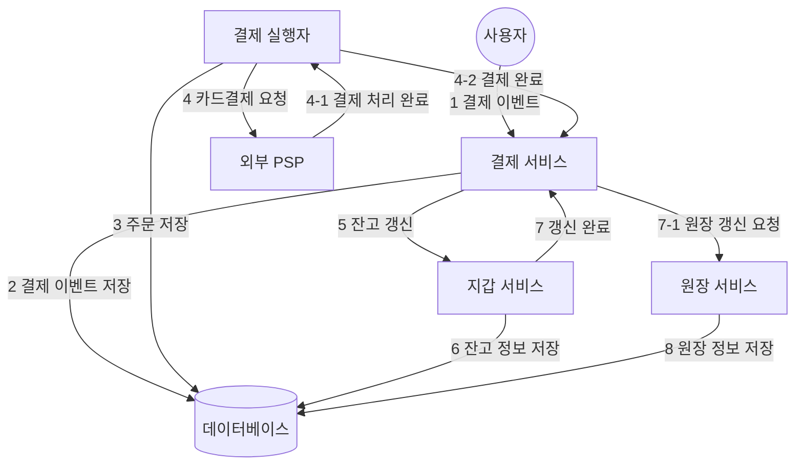

# 11장 결제 시스템

## 1단계: 문제 이해 및 설계 범위 확정

- 기능 요구사항
    - 대금 수신(pay-in) 흐름: 결제 시스템이 판매자를 대신하여 고객으로부터 대금을 수령
    - 대금 정산(pay-out) 흐름: 결제 시스템이 전 세계의 판매자에게 제품 판매 대금을 송금
- 비기능 요구사항
    - 신뢰성 및 내결함성: 결제 실패는 신중히 처리해야 한다.
    - 내부 서비스(결제 시스템, 회계 시스템)와 외부 서비스(결제 서비스 제공업체) 간 조정 프로세스
        - 시스템 간 결제 정보가 일치하는지 비동기적으로 확인
- 계략적인 규모 측정
    - 하루 100만 건 트랜잭션을 처리 (10 TPS)
    - 일반적인 데이터베이스로 별 문제 없이 처리 가능하므로 대역폭 대신 결제 트랜잭션의 정확한 처리에 초점을 맞추자

## 2단계: 계략적 설계안 제시 및 동의 구하기

- 결제 흐름은 크게 두 단계로 세분화된다.
    - 대금 수신 흐름
    - 대금 정산 흐름

### 대금 수신 흐름

- 결제 서비스(payment service)
    - 사용자로부터 결제 이벤트를 수락하고 결제 프로세스를 조율한다.
    - 일반적으로 제3자 제공업체(결제 서비스 공급자, PSP)를 이용해 결제를 처리한다.
        - ex) PayPal, stripe 등
- 결제 실행자 (payment executor)
    - 결제 서비스 공급자, 즉 PSP를 통해 결제 주문 하나를 실행
    - 하나의 결제에는 여러 결제 주문이 포함될 수 있다.
- 결제 서비스 공급자 (Payment Service Provider)
    - A 계정에서 B 계정으로 돈을 옮기는 역할을 담당
- 카드 유형
    - 카드사는 신용 카드 업무를 처리하는 조직이다.
    - 비자, 마스터카드, 디스커버리 등
- 원장 (ledger)
    - 결제 트랜잭션에 대한 금용 기록
    - 원장 시스템은 웹사이트의 총 수익을 계산하거나 향후 수익을 예측하는 등 분석에서 중요한 역할을 한다.
- 지갑 (wallet)
    - 판매자의 계정 잔액을 기록
    - 특정 사용자의 결제 총 금액을 기록할 수도 있다.

1. 사용자가 주문 버튼을 클릭해 결제 이벤트가 결제 서비스로 전송
2. 결제 서비스는 결제 이벤트를 데이터베이스에 저장
3. 결제 실행자는 결제 주문을 데이터베이스에 저장
4. 결제 실행자가 외부 PSP를 호출하여 신용 카드 결제를 처리
5. 결제 실행자가 결제를 성공적으로 처리하고 나면 결제 서비스는 지갑을 갱신하여 특정 판매자의 잔고를 기록
6. 지갑 서버는 갱신된 잔고 정보를 데이터베이스에 저장
7. 지갑 서비스가 판매자 잔고를 성공적으로 갱신하면 결제 서비스는 원장을 호출
8. 원장 서비스는 새 원장 정보를 데이터베이스에 추가

### 결제 서비스 API

- POST `/v1/payment`
    - 결제 이벤트를 실행하며 여러 결제 주문이 포함될 수 있다.
    - 요청 매개변수
        - 구매자 정보
        - 결제 이벤트 ID
        - 암호화된 카드 정보 또는 결제 토큰 (PSP마다 다른 값)
        - 결제 주문 목록 [(판매자 정보, 대금, 통화 단위, 주문 ID)]
    - 결제 실행자가 PSP에 결제 요청을 전송할 때 주문 ID는 멱등 키로 사용한다.
- GET `/v1/payments/{:id}`
    - 주문 ID가 가리키는 단일 결제 주문 실행 상태를 반환
