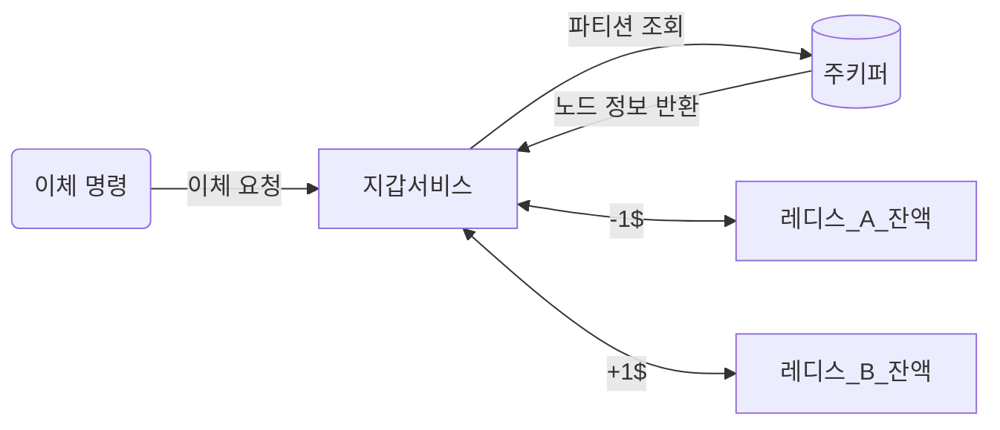
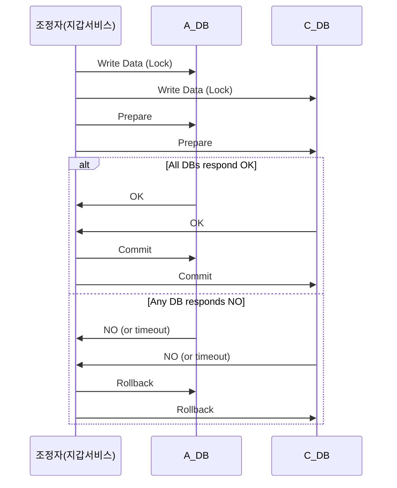

# 12장 전자 지갑
- 결제 플랫폼은 보통 고객에게 전자 지갑 서비스를 제공하여 돈을 필요할 때 사용할 수 있도록 한다.
    - 결제 기능 뿐 아니라 다른 사용자에게로의 송금도 지원한다. (ex. 페이팔)
    - 이러한 이체는 은행보다 빠르며 추가 수수료를 부과하지 않는게 보통이다.

## 1단계: 문제 이해 및 설계 범위 확정

- 기능 요구사항
    - 전자 지갑 간 이체
- 비기능 요구사항
    - 1,000,000TPS
    - 99.99% 안정성
    - 정확성에 대한 요건은 데이터베이스의 트랜잭션 보증으로 충분하다고 간주
    - 재현성을 갖춘 시스템
        - 데이터 일관성이 깨졌을 경우 그 차이가 왜 발생했는지 추적하기 위해 처음부터 데이터를 재생하여 언제든지 과거 잔액을 재구성할 수 있어야 한다.
- 개략적 추정
    - 오늘날 사용되는 관계형 DB는 초당 수천 건 트랜잭션을 지원할 수 있다.
    - 한 노드가 1,000TPS를 지원할 수 있다고 가정하고 1번의 이체에서 두 번의 연산(인출, 입금)이 필요하기에 1백만 건 TPS 처리를 위해선 2백만 TPS를 지원하는 2000개 노드가 필요하다.
    - 이번 설계 목표 중 하나는 단일 노드가 처리할 수 있는 트랜잭션 수를 늘리는 것이다.

## 2단계: 개략적 설계안 제시 및 동의 구하기

### API 설계

- POST `/v1/wallet/balance_transper`

```json
// request
{
	"from_account": "...", // 인출할 계좌
	"to_account": "...", // 이체할 계좌
	"amount": "...", // 이체 금액
	"currency": "...", // 통화 단위
	"transaction_id": "..." // 중복 제거에 사용할 ID
}
```

### 인메모리 샤딩

- <사용자, 잔액> 관계를 나타내기에 좋은 자료 구조는 키-값 저장소이기에 레디스는 좋은 선택이다.
- 다만 레디스 한 대로 100만 TPS는 벅차기에 클러스터를 구성하고 사용자 계정을 모든 노드에 균등히 분배해야 한다. (샤딩)
    - 키의 해시 값을 계산해 파티션 수 n으로 나눠 파티션 번호를 도출
    - 모든 레디스 노드의 파티션 수와 주소는 주키퍼를 사용하여 관리
- 지갑 서비스는 이체 명령 처리를 담당하는 서비스로 다음 플로우를 가진다.
    - 이체 명령 수신
    - 이체 명령 유효성 검증
    - 두 계정의 잔액 갱신



- 위 설계에선 아직 정확성 요구사항을 충족하지 못한다.
    - 각 레디스 노드에 보내는 요청이 모두 원자적으로 성공하리라는 보장이 없다.

### 분산 트랜잭션: 2단계 커밋

- 서로 다른 두 노드를 원자적으로 수행하려면 일단 각 레디스 노드를 관계형 데잍터베이스로 교체하는 방법이 있다.
- 그럼에도 샤딩된 두 DB 노드를 원자적으로 변경하는 것은 간단하지 않은데 이를 해결하기 위해 2단계 커밋(2PC)을 사용할 수 있다.
  1. 조정자(지갑 서비스)는 A 데이터베이스와 C 데이터베이스에 정상적으로 쓰기 작업을 수행하는데 그 결과로 각 데이터에는 락이 걸린다.
  2. 애플리케이션이 트랜잭션을 커밋하려할 때 조정자는 모든 데이터베이스에 트랜잭션 준비 요청을 한다.
  3. 두 번째 단계에서 조정자는 모든 데이터베이스의 응답을 받아 다음 절차를 수행한다. 
     4. 모든 DB가 ok 응답을 하면 조정자는 모든 데이터베이스에 커밋을 요청 
     5. 어느 한 DB라도 no를 응답하면 모든 DB에 트랜잭션 중단을 요청



- 2PC는 저수준 방안으로 데이터베이스 자체에 의존한다.
  - 준비 단계를 실행하려면 데이터베이스 트랜잭션 실행 방식을 변경해야 한다.
  - 모든 DB가X/Open XA 표준을 만족하는 데이터베이스여야 함
- 2PC의 문제점
  - 오래 동안 락을 잡기에 성능이 좋지 않다.
  - 조정자가 SPOF가 된다.

### 분산 트랜잭션: TC/C

- TC/C (Try-Confirm/Cancel)는 두 단계로 구성된 보상 트랜잭션이다.
  - 1) 조정자는 모든 DB에 트랜잭션에 필요한 자원 예약 요청
  - 2) 조정자는 모든 DB로부터 회신을 받는다.
    - 모두 yes 응답이면 조정자는 모든 DB에 ‘시도-확정(Try-Confirm) 절차를 시도한다.
    - 어느 하나라도 no를 응답하면 모든 DB에 ‘시도-취소(Try-Cancel)’ 절차를 시도한다.
- ex) 계좌 A에서 계좌 C로 1달러를 이체하는 예제

| 단계 | A | C |
| --- | --- | --- |
| 1(시도) | - 1$ | 아무것도 하지 않음 |
| 2(확정 절차) | 아무것도 하지 않음 | + 1$ |
| 2(취소 절차) | + 1$ | 아무것도 하지 않음 |

- 2PC와 TC/C의 비교
  - 2PC의 두 단계는 한 트랜잭션이지만 TC/C에서 각 단계는 별도 트랜잭션이다.
  - 2PC에선 두 번째 단계 시점에 모든 로컬 트랜잭션이 완료되지 않은 상태지만 TC/C에선 모든 로컬 트랜잭션이 완료된 채(락도 해제된 상태)로 두 번째 단계를 시작한다.
- TC/C는 보상 기반 분산 트랜잭션이며 고수준 방안이다.
  - 실행 취소 절차를 비즈니스 로직으로 구현한다.
  - 특정 데이터베이스에 구애받지 않는다.
- 단점으론 애플리케이션 계층에서 분산 트랜잭션의 복잡성을 처리해야 한다.

- 단계식 상태 테이블
  - TC/C 실행 도중 지갑 서비스가 재시작될 위험에 대비해 각 단계 상태 정보를 트랜잭션 DB에 저장할 필요가 있다.
  - 상태 정보 테이블은 지갑 계정이 있는 데이터베이스에 함께 두면 된다.
- 불균형 상태
  - 분산 트랜잭션 실행 도중에는 항상 데이터 불일치가 발생한다.
    - ‘시도 단계’가 끝나면 A 계정에서 1\$가 차감되지만 C는 아직 1\$를 받지 못했다.
  - 이러한 불균형은 애플리케이션 로직에서 직접 처리해야 한다.
- TC/C에선 유효한 연산 순서가 존재하고 잘못된 순서로 실행하면 일관성에 문제가 생긴다.
  - 계정 C에 +1\$ 먼저 하는 경우 -  문제가 생겨 취소 단계를 실행해야 하고 도중에 C에서 1$가 다른 이유로 차감된다면 트랜잭션 보증이 위반된다.
  - 계정 A에 -1\$와 계정 C에 +1\$를 동시에 하는 경우 - 각 연산이 따로따로 성공, 또는 실패할 수 있기에 문제가 생긴다.
  - 계정 A에 -1$를 먼저 하는 것이 올바른 방법이다.
- 잘못된 순서로 실행된 경우
  - 시도 단계에서 계정 A에 대한 작업이 실패하여 계쩡 C에 취소 명령을 전송해야 한다고 가정해보자
  - 이 때 네트워크 문제로 인해 계정 C가 시도 명령 전에 취소 명령을 받는다면 처리할 데이터가 없는 상태다.
  - 취소 명령이 먼저 도착하면 DB에 아직 시도 명령을 보지 못했다는 플래그를 참으로 설정한다.
  - 시도 명령이 도착하면 해당 플래그를 확인해 시도를 수행하지 않고 바로 실패를 반환하면 된다.
