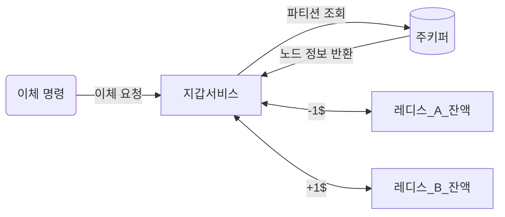

# 12장 전자 지갑
- 결제 플랫폼은 보통 고객에게 전자 지갑 서비스를 제공하여 돈을 필요할 때 사용할 수 있도록 한다.
    - 결제 기능 뿐 아니라 다른 사용자에게로의 송금도 지원한다. (ex. 페이팔)
    - 이러한 이체는 은행보다 빠르며 추가 수수료를 부과하지 않는게 보통이다.

## 1단계: 문제 이해 및 설계 범위 확정

- 기능 요구사항
    - 전자 지갑 간 이체
- 비기능 요구사항
    - 1,000,000TPS
    - 99.99% 안정성
    - 정확성에 대한 요건은 데이터베이스의 트랜잭션 보증으로 충분하다고 간주
    - 재현성을 갖춘 시스템
        - 데이터 일관성이 깨졌을 경우 그 차이가 왜 발생했는지 추적하기 위해 처음부터 데이터를 재생하여 언제든지 과거 잔액을 재구성할 수 있어야 한다.
- 개략적 추정
    - 오늘날 사용되는 관계형 DB는 초당 수천 건 트랜잭션을 지원할 수 있다.
    - 한 노드가 1,000TPS를 지원할 수 있다고 가정하고 1번의 이체에서 두 번의 연산(인출, 입금)이 필요하기에 1백만 건 TPS 처리를 위해선 2백만 TPS를 지원하는 2000개 노드가 필요하다.
    - 이번 설계 목표 중 하나는 단일 노드가 처리할 수 있는 트랜잭션 수를 늘리는 것이다.

## 2단계: 개략적 설계안 제시 및 동의 구하기

### API 설계

- POST `/v1/wallet/balance_transper`

```json
// request
{
	"from_account": "...", // 인출할 계좌
	"to_account": "...", // 이체할 계좌
	"amount": "...", // 이체 금액
	"currency": "...", // 통화 단위
	"transaction_id": "..." // 중복 제거에 사용할 ID
}
```

### 인메모리 샤딩

- <사용자, 잔액> 관계를 나타내기에 좋은 자료 구조는 키-값 저장소이기에 레디스는 좋은 선택이다.
- 다만 레디스 한 대로 100만 TPS는 벅차기에 클러스터를 구성하고 사용자 계정을 모든 노드에 균등히 분배해야 한다. (샤딩)
    - 키의 해시 값을 계산해 파티션 수 n으로 나눠 파티션 번호를 도출
    - 모든 레디스 노드의 파티션 수와 주소는 주키퍼를 사용하여 관리
- 지갑 서비스는 이체 명령 처리를 담당하는 서비스로 다음 플로우를 가진다.
    - 이체 명령 수신
    - 이체 명령 유효성 검증
    - 두 계정의 잔액 갱신



- 위 설계에선 아직 정확성 요구사항을 충족하지 못한다.
    - 각 레디스 노드에 보내는 요청이 모두 원자적으로 성공하리라는 보장이 없다.
