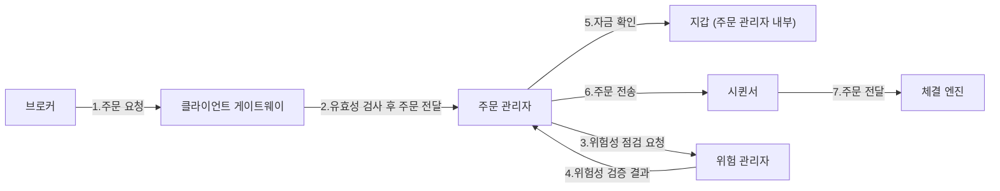
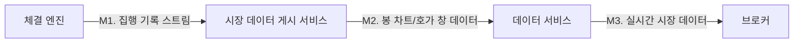
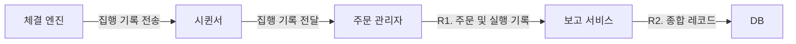
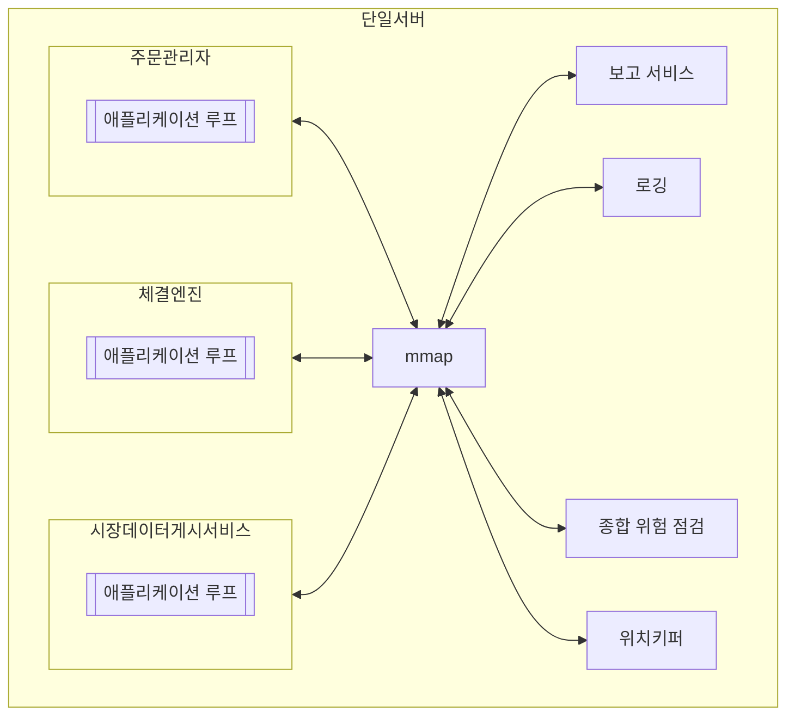

# 13장 증권 거래소

## 1단계: 문제 이해 및 설계 범위 확정

- 기능 요구사항
    - 간단히 주식만 거래한다고 가정
        - 새 주문
        - 체결되지 않은 주문 취소
    - 주문 유형은 지정가 주문만 가능
    - 시간 내 거래 처리
    - 거래소는 규제 시설이므로 위험성 점검이 가능해야 한다.
        - ex) 한 사용자가 하루에 거래할 수 있는 애플 주식을 백만 주 이하로 제한하는 규칙이 있다고 할 때 이를 위반한 거래가 있는지 점검
    - 사용자 지갑 관리
- 비기능 요구사항
    - 가용성: 최소 99.99%
    - 결함 내성: 빠른 복구 메커니즘이 필요
    - 지연 시간
        - 왕복 지연 시간이 밀리초 수준이어야 한다.
        - p99 지연 시간이 중요
    - 보안
        - 거래소는 계좌 신설 전에 사용자 신원 확인을 위한 KYC 확인을 수행
        - DDoS 공격 방지 장치 구비
- 개략적 규모 추정
    - 100가지 주식
    - 하루 10억 건 주문
    - 월~금 오전 9시 30분 ~ 16시까지 (6.5시간)
    - QPS: 10억 / (6.5 * 3600) =~ 43,000
    - 최대 QPS: 5 * QPS = 215,000
        - 거래량은 장 시작 직후, 마감 직전이 훨씬 높다.

## 2단계 개략적 설계안 제시 및 동위 구하기

### 용어 정리

- 브로커
    - 대부분 개인 고객은 브로커 시스템을 통해 거래소와 거래한다.
    - 개인 사용자가 증권을 거래하고, 시장 데이터를 확인하도록 사용자 인터페이스를 제공한다.
- 기관 고객
    - 전문 증권 거래 소프트웨어를 사용하여 대량으로 거래한다.
    - 대규모 주문을 하기에 주문 분할 같은 기능을 필요로 한다.
- 지정가 주문
    - 가격이 고정된 매수 또는 매도 주문
    - 시장가 주문과는 달리 체결이 즉시 이루어지지 않을 수 있고 부분 체결될 수도 있다.
- 시장가 주문
    - 가격을 지정하지 않는 주문으로 시장가로 즉시 체결된다.
- 봉 차트
    - 특정 기간 동안의 주가
    - 일정 시간 간격 동안 시장의 시작가, 종가, 최고가, 최저가를 표시할 수 있다.
    - 1분, 5분, 1일, 1주일, 1개월 간격이 존재
- FIX
    - Financial Information Exchange Protocol, 금융 정보 교환 프로토콜
    - 증권 거래 정보 교환을 위한 기업 중립적 통신 프로토콜

### 개략적 설계안

- 아래는 주식 주문의 거래 흐름이다.
    1. 고객에 브로커의 웹 또는 모바일 앱을 통해 주문한다.
    2. 브로커가 주문을 증권 거래소에 전송한다.
    3. 주문이 클라이언트 게이트웨이에 도착하고, 게이트웨이는 유효성 검사, 속도 제한, 인증, 정규화 등의 게이트 키핑을 수행한다.
    4. 주문 관리자가 위험 관리자가 설정한 규칙에 따라 위험성 점검을 수행한다.
    5. 위험 관리자가 위험성을 검증해 주문 관리자에 응답한다.
    6. 위험성 점검 과정을 통과한 주문에 대해 주문 관리자는 지갑에 주문 처리 자금이 충분한지 확인한다.
    7. 주문 관리자는 시퀸서를 통해 주문을 체결 엔진으로 전송한다.
    8. 체결 엔진은 매수, 매도 측 각각 하나씩 두 개의 집행 기록을 생성한다. (나중에 시퀸서는 주문 집행 기록을 일정 순서로 정렬할 것이다.)
    9. 주문 집행 사실을 클라이언트에 전송한다.



- 다음은 시장 데이터 흐름을 따라 주문이 체결 엔진부터 데이터 서비스를 거쳐 브로커로 전달되어 집행되기까지의 과정이다.
    - M1. 체결 엔진은 주문이 체결되면 집행 기록 스트림을 만들어 시장 데이터 게시 서비스로 전송한다.
    - M2. 시장 데이터 게시 서비스는 집행 기록 및 주문 스트림에서 얻은 데이터로 봉 차트와 호가 창을 구성해 데이터 서비스로 보낸다.
    - M3. 브로커는 데이터 서비스를 통해 실시간 시장 데이터를 읽고 이 시장 데이터를 고객에게 전달한다.



- 마지막으로 아래는 보고 흐름(report flow)이다. 
    - R1. 보고 서비스는 주문 관리자로부터 주문 및 실행 기록에서 보고에 필요한 모든 필드를 종합한다.
    - R2. 종합해 만든 레코드를 데이터베이스에 기록한다.



### 거래 흐름

- 거래 흐름은 거래소의 중요 경로상에서 진행된다.
- 체결 엔진
  - 각 주식 심벌에 대한 주문서 내지 호가 창을 유지 관리한다.
    - 주문서 또는 호가 창은 특정 주식에 대한 매수/매도 주문 목록
  - 매수 주문과 매도 주문을 연결하는데 즉 주문 체결로 두 개의 집행 기록이 만들어진다.
  - 집행 기록 스트림을 시장 데이터로 배포한다.
  - 고가용성의 체결 엔진이 만드는 체결 순서는 결정론적이어야 한다.
- 시퀸서
  - 체결 엔진을 결정론적으로 만드는 핵심 구성 요소로 주문에 시퀸스 ID를 붙어 체결 엔진에 전달한다.
  - 입력 시퀸서와 출력 시퀸서 2개가 있으며 각각 ID를 통해 고유 순서를 유지한다.
  - 순서 ID를 찍는 이유는 다음과 같다.
    - 시의성 및 공정성
    - 빠른 복구 및 재싱
    - 정확히 1회 실행 보증
  - 시퀸서는 체결 엔진에 두 개 카프카 이벤트 스트림이 연결되어 있는 것과 비슷하다.
    - 하나는 입력되는 주문용, 하나는 출력될 집행 기록용
- 주문 관리자
  - 주문 관리자는 클라이언트 게이트웨이를 통해 주문 수신 후 다음을 수행한다.
    - 위험 점검 컴포넌트를 통해 위험성을 검토
    - 사용자 지갑을 통해 자금 확인
    - 주문을 시퀸서에 전달
  - 또한 주문 관리자는 시퀸서를 통해 체결 엔진으로부터 집행 기록을 받는다.
    - 그리고 다시 클라이언트 게이트웨이를 통해 브로커에 체결 주문을 반환한다.
  - 주문 관리자는 다양한 상태 변화를 관리해야 하기에 이벤트 소싱을 통해 설계된다.

- 클라이언트 게이트웨이
  - 인증, 유효성 검사, 처리율 제한, 정규화 등을 지원한다.
  - 중요 경로상에 놓이며 지연 시간에 민감해 가벼워야 한다.
  - 때문에 복잡한 기능은 체결 엔진이나 위험 점검 컴포넌트에 맡겨야 한다.
- 시장 데이터 게시 서비스(Market Data Publisher, MDP)
  - 체결 엔진에서 집행 기록을 스트림을 수신해 호가 창과 봉 차트를 만들어 낸다.
  - 시장 데이터(호가 창과 봉 차트)를 데이터 서비스로 전송하여 해당 서비스의 구독자가 사용할 수 있게 된다.
- 보고 흐름
  - 거래 이력, 세금 보고, 규정 준수 여부 보고, 결산 등의 기능을 제공한다.
  - 짧은 지연 보다는 정확성과 규정 준수가 핵심이다.
  - 입력으로 들어오는 주문과 결과로 나가는 집행 기록 모두에서 정보를 모아 속성(attributes)들을 구성하는 것이 일반적이다.
    - 들어오는 새 주문에는 주문 세부 정보가 존재
    - 나가는 집행 기록에는 주문 ID, 가격, 수량 및 집행 상태 등이 존재

### 데이터 모델

- 증권 거래소에는 세 가지 유형의 주요 데이터가 있다.
  - 상품, 주문 및 집행
  - 호가 창/주문서
  - 봉 차트
- 상품, 주문, 집행
  - 상품은 거래 대상 주식의 속성으로 정의된다.
    - 자주 변경되는 데이터는 아니고 주로 UI 표시를 위한 데이터다.
    - 아무 데이터베이스에나 저장 가능하며 캐시를 적용하기 좋다.
  - 주문은 매수/매도 실행 명령이다.
  - 집행 기록은 체결이 이루어진 결과다.
  - `Product ← Order → Execution`
- 호가 창
  - 증권 또는 금융 상품에 대한 매수/매도 주문 목록으로 가격 수준별로 정리되어 있다.
  - 체결 엔진이 빠른 주문 체결을 위해 사용하는 핵심 자료구조다.
  - 호가 창 자료구조는 다음 요구사항을 만족시킬 수 있어야 한다.
    - 일정한 조회 시간
    - 빠른 추가/취소/실행 속도 - 가급적 O(1) 시간 복잡도
    - 빠른 업데이트
    - 최고 매수 호가/최저 매도 호가 질의
    - 가격 수준 순회
  - 아래 코드는 호가 창의 구현 클래스다.
    - 하지만 `orders: List<Order>`는 주문에 대한 연산을 O(1)에 만족시키지 못한다. (이중 연결 리스트가 필요)

```kotlin
class PriceLevel(
	private val limitPrice: Price,
	private val totalVolume: Long,
	private val orders: List<Order>,
)

class Book<Side>(
	private val  side: Side,
	private val limitMap: Map<Price, PriceLevel>,
)

class OrderBook(
	private val buyBook: Book<Buy>,
	private val sellBook: Book<Sell>,
	private val bestBid: PriceLevel,
	private val bestOffer: PriceLevel,
	private val orderMap: Map<OrderID, Order>,
)
```

- 봉 차트
  - 시장 데이터 프로세서가 시장 데이터를 만들 때 호가 창과 함께 사용하는 자료구조
  - `Candlestick` 클래스와 `CandlestickChart` 클래스를 사용한다.
  - 하나의 봉이 커버하는 시간이 경과하면 다음 주기를 커버할 새 `Candlestick` 클래스 객체를 생성하여 `CandlestickChart` 내부 연결 리스트에 추가한다.
  - 봉 차트에서 많은 종목 가격 이력을 다양한 시간 간격으로 추적하려면 메모리 최적화가 필요하다.
    - 미리 메모리를 할당해 둔 링 버퍼에 봉을 보관하여 새 객체 할당 횟수를 줄일 수 있다.
    - 메모리에 두는 봉 개수를 제한하고 나머지는 디스크에 보관한다.

```kotlin
class Candlestick(
	private val openPrice: Long,
	private val closePrice: Long,
	private val highPrice: Long,
	private val lowPrice: Long,
	private val volume: Long,
	private val timestamp: Long,
	private val interval: Int,
)

class CandlestickChart(
	private val sticks: List<Candlestick>
)
```

## 3단계: 상세 설계

- 현대의 거래소 중 일부 대형 거래소는 하나의 거대 서버로 거의 모든 것을 운영한다.
  - 극단적일 수 있으나 이유가 있다.

### 성능

- 거래소에서 지연 시간은 아주 중요한 문제다.
- 지연 시간을 줄이려면 두 가지 방법이 있다.
  - 중요 경로에서 실행할 작업 수를 줄인다.
  - 각 작업의 소요 시간을 줄인다.
    - 네트워크 및 디스크 사용량 경감
    - 각 작업 실행 시간 경감
- 중요 경로 실행 작업 수 줄이기
  - 주요 매매 경로는 다음과 같다. (게이트웨이 → 주문 관리자 → 시퀸서 → 체결 엔진)
  - 주요 경로엔 꼭 필요한 구성 요소만 두어야 한다.
  - 로깅도 지연을 줄이기 위해 중요 경로에선 제외한다.
- 각 작업 실행 시간 경감
  - 핵심 경로에 통신 컴포넌트가 많다면 단대단(end-to-end) 지연은 수십 밀리초에 달할 수 있다.
  - 모든 구성 요소를 단일 서버애 배치하여 낮은 지연을 달성할 필요가 있다.



- 애플리케이션 루프
  - 주된 작업 실행 메커니즘은 while 순환을 통해 실행할 작업을 계속 폴링하는 것이다.
  - 엄격한 지연 요건 만족을 위해 가장 중요한 작업만 이 순환 속에서 처리해야 한다.
  - 이 메커니즘의 목표는 각 구성 요소의 실행 시간을 줄여 전체적인 지연을 줄이는 것이다.
  - CPU 효율성 극대화를 위해 단일 스레드가 루프를 처리한다.
- mmap
  - 파일을 프로세스의 메모리에 매핑하는 POSIC 호환 UNIX 시스템 콜을 말한다.
  - 프로세스 간 고성능 메모리 공유 메커니즘을 제공한다.
  - 최신 거래소는 이를 이용해 중요 경로에서 가능한 디스크 접근이 일어나지 않도록 한다.
  - mmap 통신 경로를 통해 네트워크나 디스크에 접근하는 일 없이 메시지 전송에 마이크로초 미만이 걸린다.

### 이벤트 소싱

- 이벤트 소싱 아키텍처
  - 현재 상태를 저장하는 대신 상태를 변경하는 모든 이벤트의 변경 불가능한 로그를 유지한다.
- mmap 이벤트 저장소를 메시지 버스로 사용할 수 있다.
  - 카프카 pub-sub 모델과 아주 비슷하다. (사실 지연에 관한 요구사항이 없다면 카프카를 사용할 수도 있었을 것)
- 이벤트 소싱을 쓰면 모든 메시지는 동일한 이벤트 저장소를 사용한다.
  - 이벤트 저장소엔 sequence 필드가 존재하고 시퀸서가 이 필드 값을 넣는다.
  - 시퀸서는 이벤트 저장소에 보내기 전에 이벤트를 순서대로 정렬하는 유일한 쓰기 연산 주체다.
  - 각 이벤트 저장소에는 하나의 시퀸서만 존재하는데 여러 개 있으면 쓰기 권한을 두고 경쟁하므로 좋지 않다.
  - 시퀸서 다운을 대비해 백업 시퀸서를 두면 가용성을 높일 수 있다.

### 고가용성

- 본 설계안은 99.99% 가용성을 만족시켜야 하므로 하루에 다운 타임이 8.63초를 넘으면 안 된다.
- 가용성을 높이기 위해 다음을 고려해야 한다.
  - 거래소 아키텍처의 단일 장애 지점(SPOF)을 식별해야 한다. (ex. 체결 엔진)
  - 장애 감지 및 백업 인스턴스로의 장애 조치 결정이 빨라야 한다.
- 무상태 서비스는 수평 확장이 가능하지만 주문 관리자나 체결 엔진 처럼 상태 저장 컴포넌트는 사본 간 데이터 복사가 가능해야 한다.
  - 주 인스턴스가 다운되면 부 인스턴스는 즉시 지위를 승계한 후 이벤트를 전송해야 한다.
  - 부 인스턴스가 다운되면 일단 재시작하고 이벤트 저장소 데이터를 통해 모든 상태를 복구한다.
  - 이벤트 소싱의 결정론적 특성 때문에 상태 복구가 가능하다.
- 주 체결 엔진의 문제를 감지하기 위한 메커니즘이 필요하다.
  - 하드웨어, 프로세스 모니터링 또는 박동 메시지 사용
- 이러한 주/부 체결 엔진 설계안으로 고가용성을 달성하려면 여러 서버, 여러 데이터 센터 전반으로 확장해야 한다.
  - 주/부 서버의 클러스터를 구성해야 한다는 뜻
  - 안정적 UDP(reliable UDP)를 사용하면 모든 부 서버에 이벤트 메시지를 효과적으로 브로드캐스트할 수 있다.

### 결함 내성

- 확률은 낮지만 부 서버까지 전부 다운 됐을 때를 대비해야 한다.
  - 주 서버가 다운되면 언제 어떻게 부 서버로 자동 전환 되는가
  - 부 서버 가운데 새로운 리더는 어떻게 선출하는가
  - 복구 시간 목표(Recovery Time Objective, RTO)는 얼마인가
  - 어떤 기능을 복구해야 하는가(RecoveryPoint Objective, RPO)
- 우선 ‘장애’ 즉 다운을 정의해야 한다.
  - 잘못된 장애 정의로 인해 불필요한 장애 극복 절차가 발생할 수 있다.
  - 코드의 버그로 인해 주 서버가 다운되면 부 서버로 전환되더라도 같은 버그로 부 서버까지 다운될 수 있다. 이는 매우 치명적이다.
  - 때문에 새 시스템을 출시했을 땐 수동으로 장애 복구 조치를 수행하고, 충분한 경험과 시그널을 축적하여 자동 장애 감지 및 복구 프로세스를 도입하면 좋다.
- 리더 선출 문제는 잘 알려진 래프트(Raft) 같은 리더 선출 알고리즘을 사용하면 된다.
  - Raft 알고리즘은 분산 시스템에서 여러 노드가 동일한 상태를 유지하도록 합의를 이루는 리더 기반 합의(Consensus) 알고리즘이다.
  - 모든 노드는 Follower, Candidate, Leader의 세 가지 상태를 가지며, 처음에는 모두 Follower로 시작한다.
  - 일정 시간 동안 Leader의 신호(heartbeat)를 받지 못하면 Follower는 Candidate로 전환되어 투표를 요청한다.
  - 과반수의 표를 얻은 노드가 새로운 Leader가 되며, Leader는 클러스터의 모든 변경 요청을 받아 로그를 복제하고 데이터 일관성을 유지한다.
- 복구 시간 목표는 애플리케이션이 다운되어도 사업에 심각한 피해가 없는 시간의 최댓값이다.
  - 이를 위해 우선순위에 따라 서비스를 분류하고 최소 서비스 수준 유지를 위한 성능 저하 전략을 정의한다.
- 복구 지점 목표(RPO)는 미즈니스에 심각한 피해가 발생하기 전에 손실될 수 잇는 데이터 양 즉 손실 허용 범위를 의미한다.
  - 증권 거래소의 경우 데이터 손실을 용납할 수 없기에 RPO가 0에 가깝다.
  - 래프트 메커니즘을 통해 모든 클러스터 노드가 같은 상태를 갖도록 보장하며 데이터 사본도 많이 가질 수 있다.

