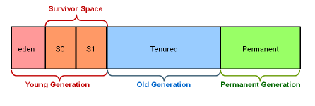

# GC
## Garbage Collector란

프로그램이 실행되다 보면 더 이상 아무도 사용하지 않는 객체가 Heap 영역에 남아 있게 된다. 이 유효하지 않은 메모리가 계속 남아 있게 된다면 언젠가 Heap 영역은 가득 차서 더 이상 프로그램을 진행할 수 있는 메모리가 남지 않을 것이다.

JVM 실행 엔진 내부에 있는 Garbage Collector는 불필요한 메모리(garbage)를 자동으로 정리해 주는 기능을 한다.

Garbage Collector는 개발자가 따로 신경 쓰지 않아도 heap 메모리를 살펴 보고 사용 중인 객체와 사용하지 않는 객체를 식별하고 사용하지 않는 객체를 삭제한다.

> 사용되지 않는 객체 = 참조되지 않는 객체
>

## GC 기본 프로세스

1. **Marking**

Garbage Collector가 사용 중인 메모리와 사용하지 않는 메모리를 식별한다.

1. **Normal Deletion**

참조되지 않는 객체를 메모리에서 삭제하고, Memory allocator가 메모리에서 삭제된 여유 공간에 대한 포인터를 가지고 있는다. (새로운 메모리 할당이 요구될 때를 대비해서)

2a. **Deletion with Compacting**

성능을 향상 시키기 위해 참조되지 않는 객체를 삭제한 뒤 남은 참조된 객체들을 압축한다. 이렇게 하면 새로운 메모리 할당이 더 간단하고 빨라진다.

## JVM Generations

하지만 모든 참조 되지 않는 메모리를 식별하고 참조된 객체를 압축하는 등의 작업은 비효율적이다. 객체가 더 많이 할당될 수록 GC를 하는 시간은 더 늘어나지만 대부분의 객체의 수명은 짧다. (메모리에 오래 남아 있지 않는다.)

- **대부분의 객체는 금방 접근 불가능한 상태(unreachable)가 된다.**
- **오래된 객체에서 젊은 객체로의 참조는 아주 적게 존재한다.**

때문에 객체 생존 기간에 따라 물리적으로 Heap 영역을 나누게 되었다.

- **Young Generation**
    - 새로운 객체가 할당되는 공간이다.
    - 대부분의 객체가 금방 접근 불가능 상태가 되기 때문에 객체가 많이 생겼다가 사라진다.
    - young 영역에서 일어나는 메모리 정리를 minor garbage collection이라고 한다.
    - 몇몇 살아남은 객체들은 old generation 영역으로 이동한다.
- **Old Generation**
    - 객체들에게 threshold가 있어서 값이 임계치를 넘어가면  young에서 old 영역으로 넘어온다.
    - young 영역보다 크게 할당되며, 크기가 큰 만큼 가비지는 적게 발생한다.
    - old 영역에서의 메모리 정리를 major garbage collection이라고 한다.
- **Permanent Generation**
    - Method Area라고도 하는 이 영역은 클래스와 메서드 정보에 대한 메타 데이터를 저장하는 영역이다.
    - java 7 버전까지 Heap Area에 존재했지만 8 버전부터 Navite Method Stack에 편입
- GC의 대상을 특정 메모리 영역(특히 young 영역)으로 제한하여 탐색함으로써 성능을 향상시킨 것 (minor GC에 비해 majorGC는 적게 발생)

## GC 동작 방식

### Mark and Sweep

- **Mark** - garbage를 식별하는 작업
    - root space - 지역 변수나 파라미터, static 영역 등의 객체 참조를 찾아갈 수 있는 시작점
    - Mark 작업이 root space로부터 객체를 찾아갈 수 있냐 없냐로 garbage인지를 판단하기 때문에 순환 참조로 인한 참조 count 문제를 막을 수 있다.
    - reachable, unreachable(garbage)
- **Seep** - garbage 객체의 메모리를 해제하는 작업
- 참조 개수가 0이 되면 삭제하는 방식과 달리 의도적으로 GC를 실행시켜야 한다.

### Stop the World

- GC를 수행하기 위해 JVM이 애플리케이션 실행을 멈추는 작업.
- GC를 수행하는 스레드 이외의 모든 스레드가 작업을 멈춘다.
- 보통 minor GC보다 major GC가 훨씬 오래 걸리기 때문에 Stop the World 때문에 튜닝이 필요할 수도 있다.
    - [minor, major GC 둘 다 stop the world가 일어나나?](https://stackoverflow.com/questions/64981896/java-gc-is-minor-gc-collection-a-stw-event)
- 일반적으로 ‘튜닝’이라는 것은 이 시간을 최소화하는 것을 의미함

### 동작 과정

1. Young 영역의 eden 공간에 새객체가 할당된다. (처음엔 두 survivor 공간(S0, S1)은 비어있다.)
2. eden 공간이 가득 차면 minor GC가 발생한다.
3. 참조가 남아있는 객체는 첫 번째 survivor 영역인 S0으로 이동하고, 참조 되지 않는 객체는 삭제된다.
4. 다음 minor GC가 일어날 때 3번과 같은 동작이 벌어진다.
    1. 하지만 3번과 다른 점은 두 번째 survivor 공간인 S2로 참조 객체들이 이동한다.
    2. 그리고 이전 minor GC에서 S0으로 이동 되었던 객체들이 살아 남았다면 threshold가 상승하고 S1로 이동한다.
    3. 모든 참조 객체가 S1간으로 이동하면 S0을 비워지고 S1에는 threshold가 다른 객체들이 함께 존재하게 된다.
5. 다음 minor GC가 발생하면 4번과 똑같이 동작하며 S1 비워지고 S0이 채워진다.
    1. 살아남은 객체들은 threshold가 증가한다.
6. 위와 같은 동작이 반복되고 몇몇 객체들의 threshold가 임계치를 넘어가면 old generation으로 이동한다.
7. minor GC가 계속되고 old generation 영역이 채워지는데 old 영역이 가득차면 major GC가 발생한다.

---

[https://www.oracle.com/webfolder/technetwork/tutorials/obe/java/gc01/index.html](https://www.oracle.com/webfolder/technetwork/tutorials/obe/java/gc01/index.html)

[https://mangkyu.tistory.com/118](https://mangkyu.tistory.com/118)

[https://d2.naver.com/helloworld/1329](https://d2.naver.com/helloworld/1329)

[https://www.youtube.com/watch?v=FMUpVA0Vvjw](https://www.youtube.com/watch?v=FMUpVA0Vvjw)
