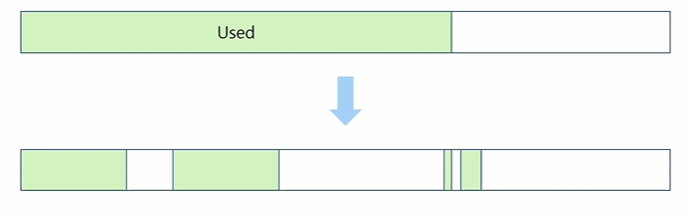
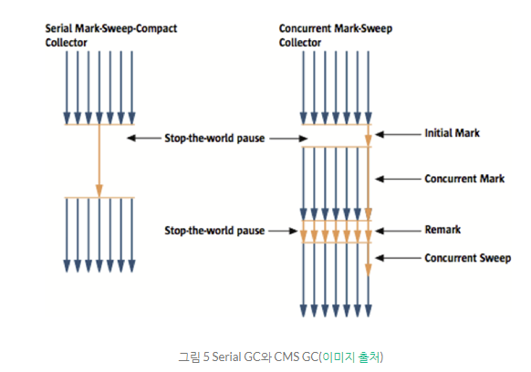
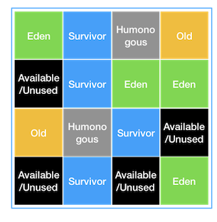

# GC 알고리즘
## Reference Counting Algorithm

- 각 객체마다 참조 count를 관리하여, 이 카운트가 0이 되면 GC를 수행
- 카운트가 0이 되면 바로 메모리에서 제거된다는 장점이 있음
- 다만 순환 참조 상황에서는 참조 count가 0이 되지 않아 메모리 누수가 발생할 수 있다

## Mark-and-Sweep Algorithm

- Reference Counting Algorithm의 단점을 극복하기 위한 알고리즘
- Root Set에서 참조를 추적
- Mark 단계에서 Garbage 대상이 아닌 객체를 마킹하는 작업을 수행한 후 Sweep 단계에서 마킹되지 않은 객체를 지우는 작업을 수행
- GC가 동작하는 경우 Mark 작업과 애플리케이션 Thread 간의 충돌을 방지하기 위해 Heap 사용이 제한됨
- Compaction 작업이 없어 빈 공간이 충분하지 않으면 Out of Memory가 발생할 수 있음

- GC가 발생하고 Compaction을 해주지 않으면 위와 같이 사이사이에 빈 공간이 생기게 된다. 만약 새로 할당될 객체의 메모리가 빈 공간보다 크다면 메모리 공간이 충분함해도 할당하지 못하는 경우가 발생하게 된다.

## Mark-and-Compact Algorithm

- Mark-and-Sweep에서 발생하는 점유 메모리 분산(Fragmentation) 문제를 해결
- Sweep 작업 후 Compact 작업이 추가되어 메모리를 모아주는 작업을 진행 → 메모리 효율 up
- 하지만 Compact 작업과 이후 참조를 업데이트 하는 작업으로 인해 오버헤드가 발생할 수 있음
    - stop the world 시간이 길어질 수 있음

## GC 종류

### Serial GC

- 하나의 CPU로 young generation과 old generation을 연속적으로 처리하는 방식
- Mark-and-Compact 사용
- GC가 수행될 때 STW 발생

### Parallel GC

- 자바 7, 8버전에서 default
- 다른 CPU가 GC 진행 시간 동안 대기 상태로 남아 있는 것을 최소화 하는 것
    - 멀티 스레드, 멀티 코어 환경에서 사용
- GC를 병렬로 처리하기에 STW 시간이 비교적 짧음

### Concurrent Mark-Sweep(CMS) GC

- 애플리케이션 Thread와 GC Thread가 동시에 실행 (STW 최소화)
- 동작 과정

1. Initial Mark
    1.  GC에서 살아남을 객체를 Root Set에서 가장 가까운 객체만 탐색, 참조 유무 확인
    2. STW가 일어나지만 탐색 깊이가 짧아 시간이 적게 걸린다.
2. Concurrent Mark
    1. Initial Mark 단계에서 마킹한(GC 대상이 아닌) 객체들의 참조 그래프를 탐색하여 GC 대상을 탐색
    2. STW가 일어나지 않고 애플리케이션 스레드와 함께 실행 된다.
3. Remark
    1. Concurrent Mark 단계를 재검증
    2.  GC 대상으로 추가 확인 되었는지, 참조가 제거되었는지 등
    3. STW가 일어나며 이 시간을 최대한 줄이기 위해 멀티 스레드로 수행
4. Concurrent Sweep
    1. GC 대상 객체들을 멀티 스레드로 메모리에서 제거
    2. STW가 발생하지 않는다.
- 전체적으로 STW 시간이 짧으며 애플리케이션 응답 속도가 중요할 때 사용하며 Low Latency GC라고도 불린다.
- 단점으로는 해야 할 작업이 많아 CPU 부하가 커진다는 것이고 Compaction이 기본적으로 제공되지 않는다.
    - 필요할 때만 Compaction이 수행되는데 이 때의 STW가 다른 GC보다 더 걸릴 수도 있다.

### Garbage First(G1) GC

- 자바 9 이상부터 사용하는 방식
- 과거의 GC들은 고용량 고성능 애플리케이션에는 적합하지 않다는 평가가 있었음
    - Root Set부터 순차적으로 탐색하기에 용량이 클수록 탐색 시간이 길어짐
- G1 GC는 큰 메모리에서 사용하기 적합한 GC
    - 대규모 Heap 사이즈에서 짧은 GC 시간 보장을 목적으로 함
- 전체 Heap 영역을 Region이라는 영역으로 분할하여 상황에 따라 역할이 동적으로 부여됨
    - 에덴, young, old 등의 각 region이 상황에 따라 달라짐
    - old, young, eden 외에 Humongous, Available/Unused 공간이 있다.
    - Humongous - Region 크기의 50%를 초과하는 큰 객체를 저장하기 위한 공간으로, GC 동작이 여기서는 최적으로 동작하지 않는다.
    - Available/Unused - 아직 사용되지 않는 공간

- Minor GC
    - young에서 Minor GC가 멀티 스레드로 수행되며 STW가 발생한다.
    - eden, survivor 영역에서 살아남은 객체는 다른 survivor 영역 또는 old region으로 이동하는데 기존의 survivor가 Available/Unused Region 상태로 변경된다.
    - eden과 survivor region의 사이즈는 다음 minor GC에 맞게 계산되어 리사이징된다.
        - 계산에 필요한 정보를 유지하고 있다.
- Major GC
    1. Initial Mark
        1. old region의 객체들이 참조하는 survivor region을 찾는데 이 과정에서 STW 발생
    2. Root Region Scan
        1. Initial Mark에서 찾은 survivor region에서 GC 대상 객체 탐색
    3. Concurrent Mark
        1. 전체 region을 스캔하여 GC 대상이 존재하지 않는 region은 이후 단계에서 제외된다.
        2. 이 단계는 minor GC에 의해 중단될 수도 있다.
    4. Remark
        1. STW 후 최종적으로 GC 대상에서 제외할 객체를 식별
    5. Cleanup
        1. STW 후 살아 있는 객체가 가장 적은 region에 대해 참조가 없는 객체를 제거
        2. STW를 끝내고 완전히 비워진 region을 Freelist에 추가하여 재사용
    6. Copy
        1. root region scan 단계에서 찾은 GC 대상이었지만 cleanup 단계에서 살아남은 객체들을 Available/Unused region에 복사하여 Compaction 작업을 수행

### Z GC

- ZPage라는 영역을 사용
    - G1 GC의 Region은 크기가 고정이지만 ZPage는 2mb 배수로 동적으로 운영됨
- 정지 시간이 최대 10ms를 초과하지 않는 것을 목적으로 함
- Heap 크기가 증가하더라도 정지 시간이 증가하지 않음

Z GC는 레퍼런스도 많이 없고 아직 많이 쓰이진 않는다.

기본적으로 자바 8 기준으로는 Parallel GC를 사용하게 될 것이다.

추가적인 튜닝으로 CMS, G1 GC를 많이 사용하는 추세다.

---

### 참고

[https://www.youtube.com/watch?v=jXF4qbZQnBc](https://www.youtube.com/watch?v=jXF4qbZQnBc)

[https://youtu.be/FMUpVA0Vvjw](https://youtu.be/FMUpVA0Vvjw)

[https://velog.io/@hygoogi/자바-GC에-대해서](https://velog.io/@hygoogi/%EC%9E%90%EB%B0%94-GC%EC%97%90-%EB%8C%80%ED%95%B4%EC%84%9C)

[https://d2.naver.com/helloworld/1329](https://d2.naver.com/helloworld/1329)

[https://www.oracle.com/technetwork/tutorials/tutorials-1876574.html](https://www.oracle.com/technetwork/tutorials/tutorials-1876574.html)
