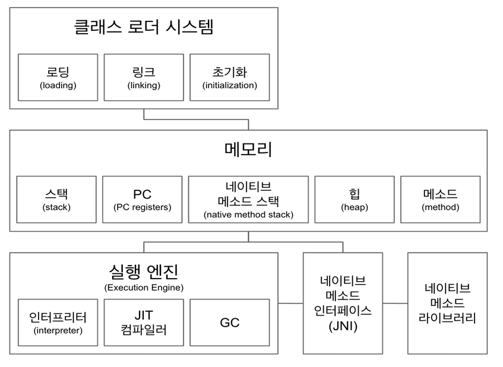

# JVM
## **JVM이란**

JAVA Virtual Machine은 자바 바이트코드를 실행하는 가상 머신이다. 이 바이트코드는 `.java` 파일을 컴파일한 `.class`파일로부터 얻을 수 있다.

JVM은 운영 체제에 의존하지 않는 인터페이스를 제공하기 때문에 가상이라고 한다. 이러한 OS 및 하드웨어로부터의 독립성은 java 프로그램의 write-once-run-anywhere 가치의 초석이다.

JVM은 GC, adaptive optimizer를 사용해 java 애플리케이션을 최적화할 수 있다.

## JVM 구조

## 클래스 로더

자바는 컴파일 타임이 아니라 런타임에 클래스를 로드하고 링크하는데 이를 클래스 로더가 수행한다. 로드한다는 것은 클래스가 요청될 때 javac가 컴파일한 .class 파일을 읽고 바이너리 데이터를 생성하여 메모리에 저장하는 것을 의미한다.

**로딩**, **링크**, **초기화** 순으로 이루어진다.

### Loading

클래스 파일(.class)을 바이트코드로 읽어 메모리(메소드 영역)로 불러오는 과정인데 저장하는 정보는 다음과 같다.

- 풀 패키지 경로 포함 클래스명
- Class 또는 Interface 또는 Enum인지에 대한 정보
- 수정자, 변수 및 메서드 정보 등

`.class` 파일을 로드한 후 JVM은 힙 메모리에 이 파일을 나타내기 위해 `Class` 타입의 객체를 생성한다.

이 클래스 객체는 클래스 이름, 부모 이름, 메서드 및 변수 정보 등과 같은 클래스 수준 정보를 얻기 위해 개발자가 사용할 수 있다.

### Link

링크는 생성된 바이트 코드가 적절한지에 대한 여부를 확인한다. 적절하지 않다면 에러가 발생한다.

- **Verify** : `.class` 파일의 정확성을 검증한다. 올바른 형식인지, 유효한 컴파일러에서 생성되었는지를 확인한다.
- **Preparation** : 클래스에 필요한 메모리 양을 할당하고 기본값으로 초기화한다.
- **Resolve** : 심볼릭 레퍼런스를 메모리 영역에 있는 실제 레퍼런스로 바꾸는 과정이다.
    - 어떤 객체가 다른 객체의 참조를 가지고 있는 경우 링크가 일어나기 전에는 힙에 있는 참조 객체의 실제 주소를 가지고 있지 않는다. 링크의 Resolve 과정에서 힙에 있는 객체를 가리키게 된다.

### ****Initialization****

static 변수의 값을 할당하고 static 블록이 있다면 이때 실행된다.

## JVM 메모리 영역

- **메소드 영역**에는 클래스 수준의 정보가 저장된다. (클래스명, 상속 관계, 메서드, 변수) 모든 스레드에서 공유하는 자원이다.
- **힙 영역**에는 애플리케이션 실행 중에 생성되는 모든 객체를 저장한다. 모든 스레드에서 공유하는 자원이다.
- **스택**은 지역 변수와 중간 결과를 저장한다. 이러한 모든 변수는 만들어지는 스레드에 대해 로컬이고 각 스레드에는 자체 JVM 스택이 있다. 스레드마다 런타임 스택을 만들고 그 안에 메서드 호출을 스택 프레임이라 부르는 블록으로 쌓는다. 스레드가 종료되면 런타임 스택도 사라진다.
- **PC 레지스터**는 현재 실행 중인 명령문의 물리적 메모리 주소를 저장한다. java에서 각 스레드에는 별도의 PC 레지스터가 있다.
- java는 네이티브 코드도 지원한다. (C, C++) **네이티브 메서드 스택**은 네이티브 코드를 실행하기 위한 스택이다.

## JVM 실행 엔진

JVM에 할당된 모든 코드는 실행 엔진에 의해 실행된다. 실행 엔진은 바이트코드를 읽고 하나씩 실행한다. 내장된 interpreter와 JIT 컴파일러를 사용해 바이트코드를 기계어로 변환하고 실행한다.

JVM을 사용하면 인터프리터와 컴파일러 모두 네이티브 코드를 생성한다. 차이점은 코드를 생성하는 방법, 최적화 방법, 최적화 비용에 있다.

- **인터프리터**: 바이트 코드를 (네이티브 코드로 변환) 한 줄씩 실행.
- **JIT 컴파일러**: 인터프리터 효율을 높이기 위해 런타임에 상호작용을 하여 컴파일한다. 인터프리터가 반복되는 코드를 발견하면 JIT 컴파일러로 반복되는 코드를 모두 네이티브 코드로 바꿔둔다. 그다음부터 인터프리터는 네이티브 코드로 컴파일된 코드를 바로 사용한다.
    - JIT 컴파일러는 기본적으로 활성화되어 있다. 비활성화할 수도 있는데 JIT의 문제점을 발견하거나 해결하는 경우를 제외하고는 하지 않는 것이 좋다.
- **GC**(Garbage Collector): 더 이상 참조되지 않는 객체를 모아서 정리한다.

---

[https://does-log.tistory.com/40](https://does-log.tistory.com/40)
