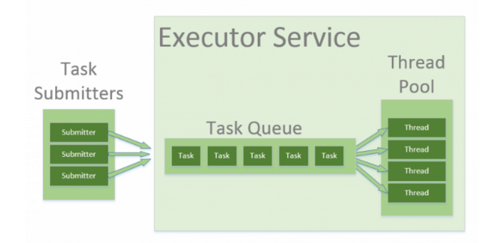

# Thread Pool
### 서버 성능 기본 지표 2개: 응답 시간, 처리량
- 응답 시간 = 대기 시간 + 처리 시간
- TPS(Transaction per Second) = 초당 몇 개의 클라이언트 요청을 처리하는지

### TPS를 높이려면

- 가장 쉬운 방법: 서버 늘리기
- 스레드 풀 + DB 커넥션 풀 늘리기
    - 동시에 처리할 수 있는 개수
        - 스레드 풀 5, 처리 시간 1초 → 5 TPS
        - 스레드 풀 10, 처리 시간 1초 → 10 TPS
- 처리 시간을 줄이기
    - 처리 시간 1초, 쓰레드 풀 10 → 10 TPS
    - 처리 시간 0.5초, 쓰레드 풀 10 → 20 TPS

### 서버, 스레드 풀 늘리기 한계

- 스레드 풀 크기가 커지면 잦은 컨텍스트 스위칭으로 인한 CPU 오버헤드 발생
    - 스레드가 많아져도 작업을 처리하는 CPU 코어 개수는 정해져 있기 때문이다.
- DB에 대한 부하가 임계치를 넘어가면 먹통 증상 발생
    - DB 쿼리 시간 증가 → 처리 시간 길어짐 → TPS 떨어짐

### 톰캣 스레드 풀 튜닝

**acceptCount**

- request Queue의 길이를 정의한다. 클라이언트가 HTTP Request를 요청했을 때 Idle Thread가 존재하지 않을 때, Idle Thread가 생길 때 까지의 대기 길이이다.
- 보통 큐에 메시지가 쌓여있다는 의미는 톰캣 인스턴스가 처리할 수 있는 쓰레드가 없다는 상황이며, 쓰레드를 사용해도 요청을 처리하지 못한다는 것은 이미 장애 상태일 가능성이 높다.
- 큐의 길이를 길게 주는 것보다는 짧게 줘서 요청을 처리할 수 없다면 빨리 에러 코드를 클라이언트에게 보내서 에러 처리를 하도록 하는 것이 좋다.
    - 큐가 길어서 대기가 길어지면 장애 상황에서도 응답을 대기하다가 다른 장애로 전파될 수도 있다.
- 순간적인 과부하 상황에 대비하기 위해 0 보다는 10 내외 정도로 짧게 주는 것이 좋다
- 디폴트 값은 100이다.

**maxConnections**

- 서버가 허용할 수 있는 최대 커넥션 수이다. 최대 커넥션 수가 도달하면 해당 메시지는 큐잉한다. 이때 큐 사이즈는 acceptCount가 결정한다. 해당 큐에서 처리를 대기한다.
- 주의할 점은 이 수가 실제 연결 중인 Connection 수가 아니라 현재 사용 중인 socket fd(file descriptor)의 수이다.
    - TCP 연결 특성상 Connection이 끝난 후에도 바로 socket이 close되는 게 아니라 FIN 신호를 보내고 대기했다가 Connection을 정리한다.
    - 실제 톰캣이 100개 요청을 동시 처리할 수 있다 해도, 요청을 정리하고 close할 때까지 시간이 있기 때문에 단 시간 내 많은 요청을 보내게 되면 maxConnection이 모자를 수 있다.
    - HTTP 1.1 keep alive를 사용하면 요청을 처리하지 않는 Connection도 유지되기 때문에 요청 처리 수보다 연결 수가 많아질 수도 있다.

**maxThread**

- 톰캣 내의 쓰레드 수를 결정하는 옵션이다.
- 쓰레드의 수는 실제 Active User 수를 의미한다. (즉 순간 처리 가능한 트랜잭션의 수)
- 해당 설정은 성능 테스트를 통해 서버 환경에 젹절하게 조절하는 것이 괜찮다.
- 디폴트는 200이다.

### **[maxThreads vs. maxConnections](https://stackoverflow.com/questions/24678661/tomcat-maxthreads-vs-maxconnections)**

- Tomcat은 2가지 모드에서 작동할 수 있다.
    - BIO - blocking I/O (연결 하나 당 하나의 스레드)
    - NIO - non-blocking I/O (스레드 보다 많은 연결)
- tomcat 7은 기본적으로 BIO였지만 NIO가 더 좋은 방법이라는 얘기가 많다.
    - 톰킷 8.5부터 BIO는 제외되었다.
- NIO 환경이라면 maxConnection=1000과 maxThreads=10은 합리적일 수도 있다.
    - 기본값은 maxConnection=10000, maxThreads-=200

## Thread Pool

자바에서 스레드는 운영체제의 리소스인 system-level 스레드에 매핑된다. 만약 스레드를 무한으로 생성한다면 리소스는 빠르게 소진될 것이다.

스레드 풀은 멀티 스레드 환경에서 리소스를 적약하고 미리 정의된 제한에서 병렬 처리를 하도록 도와준다.

### 자바에서의 스레드 풀

- *****Executors*, *Executor* and *ExecutorService***
    - Executors 클래스는 미리 정의된 스레드 풀 인스턴스를 생성하는 몇 가지 메서드를 제공한다.
    - Executor와 ExecutorService는 인터페이스를 사용하여 java에서 서로 다른 스레드 풀 구현으로 작업한다. 일반적으로 우리는 코드를 스레드 풀의 구현체와 분리한 상태로 유지해야 하며, 애플리케이션 전체에 걸쳐 인터페이스를 사용해야 한다.
- *****Executor*****
    - Executor 인터페이스는 Runnable 인터페이스 실행을 위한 하나의 메서드를 제공한다.

        ```java
        Executor executor = Executors.newSingleThreadExecutor();
        executor.execute(() -> System.out.println("Hello World"));
        ```

- *****ExecutorService*****
    - ExecutorService 인터페이스에는 작업 진행을 제어하고 service의 종료를 관리하는 많은 메서드를 제공한다.
    - 이 인터페이스로 작업을 실행할 수도 있고 Future 인스턴스를 반환 받아 작업을 제어할 수도 있다. (submit 메서드 사용)
    - 아래처럼 `Future.get()`메서드를 사용한다는 것은 스레드가 작업을 마치고 결과를 반환할 때까지 기다린다는 뜻이다. (blocking call)

        ```java
        ExecutorService executorService = Executors.newFixedThreadPool(10);
        Future<String> future = executorService.submit(() -> "Hello World");
        // some operations
        String result = future.get();
        ```

- *****ThreadPoolExecutor*****
    - 확장 가능한 스레드 풀 구현체
    - corePoolSize, maximumPoolSize, keepAliveTime을 조정할 수 있다.
    - 풀 내부에는 항상 보관되는 고정된 수의 코어 스레드로 구성되어 있다. 또한 생성되고 더 이상 사용하지 않을 땐 종료시킬 수도 있는 스레드도 존재한다.
    - corePoolSize: 인스턴스화되고 풀에 보관될 코어 스레드 수
        - 모든 코어 스레드가 사용 중이고 내부 큐가 가득 찬 경우 풀이 maximumPoolSize까지 커질 수 있다.
    - keepAliveTime: corePoolSize를 초과한 스레드들이 유휴 상태에 존재할 수 있는 시간 간격이다.
    - 이 매개 변수들로 다양한 튜닝을 할 수 있지만 가장 일반적인 구성이 정적 팩터리 메서드에 미리 정의되어 있다.
    - 예) 2개로 fixedPool을 만들었을 때 항상 2개 이하의 작업들만 바로 실행될 수 있다. 이 이외의 작업들은 큐에서 대기할 것이다.
- *****newFixedThreadPool*****
    - corePoolSize와 maximumPoolSize가 같고 keepAliveTime은 0이다.
    - 즉 스레드 풀의 스레드 수가 항상 같다는 것을 의미한다.
    - 예) 2개로 fixedPool을 만들었을 때 항상 2개 이하의 작업들만 바로 실행될 수 있다. 이 이외의 작업들은 큐에서 대기할 것이다.

```java
ThreadPoolExecutor executor = 
  (ThreadPoolExecutor) Executors.newFixedThreadPool(2);
executor.submit(() -> {
    Thread.sleep(1000);
    return null;
});
executor.submit(() -> {
    Thread.sleep(1000);
    return null;
});
executor.submit(() -> {
    Thread.sleep(1000);
    return null;
});

assertEquals(2, executor.getPoolSize());
assertEquals(1, executor.getQueue().size());
```

- *****Executors.newCachedThreadPool()***
    - 스레드 수를 받지 않고 생성되며 corePoolSize는 0이며 maximumPoolSize는 `Integer.MAX_VALIE`이다. keepAliveTime은 60초
    - 스레드 풀이 할당되는 작업 수를 수용하기 위해 한계 없이 커질 수 있음을 의미하며 더 이상 필요하지 않은 스레드는 60초 후에 죵료된다는 것을 의미한다.
    - 내부적으로 SynchronousQueue 인스턴스가 사용되므로 큐의 크기는 항상 0이다. 따라서 큐에는 아무것도 들어가지 않는다.

```java
ThreadPoolExecutor executor = 
  (ThreadPoolExecutor) Executors.newCachedThreadPool();
executor.submit(() -> {
    Thread.sleep(1000);
    return null;
});
executor.submit(() -> {
    Thread.sleep(1000);
    return null;
});
executor.submit(() -> {
    Thread.sleep(1000);
    return null;
});

assertEquals(3, executor.getPoolSize());
assertEquals(0, executor.getQueue().size());
```

- ***execute() vs submit()***
    - 매개 변수
        - Runnable만 가능.
        - Runnable과 Callable도 가능
    - 리턴 타입
        - execute() - void
        - submit() - Future
            - Future 객체는 비동기 연산의 결과
            - 만약 쓰레드 실행 중 예외가 발생했다면 Future 객체의 get() 메서드를 호출했을 때 해당 예외가 발생합니다.
            - get()의 호출은 blocking call
    - 예외 처리
        - execute - 예외가 발생하면 스레드가 종료되고 스레드 풀에서 해당 스레드가 제거된다. 그리고 새로운 스레드를 생성한다.
        - submit - 예외가 발생하더라도 스레드는 종료되지 않고 다음 작업을 위해 재사용된다.
---
[https://www.youtube.com/watch?v=JJJ4LReZ5q4](https://www.youtube.com/watch?v=JJJ4LReZ5q4)

[https://ehdvudee.tistory.com/30](https://ehdvudee.tistory.com/30)

[https://www.baeldung.com/thread-pool-java-and-guava](https://www.baeldung.com/thread-pool-java-and-guava)

[https://parkadd.tistory.com/114](https://parkadd.tistory.com/114)

[https://sas-study.tistory.com/231](https://sas-study.tistory.com/231)
