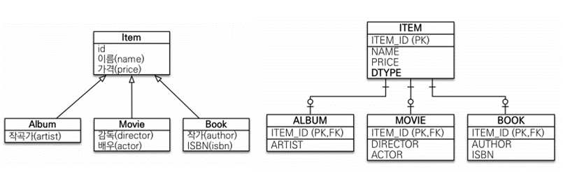
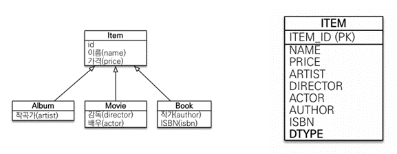
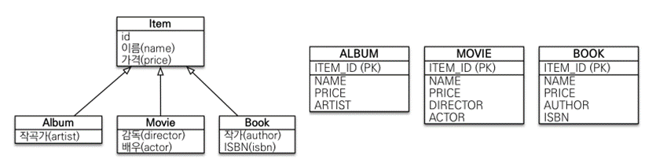

# 고급 매핑

## 상속 관계 매핑

- 관계형 데이터베이스는 상속 관계X
- 슈퍼타입 서브타입 관계라는 모델링 기법이 객체 상속과 유사
- 상속관계 매핑: 객체의 상속과 구조와 DB의 슈퍼타입 서브타입 관계를 매핑

- 슈퍼타입 서브타입 논리 모델을 실제 물리 모델로 구현하는 방법
    - 각각 테이블로 변환 -> 조인 전략
    - 통합 테이블로 변환 -> 단일 테이블 전략
    - 서브타입 테이블로 변환 -> 구현 클래스마다 테이블 전략

### **주요 어노테이션**

- `@Inheritance(strategy=InheritanceType.XXX)`
    - JOINED: 조인 전략
    - SINGLE_TABLE: 단일 테이블 전략
    - TABLE_PER_CLASS: 구현 클래스마다 테이블 전략
- `@DiscriminatorColumn(name=“DTYPE”)`
    - 부모 객체에서 선언하면 해당 테이블에 ‘DTYPE’ 칼럼이 생김
    - 자식 테이블의 엔티티 이름이 들어옴. ex) Album, Movie, Book..
    - 해당 부모 테이블이 어떤 자식 테이블과 조인되어야 하는지 알려줌
    - DTYPE을 통해 DB만 보고 이 부모 테이블이 어떤 타입인지 알 수 있음
    - 운영상 DTYPE은 항상 있는 것이 좋다.
- `@DiscriminatorValue(“XXX”)`
    - DTYPE 칼럼 명을 바꿀 수 있음 (기본값인 엔티티명이 아닌 값으로)
    - 자식 객체에 선언

### **조인 전략 @Inheritance(strategy=InheritanceType.JOINED)**


- 장점
    - 테이블 정규화
    - 외래 키 참조 무결성 제약 조건 활용 가능
        - 부모 테이블 PK가 자식 테이블의 PK이자 FK가 됨
    - 저장 공간 효율화
    - ex) 부모 객체의 칼럼으로만 해결 가능한 로직은 조인해서 자식 테이블을 가져올 필요 없이 부모 테이블만 조회해서 해결 가능
- 단점
    - 조회 시 조인을 많이 사용, 성능 저하
        1. ex) ALBUM 조회 시 ITEM도 같이 조인해서 가져와야 함
    - 조회 쿼리가 복잡함, 데이터 저장 시 INSERT SQL 2번 호출

### **단일 테이블 전략 @Inheritance(strategy=InheritanceType.SINGLE_TABLE)**

- 조인 전략과 달리 `@DiscriminatorColumn(name=“DTYPE”)`을 사용하지 않아도 DTYPE 칼럼이 자동으로 테이블에 추가됨
- 장점
  - 조인이 필요 없으므로 일반적으로 조회 성능이 빠름
  - 조회 쿼리가 단순함 (INSERT SQL도 한 번만 나감)
- 단점
  - 자식 엔티티가 매핑한 컬럼은 모두 null 허용
  - 단일 테이블에 모든 것을 저장하므로 테이블이 커질 수 있다.
  - 상황에 따라서 조회 성능이 오히려 느려질 수 있다.

### **구현 클래스마다 테이블 전략@Inheritance(strategy=InheritanceType.TABLE_PER_CLASS)**


- 이 전략은 데이터베이스 설계자와 ORM 전문가 둘 다 추천X
- 장점
  - 서브 타입을 명확하게 구분해서 처리할 때 효과적
  - not null 제약 조건 사용 가능
- 단점
  - 여러 자식 테이블을 함께 조회할 때 성능이 느림(UNION SQL 필요)
    - 부모 객체로 조회 시(`em.find(Item.class, id)`) 전체 자식 객체의 서브 테이블을 모두 뒤져서 조회한다
  - 자식 테이블을 통합해서 쿼리하기 어려움

> 정석은 Join 전략. 하지만 애플리케이션이 단순하고 확장할 일도 별로 없을 것 같으면 단순한 단일 테이블 전략으로 가도 된다.
>

## Mapped Superclass - 매핑 정보 상속

- 공통 매핑 정보가 필요할 때 사용(id, name)
- 상속관계 매핑X
- 엔티티X, 테이블과 매핑X
- 부모 클래스를 상속받는 자식 클래스에 매핑 정보만 제공
- 조회, 검색 불가(`em.find(BaseEntity)` 불가)
- 직접 생성해서 사용할 일이 없으므로 추상 클래스 권장

```java
@MappedSuperclass
public abstract class BaseEntity {

   private LocalDateTime createTime;
   private LocalDateTime updateTime;
}
```

```java
@Entity
public class Post extends BaseEntity{
```

- 테이블과 관계없고, 단순히 엔티티가 공통으로 사용하는 매핑 정보를 모으는 역할
- 주로 등록일, 수정일, 등록자, 수정자 같은 전체 엔티티에서 공통으로 적용하는 정보를 모을 때 사용
- 참고: `@Entity` 클래스는 엔티티나 `@MappedSuperclass`로 지정한 클래스만 상속 가능
