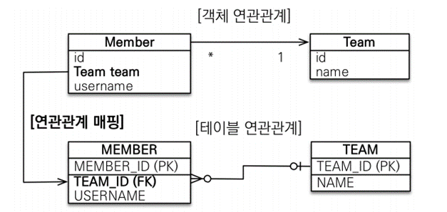
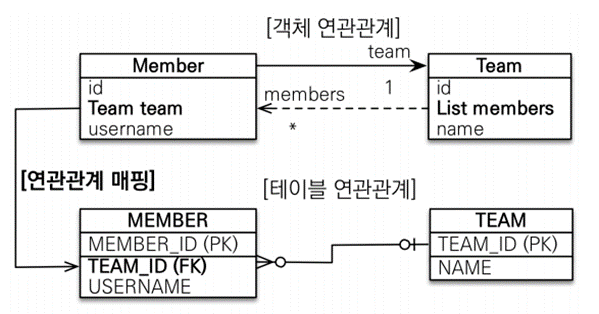
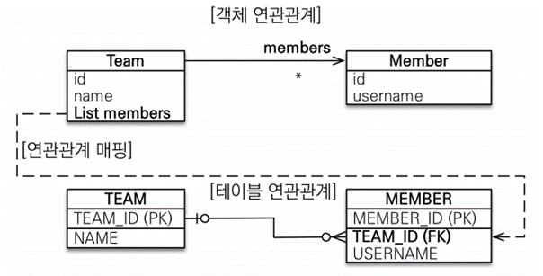
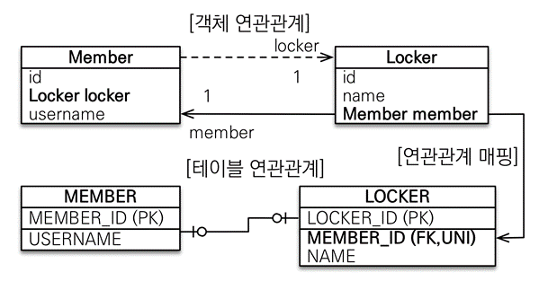
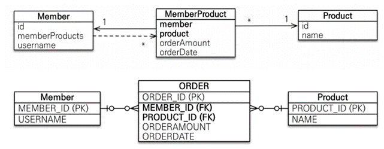

# 다양한 연관 관계 매핑
## 연관 관계 매핑 시 고려 사항 3가지

- 다중성
- 단방향, 양방향
- 연관 관계의 주인

### 다중성

- 다대일: `@ManyToOne`
- 일대다: `@OneToMany`
- 일대일: `@OneToOne`
- 다대다: `@ManyToMany` 실무에서는 쓰면 안 됨

### 단방향, 양방향

- 테이블
    - 외래 키 하나로 양쪽 조인 가능
    - 사실 방향이라는 개념이 없음
- 객체
    - 참조용 필드가 있는 쪽으로만 참조 가능
    - 한쪽만 참조하면 단방향
    - 양쪽이 서로 참조하면 양방향
    - 양방향인 것처럼 보이는 거지 사실은 단방향이 2개인 것

### **연관 관계의 주인**

- 테이블은 외래 키 하나로 두 테이블이 연관 관계를 맺음
- 객체 양방향 관계는 A->B, B->A처럼 참조가 2군데
- 객체 양방향 관계는 참조가 2군데 있음. 둘 중 테이블의 외래 키를 관리할 곳을 지정해야 함
- 연관 관계의 주인: 외래 키를 관리하는 참조
- 주인의 반대편: 외래 키에 영향을 주지 않음, 단순 조회만 가능
- 연관 관계의 주인이 아닌 객체에서 외래 키 값은 변경할 수 없음

## 다대일 [N:1]

### 다대일 단방향

```java
@Entity
public class Member {
	// ...
   
   @ManyToOne
   @JoinColumn(name = "TEAM_ID")
   private Team team;
}
```

- 가장 많이 사용하는 연관 관계
- 다대일의 반대는 일대다

### 다대일 양방향


```java
@Entity
public class Team {

   // ...

   @OneToMany(mappedBy = "team")
   List<Member> members = new ArrayList<Member>();
```

- 외래 키가 있는 쪽이 연관 관계의 주인
- 양쪽을 서로 참조하도록 개발

## 일대다[1:N]

### 일대다 단방향

```java
@Entity
public class Team {

		@Id @GenerateValue
		private Long id;

		@OneToMany
		@JoinColumn(name = "TEAM_ID")
		private List<Member> members = new ArrayList<>();
```

- 일대다 단방향은 일대다(1:N)에서 일(1)이 연관 관계의 주인
- 테이블 일대다 관계는 항상 다(N) 쪽에 외래 키가 있음
- 객체와 테이블 차이 때문에 반대편 테이블의 외래 키를 관리하는 특이한 구조
  - Team 객체에서 members를 변경하면 테이블에선 MEMBER 테이블에 업데이트 쿼리가 나가야 한다.
  - 실무에서 Team 엔티티를 건드렸는데 왜 MEMBER 엔티티 관련 쿼리가 나가지? 헷갈릴 수 있음 (테이블 수십개가 돌아가는 상황에서 이런 문제는 좋지 않음)
  - (객체지향적으로 손해를 보더라도) Member 객체에서 Team 객체를 참조할 일이 없다고 해도 DB 관점에서 유지보수하기 쉽게 일대다 단방향 보다는 다대일 양방향을 사용하는 편이 낫다.
- `@JoinColumn`을 꼭 사용해야 함. 그렇지 않으면 조인 테이블 방식을 사용함

  (중간에 테이블을 하나 추가함, TEAM_MEMBER 테이블)

- 일대다 단방향 매핑의 단점
  - 엔티티가 관리하는 외래 키가 다른 테이블에 있음
  - 연관 관계 관리를 위해 추가로 UPDATE SQL 실행

```java
Member member = new Member("member");
em.persist(member); //insert member, 외래키 team_id에는 null이 일단 들어감

Team team = new Team("A");
team.getMembers().add(member);
em.persist(team); 
// team을 영속화하는 순간 team에 대한 insert 쿼리 발생
// member에 대한 insert도 발생하는데 일대다 단방향의 경우 team_id는 null로 insert
// 이후에 따로 member 테이블의 외래키(team_id)를 수정하는 update 쿼리도 나가야 함
// 양방향이었다면 insert할 때 한 번에 team_id도 넣어서 update 쿼리가 필요 없음
```

- 일대다 단방향 매핑보다는 다대일 양방향 매핑을 사용하자

### 일대다 양방향
- 이런 매핑은 공식적으로 존재X
- `@JoinColumn(insertable=false, updatable=false)`
- 읽기 전용 필드를 사용해서 양방향처럼 사용하는 방법
- 다대일 양방향을 사용하자

> **컬렉션에서 필드를 미리 초기화하는 이유**
>
> 1. NPE 방지
> 2. 하이버네이트가 엔티티를 영속화 할 때 내부에서 컬렉션이 있으면 하이버네이트가 특별하게 조작한 컬렉션으로 변경한다. (컬렉션의 데이터가 추가 되었는지 등등을 인식할 수 있어야 하니까) 따라서 실제 참조가 변경될 수 있다. 그런데 개발자가 임의로 나중에 `new ArrayList()`로 초기화를 하게 되면 이 부분이 하이버네이트가 관리하는 컬렉션에서 개발자가 직접 만든 컬렉션으로 변경될 수 있다. 그러면 하이버네이트가 정상 동작하지 않는다. 이런 문제를 방지하기 위해 필드에서 빠르게 컬렉션을 초기화 하고, 해당 컬렉션을 바꾸는 행위를 막도록 코드를 작성하는 것이 좋다.

## 일대일 [1:1]

- 일대일 관계는 그 반대도 일대일
- 주 테이블이나 대상 테이블 중에 외래 키 선택 가능
  - 주 테이블에 외래 키 (주 테이블이란 주로 엑세스 하는 값)
  - 대상 테이블에 외래 키
- 외래 키에 데이터베이스 유니크(UNI) 제약 조건 추가
  - 유니크를 걸지 않으면 1:1이 DB에서 성립되지 않는다.

### **일대일: 주 테이블에 외래 키 단방향**

```java
@OneToOne
@JoinColumn(name = "LOCKED_ID")
private Locker locker
```

- 회원은 하나의 사물함밖에 가질 수 없다고 했을 때
- 다대일`(@ManyToOne`) 단방향 매핑과 유사

### **일대일: 주 테이블에 외래 키 양방향**
```java
@OnetoOne(mappedBy = "locker")
private Member member;
```

- 다대일 양방향 매핑처럼 외래 키가 있는 곳이 연관 관계의 주인
- 반대편은 `mappedBy` 적용

> 대상 테이블에 외래 키를 두고 일대일 단방향은 JPA에서 지원하지 않는다. 그리고 대상 테이블에 외래 키 양방향은 사실상 주 테이블 외래 키 양방향이랑 똑같다.
>

### **일대일 정리**

- 주 테이블에 외래 키
  - 주 객체가 대상 객체의 참조를 가지는 것처럼 주 테이블에 외래 키를 두고 대상 테이블을 찾음
  - 객체지향 개발자 선호
  - JPA 매핑 편리
  - 장점: 주 테이블만 조회해도 대상 테이블에 데이터가 있는지 확인 가능
    - 비즈니스 로직 상 Member를 조회할 일이 많은데 그 때 참조 값 Locker를 확인해 있는지 없는지 확인 가능하여 성능 상 이점
  - 단점: 값이 없으면 외래 키에 null 허용
- 대상 테이블에 외래 키
  - 대상 테이블에 외래 키가 존재
  - 전통적인 데이터베이스 개발자 선호
  - 장점: 주 테이블과 대상 테이블을 일대일에서 일대다 관계로 변경할 때 테이블 구조 유지
    - 한 Member가 여러 Locker를 가질 수 있을 때 대상 테이블인 LOCKER 테이블 외래 키에 유니크 제약 조건만 제거하면 됨
  - 단점: 프록시 기능의 한계로 지연 로딩으로 설정해도 항상 즉시 로딩됨
    - 주 테이블인 Member에 locker_id가 있는 주 테이블에 외래 키가 있는 경우를 생각해보자
    - Member 엔티티를 조회할 때 Locker locker에 값이 있는 지 보려면 Member 테이블만 확인하면 된다. (locker_id가 null인지 아닌지)
    - 확인해서 연관된 Locker가 있냐 없냐에 따라 null을 넣거나 프록시를 넣어서 지연 로딩을 설정할 수 있다.
    - 그런데 대상 테이블에 외래키가 있는 경우 Member 테이블만 봐도 연관된 locker가 있는지 파악할 수 없기 때문에 Locker 테이블도 뒤져야 한다.
    - 결국 값이 있는 경우 프록시를 넣어 놓는다는 판단이 불가능하여 무조건 Locker 테이블을 조회하는 즉시 로딩이 일어난다.



## 다대다[N:M]

- 관계형 데이터베이스는 정규화된 테이블 2개로 다대다 관계를 표현할 수 없음
- 연결 테이블을 추가해서 일대다, 다대일 관계로 풀어내야 함

### **다대다 매핑의 한계**

- 편리해 보이지만 실무에서 사용X
- 연결 테이블이 단순히 연결만 하고 끝나지 않음
- 연결 테이블에 주문 시간, 수량 같은 데이터가 들어올 수 있음

  다대다로 생긴 중간 테이블엔 그러한 추가 정보를 넣을 수 없음

  자바 객체로는 표현되지 않기 때문

  생각하지 못한 쿼리가 나감. (중간 테이블로 조인하면서)

### **다대다 한계 극복**

- 연결 테이블용 엔티티 추가(연결 테이블을 엔티티로 승격)
- `@ManyToMany` -> `@OneToMany`, `@ManyToOne`


> 연결 테이블용 엔티티의 PK를 FK를 묶어서 사용할 수도 있지만 PK는 정말 비즈니스적으로 의미 없는 값을 사용하는 것이 좋기 때문에 따로 id를 만들어서 PK로 사용하는게 유지보수성이 좋다는 영한님 의견이 있음
>

**N:M 관계는 1:N, N:1로**

- 테이블의 N:M 관계는 중간 테이블을 이용해서 1:N, N:1
- 실전에서는 중간 테이블이 단순하지 않다.
- `@ManyToMany`는 제약: 필드 추가X, 엔티티 테이블 불일치
- 실전에서는 `@ManyToMany` 사용X

### **@JoinColumn**
- 외래 키를 매핑할 때 사용
- `name`: 매핑할 외래 키 이름
- `referencedColumnName`: 외래 키가 참조하는 대상 테이블 컬럼 명
- `foreignKey`: 외래 키 제약 조건을 직접 지정할 수 있다. 이 속성은 테이블을 생성할 때만 사용한다.
- `unique`, `nullable`, `insertable`, `updatable`, `columnDefinition`, `table`: `@Column`의 속성과 같다.
