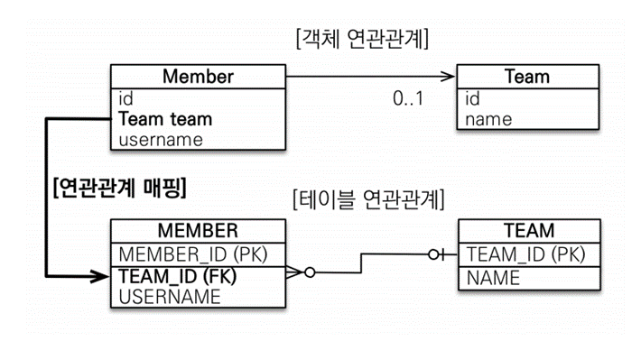
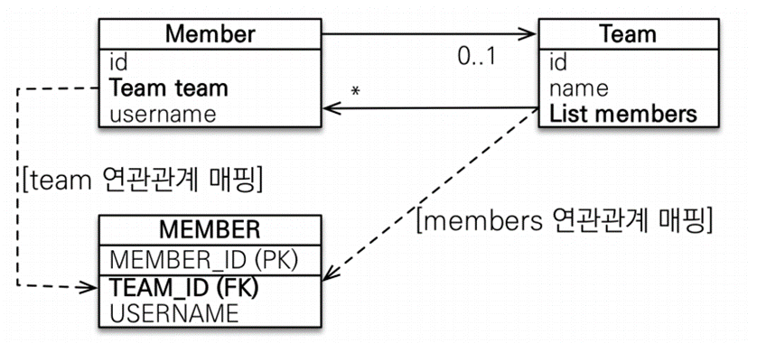
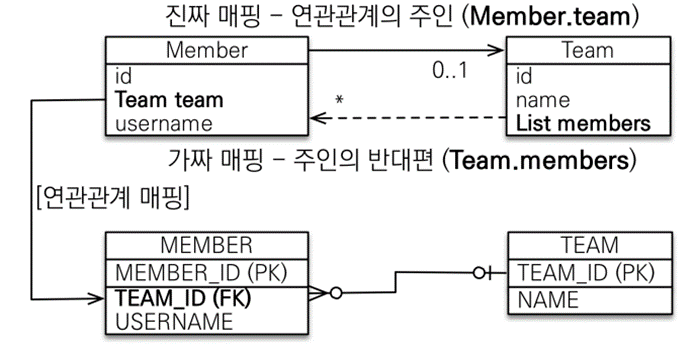

# 연관 관계 매핑 기초
### **연관 관계가 필요한 이유**

객체를 테이블에 맞추어 데이터 중심으로 모델링하면, 협력 관계를 만들 수 없다.
- 테이블은 외래 키로 조인을 사용해서 연관된 테이블을 찾는다.
- 객체는 참조를 사용해서 연관된 객체를 찾는다.
- 테이블과 객체 사이에는 이런 큰 간격이 있다

## 단방향 연관 관계
```java
@Entity
public class Member {
	// ...
   
   @ManyToOne
   @JoinColumn(name = "TEAM_ID")
   private Team team;
}
```

### **객체지향 모델링 (ORM 매핑)**

### **연관 관계 저장**

```java
//팀 저장
Team team = new Team();
team.setName("TeamA");
em.persist(team);

//회원 저장
Member member = new Member();
member.setName("member1");
member.setTeam(team); // 단방향 연관관계 설정, 참조 저장
em.persist(member);
```

### **연관 관계 조회 – 객체 그래프 탐색**

```java
//조회
 Member findMember = em.find(Member.class, member.getId()); 
//참조를 사용해서 연관관계 조회 
Team findTeam = findMember.getTeam();
```

### 연관 관계 수정

```java
// 새로운 팀B
Team teamB = new Team();
teamB.setName("TeamB");
em.persist(teamB);

// 회원1에 새로운 팀B 설정
member.setTeam(teamB);
```

## 양방향 연관 관계와 연관 관계의 주인

### 양방향 매핑
- 테이블에서는 단방향 양방향의 개념이 없다고 보면 된다. 외래키 하나로 양쪽이 모두 조회 가능하다. 하지만 객체는 다르다.
- 위 단방향 예제에서 Team 객체에 Member 참조를 추가하려 한다.
- Member 엔티티는 단방향과 동일, Team 엔티티는 컬렉션 추가

```java
@Entity
public class Team {

   // ...

   @OneToMany(mappedBy = "team")
   List<Member> members = new ArrayList<Member>();
```

### 객체 그래프 탐색

```java
//조회
Team findTeam = em.find(Team.class, team.getId());
int memberSize = findTeam.getMembers().size(); //역방향 조회
```

> 가급적 단방향이 좋다.
>

### 연관 관계의 주인과 mappedBy

**객체와 테이블이 관계를 맺는 차이**

- 객체 연관 관계 = 2개
    - 회원 -> 팀 연관 관계 1개(단방향)
    - 팀 -> 회원 연관 관계 1개(단방향)
    - 2개의 단방향
- 테이블 연관 관계 = 1개
    - 회원 <-> 팀의 연관관계 1개(양방향)
    - 외래키 하나로 양쪽 모두 조회 가능

**객체의 양방향 관계**

- 객체의 양방향 관계는 사실 양방향 관계가 아니라 서로 다른 단뱡향 2개다.
- 객체를 양방향으로 참조하려면 단방향 연관 관계를 2개를  만들어야 한다.
- A -> B (a.getB())
- B -> A (b.getA())

**테이블의 양방향 연관관계**

- 테이블은 외래 키 하나로 두 테이블의 연관 관계를 관리
- MEMBER.TEAM_ID 외래 키 하나로 양방향 연관 관계 가짐
(양쪽으로 조인할 수 있다.)

```sql
select * 
from member m 
join team t on m.team_id = t.team_id;

select * 
from team t 
join member m on t.team_id = m.team_id;
```

**둘 중 하나로 외래 키를 관리해야 한다**


- 만약 Member가 속한 Team을 변경하고 싶을 때 테이블 입장에선 외래 키 TEAM_ID(FK)만 변경하면 된다.
- 하지만 객체 입장에서는 Member의 team을 바꿔야 하는지, Team의 List<Member>를 변경해야 하는지 불분명하다.

### 연관 관계의 주인

**양방향 매핑 규칙**

- 객체의 두 관계 중 하나를 연관 관계의 주인으로 지정
- 연관 관계의 주인만이 외래 키를 관리(등록, 수정)
- 주인이 아닌 쪽은 읽기만 가능
- 주인은 `mappedBy` 속성 사용X
- 주인이 아니면 `mappedBy` 속성으로 주인 지정

**누구를 주인으로?**

- 외래 키가 있는 있는 곳을 주인으로 정해라 (일대다 중 다)
- 비즈니스적으로 중요한 엔티티가 주인이 되는 것이 아니다
- 여기서는 Member.team이 연관 관계의 주인


- Member의 Team을 변경해야 변경이 DB에 반영이 된다.
- Team의 List<Member> members에선 읽기만 가능하고 값을 변경해도 DB에 반영되지 않는다.

**양방향 매핑 시 가장 많이 하는 실수**

연관 관계의 주인에 값을 입력하지 않음

```java
Team team = new Team();
team.setName("TeamA");
em.persist(team);

Member member = new Member();
member.setName("member1");

//역방향(주인이 아닌 방향)만 연관관계 설정
team.getMembers().add(member);

em.persist(member);
```
양방향 매핑 시 연관 관계의 주인에 값을 입력해야 한다.

```java
//연관 관계의 주인에 값 설정 
member.setTeam(team);
```

**연관 관계 편의 메서드를 생성하자**

```java
// Member.changeTeam()
public void changeTeam(Team team) {
   this.team = team;
   team.getMembers().add(this);
}
```

- 순수 객체 상태를 고려해서 항상 양쪽에 값을 설정하자
- JPA 없이 순수 자바로 테스트 코드를 돌릴 수도 있다
- Team 변경 사항이 1차 캐시에만 있고 Team을 DB에서 조회했을 때 Team.members에 변경된 값이 반영되지 않는 문제를 해결할 수 있다.

**양방향 매핑 시에 무한 루프를 조심하자**

- 예: toString(), lombok, JSON 생성 라이브러리

**toString() 문제**

Member.toString

```java
@Override
public String toString() {
   return "Member{" +
      "id=" + id +
      ", name='" + name + '\'' +
      ", age=" + age +
      ", team=" + team +
      '}';
}
```

Team.toString()

```java
@Override
public String toString() {
   return "Team{" +
      "id=" + id +
      ", name='" + name + '\'' +
      ", members=" + members +
      '}';
}
```

`System.*out*.println(member);`

- 이러면 무한으로 서로를 호출하여 스택 오버 플로우(장애)가 발생한다.

**Json 라이브러리 문제**

- 스프링 컨트롤러에서 엔티티 자체를 반환하지 않으면 해결 가능
- Dto클래스를 만들어서 반환하자

### **양방향 매핑 정리**

- 단방향 매핑만으로도 이미 연관 관계 매핑은 완료
- 양방향 매핑은 반대 방향으로 조회(객체 그래프 탐색) 기능이 추가된 것 뿐
- JPQL에서 역방향으로 탐색할 일이 많음
- 처음 설계 시 단방향 매핑으로 하고, 양방향은 필요할 때 추가해도 됨

  (테이블에 영향을 주지 않음)


**연관 관계의 주인을 정하는 기준**

- 비즈니스 로직을 기준으로 연관 관계의 주인을 선택하면 안됨
- 연관 관계의 주인은 외래 키의 위치를 기준으로 정해야 함
