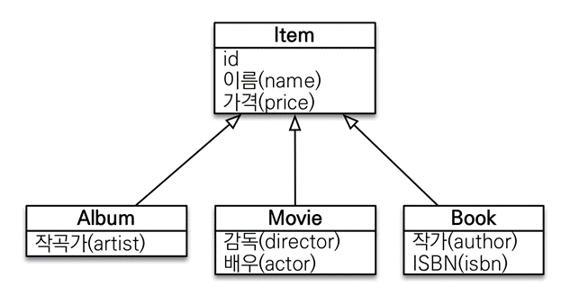

# 객체지향 쿼리 언어 - 중급 문법

## **경로 표현식**
- .(점)을 찍어 객체 그래프를 탐색하는 것
- `select m.username from member m join m.team t join m.orders o where t.name = '팀A'`

### **경로 표현식 용어 정리**

- 상태 필드(state field): 단순히 값을 저장하기 위한 필드 (ex: m.username)
    - 연관 필드(association field): 연관 관계를 위한 필드
- 단일 값 연관 필드: `@ManyToOne`, `@OneToOne`, 대상이 엔티티(ex: m.team)
- 컬렉션 값 연관 필드: `@OneToMany`, `@ManyToMany`, 대상이 컬렉션(ex: m.orders)

### **경로 표현식 특징**

- **상태 필드** (state field): 경로 탐색의 끝, 탐색X
- **단일 값 연관 경로**: 묵시적 내부 조인(inner join) 발생, 탐색O

> `“select m.team from Member m”` 실행 시 sql에선 조인이 실행됨 (묵시적 내부 조인) 묵시적 내부 조인이 발생하게 짜면 안된다. (운영이 힘들어짐)
>
- **컬렉션 값 연관 경로**: 묵시적 내부 조인 발생, 탐색X

> `“select t.members from Team t”` t.members에선 .(점)으로 또 탐색할 수는 없다.
>
- FROM 절에서 명시적 조인을 통해 별칭을 얻으면 별칭으로 탐색 가능

  `“select m from Team t join t.members m”`


### **명시직 조인, 묵시적 조인**

- 명시적 조인: join 키워드 직접 사용
    - `select m from Member m join m.team t`
- 묵시적 조인: 경로 표현식에 의해 묵시적으로 SQL 조인 발생 (내부 조인만 가능) 외부 조인하고 싶으면 명시적 조인으로
    - `select m.team from Member m`

### **경로 탐색을 사용한 묵시적 조인 시 주의 사항**

- 항상 내부 조인
- 컬렉션은 경로 탐색의 끝, 명시적 조인을 통해 별칭을 얻어야 함
- 경로 탐색은 주로 SELECT, WHERE 절에서 사용하지만 묵시적 조인으로 인해 SQL의 FROM (JOIN) 절에 영향을 줌

### **실무 조언**

- 가급적 묵시적 조인 대신에 명시적 조인 사용
- 조인은 SQL 튜닝에 중요 포인트
- 묵시적 조인은 조인이 일어나는 상황을 한눈에 파악하기 어려움

## **JPQL - 페치 조인(fetch join) – 기본**

- SQL 조인 종류X
- JPQL에서 성능 최적화를 위해 제공하는 기능
- 연관된 엔티티나 컬렉션을 SQL 한 번에 함께 조회하는 기능
- **join fetch** 명령어 사용
- 페치 조인 ::= [ LEFT [OUTER] | INNER ] JOIN FETCH 조인경로

### **엔티티 페치 조인**

- 회원을 조회하면서 연관된 팀도 함께 조회(SQL 한 번에)
- SQL을 보면 회원 뿐만 아니라 팀(T.*)도 함께 SELECT
- [JPQL] `select m from Member m **join fetch** m.team`
- [SQL] select m만 해줬는데 실행 sql을 보면 Team도 같이 가져온다. (즉시 로딩)

  `SELECT M.*, T.* FROM MEMBER M INNER JOIN TEAM T ON M.TEAM_ID=T.ID`

### 페치 조인 사용 코드

```java
String query = "select m from Member m join fetch m.team";

List<Member> result = em.createQuery(query, Member.class)
   .getResultList();

for (Member member : result) {
   System.out.println("userName = " + member.getUserName());
   System.out.println("teamName = " + member.getTeam().getName());
}
```

- 만약 그냥 조인을 썼다면 지연 로딩으로 인해 프록시 객체였던 팀을 member.getTeam()을 호출할 때마다 DB에 따로 팀을 select하는 쿼리를 날린다. -> **N+1 문제**
- 즉시 로딩일 때도 N+1 문제는 발생한다.
- 그냥 조인을 썼을 때 팀 조회 쿼리 발생 시점
  - 지연 로딩 - member.getTeam()처럼 실제 팀을 사용할 때
  - 즉시 로딩 – member를 가져온 뒤 바로 팀도 따로 조회

### 컬렉션 페치 조인

- 일대다 관계, 컬렉션 페치 조인
- [JPQL]

```java
select t
from Team t join fetch t.members
where t.name = ‘팀A'
```

- [SQL]

```sql
SELECT T.*, M.*
FROM TEAM T
INNER JOIN MEMBER M ON T.ID=M.TEAM_ID
WHERE T.NAME = '팀A'
```

### 컬렉션 페치 조인 사용 코드

```java
String query = "select t from Team t join fetch t.members where t.name = '팀A'";

List<Team> teams = em.createQuery(query, Team.class)
   .getResultList();

for(Team team : teams) {
   System.out.println("teamName = " + team.getName() + ", team = " + team);
   for (Member member : team.getMembers()) {
      System.out.println("-> username = " + member.getUserName()+ ", member = " + member);
   }
}
```

```java
결과
teamname = 팀A, team = Team@0x100 
-> username = 회원1, member = Member@0x200 
-> username = 회원2, member = Member@0x300 
teamname = 팀A, team = Team@0x100 
-> username = 회원1, member = Member@0x200 
-> username = 회원2, member = Member@0x300
```

> 이렇게 일대다 관계에서 조인을 날리면 데이터가 뻥튀기 된다. (팀A가 두 번 나옴) 이유는 회원 두 명이 팀A에 매핑된 것을 표현하기 위해 테이블 상에선 위 그림처럼 표현하기 때문이다. 저 테이블에서 팀 컬렉션을 가져오면 팀A는 두 개가 된다. (팀의 회원 수가 엄청 많다면 엄청난 문제..)
>

### **페치 조인과 DISTINCT**

- SQL의 DISTINCT는 중복된 결과를 제거하는 명령
- JPQL의 DISTINCT 2가지 기능 제공
  - 1. SQL에 DISTINCT를 추가
  - 2. 애플리케이션에서 엔티티 중복 제거
1. **SQL에 DISTINCT를 추가**
- `select **distinct** t from Team t join fetch t.members where t.name = ‘팀A’`
- SQL에 DISTINCT를 추가하지만 투플이 다르므로 SQL 결과에서 중복 제거 실패
1. 애플리케이션에서 엔티티 중복 제거
- DISTINCT가 추가로 애플리케이션에서 중복 제거 시도
- 같은 식별자를 가진 Team 엔티티 제거
```java
[DISTINCT 추가시 결과] 
teamname = 팀A, team = Team@0x100 
-> username = 회원1, member = Member@0x200 
-> username = 회원2, member = Member@0x300
```

### **페치 조인과 일반 조인의 차이**

- 일반 조인 실행 시 연관된 엔티티를 함께 조회하지 않음
- JPQL은 결과를 반환할 때 연관 관계 고려X
- 단지 SELECT 절에 지정한 엔티티만 조회할 뿐
- 페치 조인을 사용할 때만 연관된 엔티티도 함께 조회(즉시 로딩)
- 페치 조인은 객체 그래프를 SQL 한번에 조회하는 개념

## **JPQL - 페치 조인(fetch join) – 한계**

**페치 조인의 특징과 한계**

- 페치 조인 대상에는 별칭을 줄 수 없다.
  - `select t from Team t join fetch t.members **m** (X)`
  - 하이버네이트는 가능, 가급적 사용X
  - 페치 조인은 연관 엔티티를 다 긁어 오는 것.
  - 만약 팀의 회원이 5명이고 별칭을 써서 `where m…`으로 3명 정도만 가져온다고 쳤을 때 누락된 2명이 생김. = 팀 엔티티의 members에 원래 5명인데 3명만 있는 것
  - JPA에서 의도한 객체 그래프 탐색 설계는 이런 것이 아님.
  - 결론 - fetch join의 대상은 on, where 등에서 필터링 조건으로 사용하면 안된다.
- 둘 이상의 컬렉션은 페치 조인할 수 없다.
  - 페치 조인의 컬렉션은 하나만 지정할 수 있다.

    (아니면 일대다 조인 시 발생하는 데이터 뻥튀기가 심해질 수도)

- 컬렉션을 페치 조인하면 페이징 API(setFirstResult, setMaxResults)를 사용할 수 없다.
  - 일대다 조인 데이터 뻥튀기 때문에
  - 일대일, 다대일 같은 단일 값 연관 필드들은 페치 조인해도 페이징 가능
  - 하이버네이트는 경고 로그를 남기고 메모리에서 페이징(매우 위험)
  - 페이징이 DB에서부터 투플을 끊어서 갖고 오는데 데이터 뻥튀기로 인해 페이징이 제대로 작동하지 않을 수 있다. (팀이 가진 회원이 다 나오지 않을 수도 있다.)
  - 다대일 페치 조인으로 바꿔서 해결하거나 팀 테이블만 조회해서 해결한다.
  - 하지만 팀 테이블만 조회하면 지연 로딩으로 인한 N+1 문제가 발생한다.
- 연관된 엔티티들을 SQL 한 번으로 조회 - 성능 최적화
- 엔티티에 직접 적용하는 글로벌 로딩 전략보다 우선함
- `@OneToMany(fetch = FetchType.LAZY)` //글로벌 로딩 전략
- 실무에서 글로벌 로딩 전략은 모두 지연 로딩
- 최적화가 필요한 곳은 페치 조인 적용

### **@BatchSize로 N+1 해결하기**

- 우선 일대다 컬렉션 조인 시 발생하는 데이터 뻥튀기를 방지하기 위해 Team 테이블만 조회한다.

```java
String query = "select t from Team t";
List<Team> teams = em.createQuery(query, Team.class)
		.setFirstResult(0)
		.setMaxResults(2)
		.getResultList();
```

- 하지만 팀의 회원 조회 시 지연 로딩으로 인한 N+1 문제가 발생한다.
- 여기서 Team 엔티티 객체의 members에 `@BatchSize` 어노테이션을 쓴다.

```java
@BatchSize(size = 100)
@OneToMany(mappedBy = "team")
private List<Member> members = new ArrayList<>();
```

- size 속성 숫자만큼 해당 컬렉션을 지연 로딩으로 select를 날릴 때 한 번에 가져 온다.
- 예를 들어 Team이 팀1~팀10까지 총 10개가 있어서 `BatchSize` 없이는 총 10번의 members 조회 쿼리가 나가야 한다고 가정하자.
- `@BatchSize(size = 2)`로 둔다면 한 번에 2팀씩 가져와서 총 5번 쿼리가 나갈 것이다.
- `@BatchSize(size = 6)`으로 둔다면 팀6까지 한 번에 가져오고 나머지 팀 4개를 다음 지연 로딩으로 가져와 총 2번 쿼리가 나간다.
- BatchSize의 size를 충분히 높은 값으로 둠으로써 N+1 문제를 해결할 수 있다.

**페치 조인 - 정리**

- 모든 것을 페치 조인으로 해결할 수는 없음
- 페치 조인은 객체 그래프를 유지할 때 사용하면 효과적
- 여러 테이블을 조인해서 엔티티가 가진 모양이 아닌 전혀 다른 결과를 내야 하면, 페치 조인 보다는 일반 조인을 사용하고 필요한 데이터들만 조회해서 DTO로 반환하는 것이 효과적

## JPQL - 다형성 쿼리


### **TYPE**

- 조회 대상을 특정 자식으로 한정
- 예) Item 중에 Book, Movie를 조회해라
- [JPQL]

```java
select i from Item i where type(i) IN (Book, Movie)
```

- [SQL]

```java
select i from i where i.DTYPE in (‘B’, ‘M’)
```

### **TREAT(JPA 2.1)**

- 자바의 타입 캐스팅과 유사
- 상속 구조에서 부모 타입을 특정 자식 타입으로 다룰 때 사용
- FROM, WHERE, SELECT(하이버네이트 지원) 사용

예) 부모인 Item과 자식 Book이 있다.

- [JPQL]

```java
select i from Item i where treat(i as Book).auther = ‘kim’ // 다운 캐스팅과 유사
```

- [SQL]

```java
select i.* from Item i where i.DTYPE = ‘B’ and i.auther = ‘kim’
```

## JPQL - 엔티티 직접 사용

### 엔티티 직접 사용 - 기본 키 값

- JPQL에서 엔티티를 직접 사용하면 SQL에서 해당 엔티티의 기본 키 값을 사용

**엔티티를 파라미터로 전달**

```java
String jpql = "**select** m **from** Member m **where** m = :member"; 
List resultList = em.createQuery(jpql)
    .setParameter("member", member)
    .getResultList();
```

**식별자를 직접 전달**

```java
String jpql = "**select** m from **Member** m **where** m.id = :memberId"; 
List resultList = em.createQuery(jpql)
    .setParameter("memberId", memberId)
    .getResultList();
```

- 실행 SQL은 같음

### 엔티티 직접 사용 - 외래 키 값

```java
Team team = em.find(Team.class, 1L);

String qlString = "select m from Member m where m.team = :team";

List resultList = em.createQuery(qlString)
   .setParameter("team", team)
   .getResultList();
```

```java
String qlString = "select m from Member m where m.team.id = :teamId";
List resultList = em.createQuery(qlString)
   .setParameter("teamId", teamId)
   .getResultList();
```

- 실행 SQL은 같음

## **JPQL - Named 쿼리 - 정적 쿼리**

- 미리 정의해서 이름을 부여해두고 사용하는 JPQL
- 정적 쿼리
- 어노테이션, XML에 정의
- 애플리케이션 로딩 시점에 초기화 후 재사용
- 애플리케이션 로딩 시점에 쿼리를 검증

### Named 쿼리 - 어노테이션

```java
@Entity
@NamedQuery(
   name = "Member.findByUserName",
   query = "select m from Member m where m.userName = :username"
)
public class Member {
```

```java
List<Member> result = em.createNamedQuery("Member.findByUserName", Member.class)
   .setParameter("username", "회원1")
   .getResultList();
```

- 실무에서는 스프링 데이터 JPA를 통해 Repository에서 쿼리를 선언.

## JPQL - 벌크 연산

- 재고가 10개 미만인 모든 상품의 가격을 10% 상승하려면?
- JPA 변경 감지 기능으로 실행하려면 너무 많은 SQL 실행
  - 1. 재고가 10개 미만인 상품을 리스트로 조회한다.
  - 2. 상품 엔티티의 가격을 10% 증가한다.
  - 3. 트랜잭션 커밋 시점에 변경 감지가 동작한다.
- 변경된 데이터가 100건이라면 100번의 UPDATE SQL 실행

### **벌크 연산 예제**

- 쿼리 한 번으로 여러 테이블 로우 변경(엔티티)
- `executeUpdate()`의 결과는 영향받은 엔티티 수 반환
- UPDATE, DELETE 지원
- INSERT(insert into .. select, 하이버네이트 지원)

```java
String qlString = "update Product p " +
   "set p.price = p.price * 1.1 " +
   "where p.stockAmount < :stockAmount";
int resultCount = em.createQuery(qlString)
   .setParameter("stockAmount", 10)
   .executeUpdate();
```

**벌크 연산 주의**

- 벌크 연산은 영속성 컨텍스트를 무시하고 데이터베이스에 직접 쿼리
  - 벌크 연산을 먼저 실행
    - 쿼리가 나가는 거라 flush는 이루어짐
  - 벌크 연산 수행 후 영속성 컨텍스트 초기화
    - 벌크 연산 수행 전 결과가 영속성 컨텍스트에 남아있을 수 있기 때문
