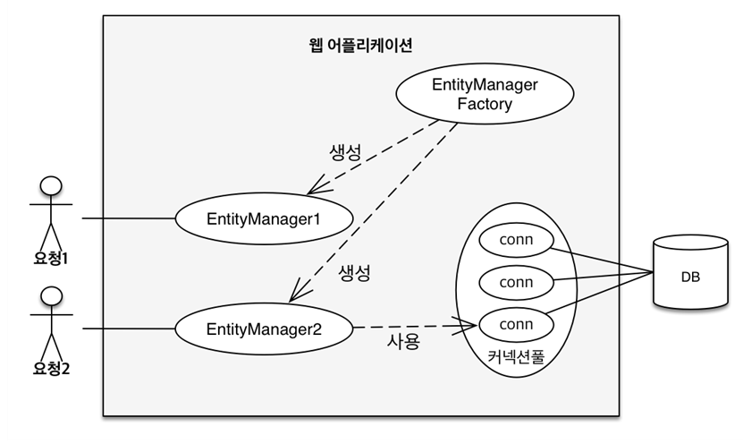

# 영속성 관리
## 영속성 컨텍스트

**JPA에서 가장 중요한 2가지**

- 객체와 관계형 데이터베이스 매핑 (Object Relational Mapping)
    - DB와 객체를 어떻게 설계해서 JPA로 매핑할 것인지
    - 정적인 설계
- **영속성 컨텍스트**
    - JPA가 내부에서 어떻게 동작하는 것일까?

### **엔티티 매니저 팩토리와 엔티티 매니저**

- 고객의 요청이 올 때마다 `EntityManagerFactory`에서 `EntityManager`를 생성한다.
- `EntityManger`는 내부적으로 커넥션풀을 사용하여 DB에 접근한다.

### **영속성 컨텍스트**

- “엔티티를 영구 저장하는 환경”
- `EntityManager.persist(entity);` 엔티티를 영속화 한다는 뜻
  - 실제로 엔티티를 영속화한다는 것은 DB에 저장한다는 뜻이 아님
  - **영속성 컨텍스트에 엔티티를 저장한다는 뜻**
- 영속성 컨텍스트는 논리적인 개념
  - 눈에 보이지 않기 때문에 뜯어보거나 내부를 들여다 볼 수 없음
- 엔티티 매니저를 통해 영속성 컨텍스트에 접근
- J2SE 환경에선 엔티티 매니저와 영속성 컨텍스트가 1:1이다.
- 스프링 프레임워크 같은 컨테이너 환경에선 엔티티 매니저와 영속성 컨텍스트가 N:1이다.

### **엔티티의 생명주기**

- **비영속 (new/transient)**
  - 영속성 컨텍스트와 전혀 관계가 없는 새로운 상태 (그냥 단순히 객체를 생성)
  - `new Member();`
- **영속 (managed)** persist 후
  - 영속성 컨텍스트에 관리되는 상태

    ```java
    Member member = new Member();
    em.persist(member);
    ```

  - `em.persist()`한 순간에 쿼리가 날아가지는 않는다. 커밋 시점에 쿼리가 날아간다.
- **준영속 (detached)**
  - 영속성 컨텍스트에 저장되었다가 분리된 상태
  - `em.detach(membr);`
- **삭제 (removed)**
  - 삭제된 상태
  - `em.remove(member);`

## **영속성 컨텍스트의 이점**

- 1차 캐시
- 동일성(identity) 보장
- 트랜잭션을 지원하는 쓰기 지연 (transactional write-behind)
- 변경 감지(Dirty Checking)
- 지연 로딩(Lazy Loading)

### **엔티티 조회, 1차 캐시**

- 엔티티를 영속하면 캐시(영속성 컨텍스트)에 pk가 key, 객체(엔티티)가 value 값으로 저장된다.
- 엔티티를 조회하면 DB보다 먼저 1차 캐시를 조회한다.

```java
Member member = new Member();
//1차 캐시에 저장됨
em.persist(member);
//1차 캐시에서 조회
Member findMember = em.find(Member.class, "member1");
```
- 값이 있으면 반환
- 1차 캐시에 없을 때 DB에 쿼리를 날려 조회하고 1차 캐시에 저장하고 반환
- 한 트랜잭션(고객의 한 요청)이 끝나면 영속 컨텍스트를 없애기 때문에 찰나의 순간에 사용되는 캐시임. 큰 성능 이점은 아니지만 로직이 굉장히 복잡할 땐 도움이 될 수도
  **영속화한 엔티티를 바로 조회**

```java
Member member = new Member();
member.setId(10L);
member.setName("helloC"); // 여기까지 비영속

em.persist(member); // 영속

Member findMember = em.find(Member.class, 10L); // 조회
System.out.println("findMember.getId()" + findMember.getId());
System.out.println("findMember.getName()" + findMember.getName());
```

**결과 쿼리**

```java
findMember.getId() = 10
findMember.getName() = helloC
Hibernate: 
    /* insert hellojpa.Member */ 
        insert 
        into
            Member
            (name, id) 
        values
            (?, ?)
```

Insert 쿼리가 나가기 전에 엔티티를 조회하고 출력했다. 이는 DB가 아닌 1차 캐시에서 엔티티를 조회했다는 뜻이고 커밋 시점에 insert 쿼리가 나간 것이다. 조회 쿼리는 나가지도 않았다.

### **영속 엔티티의 동일성 보장**

```java
Member a = em.find(Member.class, 10L);
Member b = em.find(Member.class, 10L);
System.out.println(a == b); //동일성 비교 true
```

- 1차 캐시로 반복 가능한 읽기(REPEATABLE READ) 등급의 트랜잭션 격리 수준을 데이터베이스가 아닌 애플리케이션 차원에서 제공

### **엔티티 등록 트랜잭션을 지원하는 쓰기 지연**

- 커밋할 때까지 SQL을 데이터베이스에 보내지 않는다.
- 영속성 컨텍스트 안에 있는 쓰기 지연 SQL 저장소에 SQL이 쌓인다.
- 커밋 시 SQL 실행
- 쓰기 지연을 하는 이유?
  - JDBC batch라고 한 번에 날릴 수 있는 SQL 용량이 있다.
  - 쓰기 지연을 함으로써 그 용량만큼 한 방에 쿼리를 날릴 수 있는 것
  - 실제로 같은 엔티티를 연속으로 저장하는 로직이 거의 없다. (고객 요청 당 하나씩 저장하기 때문)
  - 하지만 잘 활용한다면 성능을 더 좋게 할 수도 있다.

### **엔티티 수정 변경 감지 (Dirty Checking)**

```java
Member findMember = em.find(Member.class, 2L);
findMember.setName("JPA"); // 변경감지
```

- 변경만 해줘도 update 쿼리가 나간다. 따로 `persist`를 할 필요가 없다!
1. 커밋을 하면 JPA 내부적으로 `flush()`가 호출된다.
2. `flush()` 호출 후 엔티티와 스냅샷을 비교한다.
  - 1차 캐시에는 스냅샷이 존재하는데 스냅샷은 값을 읽어온 최초의 상태를 저장해 놓은 것이다.
3. 차이가 생기면 update 쿼리를 쓰기 지연 저장소에 쌓는다.
4. 커밋 시 update 쿼리를 날린다.

## 플러시 (flush)

영속성 컨텍스트의 변경 내용을 데이터베이스에 반영

### 플러시가 발생하면

- 변경 감지
- 수정된 엔티티를 쓰기 지연 SQL 저장소에 등록
- 쓰기 지연 SQL 저장소의 쿼리를 데이터베이스에 전송 (등록, 수정, 삭제 쿼리)

### 영속성 컨텍스트를 플러시하는 방법

- `em.flush()` - 직접 호출
- **트랜잭션 커밋** - 플러시 자동 호출
- **JPQL 쿼리 실행** - JPQL을 실행하면 플러시 자동 호출

```java
em.persist(memberA);
em.persist(memberB);
em.persist(memberC);
// 여기까지 insert 쿼리가 안나갔기 대문에 DB에 아무것도 없음

// 중간에 JPQL 실행, 모든 Member 조회
// 코드 로직 상 memberA, B, C가 조회되어야 함
query = em.createQuery("select m from Member m", Member.class);
List<Member> members= query.getResultList();
// 이런 경우 때문에 JPQL을 실행하면 flush가 강제적으로 일어남
```

### 플러시 모드 옵션

`em.setFlushMode(FlushModeType.COMMIT)`

- `FlushModeType.AUTO`커밋이나 쿼리를 실행할 때 플러시 (기본값)
- `FlushModeType.COMMIT`커밋할 때만 플러시
- 거의 모드 변경할 일 없기에 기본값으로 쓰면 됨

### 플러시는!

- 영속성 컨텍스트를 비우지 않음
- 영속성 컨텍스트의 변경 내용을 데이터베이스에 동기화
- 트랜잭션이라는 작업 단위가 중요 -> 커밋 직전에만 동기화 하면 됨

## 준영속 상태

- 영속 -> 준영속
- 영속 상태의 엔티티가 영속성 컨텍스트에서 분리(detached)
- 영속성 컨텍스트가 제공하는 기능을 사용 못함 (동일성 보장, 변경 감지 등)
- `em.detach(entity)`
  - 특정 엔티티만 준영속 상태로 전환
- `em.clear()`
  - 영속성 컨텍스트를 완전히 초기화
- `em.close()`
  - 영속성 컨텍스트를 종료

```java
// 조회하면 영속 상태 (1차 캐시에 저장)
Member findMember = em.find(Member.class, 2L);
findMember.setName("JPA study"); // 변경감지

// 준영속 상태
em.detach(findMember);

tx.commit(); 
//실행하면 select 쿼리만 나가고 커밋 시 변경 감지로 인한 update 쿼리는 나가지 않는다.
```
