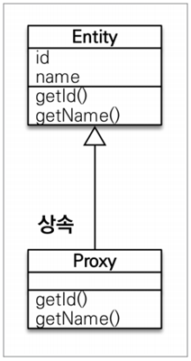
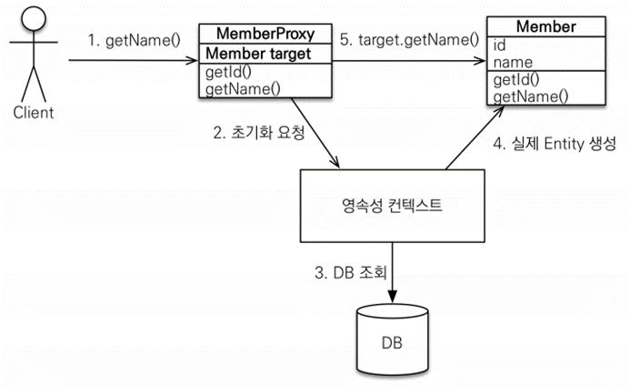

# 프록시와 연관 관계 관리

## 프록시

### 프록시 기초

- `em.find()` vs `em.getReference()`
- `em.find()`: 데이터베이스를 통해서 실제 엔티티 객체 조회
- `em.getReference()`: 데이터베이스 조회를 미루는 가짜(프록시) 엔티티 객체 조회
    - DB에 쿼리가 나가지 않음
    - 가짜 객체에 있는 값을 실제로 사용할 때 쿼리가 나감

### 프록시 특징

- 실제 클래스를 상속 받아서 만들어짐


- 실제 클래스와 겉 모양이 같다.
- 사용하는 입장에서는 진짜 객체인지 프록시 객체인지 구분하지 않고 사용하면 됨(이론상)
- 프록시 객체는 실제 객체의 참조(target)를 보관
- 프록시 객체를 호출하면 프록시 객체는 실제 객체의 메소드 호출

### 프록시 객체 초기화

```java
Member member = em.getReference(Member.class, “id1”);
member.getName();
```

- 프록시에 값이 없을 때 영속석 컨텍스트에 실제 값을 요청한다.
- 영속성 컨텍스트는 DB를 조회해서 실제 엔티티를 가져오고 프록시 객체의 target 값은 이 실제 엔티티를 가리킨다.
- 때문에 해당 엔티티가 영속성 컨텍스트 안에 있어야만 프록시 객체 초기화가 가능하다.

### **프록시의 특징**

- 프록시 객체는 처음 사용할 때 한 번만 초기화
- 프록시 객체를 초기화 할 때, 프록시 객체가 실제 엔티티로 바뀌는 것은 아님.
    - 초기화 후 `member.getClass()`를 봐도 여전히 프록시 객체임
- 초기화되면 프록시 객체를 통해서 실제 엔티티에 접근 가능 (target)
- 프록시 객체는 원본 엔티티를 상속받음, 따라서 타입 체크 시 주의해야 함 (== 비교 실패, 대신 `instance of` 사용)
    - 하지만 JPA는 같은 트랜잭션 안에서 영속성 컨텍스트의 동일성을 보장하기 때문에 PK가 같으면 항상 같은 인스턴스를 반환한다. 프록시 객체가 조회된 상황에서 `em.find()` 등으로 실제 엔티티를 조회하면 뒤에 조회된 객체도 프록시 타입이 들어간다. 대신 내부에서 프록시 초기화가 실행되어 실제 값을 가져올 수 있다.
- 영속성 컨텍스트에 찾는 엔티티가 이미 있으면 `em.getReference()`를 호출해도 실제 엔티티 반환
- 영속성 컨텍스트의 도움을 받을 수 없는 준영속 상태일 때, 프록시를 초기화하면 문제 발생

(하이버네이트는 `org.hibernate.LazyInitializationException` 예외를 터트림)

### **프록시 확인**

- 프록시 인스턴스의 초기화 여부 확인

  `PersistenceUnitUtil.isLoaded(Object entity)`

- 프록시 클래스 확인 방법

  `entity.getClass().getName()` 출력(..javasist.. or HibernateProxy…)

- 프록시 강제 초기화

  `org.hibernate.Hibernate.initialize(entity);`

- 참고: JPA 표준은 강제 초기화 없음

  강제 호출: `member.getName()`


## 즉시 로딩과 지연 로딩

### 지연 로딩 LAZY를 사용해서 프록시로 조회
``` java
@ManyToOne(fetch = FetchType.LAZY)
@JoinColumn(name = "TEAM_ID")
private Team team;
```
- `Member member = em.find(Member.class, 1L);`
- `Team team = member.getTeam();`
- `team.getName();` // 실제 team을 사용하는 시점에 초기화(DB 조회)
### 즉시 로딩 EAGER를 사용해서 함께 조회
``` java
@ManyToOne(fetch = FetchType.EAGER)
@JoinColumn(name = "TEAM_ID")
private Team team;
```
•  JPA 구현체는 가능하면 조인을 사용해서 SQL 한번에 함께 조회

### **프록시와 즉시로딩 주의**

- 가급적 지연 로딩만 사용(특히 실무에서)
- 즉시 로딩을 적용하면 예상하지 못한 SQL이 발생
- 즉시 로딩은 JPQL에서 N+1 문제를 일으킨다.
- `@ManyToOne`, `@OneToOne`은 기본이 즉시 로딩 → LAZY로 설정
- `@OneToMany`, `@ManyToMany`는 기본이 지연 로딩

### **N+1 문제**

**즉시 로딩일 때**

- `em.find(Member.class, id);`
  - `em.find()`로 찾을 때는 JPA가 내부적으로 최적화를 할 수 있다.
  - 한 번에 Member와 Team을 즉시 로딩으로 조회한다. (한 방 쿼리)
- `em.createQuery(“select m from Member m”, Member.class)`
  - 하지만 JPQL은 그대로 SQL로 변환된다.
  - 모든 Member 테이블을 가져왔더니 Team이 즉시 로딩으로 되어 있어 다시 Team 테이블을 조회하는 SQL을 생성한다. (n개 member 조회 쿼리 1번, member마다 team 조회 쿼리 n번
  - ex) member1 – temaA, member2 – teamB일 때
    1. `em.createQuery(“select m from Member m”, Member.class)` 실행
    2. JPQL은 EAGER와 무관하게 SQL로 그대로 번역 -> `select m.* from member`
    3. 전체 Member를 가져오는 SQL 실행 → (member1, member2)
    4. 최초 SQL 발생 (1개), team은 조회하지 않음
    5. member1의 teamA 조회 SQL 실행, member2의 temaB 조회 SQL 실행
    6. Member 개수만큼(n개) 추가 SQL 발생
- 해결 방법
  - 일단 모든 연관 관계를 지연 로딩으로 설정한다.
  - Member만 써야할 때는 그대로 사용하다가 Member와 Team을 같이 써야하는 상황에선 **fetch join**을 사용해서 한 번에 다 가져오자.

### **지연 로딩 활용 - 실무**

- 모든 연관 관계에 지연 로딩을 사용해라!
- 실무에서 즉시 로딩을 사용하지 마라!
- JPQL fetch 조인이나, 엔티티 그래프 기능을 사용해라!
- 즉시 로딩은 상상하지 못한 쿼리가 나간다.

## 영속성 전이: CASCADE

- 특정 엔티티를 영속 상태로 만들 때 연관된 엔티티도 함께 영속 상태로 만들도 싶을 때
- 예: 부모 엔티티를 저장할 때 자식 엔티티도 함께 저장.

### 영속성 전이: 저장

```java
@Entity
public class Parent {

    @OneToMany(mappedBy="parent", cascade=CascadeType.PERSIST) 
    private List<Child> childList = new ArrayList<>();
```
```java
em.persist(parent);
em.persist(child1);
em.persist(child2);
```

- 이렇게 할 필요 없이 parent와 child가 연관 관계를 가지고 있으면 `em.persist(parent)` 하나로 child1, 2까지 영속이 가능하다.
### **영속성 전이: CASCADE - 주의!**

- 영속성 전이는 연관관계를 매핑하는 것과 아무 관련이 없음
- 엔티티를 영속화할 때 연관된 엔티티도 함께 영속화하는 편리함을 제공할 뿐

### **CASCADE의 종류**

- `ALL`: 모두 적용
- `PERSIST`: 영속
- `REMOVE`: 삭제
- 옵션이 더 있는 데 위 3개 말고 거의 안 씀

> **주의!** – 자식의 소유자가 하나일 때만 cascade 옵션을 사용해야 한다. (부모 엔티티에게 완전히 종속적일 때(단일 소유자), 라이프 사이클이 똑같을 때) 부모 외에도 다른 엔티티가 자식과 연관관계가 있다면 쓰면 안된다. 자식이 다른 엔티티를 참조하는 건 상관 없는데, 다른 엔티티가 부모가 아님에도 자식을 참조하면 운영이 많이 힘들어진다.
>

### 고아 객체

- 고아 객체 제거: 부모 엔티티와 연관관계가 끊어진 자식 엔티티를 자동 삭제

```java
@OneToMany(mappedBy="parent", cascade=CascadeType.ALL, orphanRemoval = true)
private List<child> childList = new ArrayList();
```

```java
Parent parent1 = em.find(Parent.class, id);
parent1.getChildren().remove(0);
//자식 엔티티를 컬렉션에서 제거
```

- 자바 코드에서 연관 관계를 끊어주면 DB에 삭제 쿼리가 나간다.
  - `DELETE FROM CHILD WHERE ID=?`

### **고아 객체 - 주의**

- 참조가 제거된 엔티티는 다른 곳에서 참조하지 않는 고아 객체로 보고 삭제하는 기능
- 참조하는 곳이 하나일 때 사용해야함!
- 특정 엔티티가 개인 소유할 때 사용
- `@OneToOne`, `@OneToMany`만 가능
- 참고: 개념적으로 부모를 제거하면 자식은 고아가 된다. 따라서 고아 객체 제거 기능을 활성화하면, 부모를 제거할 때 자식도 함께 제거된다. 이것은 `CascadeType.REMOVE`처럼 동작한다

### **영속성 전이 + 고아 객체, 생명 주기**

- `CascadeType.ALL` + `orphanRemovel=true`
- 스스로 생명 주기를 관리하는 엔티티는 `em.persist()`로 영속화, `em.remove()`로 제거
- 두 옵션을 모두 활성화하면 부모 엔티티를 통해서 자식의 생명 주기를 관리할 수 있음
  - 자식 엔티티에 `em.persist()`, `em.remove()`를 호출하지 않아도 부모에서 호출하는 시점에 영속성이 전이가 되어 부모와 자식이 생명 주기를 공유
  - 자식을 삭제하고 싶으면 엔티티 메니저를 사용할 필요 없이 자바 코드 상으로 부모 엔티티의 자식 컬렉션에서 삭제하면 된다.
- 도메인 주도 설계(DDD)의 Aggregate Root개념을 구현할 때 유용
  - 자식 도메인은 Repository를 만들지 않고 Aggreagate Root를 통해 관리한다.
