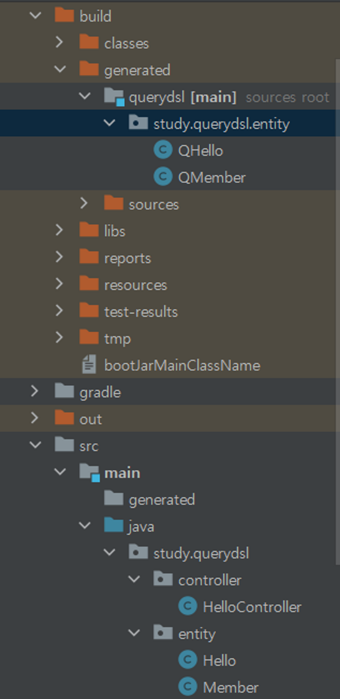

# 환경 설정
## Querydsl 설정과 검증

### build.gradle 세팅

```java
plugins {
	id 'org.springframework.boot' version '2.7.2'
	id 'io.spring.dependency-management' version '1.0.12.RELEASE'
	id 'java'

	//querydsl 추가
	id "com.ewerk.gradle.plugins.querydsl" version "1.0.10"
}

group = 'study'
version = '0.0.1-SNAPSHOT'
sourceCompatibility = '11'

configurations {
	compileOnly {
		extendsFrom annotationProcessor
	}
}

repositories {
	mavenCentral()
}

dependencies {
	implementation 'org.springframework.boot:spring-boot-starter-data-jpa'
	implementation 'org.springframework.boot:spring-boot-starter-web'

	//querydsl 추가
	implementation 'com.querydsl:querydsl-jpa:5.0.0'
	implementation 'com.querydsl:querydsl-apt:5.0.0'

	compileOnly 'org.projectlombok:lombok'
	runtimeOnly 'com.h2database:h2'
	annotationProcessor 'org.projectlombok:lombok'
	testImplementation 'org.springframework.boot:spring-boot-starter-test'
}

test {
	useJUnitPlatform()
}

// querydsl 추가 시작
def querydslDir = "$buildDir/generated/querydsl"

querydsl {
	jpa = true
	querydslSourcesDir = querydslDir
}

sourceSets {
	main.java.srcDir querydslDir
}

configurations {
	compileOnly {
		extendsFrom annotationProcessor
	}
	querydsl.extendsFrom compileClasspath
}

compileQuerydsl {
	options.annotationProcessorPath = configurations.querydsl
}
// querydsl 추가 끝
```
### Q타입 생성

- 먼저 엔티티를 만든다.

```java
@Entity
@Getter
public class Member {

	@Id
	@GeneratedValue
	private Long id;
}
```

- 엔티티를 생성한 상태에서 아래 명령어를 실행하면 `/build/genereted/querydsl` 디렉토리 하위에 프로덕션 패키지 구조와 똑같이 생긴 곳에 엔티티의 Q타입 객체가 생성된다.

 ```java
 ./gradlew clean compileQuerydsl
 ```

- 빌드를 해도 Q타입은 생긴다.

```java
./gradlew build
```

> 참고: Q타입은 컴파일 시점에 자동 생성되므로 버전 관리(GIT)에 포함하지 않는 것이 좋다. Q타입은 라이브러리가 만들어주는 코드기 때문에 버전이 올라가거나 하면 세부 코드가 달라질 수도 있다. 깃에 포함되어 있다면 이럴 대마다 커밋을 해야 한다.

앞서 설정에서 생성 위치를 gradle build 폴더 아래 생성되도록 했기 때문에 이 부분도 자연스럽게 해결된다. (대부분 gradle build 폴더를 git에 포함하지 않는다.)
>

### 테스트 해보기

```java
Hello hello = new Hello();
em.persist(hello);

JPAQueryFactory query = new JPAQueryFactory(em);
QHello qHello = QHello.hello;

Hello result = query
			.selectFrom(qHello)
			.fetchOne();

assertThat(result).isEqualTo(hello);
```
