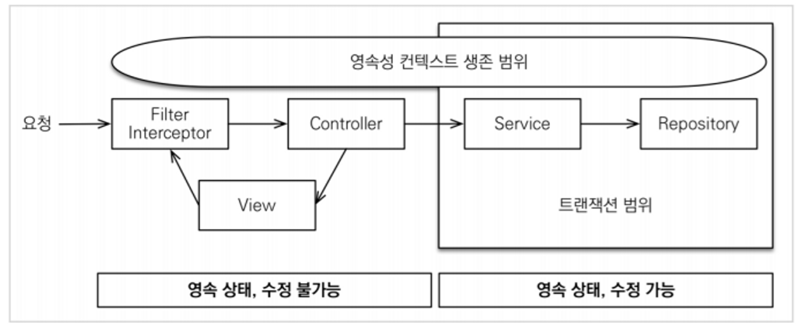
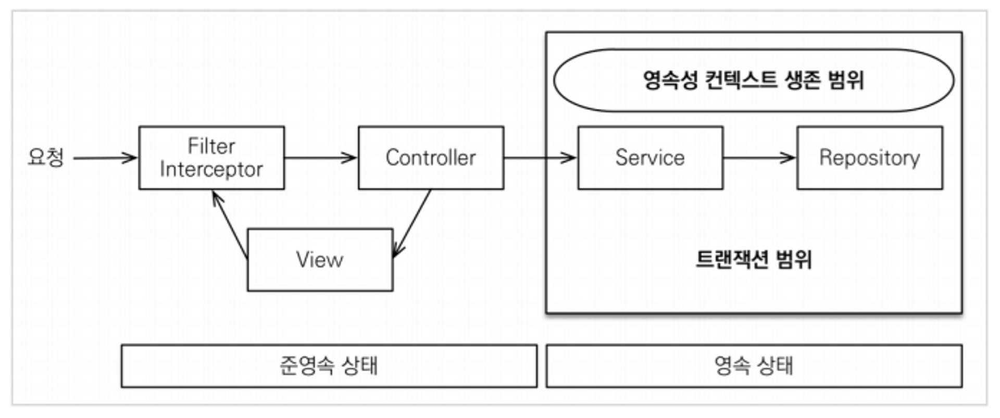

# jpa 활용편 정리
## 지연 로딩과 조회 성능 최적화 (XxxToOne 관계)

XxxToOne 관계에서 지연 로딩으로 인한 추가 쿼리로 성능이 느려질 수 있다.

엔티티를 DTO로 변환하거나, DTO로 바로 조회하는 두가지 방법은 각각 장단점이 있다. 둘중 상황에
따라서 더 나은 방법을 선택하면 된다. 엔티티로 조회하면 리포지토리 재사용성도 좋고, 개발도 단순해진다. 따라서 권장하는 방법은 다음과 같다.

### 쿼리 방식 선택 권장 순서

1. 우선 엔티티를 DTO로 변환하는 방법을 선택한다.
2. 필요하면 페치 조인으로 성능을 최적화 한다. 대부분의 성능 이슈가 해결된다.
3. 그래도 안되면 DTO로 직접 조회하는 방법을 사용한다.
4. 최후의 방법은 JPA가 제공하는 네이티브 SQL이나 스프링 JDBC Template을 사용해서 SQL을 직접 사용한다

## 컬렉션 조회 최적화 (XxxToMany 관계)

XxxToMany 관계에서는 지연 로딩 문제가 더 심각하게 발생한다.

### 페치 조인 사용

```java
"select distinct o from Order o" +
 " join fetch o.member m" +
 " join fetch o.delivery d" +
 " join fetch o.orderItems oi" +
 " join fetch oi.item i", Order.class)
```

- 페치 조인으로 SQL이 1번만 실행됨
- distinct를 사용한 이유는 1대다 조인이 있으므로 데이터베이스 row가 증가한다. 그 결과 같은 order 엔티티의 조회 수도 증가하게 된다. JPA의 distinct는 SQL에 distinct를 추가하고, 더해서 같은 엔티티가 조회되면, 애플리케이션에서 중복을 걸러준다. 이 예에서 order가 컬렉션 페치 조인 때문에 중복 조회 되는 것을 막아준다.
- 단점 - 페이징 불가능
    - 컬렉션을 페치 조인하면 일대다 조인이 발생하므로 데이터가 예측할 수 없이 증가한다.
    - 일대다에서 일(1)을 기준으로 페이징을 하는 것이 목적이다. 그런데 데이터는 다(N)를 기준으로 row가 생성된다.
    - Order를 기준으로 페이징 하고 싶은데, 다(N)인 OrderItem을 조인하면 OrderItem이 기준이
      되어버린다.

> 컬렉션 페치 조인을 사용하면 페이징이 불가능하다. 하이버네이트는 경고 로그를 남기면서 모든 데이터를 DB에서 읽어오고, 메모리에서 페이징 해버린다(매우 위험하다). 자세한 내용은 자바 ORM 표준 JPA 프로그래밍의 페치 조인 부분을 참고하자.
>

> 컬렉션 페치 조인은 1개만 사용할 수 있다. 컬렉션 둘 이상에 페치 조인을 사용하면 안된다. 데이터가 부정합하게 조회될 수 있다. 자세한 내용은 자바 ORM 표준 JPA 프로그래밍을 참고하자.
>

### 페이징과 한계 돌파

- 일단 ToOne 관계는 페치 조인해도 row 수를 증가시키지 않으므로 페이징에 영향을 주지 않는다.
- 컬렉션은 지연 로딩으로 초기화 한다.
- 지연 로딩 성능 최적화를 위해 hibernate.default_batch_fetch_size , @BatchSize 를 적용한다.
    - `hibernate.default_batch_fetch_size`: 글로벌 설정
    - `@BatchSize`: 개별 최적화
    - 이 옵션을 사용하면 컬렉션이나, 프록시 객체를 한꺼번에 설정한 size만큼 IN 쿼리로 조회한다
- 장점
    - 쿼리 호출 수가 1 + N → 1 + 1 로 최적화 된다.
    - 조인보다 DB 데이터 전송량이 최적화 된다. (Order와 OrderItem을 조인하면 Order가
      OrderItem 만큼 중복해서 조회된다. 이 방법은 각각 조회하므로 전송해야할 중복 데이터가 없다.)
    - 페치 조인 방식과 비교해서 쿼리 호출 수가 약간 증가하지만, DB 데이터 전송량이 감소한다
    - 컬렉션 페치 조인은 페이징이 불가능 하지만 이 방법은 페이징이 가능하다.
- 결론
- ToOne 관계는 페치 조인해도 페이징에 영향을 주지 않는다. 따라서 ToOne 관계는 페치조인으로
  쿼리 수를 줄이고 해결하고, 나머지는 `hibernate.default_batch_fetch_size`로 최적화 하자.

> 참고: `default_batch_fetch_size`의 크기는 적당한 사이즈를 골라야 하는데, 100~1000 사이를
선택하는 것을 권장한다. 이 전략을 SQL IN 절을 사용하는데, 데이터베이스에 따라 IN 절 파라미터를 1000으로 제한하기도 한다. 1000으로 잡으면 한번에 1000개를 DB에서 애플리케이션에 불러오므로 DB에 순간 부하가 증가할 수 있다. 하지만 애플리케이션은 100이든 1000이든 결국 전체 데이터를 로딩해야 하므로 메모리 사용량이 같다. 1000으로 설정하는 것이 성능상 가장 좋지만, 결국 DB든 애플리케이션이든 순간 부하를 어디까지 견딜 수 있는지로 결정하면 된다.
>

## OSIV와 성능 최적화

- Open Session In View: 하이버네이트
- Open EntityManager In View: JPA
- (관례상 OSIV라 한다.)

### OSIV ON

- spring.jpa.open-in-view : true 기본값
  - 최신 스프링은 애플리케이션을 시작할 때 WARN을 하나 띄운다.

```java
WARN 15064 ---[main] JpaBaseConfiguration$JpaWebConfiguration : spring.jpa.open-in-view is enabled by default. Therefore, database queries may be performed during view rendering. Explicitly configure spring.jpa.open-in-view to disable this warning
```

- OSIV 전략은 트랜잭션 시작처럼 최초 데이터베이스 커넥션 시작 시점부터 API 응답이 끝날 때 까지 영속성 컨텍스트와 데이터베이스 커넥션을 유지한다. 그래서 지금까지 View Template이나 API 컨트롤러에서 지연 로딩이 가능했던 것이다.
- 지연 로딩은 영속성 컨텍스트가 살아있어야 가능하고, 영속성 컨텍스트는 기본적으로 데이터베이스 커넥션을 유지한다. 이것 자체가 큰 장점이다.
- 그런데 이 전략은 너무 오랜시간동안 데이터베이스 커넥션 리소스를 사용하기 때문에, 실시간 트래픽이 중요한 애플리케이션에서는 커넥션이 모자랄 수 있다. 이것은 결국 장애로 이어진다.
  예를 들어서 컨트롤러에서 외부 API를 호출하면 외부 API 대기 시간 만큼 커넥션 리소스를 반환하지 못하고, 유지해야 한다.

### OSIV OFF

- spring.jpa.open-in-view: false OSIV 종료
  - OSIV를 끄면 트랜잭션을 종료할 때 영속성 컨텍스트를 닫고, 데이터베이스 커넥션도 반환한다. 따라서 커넥션 리소스를 낭비하지 않는다.
  - OSIV를 끄면 모든 지연 로딩을 트랜잭션 안에서 처리해야 한다. 따라서 지금까지 작성한 많은 지연 로딩 코드를 트랜잭션 안으로 넣어야 하는 단점이 있다.
  - 그리고 view template에서 지연 로딩이 동작하지 않는다. 결론적으로 트랜잭션이 끝나기 전에 지연 로딩을 강제로 호출해 두어야 한다

### 커멘드와 쿼리 분리

실무에서 OSIV를 끈 상태로 복잡성을 관리하는 좋은 방법이 있다. 바로 Command와 Query를 분리하는 것이다.

보통 비즈니스 로직은 특정 엔티티 몇게를 등록하거나 수정하는 것이므로 성능이 크게 문제가 되지 않는다.

그런데 복잡한 화면을 출력하기 위한 쿼리는 화면에 맞추어 성능을 최적화 하는 것이 중요하다. 하지만 그 복잡성에 비해 핵심 비즈니스에 큰 영향을 주는 것은 아니다.
그래서 크고 복잡한 애플리케이션을 개발한다면, 이 둘의 관심사를 명확하게 분리하는 선택은 유지보수 관점에서 충분히 의미 있다.
단순하게 설명해서 다음처럼 분리하는 것이다.

- OrderService
  - OrderService: 핵심 비즈니스 로직
  - OrderQueryService: 화면이나 API에 맞춘 서비스 (주로 읽기 전용 트랜잭션 사용)

> 참고: 필자는 고객 서비스의 실시간 API는 OSIV를 끄고, ADMIN 처럼 커넥션을 많이 사용하지 않는 곳에서는 OSIV를 켠다.
>
> 참고: OSIV에 관해 더 깊이 알고 싶으면 자바 ORM 표준 JPA 프로그래밍 13장 웹 애플리케이션과 영속성 관리를 참고하자.
>
