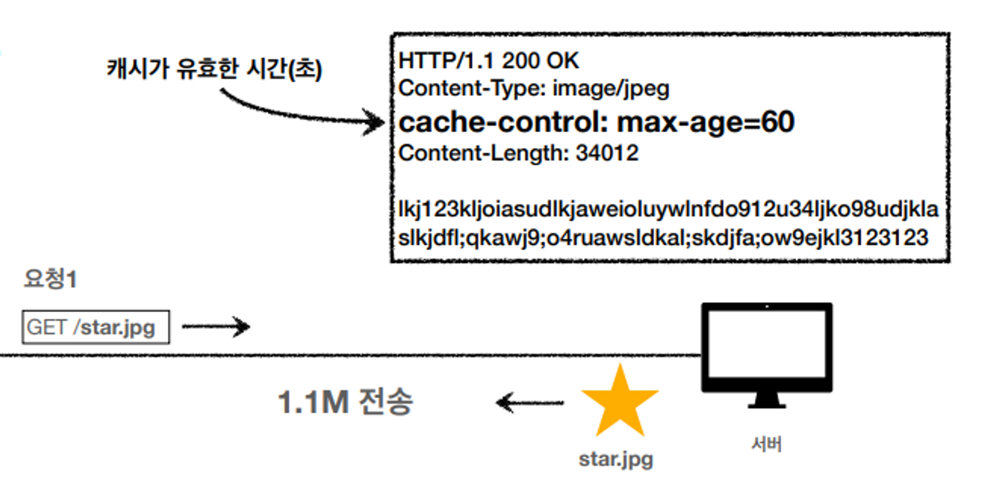
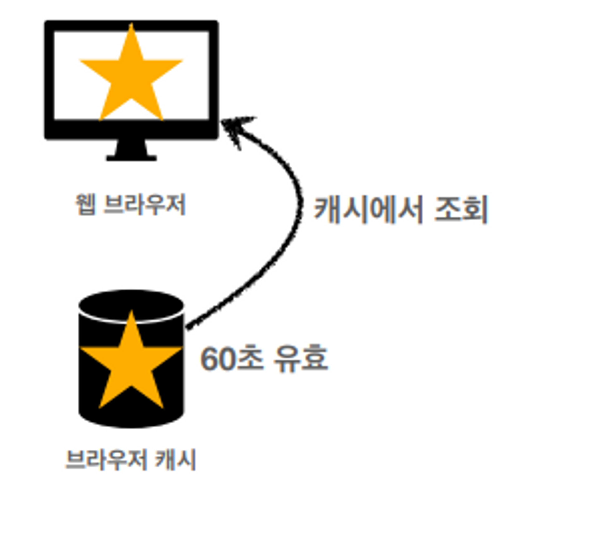
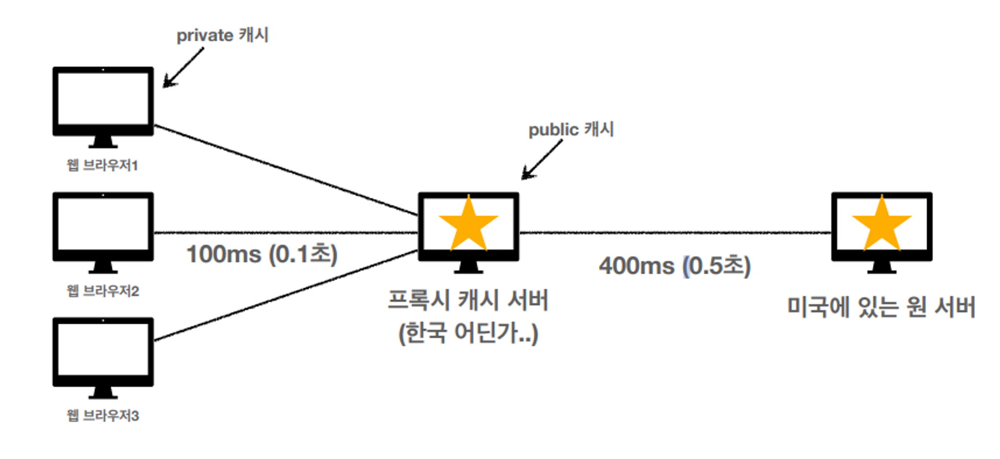

# HTTP 헤더 - 캐시와 조건부 요청

## 캐시가 없을 때

- 데이터가 변경되지 않아도 계속 네트워크를 통해서 데이터를 다운로드 받아야 한다.
- 인터넷 네트워크는 매우 느리고 비싸다.
- 브라우저 로딩 속도가 느리다.
- 느린 사용자 경험

## 캐시 적용

- cashe-control: max-age=60 (60초간 유지)
- 캐시에서 조회

- 캐시 유효 시간이 초과하면, 서버를 통해 데이터를 다시 조회하고, 캐시를 갱신한다.
- 이때 다시 네트워크 다운로드가 발생한다. (데이터가 똑같다면 다시 다운할 필요가 있을까?)

## 검증 헤더와 조건부 요청

### 검증 헤더

- 캐시 데이터와 서버 데이터가 같은지 검증하는 데이터
- Last-Modifed, ETag

### 조건부 요청 헤더

- 검증 헤더로 조건에 따른 분기
- If-Modifed-Since, Last_Modifed 사용
- If-None-Match, ETag 사용
- 조건이 만족하는 200 OK
- 조건이 만족하지 않으면 304 Not Modifed

## If-Modifed-Since, Last_Modifed
- **Last-Modified**: 2020년 11월 10일 10:00:00 (원래는 UTC 표기법 기입)
    - 데이터가 마지막에 수정된 시간
- 캐시 시간 초과가 되면 **if-modifed-since** 헤더에 응답으로 받았던 Last-Modified의 값을 넣어서 보낸다.
- 데이터가 수정되지 않았다면 **304 Not Modifed** 응답 코드를 보냄
- 그럼 캐시 데이터를 재사용하고, 헤더 데이터를 갱신한다.
- 결과적으로 네트워크 다운로드가 발생하지만 용량이 적은 헤더 정보만 다운로드
- **if-modifed-since** 이후 ****데이터가 수정되었으면?
    - 200 OK와 함께 모든 데이터 (Body 포함) 전송

### If-Modifed-Since, Last_Modifed 단점

- 1초 미만 단위로 캐시 조정이 불가능
- 날짜 기반의 로직 사용
- 데이터를 수정해서 날짜가 다르지만 같은 데이터를 수정해서 데이터 결과가 똑같은 경우
- 서버에서 별도의 캐시 로직을 관리하고 싶은 경우
    - 스페이스나 주석처럼 크게 영향이 없는 변경에서 캐시를 유지하고 싶은 경우

## ETag, If-None-Match

- Entity Tag
- 캐시용 데이터에 임의의 고유한 버전 이름을 달아둠
    - 예) ETag: “v1.0”
- 데이터가 변경되면 이 이름을 바꾸어서 변경 (Hash를 다시 생성)
- 단순히 ETag가 같으면 캐시를 재사용, 다르면 다시 다운로드
  **캐시 제어 로직을 서버에서 완전히 관리**

## 캐시 제어 헤더

### **Cache-Control**: 캐시 제어

- Cache-Control: max-age
    - 캐시 유효 시간, 초 단위
- Cache-Control: no-cache
    - 데이터는 캐시해도 되지만, 항상 오리진 서버에 검증하고 사용
- Cache-Control: no-store
    - 데이터에 민감한 정보가 있으므로 저장하면 안 됨
- Cache-Control: must-revalidate
    - 캐시 만료 후 최초 조회 시 원 서버에 검증해야 함
    - 원 서버 접근 실패 시 반드시 오류(504 Gateway Tiemeout)가 발생해야 함
    - must-revalidate는 캐시 유효 시간이라면 캐시를 사용함

## 프록시 캐시

- Cache-Control: public
    - 응답이 public 캐시에 저장되어도 됨
- Cache-Control: private
    - 응답이 해당 사용자만을 위한 것임, private 캐시에 저장해야 함(기본값)

## 캐시 무효화

- **Cache-Control: no-cache, no-store, must-revalidate**
    - 절대 캐시가 되지 않아야 할 정보에 위 3개를 다 넣기
- Pragma: no-cache
    - 옛날에 쓰던 건데 하위 호환성을 위해 추가하면 좋음
    - 옛날 브라우저에서도 요청할 수 있기 때문

### must-revalidate는 왜 필요?
**no-cache**
1. 캐시 서버 요청
2. 원 서버로의 순간 네트워크 단절
3. 원 서버에 접근할 수 없는 경우 캐시 서버 설정에 따라 캐시 데이터를 반환할 수 있음
4. 원 서버까지 통신을 못했지만 캐시된 데이터를 보여주면서 200 OK를 줄 수 있음

**must-revalidate**
1. 캐시 서버 요청
2. 원 서버로의 순간 네트워크 단절
3. 원 서버에 접근할 수 없는 경우 항상 오류가 발생
4. 504 Gateway Timeout 응답 전달
