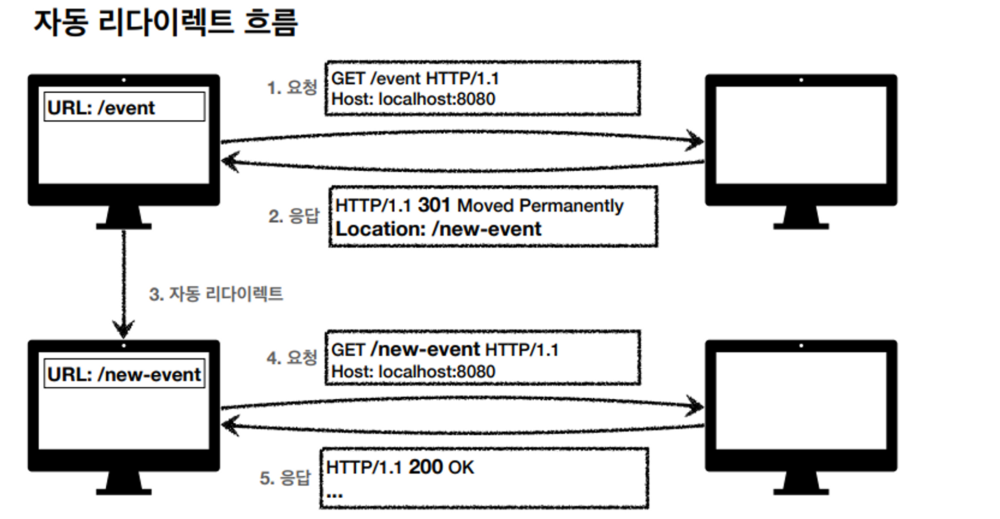

# HTTP 상태 코드
## 상태 코드

**클라이언트가 보낸 요청의 처리 상태를 응답에서 알려주는 기능**

- 1xx (Informational): 요청이 수신되어 처리중
- 2xx (Successful): 요청 정상 처리
- 3xx (Redirection): 요청을 완료하려면 추가 행동이 필요
- 4xx (Client Error): 클라이언트 오류, 잘못된 문법등으로 서버가 요청을 수행할 수 없음
- 5xx (Server Error): 서버 오류, 서버가 정상 요청을 처리하지 못함

### 만약 모르는 상태 코드가 나타나면?

- 클라이언트는 상위 상태 코드로 해석해서 처리
- 미래에 새로운 상태 코드가 추가되어도 클라이언트를 변경하지 않아도 됨

## 200 OK
**요청 성공**
## 201 Created
**요청 성공해서 새로운 리소스가 생성됨**

생성된 리소스는  응답의 Location 헤더 필드로 식별

## 202 Accepted

요청이 접수되었으나 처리가 완료되지 않았음

- 배치 처리 같은 곳에서 사용
- 예) 요청 접수 후 1시간 뒤에 배치 프로세스가 요청을 처리함

## 204 No Content

**서버가 요청을 성공적으로 수행했지만, 응답 페이로드 본문에 보낼 데이터가 없음**

- 예) 웹 문서 편집기에서 save 버튼
- save 버튼의 결과로 아무 내용이 없어도 된다.
- save 버튼을 눌러도 같은 화면을 유지해야 한다.
- 결과 내용이 없어도 204 메시지(2xx)만으로 성공을 인식할 수 있다.

## 리다이렉션의 이해

웹 브라우저는 3xx 응답의 결과에 Location 헤더가 있으면, Location 위치로 자동 이동 (리다이렉트)

### 자동 리다이렉트 흐름

1. 원래 사용하던 /event 페이지의 URI 경로가 /new-event로 변경되었다.
2. 기존의 URI를 북마크하던 사람이 있을 수도 있고 원래 URI를 알고 있는 많은 사람들이 있을텐데 그 사람들이 /event로 접속하면 /new-event로 리다이렉트 시킨다. (301 Moved Permanently)

### 리다이렉트 종류

- **영구 리다이렉션** - 특정 리소스의 URI가 영구적으로 이동
- **일시 리다이렉션** - 일시적인 변경
    - 주문 완료 후 주문 내역 화면으로 이동
    - PRG: Post/Redirect/Get
- **특수 리다이렉션**
    - 결과 대신 캐시를 사용

## 영구 리다이레션

### 301, 308

- 리소스의 URI가 영구적으로 이동
- 원래의 URL를 사용하지 않고 검색 엔진 등에서도 변경 인지
- **301 Moved Permanently**
    - **리다이렉트 시 요청 메서드가 GET으로 변하고, 본문이 제거될 수 있음**
- **308 Permanent Redirect**
    - 301과 기능은 같음
    - **리다이렉트 시 요청 메서드와 본문 유지 (처음 Post를 보니면 리다이렉트도 Post)**

### 영구 리다이렉션 - 301
1. 옛날 URI로 메시지 바디에 정보를 담아 POST를 보낸다.
2. 새로운 URI로 리다이렉트를 시키는 데 메시지 바디가 사라지고 GET 요청으로 변경한다.
3. 이벤트 참여 Form을 작성했었더라면 처음부터 다시 작성해야 한다.

### 영구 리다이렉션 - 308
1. 똑같은데 리다이렉트 시 본문을 유지한다.
2. 이벤트 참여가 등록이 된다.
- 이게 스펙이기 때문에 설명한 거지 실무에서는 거의 이렇게 안 한다.
- 일반적으로 URI가 바뀌면 내부적으로 전달해야 하는 데이터가 다 바뀐다.
- 때문에 POST로 와도 301로 GET으로 돌리는 게 낫다.
- 실무에서 308은 거의 못 봤다고 한다.

## 일시적인 리다이렉션

**302, 307, 303**

- 리소스의 URI가 일시적으로 변경
- 검색 엔진에서 URL 변경하면 안 됨
- **302 Found**
    - **리다이렉트 시 요청 메서드가 GET으로 변하고, 본문이 제거될 수 있음 (메서드도 본문도 변경이나 제거가 확실치 않음)**
    - 301이랑 똑같음
- **307 Temporary Redirect**
    - 302와 기능은 같음
    - **리다이렉트 시 요청 메서드와 본문 유지 (메서드를 변경하면 안 된다.)**
- **303 See Other**
    - 302와 기능은 같음
    - **리다이렉트 시 요청 메서드가 GET으로 변경**
    - 302와 다르게 무조건 GET으로 변경
- 정리
    - 302 - GET으로 변할 수 있음
    - 307 - 메서드가 변하면 안 됨
    - 303 - 메서드가 GET으로 변경
- 모호한 302 대신 307, 303을 권장하지만 많은 애플리케이션들이 이미 302를 기본값으로 사용
- 자동 리다이렉션 시에 GET으로 변해도 되면 302를 써도 문제는 없다.

## PRG: Post/Redirect/Get

- POST로 주문 후에 웹 브라우저를 새로고침하면?
- 새로고침은 다시 요청
- 중복 주문이 될 수 있다.

### PRG 사용 전
1. 주문 DB에 저장
2. 새로고침
3. 마지막 요청인 주문을 다시 한 번 DB에 저장

### PRG 사용 후
1. 주문 DB에 저장
2. GET으로 리다이렉트
3. 새로고침하면 마지막 요청인 GET 보냄
4. 주문 중복 저장 안 됨

물론 이런 중복 주문은 PRG로 만족할 게 아니라 서버에서 잘 막아야 한다. 상품  ID이런 걸로 중복 주문은 잘 거르자

## 기타 리다이렉션

**300, 304**

- 300 Multiple Choices: 안 쓴다.
- 304 Not Modified
    - 캐시 목적으로 사용
    - 클라이언트에게 리소스가 수정되지 않았음을 알려준다. 따라서 로컬 PC에 저장된 캐시를 재사용한다. (캐시로 리다이렉트)
    - 304 응답은 응답 메시지 바디를 포함하면 안 된다. (로컬 캐시를 사용해야 하므로)
    - 조건부 GET, HEAD 요청 시 사용

## 4xx, 5xx 오류 차이

- 4xx는 클라이언트 오류, 5xx는 서버 오류
- 4xx인 경우 같은 요청이 무조건 실패하지만 5xx는 나중에 복구될 수도 있다.

## 400 Bad Request

- 요청 구문, 메시지 등등 오류
- 클라이언트가 다시 요청을 검토하고 보내야 함
- 예) 요청 파라미터가 잘못되거나, API 스펙이 맞지 않을 때

## 401 Unauthorized

**클라이언트가 해당 리소스에 대한 인증이 필요함**

- 인증(Authentication) 되지 않음
- 401 오류 발생시 응답에 WWW-Authenticate 헤더와 함께 인증 방법을 설명
- 참고
    - 인증(Authentication): 본인이 누구인지 확인, (로그인)
    - 인가(Authorization): 권한부여 (ADMIN 권한처럼 특정 리소스에 접근할 수 있는 권한, 인증이 있어야 인가가 있음)
    - 오류 메시지가 Unauthorized 이지만 인증 되지 않음 (이름이 아쉬움)

## 403 Forbidden

**서버가 요청을 이해했지만 승인을 거부함**

- 주로 인증 자격 증명은 있지만, 접근 권한이 불충분한 경우
- 예) 어드민 등급이 아닌 사용자가 로그인은 했지만, 어드민 등급의 리소스에 접근하는 경우

## 404 Not Found

- 요청 리소스가 서버에 없음
- 또는 클라이언트가 권한이 부족한 리소스에 접근할 때 해당 리소스를 숨기고 싶을 때

## 500 Internal Server Error

**서버 문제로 오류 발생, 애매하면 500 오류**

- 서버 문제
- 애매하면 500 오류

## 503 Service Unavailable

**서비스 이용 불가**

- 서버가 일시적인 과부하 또는 예정된 작업으로 잠시 요청을 처리할 수 없음
- Retry-After 헤더 필드로 복구 시간 명시 가능
