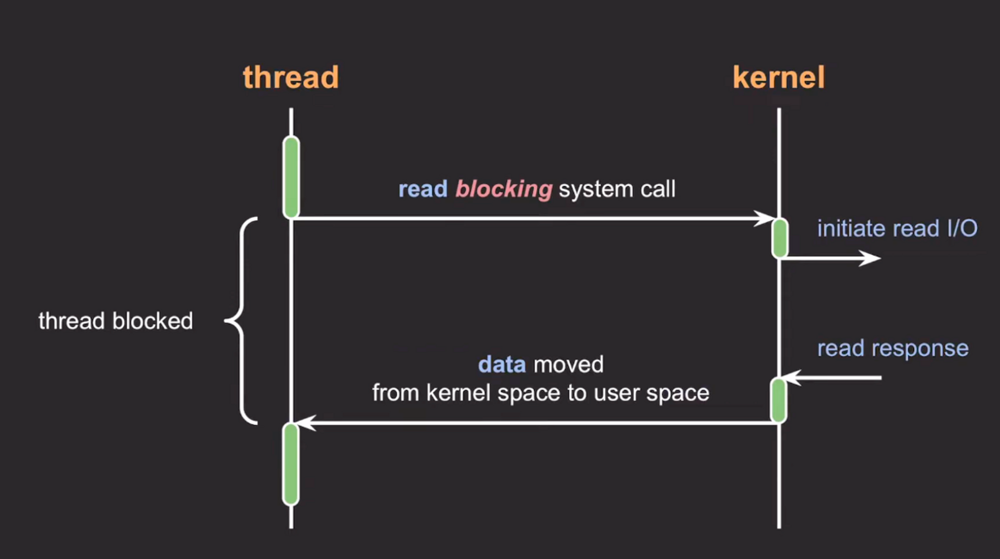
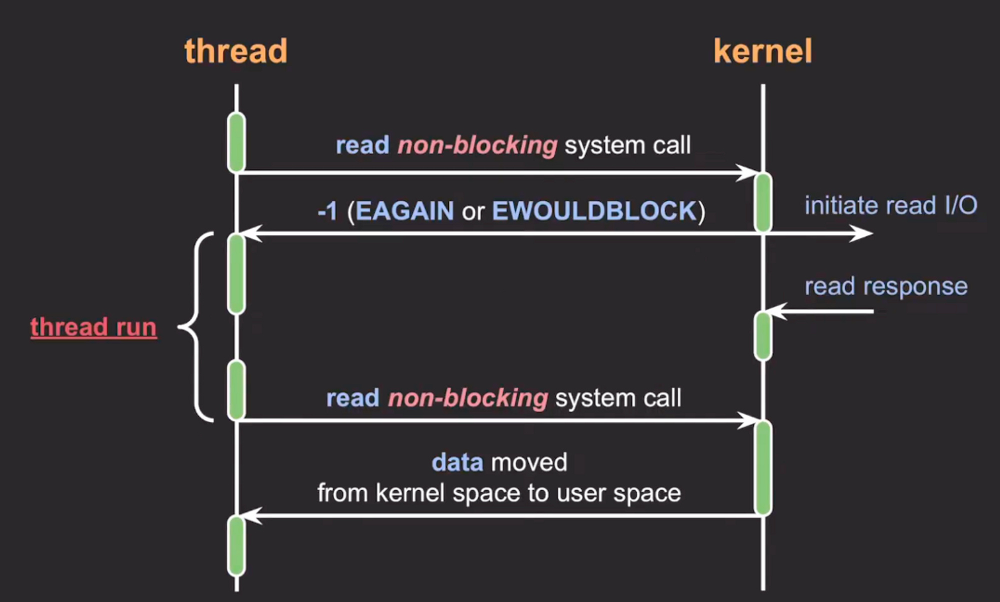
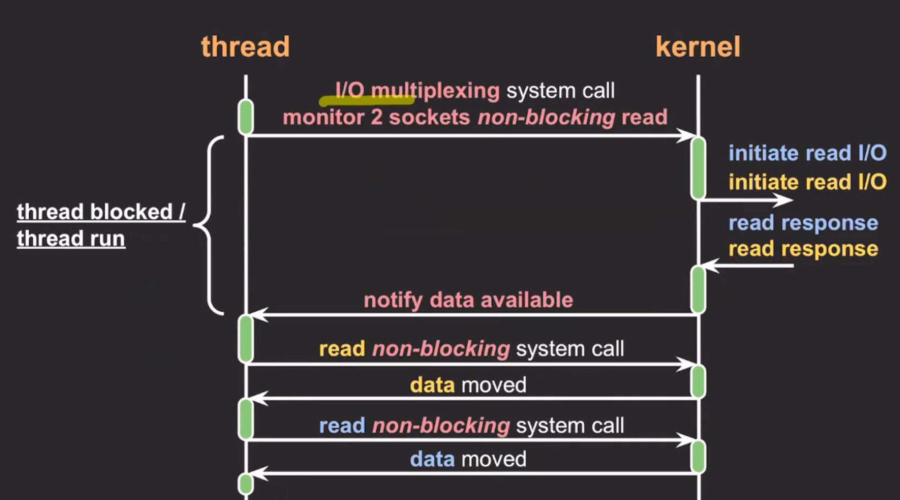

# Block I/O, Non-Block I/O
### I/O란

- I/O는 input/output의 약자로 데이터의 입출력을 의미
- I/O 종류
    - network (socket)
        - 네트워크 통신은 socket을 통해 데이터가 입출력된다.
    - file
    - pipe
    - device

## Block I/O

- I/O 작업을 요청한 프로세스/스레드는 요청이 완료될 때까지 블락
- I/O가 완료될 때가지 제어권을 커널이 갖고 있다.
- 스레드가 다른 작업을 수행하지 못 한다.

1. 스레드가 read라는 시스템 콜을 호출
2. 스레드는 블락 되고 커널 모드로 전환
3. 커널이 응답하면 스레드가 다시 데이터를 읽어 코드를 실행

### Socket

- socket에는 send_buffer와 recv_buffer가 존재한다.
- recv_buffer는 데이터가 소켓으로 들어오는 것을 담는다.
- send_buffer는 전송할 데이터를 담는다.

### Socket에서 block I/O란?

- 다른 socket으로부터 데이터를 받기 위해 read를 요청하면 recv_buffer에 데이터가 들어올 때까지 스레드는 블락된다.
- socket이 데이터를 보내려고 write를 요청하할 때 send_buffer가 가득 차 있으면 자리가 날 때까지 스레드는 블락된다.

## Non-Block I/O

- 프로세스/스레드를 블락시키지 않고 요청에 대한 현재 상태를 즉시 리턴
    - 스레드가 다른 작업을 이어 실행 가능
- 스레드는 다른 작업을 수행하다 중간중간 시스템 콜을 통해 I/O 완료 여부를 커널에 물어보게 된다.

1. read 시스템 콜을 하게 되면 커널이 read I/O를 실행하는데 바로 리턴한다.
2. 스레드가 블락되지 않고 동작을 수행한다.
3. 커널에서 데이터를 준비했다는 응답을 한다.
4. 스레드는 다시 한 번 read 시스템 콜을 호출하여 완료 여부를 확인 후 완료 되었다면 데이터를 받아온다.
5. 스레드가 작업을 마저 처리한다.

### Socket에서 non-block I/O란?

- read를 호출하고 recv_buffer에 데이터가 없으면 블락되지 않고 바로 리턴한다.
- write를 할 때도 send_buffer에 데이터가 가득 차 있어도 블락되지 않고 바로 리턴한다.

## Non-Block I/O 결과 처리 방식

### 완료 되었는지 반복적으로 확인

- 커널이 요청을 완료된 시간과 스레드가 완료를 확인한 시간 사이의 갭으로 인해 처리 속도가 느려질 수 있음
    - 커널의 read response와 스레드의 결과 확인 시간 차이의 갭
- CPU 낭비 발생

### I/O multiplexing

- 관심 있는 I/O 작업들을 동시에 모니터링하고 그 중에 완료된 I/O 작업들을 한 번에 알려주는 방식
- 네트워크 통신에 많이 사용

1. 2개의 socket에 대해 read 시스템 콜 요청
2. 스레드가 블락될 수도 안될 수도 있다.
3. 2개 socket에 모두 데이터가 들어오고 커널이 이를 스레드에 알린다.
4. 스레드는 순차적으로 데이터들을 읽어 socket들의 데이터를 처리한다.

---

[https://youtu.be/mb-QHxVfmcs](https://youtu.be/mb-QHxVfmcs)
