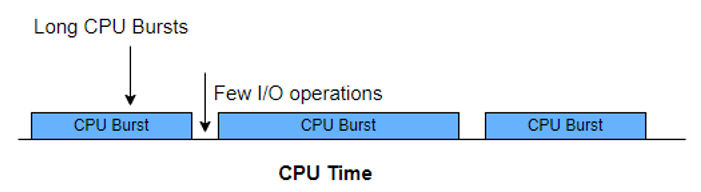
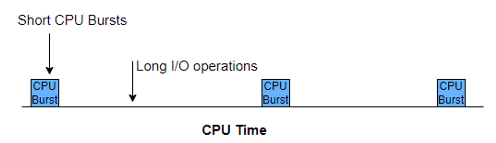

# CPU bound, IO bound
## CPU (central processing unit)

- 프로세스의 명령어를 해석하고 실행하는 장치

## IO (input/output)

- 파일을 읽고 쓰거나 네트워크 어딘가와 데이터를 주고 받는 것
- 입출력 장치와 데이터를 주거나 받는 것

## 버스트 (Burst)

- **버스트**(burst) - 어떤 현상이 짧은 시간 안에 집중적으로 일어나는 일
- **CPU 버스트**란 프로세스가 CPU에서 한 번에 연속적으로 실행되는 시간이다.
- **IO 버스트**란 프로세스가 IO 작업을 요청하고 결과를 기다리는 시간이다.
- 프로세스는 CPU 버스트와 IO 버스트가 반복적으로 바뀌며 실행된다.

## CPU bound 프로세스

- CPU burst가 많은 프로세스
- 프로세서(CPU)가 작업 실행의 대부분의 시간을 차지하고 다른 요소들은 적게 실행된다.
- 일반적으로 많은 계산이 필요한 애플리케이션을 예로 들 수 있다.
    - 예) 동영상 편집 프로그램, 머신러닝 프로그램
- 장점
    - CPU로 작업이나 프로그램을 빠르게 처리할 수 있다.
- 단점
    - CPU 외에 다른 리소스가 사용되지 않기 때문에 리소스 낭비를 가져올 수도 있다.
    - 높은 CPU 성능을 요구하기 때문에 비싸다.

### CPU bound 적정 스레드 수

- Goetz의 추천으로 적정 스레드 수는 `number of CPUs + 1`이라고 한다.
- 코어 수보다 스레드 수가 많은 경우 CPU 사용률이 큰 CPU bound 프로세스에선 컨텍스트 스위칭 비용을 무시할 수 없다. (CPU 낭비가 발생함)
    - T1 작업 → CS(컨텍스트 스위칭) → T2 작업 → CS → T1 작업 → CS …

## IO bound 프로세스

- IO burst가 많은 프로세스
- 프로그램의 실행이 입출력 시스템과 디스크 드라이브 등에 의존하는 경우
- 예) (일반적인) 백엔드 API 서버
    - HTTP 요청을 받고 DB에 요청을 해서 데이터를 가져온 뒤 적당히 가공하고 다시 HTTP로 응답을 보낸다.
    - 이 때 DB나 캐시 서버에 요청을 하는 것은 네트워크를 타는 IO 요청이고 이는 CPU에서 명령어 몇십 개 처리되는 것보다 오래 걸린다.
- CPU bound 프로세스 보다 느리다.
    - 입출력 시스템을 많이 사용하기 때문에 데이터를 쓰고 읽는 동안 CPU가 작업을 할 수 없다.

### IO bound 적정 스레드 수

- 여러 상황에 맞춰서 적절한 스레드 수를 찾아야 한다.

---

[https://www.youtube.com/watch?v=qnVKEwjG_gM](https://www.youtube.com/watch?v=qnVKEwjG_gM)

[https://www.baeldung.com/cs/cpu-io-bound](https://www.baeldung.com/cs/cpu-io-bound)
