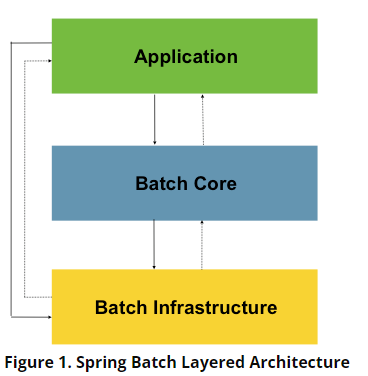

## [Spring Batch Introduction](https://docs.spring.io/spring-batch/docs/current/reference/html/spring-batch-intro.html#spring-batch-intro)

엔터프라이즈 도메인의 많은 애플리케이션들이 비즈니스 상황을 처리하기 위해 대용량 처리를 필요로하는 경우가 많다.

이러한 비즈니스 운영은 다음을 포함한다.

- 개발자의 상호작용 없이 자동적으로 복잡하고 큰 볼륨의 정보를 효율적으로 처리
    - 보통 time-based 이벤트인 경우가 많다. (하루에 한 번, 한 달에 한 번)
- 대용량 데이터를 반복적으로 처리해야 하는 복잡한 비즈니스 규칙을 가지는 애플리케이션
- 포매팅, 검증, 트랜잭션 처리 등이 필요한 내부 혹은 외부 시스템으로부터 받은 정보를 통합해야 하는 경우
    - 배치 프로세싱은 기업에서 매일 수십억 건의 트랜잭션을 처리하는 데 사용된다.

Spring Batch는 일반적으로 기대되는 Spring Framework의 특성을 기반으로 동작하기에 개발자가 쉽게 엑세스하고 활용할 수 있도록 지원한다.

Spring Batch는 스케줄링 프레임워크가 아니기 때문에 스케줄러와 함께 동작하여 사용된다.

Spring Batch는 로깅, 트랜잭션 관리, 작업 처리 통계, 작업 재시작, 건너 뛰기, 리소스 관리 등 대용량 코드 처리에 필수적인 재사용 가능한 기능을 제공한다. 또한 최적화 및 파티셔닝 기술로 대용량 및 고성능 배치 처리를 가능하게 한다.

Spring Batch는 단순한 작업(DB로부터 파일을 읽거나 저장)과 복잡하고 대용량 작업(DB 간의 데용량 데이터 이동, 변환 등) 모두에서 사용할 수 있다.

## [Usage Scenarios](https://docs.spring.io/spring-batch/docs/current/reference/html/spring-batch-intro.html#springBatchUsageScenarios)

- 데이터베이스, 파일 또는 큐에서 많은 양의 레코드 읽기
- 특정 방식으로 데이터 처리
- 변경된 방식으로 데이터를 다시 쓰기

Spring Batch는 이 기본 배치 반복을 자동화한다.

### 비즈니스 시나리오

- 주기적으로 배치 프로세스를 커밋
- 동시에 배치 프로세싱 - 작업을 병렬로 처리
- 단계적, 엔터프라이즈 message-driven 처리
- 대용량 배치 프로세싱
- 작업 실패 후 수동 또는 예정된 재시작
- 종속적인 단계에 대한 순차적인 처리 (workflow-driven 배치 기반의 확장)
- 부분 처리 - 레코드 스킵 (예를 들어 rollback)
- Whole-batch transaction, for cases with a small batch size or existing stored procedures/scripts

### 기술적 목표

- 배치 개발자는 스프링 프로그래밍 모델을 사용
    - 비즈니스 로직에 집중하고 인플는 프레임워크가 처리하도록 함
- 인프라, 배치 실행 환경 및 배치 애플리케이션의 관심사를 완벽히 분리
- 모든 프로젝트가 구현할 수 있도록 일반적이고 핵심적인 실행 인터페이스를 제공한다
- 즉시 사용할 수 있는 간단하고 기본적인 인터페이스의 구현을 제공한다.
- 모든 계층에서 스프링 프레임워크를 사용하여 쉽게 설정하고 커스텀 및 확장할 수 있다.
- 인프라 레이어에 영향을 주지 않고 모든 코어 서비스를 쉽게 대체하고 확장할 수 있다.
- JAR로 간단한 배포 모델을 제공한다.

## [Spring Batch Architecture](https://docs.spring.io/spring-batch/docs/current/reference/html/spring-batch-architecture.html#springBatchArchitecture)

Spring Batch는 다양한 end 유저 그룹을 염두에 두고 설계 되었다. 아래 그림은 엔드 유저 개발자의 확장성과 편의성을 지원하는 레이어 아키텍처를 보여준다.

이 레이어 아키텍처에서 다음의 세 가지 high-level 컴포넌트를 강조한다.

- **Application**
  - Spring Batch를 사용하는 개발자가 작성한 모든 batch job들과 코드를 포함
- **Batch Core**
  - batch job을 시작하고 제어하는 데 필요한 핵심 런타임 클래스가 포함되어 있다.
  - `JobLauncher`, `Job`, `Step`에 대한 구현이 포함
- 애플리케이션고 코어 모두 common 인프라 기반으로 구축된다.
- **Batch Infrastructure**
  - 애플리케이션 개발자와 코어 프레임워크 자체에 의해 사용되는 공통 readers와 writers 및 서비스를 포함한다. (`ItemReader` 및 `ItemWriter`)

## [General Batch Principles and Guidelines](https://docs.spring.io/spring-batch/docs/current/reference/html/spring-batch-architecture.html#springBatchArchitecture)

- 배치 아키텍처는 일반적으로 서비스 아키텍처에 영향을 미치고 반대도 마찬가지다. 배치와 서비스에 영향을 최소화할 수 있도록 구조와 환경에 맞게 디자인 해야 한다.
- 가능한 단순화하고 단일 배치 애플리케이션에서 복잡한 논리 구조를 구축하지 않도록 한다.
- 작업 처리와 물리적인 데이터 저장소를 가깝게 유지한다.
- 시스템 자원의 사용 특히 I/O를 최소화한다. 메모리 내부에서 많은 작업을 하도록 한다.
- 불필요한 물리 I/O를 피하기 위해 애플리케이션 I/O를 검토한다. (SQL) 특히 아래의 4가지 결함을 찾아야 한다.
  - 데이터를 한 번에 읽거나 작업 스토리지에 캐시, 보관할 수 있는데 매 트랜잭션마다 데이터를 읽는 경우
  - 동일한 트랜잭션에서 이미 읽은 데이터를 읽는 경우
  - 불필요한 테이블, 인덱스 스캔을 유발하는 경우
  - SQL where 문에 조건을 명시하지 않는 경우
- 배치 작업을 두 번 실행하지 말자
- 프로세스 중에 시간이 많이 걸리는 재할당을 피하기 위해 배치 시작 시점에 충분한 메모리를 ㅎ라당한다.
- 데이터 무결성과 관련하여 항상 최악의 경우를 가정해라. 적절한 검증 로직을 넣고 유효성 검사를 기록하여 데이터 무결성을 유지한다.
- 가능한 경우 내부 검증을 위한 체크섬을 구현한다.
- 현실적인 데이터 볼륨이 있는 프로덕션 환경에서 스트레스 테스트를 가능한 일찍 계획하고 실행한다.
- 대규모 배치 시스템에서는 백업이 어려울 수도 있다. 백업 절차를 수립하고 문서화와 정기적인 테스트를 수행할 필요가 있다.

## [Batch Processing Strategies](hhttps://docs.spring.io/spring-batch/docs/current/reference/html/spring-batch-architecture.html#batchProcessingStrategy)
