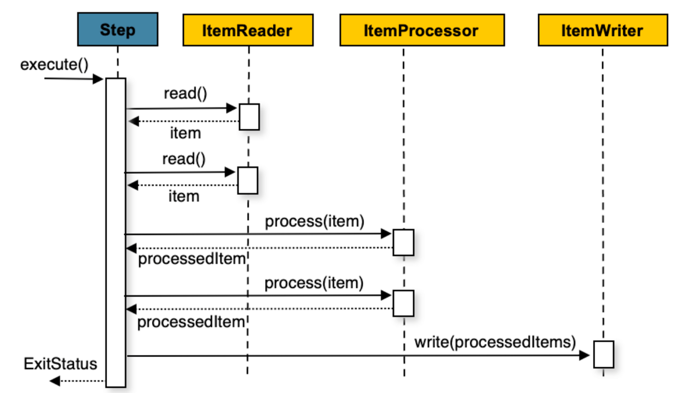

# Configuring a Step
`Step`은 개발자가 작성하기 나름이기 때문에 모호할 수 있다. 간단한 `Step`은 데이터를 DB나 파일에서 로드한 뒤 간단한 코드만 실행시키기도 한다. 더 복잡한 `Step`은 복잡한 비즈니스 규칙을 적용시키기도 한다.

## [Chunk-oriented Processing](https://docs.spring.io/spring-batch/docs/current/reference/html/step.html#chunkOrientedProcessing)


- 스프링 배치는 일반적으로 “Chunk-oriented’ 프로세싱 스타일을 사용한다.
- Chunk-oriented 처리는 트랜잭션 경계 내에서 쓰기 작업을 할 ‘청크’를 한 번에 하나씩 읽어오며 생성하는 것을 말한다.
- 읽은 데이터 수가 ‘커밋 간격’과 같으면 전체 청크가 `ItemWriter`에 의해 기록된 다음 트랜잭션이 커밋된다.
- 위 단계를 수도 코드로 나타내면 다음과 같다.
- chunk-oriented step을 구성하면서 `ItemProcessor`를 추가하여 ItemWriter가 데이터를 쓰기 전에 특정 처리를 할 수도 있다.

## [Configuring a Step](https://docs.spring.io/spring-batch/docs/current/reference/html/step.html#configuringAStep)

Java configuration을 사용하면 Spring Batch builder를 사용하여 `Step`을 설정할 수 있다.

```java
// JobRepository는 일반적으로 빈 설정 되어 있어 주입 받을 수 있기에 외부 설정이 필요없다.
@Bean
public Job sampleJob(JobRepository jobRepository, Step sampleStep) {
        return new JobBuilder("sampleJob", jobRepository)
        .start(sampleStep)
        .build();
        }

@Bean
public Step sampleStep(JobRepository jobRepository, PlatformTransactionManager transactionManager) {
        return new StepBuilder("sampleStep", jobRepository)
        .<String, String>chunk(10, transactionManager)
        .reader(itemReader())
        .writer(itemWriter())
        .build();
        }
```

## [Ingeriting from a Parent Step](https://docs.spring.io/spring-batch/docs/current/reference/html/step.html#InheritingFromParentStep)

- `Step`들이 비슷한 설정을 공유하는 경우 ‘parent’ `Step`을 정의할 수 있다.
- 자바의 상속과 유사하게 자식 `Step`은 부모의 속성, 요소와 결합된다.
  - 오버라이딩도 가능하다.

### [Abstract Step](https://docs.spring.io/spring-batch/docs/current/reference/html/step.html#abstractStep)

- 경우에 따라 완성된 `Step`이 아닌 추상 `Step`을 정의해야할 수도 있다.
  - ex) `reader`, `writer`, `tasklet` 속성이 Step 구성에서 제외되는 경우 초기화에 실패하지만 이 구성 없이 초기화시키고 싶을 수도 있다.
- `abstract` `Step`은 오직 확장될 수 있고 인스턴스화는 시키지 못한다.

## [The Commit Interval](https://docs.spring.io/spring-batch/docs/current/reference/html/step.html#commitInterval)

- `Step`은 `PlatformTransactionManager`를 사용하여 주기적으로 아이템을 읽고 쓴 뒤 커밋한다.
  - `commit-interval`이 1이면 개별 아이템을 쓴 후 커밋한다.
- 트랜잭션을 커밋하는 것은 비용이기 때문에 각 트랜잭션에서 가능한 많은 아이템을 처리하는 것이 바람직하다.
- 아래 설정에선 `commit-interval`이 10이기 때문에 10개씩 커밋을 하게 된다.

    ```java
    @Bean
    public Job sampleJob(JobRepository jobRepository) {
        return new JobBuilder("sampleJob", jobRepository)
                         .start(step1())
                         .build();
    }
    
    @Bean
    public Step step1(JobRepository jobRepository, PlatformTransactionManager transactionManager) {
    	return tnew StepBuilder("step1", jobRepository)
    				.<String, String>chunk(10, transactionManager)
    				.reader(itemReader())
    				.writer(itemWriter())
    				.build();
    }
    ```


## [Configuring a Step for Restart](https://docs.spring.io/spring-batch/docs/current/reference/html/step.html#stepRestart)

아래 설명은 모드 한 `JobInstance`에 해당하는 `Step`의 재시작 여부라고 생각하면 이해하기 쉽다.

### Setting a Start Limit

- `Step`을 시작하는 횟수를 제어하는 시나리오는 여러가지가 있다.
  - ex) 한 번만 실행하는 `Step`, 무한 실행 가능한 `Step`
- 아래 코드는 1번만 실행하게 하는 `Step` 설정이다.

    ```java
    @Bean
    public Step step1(JobRepository jobRepository, PlatformTransactionManager transactionManager) {
    	return tnew StepBuilder("step1", jobRepository)
    				.<String, String>chunk(10, transactionManager)
    				.reader(itemReader())
    				.writer(itemWriter())
    				.startLimit(1)
    				.build();
    }
    ```

  - 이 step을 다시 실행하려고 하면 `StartLimitExceededException`이 발생한다.
  - start-limit의 기본값은 `Integer.MAX_VALUE`이다.

### Restarting a Completed Step

- 처음 성공 여부에 관계 없이 앞으로도 항상 실행해야 하는 `Step`이 있다.
- 기본적으로 `Step`을 처리할 때 `COMOLETED` 상태는 스킵된다.
- allow-start-if-complete를 `true`로 오버라이딩하면 step이 항상 실행된다.

```java
@Bean
public Step step1(JobRepository jobRepository, PlatformTransactionManager transactionManager) {
	return tnew StepBuilder("step1", jobRepository)
				.<String, String>chunk(10, transactionManager)
				.reader(itemReader())
				.writer(itemWriter())
				.allowStartIfComplete(true)
				.build();
}
```

### [Step Restart Configuration Example](https://docs.spring.io/spring-batch/docs/current/reference/html/step.html#stepRestartExample)

## [Configuring Skip Logic](https://docs.spring.io/spring-batch/docs/current/reference/html/step.html#configuringSkip)

- 중간에 에러가 나도 `Step`을 실패로 처리하는게 아니라 무시하고 넘어가야할 때가 있다.
  - ex) 금융 데이터를 다룰 때 돈이 송금될 수 있으므로
- 아래 코드에선 `FlatFileParseException`이 발생하는 경우 실패 처리를 하지 않고 10번까지는 스킵하도록 설정했다.

    ```java
    @Bean
    public Step step1(JobRepository jobRepository, PlatformTransactionManager transactionManager) {
    	return tnew StepBuilder("step1", jobRepository)
    				.<String, String>chunk(10, transactionManager)
    				.reader(flatFileItemReader())
    				.writer(itemWriter())
    				.faultTolerant()
    				.skipLimit(10)
    				.skip(FlatFileParseException.class)
    				.build();
    }
    ```

  - 11번째 스킵은 예외를 발생시킨다.
- 아래 예제 코드는 모든 예외를 스킵하지만 `FileNotFoundException`만 예외로 실패 처리를 한 코드다.

    ```java
    @Bean
    public Step step1(JobRepository jobRepository, PlatformTransactionManager transactionManager) {
    	return tnew StepBuilder("step1", jobRepository)
    				.<String, String>chunk(10, transactionManager)
    				.reader(flatFileItemReader())
    				.writer(itemWriter())
    				.faultTolerant()
    				.skipLimit(10)
    				.skip(Exception.class)
    				.noSkip(FileNotFoundException.class)
    				.build();
    }
    ```


## [Configuring Retry Logic](https://docs.spring.io/spring-batch/docs/current/reference/html/step.html#retryLogic)

- 대부분의 배치 프로세스 중 예외를 만나면 스킵하거나 실패 처리를 하면 된다.
- 하지만 `DeadlockLoserDataAccessException`처럼 다시 시도해서 성공할 수도 있는 예외엔 재시도 처리를 할 수 있다.

    ```java
    @Bean
    public Step step1(JobRepository jobRepository, PlatformTransactionManager transactionManager) {
    	return new StepBuilder("step1", jobRepository)
    				.<String, String>chunk(2, transactionManager)
    				.reader(itemReader())
    				.writer(itemWriter())
    				.faultTolerant()
    				.retryLimit(3)
    				.retry(DeadlockLoserDataAccessException.class)
    				.build();
    }
    ```

  - 각 아이템을 재시도할 수 있는 횟수와 재시도 가능한 예외 리스트를 정의할 수 있다.

## [Controlling Rollback](https://docs.spring.io/spring-batch/docs/current/reference/html/step.html#controllingRollback)

- 기본적으로 `ItemWriter`에서 발생하는 모든 예외는 Step`에서` 처리되는 트랜잭션을 롤백시킨다.
  - 재시도 여부와 상관 없다.
  - skip 설정이 되어 있다면 `ItemReader`에서 발생한 예외는 롤백시키지 않는다.
- `ItemWriter`에서 예외가 발생해도 롤백시키고 싶지 않을 때 대상 예외들을 지정할 수 있다.

    ```java
    @Bean
    public Step step1(JobRepository jobRepository, PlatformTransactionManager transactionManager) {
    	return tnew StepBuilder("step1", jobRepository)
    				.<String, String>chunk(2, transactionManager)
    				.reader(itemReader())
    				.writer(itemWriter())
    				.faultTolerant()
    				.noRollback(ValidationException.class)
    				.build();
    }
    ```


### Transactional Readers

- `ItemReader`는 데이터를 읽을 때 기본적으로 앞에서 뒤로만 읽는다.
- `Step`은 데이터를 읽고 나면 버퍼에 넣어두기에 롤백 후 데이터를 다시 읽을 필요는 없다.
- 경우에 따라 step이 버퍼를 사용하지 않도록 설정할 수가 있다.

```java
@Bean
public Step step1(JobRepository jobRepository, PlatformTransactionManager transactionManager) {
	return tnew StepBuilder("step1", jobRepository)
				.<String, String>chunk(2, transactionManager)
				.reader(itemReader())
				.writer(itemWriter())
				.readerIsTransactionalQueue()
				.build();
}
```

## [Transaction Attributes](https://docs.spring.io/spring-batch/docs/current/reference/html/step.html#transactionAttributes)

- `Step`에서도 트랜잭션 격리와 전파, 그리고 타임아웃 설정을 할 수 있다.

```java
@Bean
public Step step1(JobRepository jobRepository, PlatformTransactionManager transactionManager) {
	DefaultTransactionAttribute attribute = new DefaultTransactionAttribute();
	attribute.setPropagationBehavior(Propagation.REQUIRED.value());
	attribute.setIsolationLevel(Isolation.DEFAULT.value());
	attribute.setTimeout(30);

	return new StepBuilder("step1", jobRepository)
				.<String, String>chunk(2, transactionManager)
				.reader(itemReader())
				.writer(itemWriter())
				.transactionAttribute(attribute)
				.build();
}
```

## [Registering ItemStream with a Step](https://docs.spring.io/spring-batch/docs/current/reference/html/step.html#registeringItemStreams)

- Step 생명 주기 동안 `ItemStream` 콜백을 처리해야 할 때가 있다.
  - `ItemStream`은 step이 실패 후 재시작하는 경우에 각 실행 상태에 대한 정보를 얻을 수 있는 인터페이스를 제공한다.
- `ItemStream` 인터페이스를 `ItemReader`, `ItemProcessor`, `ItemWriter` 중 하나로 구현하면 자동으로 등록된다.
- `Step`에 stream을 등록할 땐 아래와 같이 한다.

    ```java
    @Bean
    public Step step1(JobRepository jobRepository, PlatformTransactionManager transactionManager) {
    	return tnew StepBuilder("step1", jobRepository)
    				.<String, String>chunk(2, transactionManager)
    				.reader(itemReader())
    				.writer(compositeItemWriter())
    				.stream(fileItemWriter1())
    				.stream(fileItemWriter2())
    				.build();
    }
    
    /**
     * In Spring Batch 4, the CompositeItemWriter implements ItemStream so this isn't
     * necessary, but used for an example.
     */
    @Bean
    public CompositeItemWriter compositeItemWriter() {
    	List<ItemWriter> writers = new ArrayList<>(2);
    	writers.add(fileItemWriter1());
    	writers.add(fileItemWriter2());
    
    	CompositeItemWriter itemWriter = new CompositeItemWriter();
    
    	itemWriter.setDelegates(writers);
    
    	return itemWriter;
    }
    ```


## [Intercepting Step Execution](https://docs.spring.io/spring-batch/docs/current/reference/html/step.html#interceptingStepExecution)

- `Job`처럼 `Step`도 실행 중 발생한 이벤트를 별도로 처리할 때 `StepListener`를 사용할 수 있다.
- 모든 `StepListener`를 확장한 구현체는 `listener()` 메서드로 step에 등록할 수 있다.
  - 리스너는 step, tasklet, 청크 단위로 사용할 수 있다.
- 아래 예제는 청크 레벨로 리스너를 등록했다.

    ```java
    @Bean
    public Step step1(JobRepository jobRepository, PlatformTransactionManager transactionManager) {
    	return new StepBuilder("step1", jobRepository)
    				.<String, String>chunk(10, transactionManager)
    				.reader(reader())
    				.writer(writer())
    				.listener(chunkListener())
    				.build();
    }
    ```

- `StepListener`가 아니어도 어노테이션으로 같은 관심사를 처리할 수 있다.

### StepExecutionListener

- `Step` 성공 실패 여부와 상관 없이 시작 전과 완료 후에 작동한다.

```java
public interface StepExecutionListener extends StepListener {

    void beforeStep(StepExecution stepExecution);

    ExitStatus afterStep(StepExecution stepExecution);

}
```

- 위 인터페이스와 동일한 어노테이션
  - `@BeforeStep`
  - `@AfterStep`

### ChunkListener

- 청크는 트랜잭션 범위에서 처리하는 아이템 묶음이다.
- `ChunkListener`는 청크를 처리하기 전이나 후에 호출된다.

```java
public interface ChunkListener extends StepListener {

    void beforeChunk(ChunkContext context); // 청크 처리 전 호출
    void afterChunk(ChunkContext context); // 청크가 커밋된 후에만 호출
    void afterChunkError(ChunkContext context);

}
```

- 위 인터페이스와 동일한 어노테이션
  - `@BeforeChunk`
  - `@AfterChunk`
  - `@AfterCunkError`

### ItemReadListener

- 데이터를 읽기 실패한 경우 `ItemReadListener`로 로그를 남길 수 있다.

```java
public interface ItemReadListener<T> extends StepListener {

    void beforeRead();
    void afterRead(T item);
    void onReadError(Exception ex);

}
```

- 위 인터페이스와 동일한 어노테이션
  - `@BeforeRead`
  - `@AfterRead`
  - `@OnReadError`

### ItemProcessListener

- 아이템을 처리할 때도 리스너를 사용할 수 있다.

```java
public interface ItemProcessListener<T, S> extends StepListener {

    void beforeProcess(T item);
    void afterProcess(T item, S result);
    void onProcessError(T item, Exception e);

}
```

- 위 인터페이스와 동일한 어노테이션
  - `@BeforeProcess`
  - `@AfterProcess`
  - `@OnProcessError`

### ItemWriteListener

```java
public interface ItemWriteListener<S> extends StepListener {

    void beforeWrite(List<? extends S> items);
    void afterWrite(List<? extends S> items);
    void onWriteError(Exception exception, List<? extends S> items);

}
```

- 위 인터페이스와 동일한 어노테이션
  - `@BeforeWrite`
  - `@AfterWrite`
  - `@OnWriteError`

### SkipListener

- 스킵된 아이템을 추적하기 위한 인터페이스다.
  - `ItemReadListener`, `ItemProcessListener`, `ItemWriteListener` 모두 스킵된 경우엔 알려주지 않는다.

```java
public interface SkipListener<T,S> extends StepListener {

    void onSkipInRead(Throwable t); // 아이템을 읽는 동안 스킵될 대마다 호출
    void onSkipInProcess(T item, Throwable t);
    void onSkipInWrite(S item, Throwable t); // 쓰는 동안 스킵할 때 호출

}
```

- 위 인터페이스와 동일한 어노테이션
  - `@OnSkipInRead`
  - `@OnSkipInWrite`
  - `@OnSkipInProcess`
- 스킵된 아이템을 로깅할 때 가장 많이 쓰인다.
- 스킵된 이슈를 확인하고 수저하려면 다른 배치 프로세스나 수동 작업이 필요할 때가 있다.
- 기존 트랜잭션이 롤백되었다면 여러 이유가 있을 수 있는데 스프링 배치는 다음 두 가지를 보장한다.
  - 적절한 skip 메서드를 아이템마다 한 번만 호출한다.
  - `SkipListener`는 항상 트랜잭션 커밋 직전에 호출된다.
    - 따라서 `ItemWriter`에서 에러가 발생해도 리스너에서 호출하는 트랜잭션까지는 롤백되지 않는다.

## [TaskletStep](https://docs.spring.io/spring-batch/docs/current/reference/html/step.html#taskletStep)

- Chunk-oriented processing이외에도 `Step`을 처리할 수 있다.
  - `Step`이 stored procedure call로 구성될 때 `ItemReader`로 call을 구현하면 null을 반환할 수 있다.
  - 그럼 작업하지 않는 `ItemWriter`가 있어야 해서 부자연스럽다.
- `Tasklet` 인터페이스에는 `execute` 메서드가 하나  존재한다.
  - `TaskletStep`에 의해 반복 호출되는데 `RepeatStatus.FINISHED`가 반환되거나 예외가 발생할 때까지 호출한다.
  - 각 `Tasklet` 호출은 트랜잭션으로 감싸져 있다.
  - `Tasklet` 구현자는 stored procedure, 스크립트, SQL 문을 호출할 수 있다.

> `TaskletStep`이 `StepListener`를 구현하는 경우 자동으로 tasklet이 `StepListener`로 등록된다.
>

### TaskletAdapter

- `ItemReader` 및 `ItemWriter` 인터페이스의 다른 어댑터와 마찬가지로 `Tasklet` 인터페이스도 기존의 모든 클래스에 맞게 조정할 수 있는 `TaskletAdapter`가 존재한다.

```java
@Bean
public MethodInvokingTaskletAdapter myTasklet() {
	MethodInvokingTaskletAdapter adapter = new MethodInvokingTaskletAdapter();

	adapter.setTargetObject(fooDao());
	adapter.setTargetMethod("updateFoo");

	return adapter;
}
```

### Example Tasklet Implementation

- 많은 배치 작업이 주 처리를 시작하기 전에 다양한 리소스를 설정할 필요가 있다.
- 또한 처리 완료 후 해당 리소스를 정리해야 하는 단계도 포함되어 있다.
  - ex) 특정 파일을 성공적으로 업로드한 후 로컬에서 삭제하는 경우

```java
public class FileDeletingTasklet implements Tasklet, InitializingBean {

  private Resource directory;

  public RepeatStatus execute(StepContribution contribution,
                              ChunkContext chunkContext) throws Exception {
    File dir = directory.getFile();
    Assert.state(dir.isDirectory());

    File[] files = dir.listFiles();
    for (int i = 0; i < files.length; i++) {
      boolean deleted = files[i].delete();
      if (!deleted) {
        throw new UnexpectedJobExecutionException("Could not delete file " +
                files[i].getPath());
      }
    }
    return RepeatStatus.FINISHED;
  }

  public void setDirectoryResource(Resource directory) {
    this.directory = directory;
  }

  public void afterPropertiesSet() throws Exception {
    Assert.state(directory != null, "directory must be set");
  }
}
```

- 위 tasklet 구현은 지정된 디렉토리 내 모든 파일을 삭제한다.

```java
@Bean
public Job taskletJob(JobRepository jobRepository) {
        return new JobBuilder("taskletJob", jobRepository)
        .start(deleteFilesInDir())
        .build();
}

@Bean
public Step deleteFilesInDir(JobRepository jobRepository, PlatformTransactionManager transactionManager) {
        return new StepBuilder("deleteFilesInDir", jobRepository)
        .tasklet(fileDeletingTasklet(), transactionManager)
        .build();
}

@Bean
public FileDeletingTasklet fileDeletingTasklet() {
        FileDeletingTasklet tasklet = new FileDeletingTasklet();

        tasklet.setDirectoryResource(new FileSystemResource("target/test-outputs/test-dir"));

        return tasklet;
}
```
