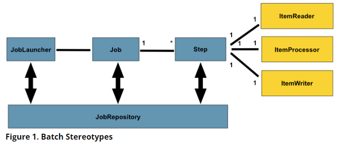
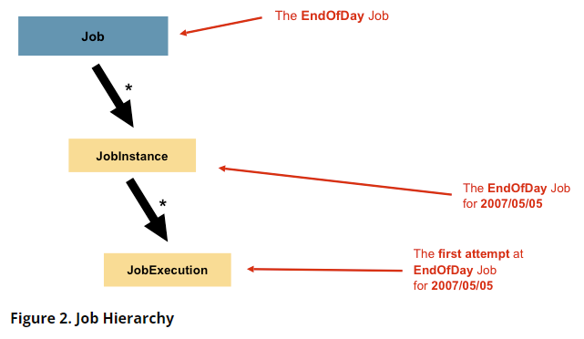
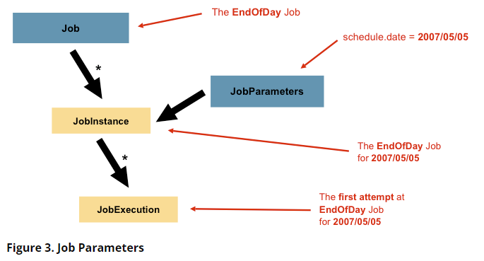
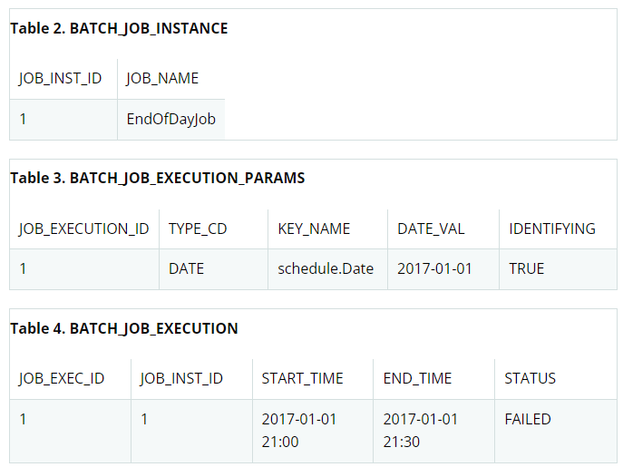
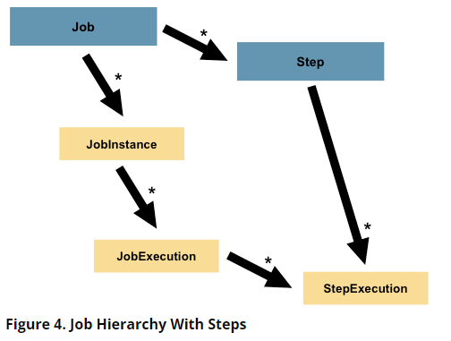

# ****[The Domain Language of Batch](https://docs.spring.io/spring-batch/docs/current/reference/html/domain.html#domainLanguageOfBatch)****

위 그림은 스프링 배치의 도메인 언어를 구성하는 주요 개념을 나타낸다. `Job`에는 여러 `Step`이 존재하며 각 Step에는 정확히 하나의 `ItemReader`, `ItemProcessor`, `ItemWriter`를 가진다. `JobLauncher`를 사용하여 작업을 시작하고 현재 실행 중인 프로세스에 대한 메타 데이터를 `JobRepository`에 저장한다.

## [Job](https://docs.spring.io/spring-batch/docs/current/reference/html/domain.html#job)

`Job`은 전체 배치 프로세스를 캡슐화하는 엔티티다. `Job`은 전체 계층의 최상단에 위치한다.


스프링 배치에서 `Job`은 간단히 말해서 `Step` 인스턴스의 컨테이너다. `Step`은 논리적인 결합이 있는 여러 단계로 이루어져 있고, 재시작 가능성과 같은 모든 `Step`에 대한 전역 속성을 구성할 수 있도록 한다.

`Job` 설정에는 다음을 포함한다.

- `Job`의 간단한 이름
- `Step` 인스턴스들의 순서 정의
- `Job`이 재시작할 수 있는지

java configuration을 사용하는 개발자를 위해 스프링 배치는 `Job` 인터페이스에 대한 기본 구현체 `SimpleJob`을 제공한다. 다음과 같이 빌더로 `Job`을 인스턴스화 해서 사용할 수 있다.

```java
@Bean
public Job footballJob() {
    return this.jobBuilderFactory.get("footballJob")
                     .start(playerLoad())
                     .next(gameLoad())
                     .next(playerSummarization())
                     .build();
}
```

## JobInstance

`JobInstance`는 논리적인 작업 실행의 개념을 나타낸다. Figure 2를 보면 EndOfDay라는 `Job`은 하나지만 실제로 실행되는 각 작업들은 개별적으로 추적 되어야 한다. 예를 들어 위 `Job`이 하루에 한 번 실행된다고 했을 때 어제의 작업과 오늘의 작업이 생긴다. 이 각각의 작업이 `JobInstance`다.

예를 들어 1월 1일 작업과 1월 2일 작업이 있다고 하자. 만약 1월 1일 작업이 첫 날에 실패하고 다음날 작업이 다시 실행된다고 하면 여전히 다시 1월 1일 `JobInstance`가 실행된다. 즉 `JobInstance`에는 여러 개의 실행(`JobExecution`)이 있을 수 있고 오직 한 `JobInstance`는 하나의 `Job`에 해당하고 `JobParameters`를 식별하는 하나의 `JobInstance`만 한 번에 실행할 수 있다.

`JobInstance`의 정의는 로드할 데이터와는 전혀 관련이 없다. 데이터가 로드되는 방식을 결정하는 것은 전적으로 `ItemReader` 구현에 달려 있다. 예를 들어 1월 1일 작업은 1일의 데이터를 로드하고, 1월 2일의 작업은 2일의 데이터를 로드한다면 `ItemReader`가 이를 결정하도록 구현을 해야 한다. 하지만 동일한 `JobInstance`를 사용하면 이전의 실행의 ‘상태’(`ExecutionContext`)가 사용 되는지 여부가 결정된다. 새 `JobInstance`를 실행한다는 것은 처음부터 시작한다는 것을 의미하고, 존재하는 `JobInstance`를 사용한다는 것은 멈춘 곳에서부터의 시작을 의미한다.

## JobParameters

`Job`과 `JobInstance`가 다른 것은 알았다. 그렇다면 각 `JobInstance`는 서로 어떻게 구별되는가? 정답은 `JobParameters`에 있다. `JobParameters`는 배치 작업을 시작하는 데 사용되는 매개 변수 집합을 가지고 있다.

1월 1일 인스턴스와 1월 2일 인스턴스 예를 생각해 보자. 두 인스턴스는 하나의 `Job`이지만 다른 `JobParameter`를 가지고 있다.(01-01-2017, 01-02-2017) 따라서 `JobInstance` = `Job` + `JobParameters`라는 공식이 성립한다.

## JobExecution

`JobExecution`은 `Job`을 실행시키는 데 있어 단일 시도의 기술적 개념을 뜻한다. 한 실행이 실패 혹은 성공으로 끝날 수도 있지만, 주어진 실행에 해당하는 `JobInstance`는 실행이 실패하면 완료되지 않은 것으로 간주된다. 이전에 예로 들었던 실패한 1월 1일 `JobInstance`를 생각해 보자. 만약 작업이 다시 실행된다면 같은 작업 매개변수로(01-01-2017) 작업이 실행 될 것이고, 새로운 `JobExecution`은 생기지만 여전히 `JobInstance`는 하나다.

**JobExecution Properties**

- `Status` - 배치 작업이 시작 됐는지, 실패했는지, 완료했는지
- `startTime` - 작업 시작 시간
- `endTime` - 작업 종료 시간 (성공, 실패 여부와 상관 없음)
- `exitStatus` - 실행 결과를 나타냄. 종료 코드가 포함되어 있기에 가장 중요.
- `createTime` - `JobExecution`이 저장된 시간. `JobExecution`이 아직 시작하지 않아서 startTime이 비어 있더라도 `createTime`은 존재한다.
- `lastUpdated` - `JobExecution`이 마지막으로 저장된 시간. 아직 시작하지 않았으면 비어 있다.
- `executionContext` - 작업들 사이에 저장될 필요가 있는 사용자 데이터를 포함하는 property bag
- `failuerExceptions` - `Job` 실행 중에 마주친 예외의 리스트.

이러한 속성은 지속되며 실행 상태를 확인하는 데 사용할 수 있기 때문에 중요하다. 예를 들어 01-01-2017 작업이 9시에 실행되고 9시 30분에 실패하는 경우 배치 메타 데이터 테이블에 다음 항목이 생성 된다.



## [Step](https://docs.spring.io/spring-batch/docs/current/reference/html/domain.html#step)

`Step`은 배치 작업의 순차적인 단계를 독립적으로 캡슐화한 도메인 객체다. 모든 Job은 하나 이상의 step들로 구성되어 있다. `Step`은 실제 배치를 진행하는 데 필요한 정의나 제어에 대한 모든 정보를 가지고 있다. `Step`은 Job을 작성하는 개발자 재량에 달려있기 때문에 이를 설명하는 것은 모호할 수 있다. `Step`은 복잡할 수도 간단할 수도 있다. (DB에서 데이터를 로드만 해서 코드가 필요하지 않을 수도 있다.) 또 복잡한 비즈니스 규칙을 위해 복잡한 Step을 구성해야할 수도 있다. `Job`처럼 `Step`도 개별 `StepExecution`이 존재한다.


## StepExecution

`StepExecution`은 `Step`의 한 실행 단위를 나타낸다. 새로운 `StepExecution`은 `Step`이 실행될 때마다 만들어진다. (JobExecution과 유사) 하지만 step이 실패한다면 이 실행은 지속되지 않는다. `StepExecution`이 생성되는 것은 실제로 `Step`이 시작될 때만 생성된다.

`Step`의 실행은 `StepExecution` 클래스로 표현된다. 각 execution은 해당 step과 `JobExecution` 그리고 데이터와 관련된 트랜잭션 관련 정보들이 포함된다. 또한 각 step execution에는 상태 정보와 같은 개발자가 배치 실행을 통해 유지해야 하는 모든 데이터가 포함되는 `ExecutionContext`를 가지고 있다.

[StepExecution Properties](https://docs.spring.io/spring-batch/docs/current/reference/html/domain.html#stepexecution)

### ExecutionContext

`ExecutionContext`는 개발자가 `StepExecution` 객체 또는 `JobExecution` 객체에 범위가 지정된 영구 상태를 저장할 수 있도록 프레임워크에 의해 영속되고 제어되는 키, 값 쌍의 모음을 나타낸다. 이를 설명하기 가장 좋은 예는 실패 재시작이다. 배치 실행 중 오류가 발생하더라도 `ItemReader`가 상태를 저장할 수 있다.

## [JobRepository](https://docs.spring.io/spring-batch/docs/current/reference/html/domain.html#jobrepository)

`JobRepository`는 위에서 언급한 모든 Stereotypes에 대한 영속 메커니즘이다. `JobLauncher`, `Job` 및 `Step` 구현을 위한 CRUD 작업을 제공한다. `Job`이 처음 실행되면, `JobExecution`은 repository에서 얻을 수 있고, 실행하는 동안 `StepExecution`과 `JobExecution` 구현은 repository에 전달 되어 영속된다.

Java configuration을 사용한다면 `@EnableBatchProcessing` 어노테이션을 통해 JobRepository를 자동으로 제공해준다.

## [JobLauncher](https://docs.spring.io/spring-batch/docs/current/reference/html/domain.html#joblauncher)

`JobLauncher`는 `JobParameters`를 전달 받은 Job 실행을 위한 간단한 인터페이스이다.

```java
public interface JobLauncher {

public JobExecution run(Job job, JobParameters jobParameters)
            throws JobExecutionAlreadyRunningException, JobRestartException,
                   JobInstanceAlreadyCompleteException, JobParametersInvalidException;
}
```

## Item Reader

`ItemReader`는 한 번에 하나의 아이템에 해당하는 Step의 인풋을 나타내는 추상화이다.

## Item Writer

`ItemWriter`는 한 번의 하나의 배치 또는 Step의 아웃풋을 나타내는 추상화다. 일반적으로 `ItemWriter`는 다음에 받아야 할 입력 정보를 모르고 현재 호출에서 전달된 항목에 대해서만 알고 있다.

## Item Processor

`ItemProcessor`는 아이템에 대한 비즈니스 프로세싱에 대한 추상화이다. ItemReader가 아이템을 읽고, ItemWriter가 그것들을 쓰는 동안 ItemProcessor는 다른 비즈니스 처리를 변환하거나 적용할 수 있는 엑세스 포인트를 제공한다. 아이템을 처리하는 동안 해당 아이템이 유효하지 않다고 판단되면 null을 반환하고 해당 아이템을 기록해서는 안 된다.
