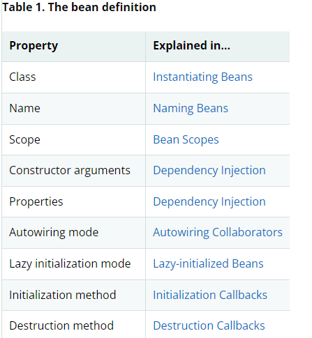

## ****[1.1. Introduction to the Spring IoC Container and Beans](https://docs.spring.io/spring-framework/docs/current/reference/html/core.html#beans-introduction)****

Ioc는 DI라고도 많이 알려져 있다.

DI는 객체가 자신의 의존 객체를 오직 생성자, 팩토리 메서드, setter를 통해 외부에서 주입 받는 것을 말한다.

컨테이너는 빈을 생성할 때 이러한 의존 관계들을 주입한다.

이는 빈이 직접 클래스 구성을 설정하여 의존을 구성하는 것이 아니기 때문에 빈의 입장에서 제어가 역전되었다고 볼 수 있다.

`org.springframework.beans`와 `org.springframework.context`는스프링 IoC 컨테이너의 기본 패키지이다.

`BeanFactory` 인터페이스는 어떤 타입의 객체든 관리할 수 있는 향상된 configuration 메커니즘을 제공한다.

`ApplicationContext`는 `BeanFactory`의 하위 타입이다. 여기에는

- 스프링 AOP와 간편한 통합
- 메시지 리소스 처리 (국제화에 사용)
- Event publication
- 웹 애플리케이션에 사용되는 `WebApplicationContext` 같은 Application-layer에 특화된 컨텍스트이다.

간단히 말해 `BeanFactory`는 Configuration 프레임워크와 기본 기능을 제공하며, `ApplicationContext`는 enterprise-specific 기능이 추가되었다.

`ApplicationContext`는 `BeanFactory`의 완전한 super-set

스프링에서 애플리케이션의 뼈대를 이루고, IoC 컨테이너에 관리되는 객체를 빈 (bean)이라고 부른다. 빈은 IoC 컨테이너에 의해 인스턴스화 되고, 조립되고, 관리된다.

반면 단순하게 표현하면 빈은 애플리케이션의 많은 객체 중 하나일 뿐이다.

빈, 그리고 그들의 의존 관계는 configuration에 반영되어 있고 이를 컨테이너가 사용한다.

## [1.2 Container Overview](https://docs.spring.io/spring-framework/docs/current/reference/html/core.html#beans-basics)

`org.springframework.context.ApplicationContext` 인터페이스는 스프링 IoC 컨테이너를 나타낸다.

컨테이너는 빈을 인스턴스화 하고, 설정하고, 조립할 책임이 있다.

컨테이너는 configuration 메타 데이터를 통해 어떤 객체를 인스턴스화 하고, 설정하고, 조립할지 지시 받는다.

configuration 메타 데이터는 XML, 자바 어노테이션, 자바 코드로 설정할 수 있다.

이를 통해 애플리케이션을 구성하는 객체와 객체의 상호 의존성을 풍부하게 표현할 수 있다.

`ApplicationContext`의 몇몇 구현체들은 스프링과 함께 제공된다.

stand-alone 애플리케이션에서는 `ClassPathXmlApplicationContext` 또는 `FileSystemXmlApplicationContext`의 인스턴스를 만드는 것이 일반적이다.

XML은 configuration 메타 데이터를 정의하는 전통 포맷이다.

하지만 추가적인 메타 데이터 설정을 선언적으로 활성화하기 위해  소량의 XML configuration을 제공하여 컨테이너에 자바 어노테이션 또는 코드를 메타 데이터 형식으로 사용하도록 지시할 수도 있다.

다음 그림은 스프링 환경을 추상화해서 보여준다.

1. 애플리케이션 클래스의 configuration 메타 데이터와 결합
2. `ApplicationContext` 생성 및 초기화
3. 시스템이나 애플리케이션이 완전히 조립되고 실행 가능한 상태가 됨


### [1.2.1 Configuration Metadata](https://docs.spring.io/spring-framework/docs/current/reference/html/core.html#beans-factory-metadata)

위 그림에서 보이듯이 컨테이너는 configuration 메타 데이터를 소비한다.

configuration 메타 데이터는 객체들을 어떻게 인스턴스화하고, 설정하고, 조립할지 스프링 컨테이너에게 개발자가 지시하는 방법을 나타낸다.

### [1.2.3 Using the Container](https://docs.spring.io/spring-framework/docs/current/reference/html/core.html#beans-factory-client)

`ApplicationContext` 는 여러 빈들과 그 의존성을 유지할 수 있는 고급 팩토리 인터페이스이다.

`T getBean(String name, Class<T> requiredType)`를 통해 빈 인스턴스를 찾을 수 있다.

```java
**ApplicationContext ac = new AnnotationConfigApplicationContext(AppConfig.class);
MemberService memberService = ac.getBean("memberService", MemberService.class);**
```

## [1.3 Bean Overview](https://docs.spring.io/spring-framework/docs/current/reference/html/core.html#beans-definition)

스프링 IoC 컨테이너는 하나 이상의 Bean들을 관리한다.

이 Bean들은 개발자가 컨테이너에게 제공한 configuration 메타 데이터로 생성된다.

컨테이너 자체 내에서 이러한 bean definition은 다음과 같은 메타 데이터를 포함하는 `BeanDefinition` 객체로 표현된다.

- package-qualified class name: 일반적으로, 정의된 bean의 실제 구현 클래스
- 컨테이너에서 bean이 어떻게 동작해야 하는지 나타내는 동작 구성 요소(scope, lifecycle, 콜백 등)
- bean과 bean 사이의 의존성 참조
- 새로 만든 객체에서 설정할 기타 구성 설정 (풀의 크기 제한 또는 커넥션 풀을 관리하는 bean이 사용할 커넥션 개수)

이 메타 데이터는 각 bean definition을 구성하는 속성(properties) 집합으로 변환된다.



### [1.3.1 Naming Beans](https://docs.spring.io/spring-framework/docs/current/reference/html/core.html#beans-beanname)

모든 빈에는 하나 이상의 식별자가 있다. 이 식별자는 컨테이너 안에서 유일해야 한다. 빈은 보통 단 하나의 식별자를 가진다. 하지만 둘 이상의 식별자가 필요한 경우에 추가적인 식별자를 별칭(aliases)으로 간주할 수 있다.

**Bean Naming Conventions:** 빈 이름에는 표준 Java 규칙을 사용하는 것이 관례다. 소문자로 시작하여 camel-cased을 사용한다. (ex accountManager, accountService) 또한 빈 이름을 일관되게 지정하면 구성을 더 쉽게 읽고 이해할 수 있다. 스프링 AOP를 사용하면 이름 별로 관련된 빈 집합에 advice를 적용할 때 많은 도움이 된다.

## [1.15 Additional Capabilities of the Application Context](https://docs.spring.io/spring-framework/docs/current/reference/html/core.html#context-introduction)

### [1.15.2 Standard and Custom Events](https://docs.spring.io/spring-framework/docs/current/reference/html/core.html#context-functionality-events)

`ApplicatoinContext`에서의 이벤트는 `ApplicationEvent` 클래스와 `ApplicationListener` 인터페이스에 의해 제공된다. `ApplicationListener` 인터페이스를 구현하는 빈이 컨텍스트에 배포되는 경우, `ApplicationEvent`가 `ApplicationContext`에 게시될 때마다 해당 빈에게 통지된다. 이는 옵저버 패턴의 기본이다.

> 스프링 4.2부터는 `ApplicationEvent` 클래스를 상속 받지 않고도 어노테이션 기반으로 이벤트 인프라를 사용할 수 있다. `(@EventListener)`
>

### Built-in Events

| Event | Explanation |
| --- | --- |
| ContextRefreshedEvent | ApplicationContext가 초기화되거나 refresh될 때 발행되는 이벤트다. 여기서 ‘초기화’란 모든 빈이 로드되고, post-processor 빈들이 감지 및 실행되고, 싱글톤이 사전 인스턴스화 된 뒤 ApplicationContext 객체가 사용할 준비가 되는 걸 말한다. 컨테이너가 닫히지 않는 한 refresh는 여러 번 호출될 수 있다. |
| ContextStartedEvent | ApplicationContext가 ConfigurableApplicationContext 인터페이스의 start() 메서드에 의해 시작될 때 발행되는 이벤트다.  ‘시작’이란 모든 빈의 라이프 사이클이 명시적인 시작 신호를 받았다는 뜻이다. 이 신호는 명시적 중지 후에 빈을 재시작하는 데 사용되지만 자동 시작으로 구성되지 않는 요소를 시작하는 데도 사용될 수 있다. |
| ContextStoppedEvent | ApplicationContext가 ConfigurableApplicationContext 인터페이스의 stop() 메서드에 의해 멈출 때발행되는 이벤트다. stop이란 모든 빈들의 생명 주기가 명시적인 stop 신호를 받았다는 뜻이며 start() 메서드에 의해 다시 시작될 수도 있다. |
| ContextClosedEvent | ApplicationContext가 ConfigurableApplicationContext 인터페이스의 close() 메서드에 의해 닫힐 때 발행되는 이벤트다. (또는 JVM shutdown hook에 의해 닫힐 때) 여기서 close란 모든 싱글톤 빈이 파괴되는 것을 의미한다. 한 번 컨테이너가 닫히면 다시는 refresh되거나 restart할 수 없다. |
| RequestHandledEvent | HTTP 요청이 처리되었음을 모든 빈에게 알리는 web-specific 이벤트다. 이벤트는 요청이 완료된 후 발행된다. 이 이벤트는 DispatcherServlet을 사용하는 웹 애플리케이션에만 적용된다. |
| ServletRequestHandledEvent | 서블릿 관련 컨텍스트 정보를 추가한 RequestHandledEvent의 서브 클래스 |

`ApplicationEvent` 클래스를 상속해서 커스텀 이벤트를 만들 수도 있다.

```java
public class BlockedListEvent extends ApplicationEvent {

    private final String address;
    private final String content;

    public BlockedListEvent(Object source, String address, String content) {
        super(source);
        this.address = address;
        this.content = content;
    }

    // accessor and other methods...
}
```

커스텀 이벤트를 발동시키기 위해선 `ApplicationEventPublisher`인터페이스의 `publishEvent()` 메서드를 호출해야 한다. 일반적으로 이는 `ApplicationEventPublisherAware` 인터페이스를 구현한 클래스를 스프링 빈으로 등록해서 수행할 수 있다.

```java
public class EmailService implements ApplicationEventPublisherAware {

    private List<String> blockedList;
    private ApplicationEventPublisher publisher;

    public void setBlockedList(List<String> blockedList) {
        this.blockedList = blockedList;
    }

    public void setApplicationEventPublisher(ApplicationEventPublisher publisher) {
        this.publisher = publisher;
    }

    public void sendEmail(String address, String content) {
        if (blockedList.contains(address)) {
            publisher.publishEvent(new BlockedListEvent(this, address, content));
            return;
        }
        // send email...
    }
}
```

빈을 구성할 때 스프링 컨테이너는 `ApplicationEventPublisherAware`를 구현한 `EmailService`를 감지하고 자동적으로 `setApplicationEventPublisher()`를 호출한다.

`ApplicationEvent`를 상속한 `BlockedListEvent`를 받기 위해선 `ApplicationListener`를 구현한 클래스를 빈으로 등록해야 한다.

```java
public class BlockedListNotifier implements ApplicationListener<BlockedListEvent> {

    private String notificationAddress;

    public void setNotificationAddress(String notificationAddress) {
        this.notificationAddress = notificationAddress;
    }

    public void onApplicationEvent(BlockedListEvent event) {
        // notify appropriate parties via notificationAddress...
    }
}
```

이 리스너는 우리가 만든 커스텀 이벤트를 제네릭 타입으로 받고 있다. 이는 커스텀 에빈트를 위한 `onApplicationEvent()` 메서드가 type-safe하며 로직 처리를 위해 다운 캐스팅할 필요가 없음을 보여준다. 이 방법으로 만든 이벤트 리스너를 등록할 수 있지만, 기본적으로 이벤트 리스너들은 이벤트들을 동기적으로 받아들인다. 즉 `publishEvent()` 메서드는 다른 모든 이벤트 리스너들이 작업을 끝마칠 때까지 실행이 block된다는 것을 의미한다. 이렇게 단일 스레드로 동기적으로 처리할 때의 이점으로 트랜잭션 컨텍스트 내에서 작동한다는 것이다.

### Annotation-based Event Listeners

이벤트 리스너를 `@EventListene`r 어노테이션으로 쉽게 등록할 수 있다.

```java
public class BlockedListNotifier {

    private String notificationAddress;

    public void setNotificationAddress(String notificationAddress) {
        this.notificationAddress = notificationAddress;
    }

    @EventListener
    public void processBlockedListEvent(BlockedListEvent event) {
        // notify appropriate parties via notificationAddress...
    }
}
```

이벤트를 수신하는 메서드에서 이벤트 유형을 다시 선언하는 데 이 경우 특정 리스너 인터페이스를 구현하지 않아도 된다.

만약 여러 이벤트를 다 받고 싶거나, 파라미터가 필요 없는 경우 아래와 같이 작성할 수도 있다.

```java
@EventListener({ContextStartedEvent.class, ContextRefreshedEvent.class})
public void handleContextStart() {
    // ...
}
```

또한 SpEL Expression을 사용하는 `condition` 속성으로 런타임 필터링을 추가할 수도 있다.

```java
@EventListener(condition = "#blEvent.content == 'my-event'")
public void processBlockedListEvent(BlockedListEvent blEvent) {
    // notify appropriate parties via notificationAddress...
}
```

만약 한 이벤트가 끝나고 다른 이벤트가 연속해서 실행되기를 원한다면 메서드의 반환 값으로 다른 이벤트 클래스를 반환하면 된다.

```java
@EventListener
public ListUpdateEvent handleBlockedListEvent(BlockedListEvent event) {
    // notify appropriate parties via notificationAddress and
    // then publish a ListUpdateEvent...
}
```

### Asynchronous Listeners

특정 리스너를 비동기적으로 처리하고 싶다면, `@Async` 어노테이션을 사용하면 된다.

```java
@EventListener
@Async
public void processBlockedListEvent(BlockedListEvent event) {
    // BlockedListEvent is processed in a separate thread
}
```

유의할 점

- 비동기로 처리되는 리스너에서 예외가 발생했을 때, 이 이벤트를 호출한 호출자에까지 예외가 전파되지 않는다. 자세한 내용은  `AsyncUncaughtExceptionHandler` 참고
- 비동기 이벤트 리스너는 리턴 값으로 새로운 이벤트를 발행하지 못 한다. 비동기 리스너에서 새로운 이벤트를 발행하고 싶다면 `ApplicationEventPublisher`를 주입 받아 처리하면 된다.

### Ordering Listeners

한 리스너가 다른 리스너 전 혹은 후에 꼭 실행시키고 싶다면 아래와 같이 할 수 있다.

```java
@EventListener
@Order(42)
public void processBlockedListEvent(BlockedListEvent event) {
    // notify appropriate parties via notificationAddress...
}
```

### Generic Events

제네릭을 사용하여 이벤트 구조를 추가적으로 정의할 수 있다. 아래의 커스텀 제네릭 이벤트를 사용해보자.

```java
@EventListener
public void onPersonCreated(EntityCreatedEvent<Person> event) {
    // ...
}
```

제네릭으로 인해 이벤트 리스너는 제네릭 타입까지 일치해야 작동한다.

특정 상황에서는 모든 사건이 동일한 구조를 따르는 경우(앞의 예에서와 같이) 상당히 지루할 수 있다. 이러한 경우 해결 가능을 구현할 수 있습니다.런타임 환경에서 제공하는 것보다 더 많은 프레임워크를 안내하려면 Provider를 입력하십시오. 다음 이벤트에서는 이 작업을 수행하는 방법을 보여 줍니다.

```java
public class EntityCreatedEvent<T> extends ApplicationEvent implements ResolvableTypeProvider {

    public EntityCreatedEvent(T entity) {
        super(entity);
    }

    @Override
    public ResolvableType getResolvableType() {
        return ResolvableType.forClassWithGenerics(getClass(), ResolvableType.forInstance(getSource()));
    }
}
```
