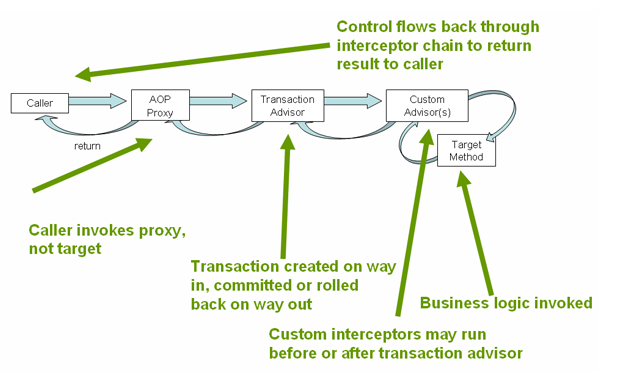
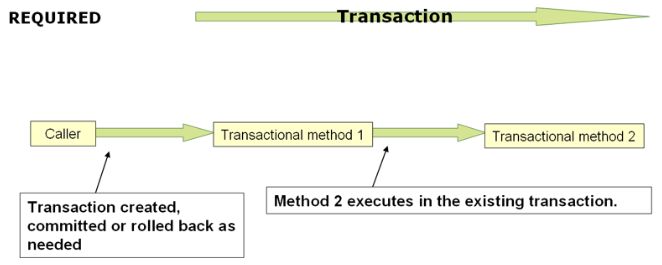
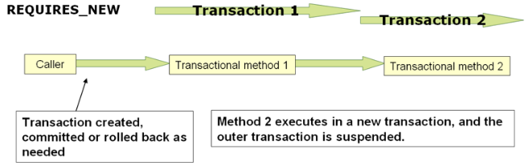

# [1. Transaction Management](https://docs.spring.io/spring-framework/docs/current/reference/html/data-access.html#transaction)

포괄적인 트랜잭션 지원은 스프링 프레임워크를 사용해야 하는 가장 설득력 있는 이유 중 하나다. 스프링은 트랜잭션 관리를 위한 일관된 추상화를 제공하고 다음과 같은 이점을 제공한다.

- Java Transaction API(JTA), JDBC, Hibernate 및 JPA 등 다양한 트랜잭션 API에 걸쳐 일관된 프로그래밍 모델이다.
- 선언적 트랜잭션 관리를 지원한다.
- JTA 같은 복잡한 API보다 단순한 프로그래밍 방식의 트랜잭션 관리를 지원한다.
- 스프링의 데이터 접근 추상화와 통합이 잘 되어 있다.

## [1.1 Spring Framework’s Transaction Support Model의 장점](https://docs.spring.io/spring-framework/docs/current/reference/html/data-access.html#transaction-motivation)

전통적인 Java EE 개발자들은 트랜잭션 관리를 위해 글로벌 트랜잭션과 로컬 트랜잭션을 사용할 수 있었다. 이 두 가지는 심각한 한계를 가지고 있다.

### 1.1.1 Global Transactions

글로벌 트랜잭션에서는 다양한 트랜잭션 리소스를 활용한다. (관계형 데이터베이스, 메시지 큐 등) 애플리케이션 서버는 JTA의 복잡한 API를 통해 트랜잭션을 관리하는데 이는 보통 JNDI에서 가져온다. JTA는 일반적으로 애플리케이션 서버 환경에서만 사용할 수 있어 애플리케이션 코드를 재사용하기 어렵다.

### 1.1.2 Local Transactions

로컬 트랜잭션은 사용하기 더 편리하긴 한데 여러 트랜잭션 리소스에서 사용할 수 없다. 예를 들어 JDBC connection을 사용하여 트랜잭션을 관리하는 코드는 글로벌 트랜잭션에서 실행할 수 없다. 애플리케이션 서버는 트랜잭션 관리에 관여하지 않아서 여러 리소스에 걸쳐 정확성을 보장할 수 없다. 또 로컬 트랜잭션이 프로그래밍 모델을 침범하는 단점이 있다.

### 1.1.3 Spring Framework’s Consistent  Programming Model

스프링을 사용하면 개발자는 모든 환경에서 일관된 프로그래밍 모델을 사용할 수 있다. 코드를 한 번 작성하면 여러 환경에서 서로 다른 트랜잭션 관리 전략을 통해 이점을 얻을 수 있다. 스프링은 선언적 트랜잭션 관리와 프로그래밍 방식 트랜잭션 관리를 모두 지원한다. 대부분 선언적 트랜잭션 관리를 선호하고 권장되기도 한다.

프로그래밍 방식으로 트랜잭션을 관리하면 개발자는 트랜잭션 인터페이스로 코드를 작성한다. (어떤 트랜잭션 인프라를 기반으로도 실행 가능한 인터페이스) 선언적 모델에선 개발자는 코드를 거의 작성하지 않는다.

## [1.2 ****Understanding the Spring Framework Transaction Abstraction****](https://docs.spring.io/spring-framework/docs/current/reference/html/data-access.html#transaction-strategies)

스프링 트랜잭션 추상화의 핵심은 트랜잭션 전략의 개념이다. 트랜잭션 전략은 `TransactionManager`에 의해 정의된다. (`TransactionManager`를 상속한 인터페이스로 명령형 트랜잭션 관리를 위한`PlatformTransactionManager`와 반응형 트랜잭션 관리를 위한 `ReactiveTransactionManager`가 있다.)

다음은 `PlatformTransactionManager` API이다.


```java
public interface PlatformTransactionManager extends TransactionManager {

    TransactionStatus getTransaction(TransactionDefinition definition) throws TransactionException;

    void commit(TransactionStatus status) throws TransactionException;

    void rollback(TransactionStatus status) throws TransactionException;
}
```

애플리케이션 코드에서 프로그래밍 방식으로 사용할 수 있지만 주로 SPI(Service Provider Interface)이다. `PlatformTransactionManager`는 인터페이스이기 때문에 필요에 따라 쉽게 mock이나 stub으로 사용할 수 있다. `PlatformTransactionManager`의 구현은 스프링 IoC 컨테이너의 다른 객체(빈)처럼 정의 된다.

스프링 철학에 따라 `TransactionException`은 `PlatformTransactionManager`의 모든 메서드에서 발생할 수 있는 unchecked 예외이다. 트랜잭션 인프라 장애는 거의 예외 없이 치명적이다. 애플리케이션 코드가 트랜잭션 실패에서 실제로 복구할 수 있는 드문 경우이지만, 개발자는 여전히 트랜잭션을 catch하여 처리할 수 있다. 두드러진 점은 개발자들이 그렇게 하도록 강요받지 않는다는 것이다.

`getTransaction(..)` 메서드는 `TransactionDefinition` 파라미터에 의존하여 `TransactionStatus`를 반환한다. 반환된 `TransactionStatus`는 새 트랜잭션이거나 일치하는 트랜잭션이 현재 호출 스택에 있는 경우 기존 트랜잭션일 수도 있다. 후자의 경우 Java EE 트랜잭션 컨텍스트와 마찬가지로 `TransactionStatus`는 실행 스레드와 연관된다.

The `TransactionDefinition` interface specifies:

- `Propagation`: 일반적으로 트랜잭션 범위 내의 모든 코드는 해당 트랜잭션에서 실행된다. 그러나 트랜잭션 컨텍스트가 이미 있을 때 트랜잭션 메서드가 실행되는 경우 동작을 지정할 수 있다. 예를 들어 기존 트랜잭션(일반적인 경우)에서 코드가 계속 실행되거나 기존 트랜잭션을 일시 중단하고 새 트랜잭션을 만들 수 있다.
- `Isolation`: 트랜잭션이 다른 트랜잭션 작업과 격리되는 정도이다. 예를 들어 한 트랜잭션이 커밋하지 않은 데이터 변경 내용을 다른 트랜잭션이 읽을 수 있는지 등의 수준을 결정한다.
- `Timeout`: 트랜잭션이 시간 초과되어 기본 트랜잭션 인프라에 의해 자동으로 롤백되기 전에 실행되는 시간이다.
- `Read-only`: 코드가 데이터를 읽지만 수정하지 않을 때 읽기 전용 트랜잭션을 실행할 수 있다. read-only 트랜잭션은 최적화가 필요한 경우 (Hibernate를 사용할 때)에 유용하다.

`TransactionStatus` 인터페이스는 트랜잭션 코드가 트랜잭션 실행 및 상태를 쿼리하는 간단한 방법을 제공한다. 이 개념은 모든 트랜잭션 API에 공통적이다.

```java
public interface TransactionStatus extends TransactionExecution, SavepointManager, Flushable {

    @Override
    boolean isNewTransaction();

    boolean hasSavepoint();

    @Override
    void setRollbackOnly();

    @Override
    boolean isRollbackOnly();

    void flush();

    @Override
    boolean isCompleted();
}
```

선언형 트랜잭션 관리를 사용하든 프로그래밍 트랜잭션 관리를 사용하든 올바른 `TransactionManager` 구현을 정의하는 것은 필수적이다. 일반적으로 DI를 통해 구현을 정의한다.

`TransactionManager` 구현에는 일반적으로 작동하는 환경에 대한 지식이 필요하다. (JDBC, JTA, Hibernate)

## ****[1.4. Declarative Transaction Management](https://docs.spring.io/spring-framework/docs/current/reference/html/data-access.html#transaction-declarative)****

> 스프링 사용자 대부분은 선언적 Transaction을 사용한다. 이 옵션은 애플리케이션 코드에 미치는 영향이 가장 적다.
>

### ****[1.4.1. Understanding the Spring Framework’s Declarative Transaction Implementation](https://docs.spring.io/spring-framework/docs/current/reference/html/data-access.html#tx-decl-explained)****

스프링 프레임워크의 선언적 트랜잭션 지원과 관련하여 파악해야 할 가장 중요한 개념은 이 지원이 **AOP 프록시를 통해 기능하고 트랜잭션 advice가 메타데이터에 의해 작동한다는 것이다**. (XML 또는 어노테이션 기반) AOP와 메타데이터의 조합은 트랜잭션을 사용하는 AOP 프록시를 생성한다.AOP 프록시는 적절한 `TransactionManager` 구현과 함께 `TransactionInterceptor`를 사용하여 메서드 호출에 대한 트랜잭션을 수행한다.

스프링의 `TransactionInterceptor`는 명령형 및 리액티브 프로그래밍 모델에 대한 트랜잭션 관리를 제공한다. 인터셉터는 메서드 반환 유형을 검사하여 트랜잭션 관리의 원하는 flavor를 감지한다. Publisher 또는 코틀린의 Flow와 같은 반응형을 반환하는 메서드는 reactive transaction management가 적합하다. void를 포함한 다른 모든 반환 유형은 imperative transaction management를 위해 코드 경로를 사용한다.

트랜잭션 관래 flavors는 어떤 트랜잭션 manager가 필요할지 결정한다. imperative 트랜잭션은 `PlatformTransactionManager`를, reactive 트랜잭션은 `ReactiveTransactionManager`가 필요하다.



### [1.4.6 Using `@Transactional`](https://docs.spring.io/spring-framework/docs/current/reference/html/data-access.html#transaction-declarative-annotations)

```java
// the service class that we want to make transactional
@Transactional
public class DefaultFooService implements FooService {

    @Override
    public Foo getFoo(String fooName) {
        // ...
    }

    @Override
    public Foo getFoo(String fooName, String barName) {
        // ...
    }

    @Override
    public void insertFoo(Foo foo) {
        // ...
    }

    @Override
    public void updateFoo(Foo foo) {
        // ...
    }
}
```

위와 같이 클래스 수준에서 어노테이션을 선언하면 하위 메서드 전체에 다 적용된다. 각 메서드에 개별적으로 어노테이션을 적용할 수도 있다.

### [Method visibility and @Transactional](https://docs.spring.io/spring-framework/docs/current/reference/html/data-access.html#transaction-declarative-annotations-method-visibility)

스프링 기본 설정으로 트랜잭션 프록시를 사용하려면 `@Transactional` 어노테이션을 `public` 메서드에만 사용해야 한다. 만약 `private`, `protected` 또는 package-visible 메서드에 붙인다면 예외는 발생하지 않지만 **트랜잭션 세팅이 일어나지 않는다.**

### [1.4.7 Transaction Propagation](https://docs.spring.io/spring-framework/docs/current/reference/html/data-access.html#tx-propagation)

이 섹션은 트랜잭션 전파에 대한 적절한 소개는 아니다. 오히려 Spring에서의 트랜잭션 전파에 관련된 내용을 살명한다.

Spring-managed transaction의 경우 물리적 트랜잭션과 논리적 트랜잭션의 차이와 이 차이에 전파 설정이 적용되는 방법에 유의하면 된다.

### PROPAGATION_REQUIRED



PROPAGATION_REQUIRED는 트랜잭션이 아직 존재하지 않는 경우 현재 범위에 대해 로컬 또는 더 큰 범위에 정의된 기존 ‘외부’ 트랜잭션에 참여하도록 물리적 트랜잭션을 적용한다.

이는 동일한 스레드 내에 일반적인 콜 스택에 적용되는 기본 값이다. (예를 들어 XXXService가 XXXRepository를 호출할 때 Service 계층에서 트랜잭션을 시작하면 Repository 계층 메서드들이 이 트랜잭션에 참여)

> 기본적으로 참여하는 트랜잭션은 기존 트랜잭션의 특징이 적용된다. (참여 트랜잭션 자신의 격리 레벨, timeout 설정, read-only 설정은 무시되고 기존 트랜잭션 특징이 적용됨)

기존 트랜잭션의 격리 레벨과는 다른 격리 레벨을 참여 트랜잭션에 적요시키고 싶다면 `validateExistingTransactions` flag를 `true`로 하면 된다.
>

PROPAGATION_REQUIRED로 전파 레벨이 설정되면 설정된 각 메서드에 대해 논리적 트랜잭션 범위가 생성된다. 각 논리적 트랜잭션 범위는 개별적으로 rollback-only 설정을 줄 수 있으며 외부 트랜잭션 범위는 내부 트랜잭션 범위와 논리적으로 독립적이다. 표준 PROPAGATION_REQUIRED 동작의 경우 이 모든 범위가 같은 물리적 트랜잭션에 매핑된다. 따라서 내부 트랜잭션 범위에 있는 rollback-only 마커는 외부 트랜잭션이 실제로 커밋할 수 있는 기회에 영향을 미친다.

하지만 내부 트랜잭션 범위가 rollback-only 마커를 설정하는 경우 외부 트랜잭션이 본인이 롤백을 결정하지 않았으므로 이는 예기치 않은 롤백이다. `UnexpectedRollbackException`이 그 지점에서 던져진다. 이는 예상된 동작이므로 트랜잭션 호출자가 실제로 커밋되지 않은 작업을 커밋되었다고 잘못 추정할 일이 없다. 그래서 만약 내부 트랜잭션이 트랜잭션을 rollback-only로 설정한 경우 외부 호출자는 커밋을 여전히 호출하려고 한다. 외부 호출자는 커밋이 아닌 롤백을 위해 `UnexpectedRollbackException`을 수신 받아야 한다.

### PROPAGATION_REQUIRES_NEW



PROPAGATION_REQUIRES_NEW는 영향을 받는 내부 트랜잭션들이 항상 독립적인 물리적 트랜잭션을 사용하며 외부 범위에 대한 기존 트랜잭션에는 참여하지 않는다. 이 설정에서는 외부 트랜잭션이 내부 트랜잭션의 롤백 상태에 영향을 받지 않고 내부 트랜잭션의 완료 즉시 락이 해제되어 독립적으로 커밋하거나 롤백할 수 있다. 이러한 독립적인 내부 트랜잭션은 자체 격리 레벨, timeout, read-only를 설정할 수 있고 외부 트랜잭션 특성을 상속하지 않는다.

### PROPAGATION_NESTED

롤백할 수 있는 여러 지점(save point)을 가지고 있는 단일 물리적 트랜잭션을 사용한다. 롤백을 통해 내부 트랜잭션 범위가 해당 범위에 대한 롤백을 트리거할 수 있고 외부 트랜잭션은 일부 작업이 롤백 되었지만 물리적 트랜잭션을 계속할 수 있다. 이 설정은 일반적으로 JDBC savepoint에 매핑되므로 JDBC resource transaction에서만 작동한다.

## [1.7 Transaction-bound Events](https://docs.spring.io/spring-framework/docs/current/reference/html/data-access.html#transaction-event)

스프링 4.2부터 이벤트 리스너는 트랜잭션 페이즈에 참여할 수 있다. 일반적인 예는 트랜잭션이 성공적으로 완료되었을 때 이벤트를 처리하는 것이다. 이렇게 하면 현재 트랜잭션의 결과가 이벤트 리스너에게 중요할 때 이벤트를 보다 유연하게 사용할 수 있다.

`@EventListener` 어노테이션으로 이벤트를 수신할 수 있다. 만약 트랜잭션에 바인딩되기를 원한다면 `@TransactionalEventListener`를 사용하면 된다. 이렇게 하면 기본적으로 트랜잭션이 커밋된 후에 바인딩 된다.

주문 생성 이벤트를 발행하고 이벤트를 발행하는 트랜잭션이 성공적으로 커밋된 후에만 해당 이벤트를 처리해야 하는 리스너를 정의하려고 한다. 아래 코드는 리스너 코드다.

```java
@Component
public class MyComponent {

    @TransactionalEventListener
    public void handleOrderCreatedEvent(CreationEvent<Order> creationEvent) {
        // ...
    }
}
```

`@TransactionalEventListener` 어노테이션에는 리스너가 바인딩되어야 하는 트랜잭션 단계를 사용자 정의할 수 있는 단계 속성이 표시 된다. BEFORE_COMMIT, AFTER_COMMIT(기본값), AFTER_ROLLBACK 및 트랜잭션 완료를 집계하는 AFTER_COMMITLECTION (커밋 또는 롤백)이 있다.

만약 이벤트를 발행하는 곳에서 트랜잭션이 없다면 리스너는 동작하지 않는다.

> `@TransactionalEventListener`는 `PlatformTransactionManager`에서 관리하는 thread-bound 트랜잭션에서만 동작한다. `ReactiveTransactionManager`에서 관리하는 reactive 트랜잭션은 스레드 로컬 속성 대신 Reactor 컨텍스트를 사용하기 때문에 이벤트 리스너 관점에서 볼 때 Reactor가 참여할 수 있는 호환 가능한 활성 트랜잭션이 없다.
>
