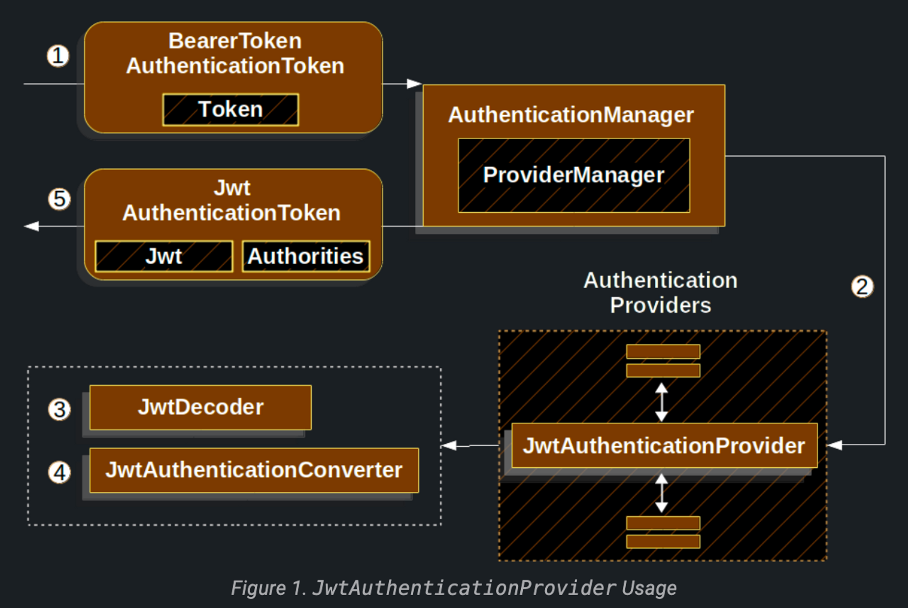

# OAuth 2.0 Resource Server JWT

## [Minimal Dependencies for JWT](https://docs.spring.io/spring-security/reference/servlet/oauth2/resource-server/jwt.html#oauth2resourceserver-jwt-minimaldependencies)

- 대부분의 리소스 서버 지원은 `spring-security-oauth2-resource-server`로 수집된다.
- JWT 디코딩 및 확인에 대한 지원은 `spring-security-oauth2-jose`에 있다.

## **[Minimal Configuration for JWTs](https://docs.spring.io/spring-security/reference/servlet/oauth2/resource-server/jwt.html#oauth2resourceserver-jwt-minimalconfiguration)**

- 스프링부트에서 애플리케이션을 리소스 서버로 구성하는 것은 두 가지 기본 단계로 구성된다.
    - 필요한 종속성 포함
    - 권한 부여 서버의 위치를 지정 (authorization server)

### Specifying the Authorization Server

```yaml
spring:
  security:
    oauth2:
      resourceserver:
        jwt:
          issuer-uri: https://idp.example.com/issuer
```

- `[idp.example.com/issuer`는](http://idp.example.com/issuer는) authorization server가 발급할 JWT 토큰에 대한 `iss` 클레임에 포함된 값이다.
- 리소스 서버는 이 속성으로 추가 자체 구성, authorization server의 공개 키 검색 및 수신 JWT 유효성 검사를 수행한다.

> `issuer-url` 속성을 사용하려면 `idp.example.com/issuer/.wellknown/openid-configuration`, `idp.example.com/.wellknown/openid-configuration/issuer` 또는 `idp.example.com/.wellknown/oauth-authorization-server/issuer` 중 하나가 인증 서버에 지원되는 엔드포인트이어야 한다. 이 엔드포인트를 Provider Configuration 엔드포인트 또는 Authorization Server 메타데이터 엔드포인트라고 한다.
>

## [Startup Expectations](https://docs.spring.io/spring-security/reference/servlet/oauth2/resource-server/jwt.html#_startup_expectations)

위 속성들과 종속성을 추가하면 리소스 서버는 자동적으로 JWT-encoded Bearer Token을 자체 설정한다.

1. Provider Configuration 또는 Authorization Server 메타데이터를 `jwks_url` 속성을 통해 조회한다.
2. 지원되는 알고리즘을 `jwks_url`을 통해 조회한다.
3. 유효성 검사 전략을 구성하여 찾은 알고리즘의 유효 공개 키를 `jwks_url`로 조회한다.
4. 유효성 검사 전략을 구성하여 `idp.example.com`에 대해 각 JWT 발급 클레임의 유효성을 검사한다.

## [Runtime Expectation](https://docs.spring.io/spring-security/reference/servlet/oauth2/resource-server/jwt.html#_runtime_expectations)

- 애플리케이션이 시작되면 리소스 서버는 `Authorization: Bearer` 헤더가 포함된 모든 요청을 처리하려고 한다.

```html
GET / HTTP/1.1
Authorization: Bearer some-token-value # Resource Server will process this
```

1. `jwks_url` 엔드포인트에서 얻은 공개 키로 서명의 유효성을 검사하고 JWT와 일치하는지 확인한다.
2. JWT를 검사하고 `exp`와 `nbf` 타임스탬프, JWT의 `iss` 클레임 유효성을 검사한다.
3. `SCOPE_` prepix를 사용하여 권한을 확인한다.
- 결과물인 `Authentication#getPrincipal`은 기본적으로 스프링 시큐리티 `JWT` 객체이다.

## [How JWT Authentication Works](https://docs.spring.io/spring-security/reference/servlet/oauth2/resource-server/jwt.html#oauth2resourceserver-jwt-architecture)

- `JwtAuthenticationProvider`는 `AuthenticationProvider`의 하위 구현체이며 JWT를 인증하기 위한 `JwtDecoder`와 `JwtAuthenticationConverter`를 활용한다.

1. Bearer 토큰을 읽는 `Filter`에서 `BearerTokenAuthenticationToken`을 `AuthenticationManager`를 구현한 `ProvderManager`에게 전달한다.
2. `ProviderManager`는 `JwtAuthenticationProvider` 타입의 `AuthenticationProvider`가 설정되어 있어 사용할 수 있다.
3. `JwtAuthenticationProvider`는 `JwtDecoder`를 사용해 디코딩, 검증 및 유효성을 검사한다.
4. `JwtAuthenticationProvider`는 `JwtAuthenticationConverter`를 사용해 `Jwt`를 grant authority의 `Collection`으로 변환한다.
5. 인증에 성공하면 `JwtAuthenticationToken` 타입이며 `Jwt`를 `principal`로 가지고 있는 `Authentication`이 `JwtDecoder`에서 리턴된다. 궁극적으로 `JwtAuthenticationToken`은 `SecurityContextHolder`에 설정된다.
