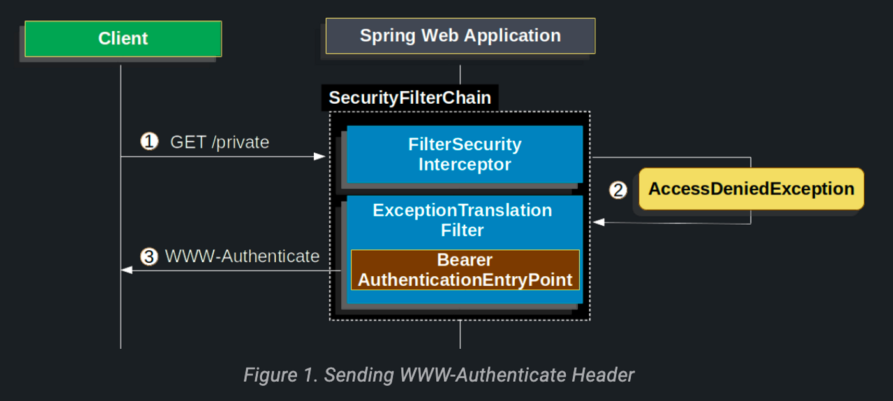
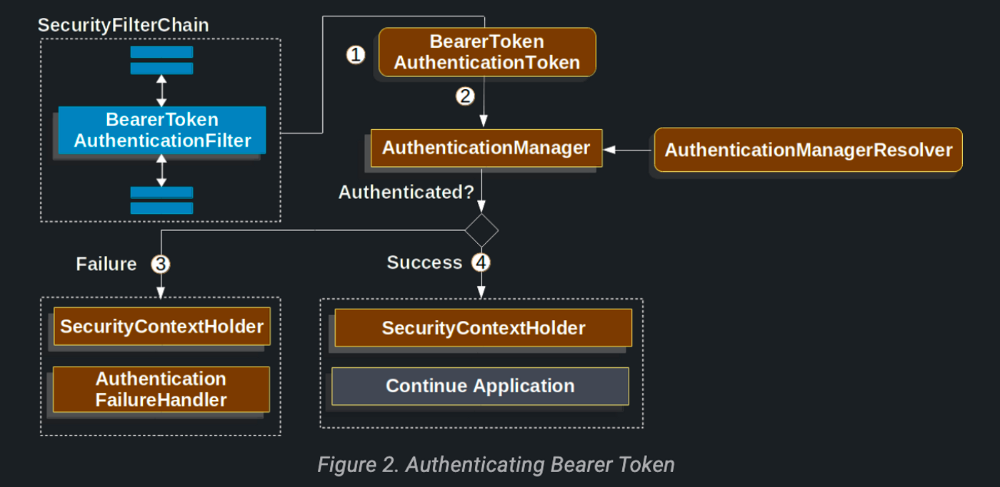

# OAuth2 Resource Server

스프링 시큐리티는 두 가지 방식의 OAuth 2.0 Bearer Token 엔드포인트를 지원한다.
- [JWT](jwt.md)
- Opaque Tokens

이 기능은 애플리케이션이 권한 관리를 authorization server(ex. Okta or Ping Identity)에 위임한 경우 유용하다.

### WWW-Authenticate Header

- Spring Security 내에서 Bearer 토큰 인증이 어떻게 동작하는지 살펴보자.
- 아래 그림은 `SecurityFilterChain` 다이어그램이다.

1. 먼저 사용자가 인증이 필요한 `/private` 리소스로 요청을 한다.
2. Spring Security의 `FilterSecurityInterceptor`는 인증되지 않은 요청이 거부되었음을 `AccessDeniedException`을 던짐으로써 나타낸다.
3. 사용자가 인증되지 않았기에 `ExceptionTranslationFilter`는 인증을 시작한다.
    1. 설정된 `AuthenticationEntryPoint`는 WWW-Authenticate 헤더를 전송하는 `BearerTokenAuthenticationEntryPoint` 인스턴스다.
- 클라이언트가 WWW-Authenticate 헤더를 받으면 Bearer 토큰으로 다시 시도해야 한다는 것을 알 수 있다.

### Authenticating Bearer Token

1. 사용자가 Bearer 토큰을 보내면 `BearerTokenAuthenticationFilter`가 `HttpServletRequest`에서 토큰을 추출하여 `Authentication`의 한 타입인 `BearerTokenAuthenticationToken`을 생성한다.
2. 다음으로 `HttpServletRequest`는 사용할 `AuthenticationManager`를 결정하는 `AuthenticationManagerResolver`로 전달된다.
    1. `BearerTokenAuthenticationToken`은 인증되기 위해 `AuthenticationManager`로 전달된다.
    2. 어떤 AuthenticationManager를 쓸지는 JWT를 쓰냐, opaque 토큰을 쓰냐에 따라 다르다.
3. 인증이 실패하는 경우
    1. `SecurityContextHolder`가 클리어된다.
    2. `AuthenticationEntryPoint`가 호출되어 WWW-Authenticate 헤더가 다시 전송되도록 트리거한다.
4. 인증이 성공하는 경우
    1. `SecurityContextHolder`에 `Authentication`이 설정된다.
    2. `BeforeTokenAuthenticationFilter`가 `FilterChain.doFilter(request, response)`를 호출하여 애플리케이션 로직이 계속되도록 한다.
