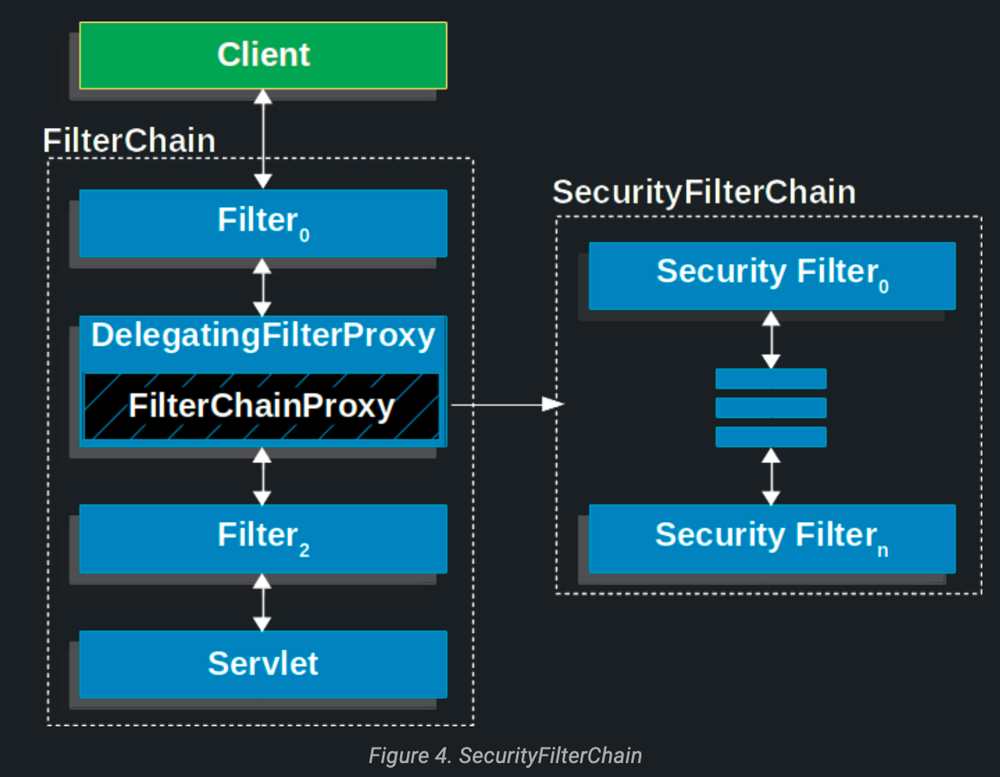
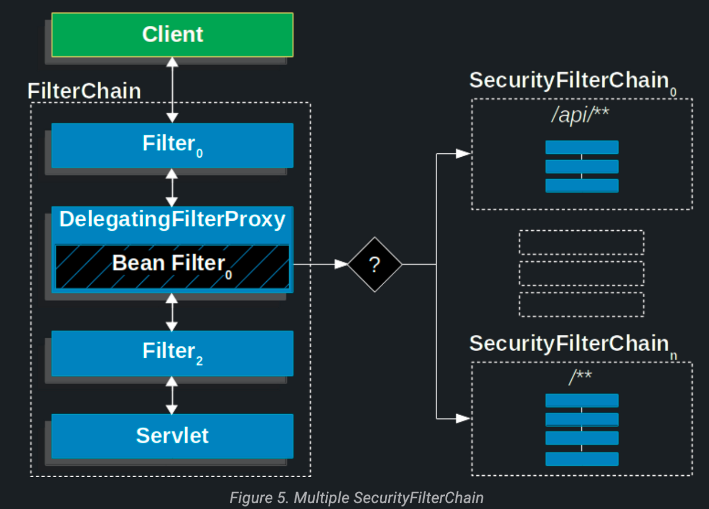

# Architecture

- 서블릿 기반 애플리케이션에서 스프링 시큐리티의 고수준 아키텍처를 다룬다.
- 인증, 인가, 취약점 공격 방어

## [A Review of Filters](https://docs.spring.io/spring-security/reference/servlet/architecture.html#servlet-filters-review)

- 스프링 시큐리티는 서블릿 `Filter`를 기반으로 서블릿을 지원한다.
- 클라이언트가 요청을 보내면 컨테이너는 URI 요청에 기반으로`HttpServletRequest`를 처리하기 위해 `Filter`와 `Servlet` 인스턴스로 구성된 `FilterChain`을 생성한다.
    - 스프링 MVC에서의 `Servlet`은 `DispatcherServlet`이다.
    - 하나의 `Servlet`에 여러 `Filter`를 사용할 수 있다.
- `Filter` 사용
    - 다운스트림의 `Servlet`과 `Filter` 실행을 막는다.
    - 다운스트림의 `Servlet`과 여러 `Filter`가 사용할 `HttpServletRequest`나 `HttpServletResponse`를 수정한다.

```java
public void doFilter(ServletRequest request, ServletResponse response, FilterChain chain) {
	// do something before the rest of the application
    chain.doFilter(request, response); // invoke the rest of the application
    // do something after the rest of the application
}
```

- `Filter`는 다운스트림의 다른 `Filter`나 `Servlet`에멘 영향을 줄 수 있기에 `Filter` 순서는 중요하다.

## [DelegatingFitlerProxy](https://docs.spring.io/spring-security/reference/servlet/architecture.html#servlet-delegatingfilterproxy)

- 스프링부트는 `DelegatingFilterProxy`라는 `Filter` 구현체를 사용한다.
- 서블릿 컨테이너 생명주기와 스프링의 `ApplicationContext`를 연결한다.
    - 서블릿 컨테이너 자체에서 `Filter`를 등록할 수도 있지만 스프링 빈으로는 인식되지는 못한다.
    - `DelegatingFilterProxy`를 사용함으로써 모든 처리를 `Filter`를 구현한 스프링 빈으로 위임해준다.
    - 표준 서블릿 컨테이너 메커니즘으로 등록할 수도 있다.
- `DelegatingFilterProxy`는 `ApplicationContext`에서 빈 필터를 찾아 실행한다.
    ```java
    public void doFilter(ServletRequest request, ServletResponse response, FilterChain chain) {
        // Lazily get Filter that was registered as a Spring Bean
        // For the example in DelegatingFilterProxy delegate is an instance of Bean Filter0
        Filter delegate = getFilterBean(someBeanName);
        // delegate work to the Spring Bean
        delegate.doFilter(request, response);
    }
    ```
    - `Filter` 빈 인스턴스 참조를 지연시킬 수도 있다.
        - 이는 중요한 장점인데 보통 `Filter`는 서블릿 컨테이너가 시작할 때 미리 다 참조가 연결된다.
        - 하지만 스프링은 `ContextLoaderListener`로 빈을 찾는데 이는 `Filter` 인스턴스가 다 등록된 이후에 등록된다.
## [FilterChainProxy](https://docs.spring.io/spring-security/reference/servlet/architecture.html#servlet-filterchainproxy)

- 스프링 시큐리티가 제공하는 `FilterChainProxy`는 서블릿을 지원하는 특별한 `Filter`다.
- `SecurityFilterChain`을 통해 여러 `Filter` 인스턴스로 처리를 위임할 수 있다.
- `FilterChainProxy`는 빈이기 때문에 `DelegatingFilterProxy`로 감싸져 있다.

## [SecurityFilterChain](https://docs.spring.io/spring-security/reference/servlet/architecture.html#servlet-securityfilterchain)

- `SecurityFilterChain`은 `FilterChainProxy`가 현재 요청에 어떤 `Security Filter` 인스턴스를 사용할지 결정하는데 사용된다.


- `SecurityFilterChain`에 있는 스피링 시큐리티 `Fitler`들은 빈이지만 `DelegatingFilterProxy`가 아닌 `FilterChainProxy`로 등록한다.
- `FilterChainProxy`을 직접 서블릿 컨테이너에 등록하거나 `DelegatingFilterProxy`에 등록할 때 장점
    - 스프링 시큐리티가 서블릿을 지원할 수 있는 시작점이 되어준다.
        - 시큐리티 적용에 문제가 생기면 `FilterChainProxy`부터 디버깅하는 것이 좋다.
    - 스프링 시큐리티의 중심점이기 때문에 필수적인 작업을 수행할 수 있다.
        - ex) `SecurityContext`를 비워 메모리 누수를 방지하거나 `HttpFirewall`을 적용해서 특정 공격 유형을 방어할 수도 있다.
    - 어떤 `SecurityFilterchain`을 사용할지 결정하는 데에도 유연함을 제공한다.

      

        - 서블릿 컨테이너에선 URL로만 사용할 `Filter`를 결정한다.
        - `FilterChainProxy`는 `RequestMatcher` 인터페이스로 `HttpServletRequest`에 있는 어떤 것으로도 실형 여부를 결정할 수 있다.
- 위에서 봤던 것처럼 `SecurityFilterChain`은 여러 개가 있을 수 있다.
    - 각각의 `SecurityFilterChain`은 고유하고 격리된 보안 설정을 가질 수 있다.

## [Security Filters](https://docs.spring.io/spring-security/reference/servlet/architecture.html#servlet-security-filters)

- `Security Filter`들은 `SecurityFilterChain` API를 통해 `FilterChainProxy`에 추가된다.
    - 등록되는 순서가 중요하다.
- 전체 `SecurityFilter` 순서는 링크를 클릭하면 볼 수 있다.

## [Handling Security Exception](https://docs.spring.io/spring-security/reference/servlet/architecture.html#servlet-exceptiontranslationfilter)

- `ExceptionTranslationFilter`는 `AccessDeniedException`을 해석하고 `AuthenticationException`을 HTTP 응답으로 바꾼다.
- `ExceptionTranslationFilter`는 `Security Fitler` 중 하나로 `FilterChainProxy`에 등록된다.

> `ExceptionTranslationFilter`는 애플리케이션에서 `AccessDeniedException`이나 `AuthenticationException`이 발생했을 때만 동작한다.
>

```java
try {
	filterChain.doFilter(request, response);
} catch (AccessDeniedException | AuthenticationException ex) {
	if (!authenticated || ex instanceof AuthenticationException) {
		startAuthentication();
	} else {
		accessDenied();
	}
}
```

## [RequestCache](https://docs.spring.io/spring-security/reference/servlet/architecture.html#requestcache)

- 스프링 시큐리티는 `RequestCache` 구현체에 `HttpServletRequest`를 저장해 놓는다.
    - 인증을 성공적으로 끝낸 후 재요청 하기 위해 요청을 저장할 필요가 있다.
- `RequestCacheAwareFilter`는 `RequestCache`를 사용해서 인증이 성공하면 저장해둔 요청을 재실행하는데 사용된다.
