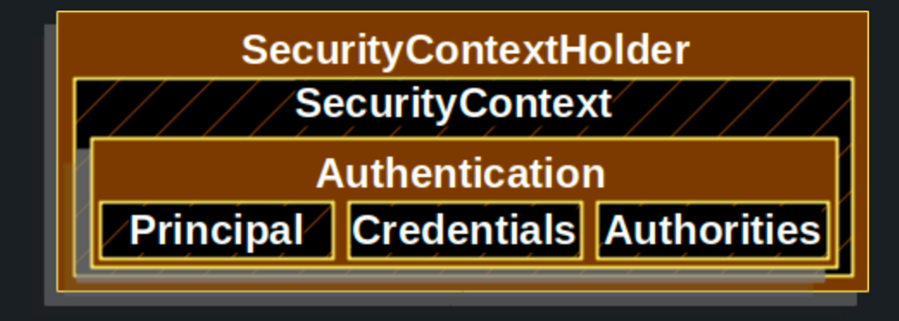
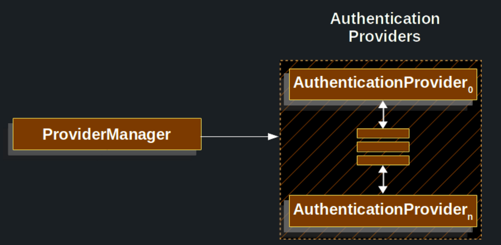
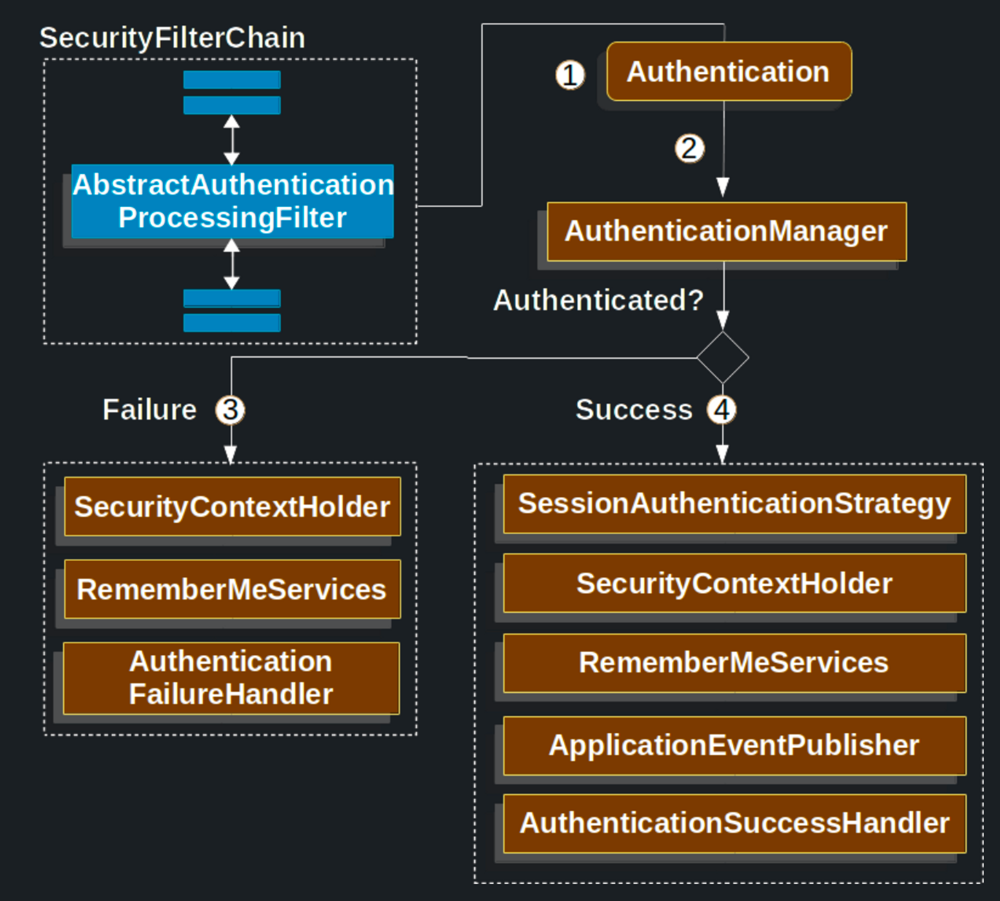

# [Servlet Authentication Architecture](https://docs.spring.io/spring-security/reference/servlet/authentication/architecture.html)

**스프링 시큐리티 주요 아키텍처 컴포넌트**

- `SecurityContextHolder`
    - 스프링 시큐리티가 인증된 사용자를 저장하는 곳
- `SecurityContext`
    - `SecurityContextHolder`로 접근할 수 있으며 인증한 사용자의 `Authentication`을 가지고 있다.
- `Authentication`
    - 사용자가 인증을 위해 제공한 credential을 제공하거나 `SecurityContext`에서 현재 사용자를 제공하기 위한 `AuthenticationManager`에 대한 입력이 될 수 있다.
- `GrantedAuthority`
    - `Authentication`에서 접근 주체(principal)에 부여한 권한이다.
    - role, scope 등
- `AuthenticationManager`
    - 스프링 시큐리티의 필터가 인증을 어떻게 할지 결정하는 API
- `ProviderManager`
    - `AuthenticationManager`의 일반적인 구현체
- `AuthenticationProvider`
    - `ProverManger`에 의해 사용되어 특정 타입의 인증을 수행
- Request Credentials with `AuthenticationEntryPoint`
    - 클라이언트에 credential을 요청할 때 사용한다.
- `AbstractAuthenticationProcessingFilter`
    - 인증에 사용하는 기본 `Filter`
    - 여러 컴포넌트를 조합해서 높은 수준의 인증 플로우를 구성할 수 있다.

### [SecurityContextHolder](https://docs.spring.io/spring-security/reference/servlet/authentication/architecture.html#servlet-authentication-securitycontextholder)

- 스프링 시큐리티의 중심이 되가는 모델
  - `SecurityContext`를 포함하고 있다.
  
- 인증한 사용자들의 details를 저장하는 곳
- 스프링 시큐리티는 `SecurityContextHolder`에 어떻게 값이 들어갔는지는 상관하지 않고 값이 있다면 인증된 사용자가 있다고 본다.
  - 사용자가 인증되었음을 나타내는 가장 쉬운 방법은 직접 값을 넣는 것이다.

    ```java
    SecurityContext context = SecurityContextHolder.createEmptyContext();
    Authentication authentication =
        new TestingAuthenticationToken("username", "password", "ROLE_USER");
    context.setAuthentication(authentication);
    
    SecurityContextHolder.setContext(context);
    ```

  - 비어 있는 새 컨텍스트를 만드는 것으로 시작한다.
    - 스레드 경합을 피하려면 `SecurityContextHolder.getContext.setAuthentication()`을 사용해선 안 된다.
  - 새 `Authentication` 객체를 생성한다.
    - 프로덕션 환경에선 `UserPasswordAuthenticationToken`을 주로 사용한다.
  - 마지막으로 `SecurityContexHolder`에 `SecurityContext`를 설정한다.
- 인증된 사용자 정보를 얻으려면 `SecurityContextHolder`를 통해 접근할 수 있다.

    ```java
    SecurityContext context = SecurityContextHolder.getContext();
    Authentication authentication = context.getAuthentication();
    String username = authentication.getName();
    Object principal = authentication.getPrincipal();
    Collection<? extends GrantedAuthority> authorities = authentication.getAuthorities();
    ```

- `SecurityContextHolder`는 `ThreadLocal`에 정보를 저장하기에 동일 스레드라면 항상 `SecurityContext`에 접근할 수 있다.
  - 요청이 끝나면 `FilterChainProxy`가 항상 `ThreadLocal`을 비워준다.
- ThreadLocal 사용이 적합하지 않은 애플리케이션인 경우 (전체 스레드에서 하나의 컨텍스트를 공유해야 하는 경우) 따로 설정을 할 수 있다.
  - 공식 문서 참조

### [SecurityContext](https://docs.spring.io/spring-security/reference/servlet/authentication/architecture.html#servlet-authentication-securitycontext)

- `SecurityContext`는 `Authentication` 객체를 가지고 있다.

### [Authentication](https://docs.spring.io/spring-security/reference/servlet/authentication/architecture.html#servlet-authentication-authentication)

- `Authentication`은 다음 2가지 목적으로 제공된다.
  - `AuthenticationManager`의 입력으로 사용되어 인증된 사용자의 credentials을 제공한다.
  - `SecurityContext`에서 현재 인증된 `Authentication`을 얻을 수 있다.
- `Authentication`은 다음을 포함한다.
  - `principal`: 사용자를 나타내며 username/password로 인증했을 시 `UserDetails` 인스턴스로 나타난다.
  - `credentials`: 주로 패스워드이다. 대부분 유츌되지 않도록 인증한 다음 비운다.
  - `authorities`: `GratedAuthority`의 추상화로 사용자에게 부여한 권한이다.

### [GrantedAuthority](https://docs.spring.io/spring-security/reference/servlet/authentication/architecture.html#servlet-authentication-granted-authority)

- 사용자에게 부여된 권한의 추상화로 role이나 scope를 예로 들 수 있다.
- `Authentication.getAuthorities()`로 얻을 수 있다.
  - `GrantedAuthority`의 `Collection`이 반환된다.
- 스프링 시큐리티에선 역할(role)을 해석하고 권한을 확인한다.
- username/password 기반 인증이라면 보통 `UserDetailsService`가 `GrantedAuthority`를 로드한다.
- 특정 도메인 객체마다 권한을 부여하지 않고 도메인 객체 단위로 보안 권한을 적용하도록 한다.
  - 아니라면 권한을 수천 개 만들어야 할 수도 있다.

### [AuthenticationManager](https://docs.spring.io/spring-security/reference/servlet/authentication/architecture.html#servlet-authentication-authenticationmanager)

- 스프링 시큐리티의 필터들의 인증 수행 방식을 정의하는 API
- 리턴된 `Authentication`을 `SecurityContextHolder`에 설정하는 건 `AuthenticationManager`를 호출한 객체(시큐리티의 필터)가 담당한다.
- 스프링 시큐리티 필터와 통합하지 않는다면 `SecurityContextHolder`에 `AuthenticationManager`를 거치지 않고 `Authentication`을 직접 설정할 수도 있다.
- `AuthenticationManager`의 구현체는 보통 `ProviderManager`이다.

### [ProviderManager](https://docs.spring.io/spring-security/reference/servlet/authentication/architecture.html#servlet-authentication-providermanager)

- 가장 많이 쓰는 `AuthenticaitonManager`의 구현체
- `ProviderManager`는 동작을 `AuthenticaitonProvider`의 `List`에 위임한다.
  - 각 `AuthenticationProvider`는 인증을 성공시키거나 실패시킬 수 있다.
  - 또 인증 여부를 판단할 수 없다면 다운스트림에 있는 `AuthenticationProvider`에 결정을 맡긴다.
  - 모든 `AuthenticationProvider`가 인증을 판단하지 못하면 특별한 예외인 `ProviderNotFoundException`이 발생한다.

> `ProviderFoundException`이 발생했다는 뜻은 넘겨진 `Authentication` 유형을 지원하는 `ProviderManager`가 설정되지 않았다는 것이다.



- 기본적으로 `ProviderManager`는 인증에 성공하면 리턴하는 `Authentication` 객체에 있는 민감 credential 정보를 지운다.
  - 비밀번호 등을 `HttpSession`에 길게 유지하지 않는다.

> 애플리케이션에서 사용자 객체를 캐싱하는 경우 `Authentication`이 credential을 지워버린다면 캐시된 값으로는 더 이상 인증할 수 없다. 따라서 캐시를 사용한다면 이를 고려하여 구현해야 한다. 객체의 복사본을 만들거나 `ProviderManager`의 `eraseCredentialsAfterAuthentication` 프로퍼티를 비활성화시켜도 된다.
>

### [AuthenticationProvider](https://docs.spring.io/spring-security/reference/servlet/authentication/architecture.html#servlet-authentication-authenticationprovider)

- `ProviderManager`에 여러 `AuthenticationProvider`를 주입할 수 있다.
  - 각 `AuthenticationProvider`는 특정 유형의 인증을 수행한다.
  - ex) username/password 인증 방식, JWT 인증 방식 등
- 따라서 하나의 `AuthenticationManager` 빈만으로 여러 유형의 인증을 모두 처리할 수 있다.
  - `ProviderManager`가 여러 인증 유형을 지원하는 `AuthenticationProvider`들을 가지고 있기에

### [Request Credentials with AuthenticationEntryPoint](https://docs.spring.io/spring-security/reference/servlet/authentication/architecture.html#servlet-authentication-authenticationentrypoint)

- `AuthenticationEntryPoint`는 클라이언트에게 credentials을 요청하는 HTTP 응답을 보낼 때 사용한다.
  - 보통은 클라이언트가 credential을 포함하여 요청을 보내기에 스프링 시큐리티는 위와 같은 응답을 날리지 않는다.
  - 클라이언트가 아직 인가되지 않은 리소스에 접근하려할 때 credentials 요청 응답을 보내는 것이다.
- 로그인 페이지로 리다이렉트하거나 WWW-Authenticate 헤더로 응답하거나 한다.

### [AbstractAuthenticationProcessingFilter](https://docs.spring.io/spring-security/reference/servlet/authentication/architecture.html#servlet-authentication-abstractprocessingfilter)

- `AbstractAuthentiationProcessingFilter`는 사용자 `credentials`을 인증하는 base `Filter`다.
  - 인증할 수 없다면 `AuthenticationEntryPoint`가 `credential` 요청 응답을 보내는 것

1. 사용자가 credential을 제출하면 `AbstractAuthenticationProcessingFitler`가 `HttpServletRequest`에서 `Authentication`을 생성한다.
   1. Authentication의 타입은 `AbstractAuthenticationProcessingFitler`의 하위 클래스에 따라 다르다.
   2. ex) `UsernamePasswordAuthenticationFilter`라면 `UsernamePasswordAuthenticationToken` 타입이 생성된다.
2. `Authentication`은 인증되기 위해 `AuthenticationManager`에 전달된다.
3. 인증이 실패하는 경우
   1. `SecurityContextHolder`가 비워진다.
   2. `RememberMeServices.loginFial`을 실행하는데 remember me를 설정하지 않았다면 동작하지 않는다.
   3. `AuthenticationFailureHandler`가 동작한다.
4. 인증이 성공하는 경우
   1. `SessionAuthenticationStrategy`가 새로운 로그인을 통지 받는다.
   2. `SecurityContextHolder`에 `Authentication`이 설정되고 `SecurityContextPersistenceFilter`가 `SecurityContext`를 `HttpSession`에 저장한다.
   3. `RememberMeServices.loginSuccess`가 동작하는데 remember me가 설저오디지 않았다면 동작하지 않는다.
   4. `ApplicationEventPublisher`가 `InteractiveAuthenticationSuccessEvent`를 발행한다.
   5. `AuthenticationSuccessHandler`가 동작한다.
