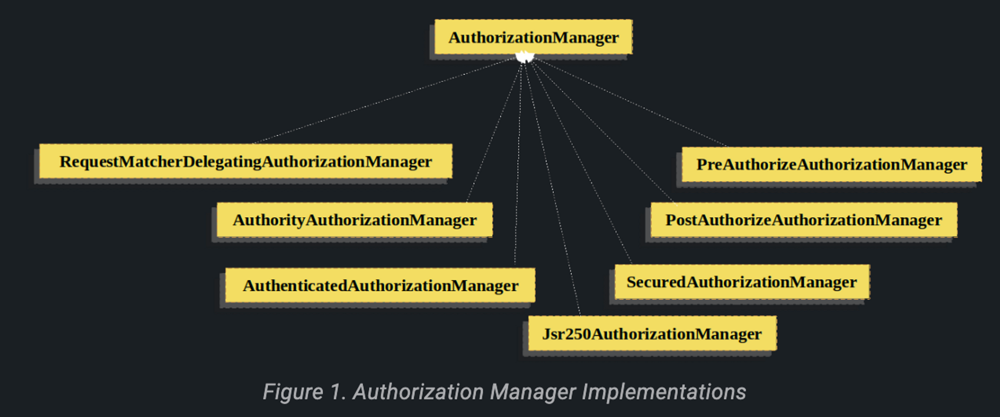

# Authorization Architecture

## [Authorities](https://docs.spring.io/spring-security/reference/servlet/authorization/architecture.html#authz-authorities)

- `Authentication` 객체는 principal에게 부여한 권한인 `GrantedAuthority`를 `AuthenticationManager`에게 입력받는다.
- 이후 `AccessDecisionManager`가 `GrantedAuthority`를 읽어 권한을 결정한다.
- `GrantedAuthority`는 메서드가 하나인 인터페이스다.

    ```java
    String getAuthority();
    ```

    - `AccessDecisionManager`는 `GrantedAuthority`가 반환하는 String을 쉽게 읽을 수 있다.
- 스프링 시큐리티는 `GrantedAuthority`를 쉽게 만들 수 있는 `SimpleGrantedAuthority`를 제공한다.
    - 사용자가 지정한 `String`을 `GrantedAuthority`로 변환해준다.
    - `AuthenticationProvider`도 `SimpleGrantedAuthority`를 사용한다.

## [Pre-Invocation Handling](https://docs.spring.io/spring-security/reference/servlet/authorization/architecture.html#authz-pre-invocation)

- 스프링 시큐리티는 method invocation이나 웹 요청 같은 보안 객체에 접근을 제어하는 인터셉터를 제공한다.
- `AccessDecisionManager`가 메서드 호출을 허용할지, pre-invocation 결정 등을 내린다.

## [The AuthorizationManager](https://docs.spring.io/spring-security/reference/servlet/authorization/architecture.html#authz-authorities)

- `AuthorizationManager`는 `AccessDecisionManager`와 `AccessDecisionVoter`를 모두 대체한다.
    - `AccessDecisionManager`와 `AccessDecisionVoter`는 레거시 컴포넌트이다.
    - `AccessDecisionManager`나 `AccessDecisionVoter`를 커스텀하는 애플리케이션은 `AuthorizationManager`를 사용하도록 바꾸는 것을 권장한다.
    - `AuthorizationFitler`라 불리며 접근 제어의 최정 결정 책임을 맡고 있다.
- `AuthorizationManaber` 인터페이스는 두 메서드를 가지고 있다.

    ```java
    AuthorizationDecision check(Supplier<Authentication> authentication, Object secureObject);
    
    default AuthorizationDecision verify(Supplier<Authentication> authentication, Object secureObject)
            throws AccessDeniedException {
        // ...
    }
    ```

    - `check` 메서드는 인가 결정을 내리기 위한 모든 관련 정보를 전달 받는다.
    - `verify` 메서드는 `check`를 호출하며 잘못된 `AuthorizationDecision`에 대해 `AccessDeniedException`을 던질 수도 있다.

## [Delegate-based AuthorizationManager Implementations](https://docs.spring.io/spring-security/reference/servlet/authorization/architecture.html#authz-delegate-authorization-manager)

- 스프링 시큐리티는 각각의 `AuthorizationManager`들끼리 협력할 수 있는 위임 `AuthorizationManager`들을를 제공한다.
    - 개발자가 직접 AuthorizationManager를 구현할 수도 있다.
- `RequestMatcherDelegatingAuthorizationManager`가 요청에 일치하는 가장 적절한 위임 `AuthorizationManager`이다.
- method security를 위해 `AuthorizationManagerBeforeMethodInterceptor`와 `AuthorizationManagerAfterMethodInterceptor`를 사용할 수 있다.

### Authorization Manager Implementations


- **AuthorityAuthorizationManager**
    - 스프링 시큐리티가 제공하는 가장 일반적인 `AuthorizationManager`
    - 현재 인증된 `Authentication`의 권한들로 구성되어 있다.
    - `Authentication`에 권한들이 포함되어 있으면 긍정적인 `AuthorizationDecision`을 반환한다.

- **AuthenticatedAuthorizationManager**
    - 익명, fully-authenticated, rememver-me의 인증된 사용자를 구별하는데 사용된다.
    - 많은 사이트가 remember-me 인증에게 제한된 권한을 허용하여 완전히 로그인할 것을 요구한다.
- **Custom Authorization Managers**
    - 커스텀 `AuthorizationManager`를 구현할 수도 있다.
